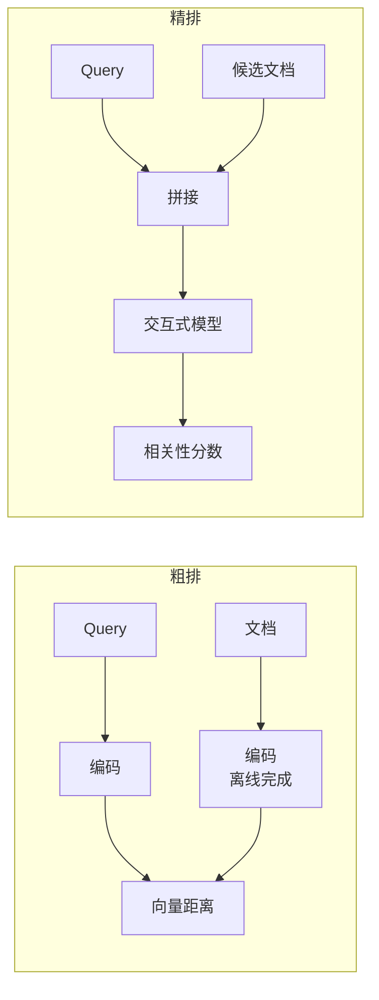
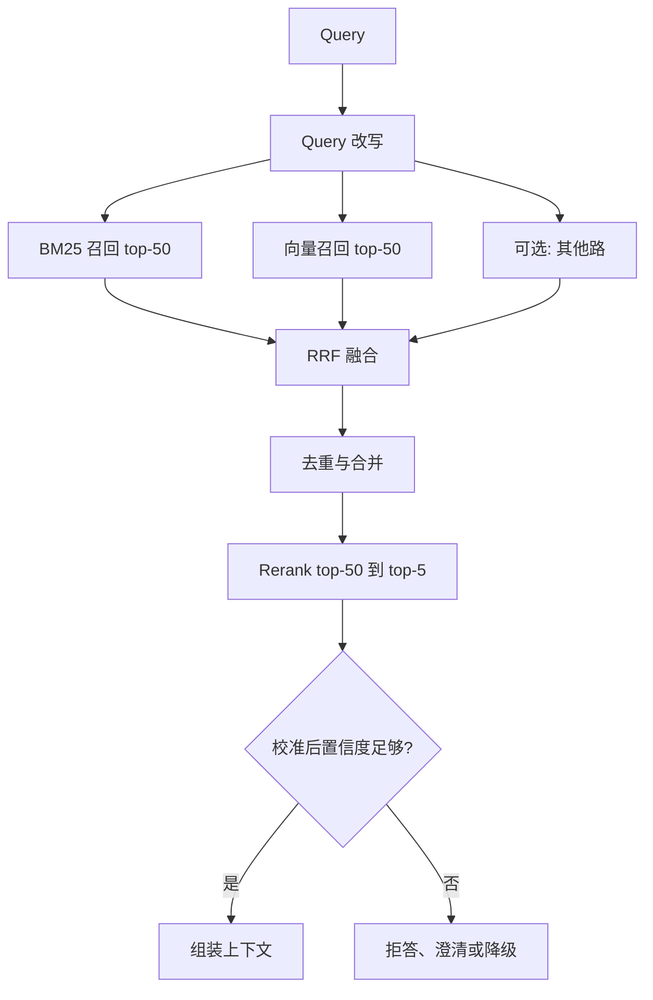

# 第十三章：多路召回、RRF 融合与 Rerank

## 13.1 为什么考虑多路召回

第十一章已经展开过理论依据，这里先压缩成一句话：

> **不同表示常有互补弱项；先测各路独占的证据覆盖，再决定是否组合，而不是假定每个系统都必须多路。**

| 单路方案 | 系统性盲区 |
|---|---|
| 只用向量 | 型号、错误码、人名、专有名词、否定语义、数值条件 |
| 只用 BM25 | 同义表述、概念性问题、跨语言 |

这些是常见弱项，不是某类 Query 永远不可能召回。提高 K 有时能补覆盖，但增加成本；提高 `ef_search` 主要减少 ANN 近似误差，不能保证修复表示本身的相关性排序。

## 13.2 分数没法直接比较

多路召回的第一个技术问题是**融合**。

| 召回路 | 分数形式 | 典型范围 |
|---|---|---|
| 向量检索 | 余弦相似度 | −1 到 1；产品可能返回变换后的分数 |
| BM25 | 累加的词项得分 | 不归一化到固定区间；范围依 IDF 变体、语料、查询与字段配置 |

**这两组分数根本不在同一个量纲上。** 简单加权融合需要先归一化，而归一化本身又有问题：

- **min-max 归一化依赖当前批次的极值**，同一个文档在不同 Query 下的归一化分数会剧烈波动；
- **分数分布形状不同**：余弦可能集中在窄区间，但具体区间依模型与数据而定；线性归一化不等于把两路校准成同一种相关性概率；
- **权重需要针对每个数据集调**，换语料就要重调。

## 13.3 RRF：用排名代替分数

**倒数排名融合（Reciprocal Rank Fusion）的思路极其简单：只用排名，完全不用原始分数。**

$$
\mathrm{RRF}(d) = \sum_{r \in R} \frac{1}{k + \mathrm{rank}_r(d)}
$$

其中 $R$ 是召回路集合，排名从 1 开始；未出现在某路候选窗口中的文档，该路贡献为 0。 $k$ 是平滑常数，常用起点为 60，**不是最终 Top-K**。融合前确保每路同一 ID 只出现一次，再累加跨路贡献。

### 13.3.1 为什么它管用

排名本身没有量纲，第 1 名就是第 1 名，不管原始分数是 0.92 还是 34.7，这让 RRF 能直接绕开不同分数体系不可比的问题。

$k$ 则起到削峰作用。当 $k = 60$ 时：

| 排名 | 贡献值 |
|---|---|
| 1 | 1/61 ≈ 0.0164 |
| 2 | 1/62 ≈ 0.0161 |
| 10 | 1/70 ≈ 0.0143 |

第 1 名和第 2 名的差距很小。**这意味着：某一路把某文档排第 1，不足以让它压过“在两路里都排前十”的文档。**

> **RRF 天然偏好「多路共识」而非「单路极端自信」。** 因为单路的高分可能来自该路特有的偏见，而多路都认可的结果通常更可靠。

$k=60$ 来自原论文的经验设置，RRF 无需训练，但每路候选窗口、权重、平滑常数和融合后截断仍要调。多个高度相似的 Query 扩展结果并非独立证据，可能重复放大某一路偏见。

### 13.3.2 它的局限

- **丢弃了分数的绝对信息**：一个相似度 0.95 和一个 0.5 的结果，只要排名相同，贡献就相同；
- **无法表达"这一路整体都不靠谱"**：即使某路的所有结果都很差，它的第 1 名仍然贡献满额；
- **不同路的可信度无法直接表达**（可通过给每路加权部分缓解）。

RRF 是混合检索中广泛采用、值得先建立的**强基线**，因为它鲁棒且少调参；它不是所有语料的“事实标准”。若有带标签的业务数据，应将 RRF 与归一化加权、学习排序或单路检索一起比较，再按效果、延迟和可维护性选择。

## 13.4 Rerank：在候选覆盖之后改善排序

### 13.4.1 为什么需要它

典型稠密粗排把 Query 与文档独立编码，再比较两个压缩表示，在线没有跨文本注意力。因此可以尝试重排补足细粒度交互，但不意味着双塔在每个任务上一定更差（第六章 6.3.3）。

常见的 Rerank 实现采用 cross-encoder：**把 Query 和候选文档拼在一起**送进模型，让两者充分交互后输出相关性分数。重排也可用多向量打分或 LLM 排序，不只这一种架构。

**效果提升通常很明显**，也是单点投入产出比很高的优化，因此往往会早于更复杂的改造进入链路。

### 13.4.2 三类 Reranker

| 类型 | 比较重点 |
|---|---|
| 轻量成对重排 | 如基于 MiniLM 的 cross-encoder；资源较少，但要核对语言、领域与输入长度 |
| 较大成对模型或托管重排服务 | 如 BGE/Jina 的具体重排模型、Cohere Rerank 服务；按型号核验架构、截断规则、计费与批处理，不能由系列名推断成本 |
| LLM listwise | 对候选列表做相对排序，可利用候选间关系；需检查位置偏置、ID 遗漏与超窗口分组 |

**LLM listwise 的额外价值**在于它一次看到所有候选，能做**相对比较**和去冗余（识别出「这两条说的是同一件事」），而 cross-encoder 是**逐条独立打分**的，看不到候选之间的关系。

Listwise 只有在候选装入同一输入时才能一起比较；超预算时需滑动窗口或分组排序。应在相同候选数、长度、硬件和负载下测各方案延迟，并检查 ID 是否遗漏、重复，以及候选顺序扰动是否改变结果。

### 13.4.3 工程要点

候选数与长度共同决定计算量；批处理、padding 和排队使墙钟延迟不一定线性。普通全注意力编码器还受单对输入长度的平方项影响。应在不同候选数与长度下测覆盖、排序、吞吐和尾延迟，而非预设从 100 减到 50 就快一倍。

同时要有经校准的拒答策略。

> **Rerank 之后不得无条件取 Top-K；但也不能把一个固定绝对分数当作所有 Query 的通用阈值。**

不同 Query、语言、候选集和模型版本的分数分布不同。应在带“有依据/无依据”标注的业务评测集上校准置信度或拒答规则，例如结合首位分数、首二名间隔、候选一致性、来源质量和 Query 类型，并分别报告覆盖率与错误接受率。低置信度时返回空、请求澄清或走人工/外部检索路径，而不是硬凑不相关上下文。

更换 reranker、语料、语言分布或召回策略都会使校准失效。将拒答规则版本化，在评测集和线上抽样上重校准；不要把来自一个 Query 的裸分数直接同另一个 Query 比较。

Rerank 超时可以回退到粗排，但必须使用针对粗排校准的证据规则，并继续执行 ACL、版本和引用校验。若该路径没有通过业务验收，就返回暂时无法回答，不能把“仍有 Top-K”当作可发布依据。

## 13.5 完整的召回-排序链路

**各阶段的数量收缩参考**：每路召回 50–100 → 融合去重后 50–150 → Rerank 输入 50 → 最终 3–10。

最后一档不是越大越好（第二章 2.6 节），必须实测。

## 13.6 去重也很重要

融合之后必须去重，否则会浪费 Prompt 预算：

| 重复来源 | 处理 |
|---|---|
| 多路召回同一 chunk | 按 chunk ID 合并 |
| 多个子块命中同一父块 | 合并为一个父块（第五章 5.3.2） |
| 内容高度相似的不同 chunk | 相似度筛候选，再核对实体、数字、否定、版本与适用范围；保留会改变结论的差异 |
| 同一文档的新旧版本 | 按查询时刻、生效区间和适用范围选择；历史查询保留对应旧版，对比查询可保留两版 |

最后一行尤其容易漏掉：新旧版本同时进入上下文，会让模型面对矛盾信息，产出错误或含糊的答案。

## 13.7 常见错误

### 13.7.1 直接加权融合不同量纲的分数

需要归一化，而归一化本身不稳定。RRF 是更好的默认选择。

### 13.7.2 不知道 RRF 为什么用排名

如果只知道 RRF 这个名词，却说不出「规避量纲问题」和「偏好多路共识」，通常也很难判断它是否适合当前链路。

### 13.7.3 不知道 $k=60$ 的作用

它起削峰作用，让排名靠前的差距变小，从而更看重多路共识。

### 13.7.4 Rerank 后无条件取 Top-K

这会放弃拒答能力；低置信度候选应触发拒答、澄清或降级路径。

### 13.7.5 用固定裸分阈值跨 Query 比较

分数分布因 Query、模型和语料而异。应在业务评测集上校准可回归的置信度/拒答策略，并在变更后重校准。

### 13.7.6 默认上 LLM listwise rerank

计算量、调用方式、位置偏置与输入窗口都需要验证，不应预设它一定最准或固定贵多少倍。

### 13.7.7 忘记去重，尤其是新旧版本

矛盾的上下文会直接导致错误答案。

### 13.7.8 没有 Rerank 的降级路径

经验证的粗排降级可提高可用性，但不能绕过证据与权限闸门；安全回退不可用时应明确失败。

## 13.8 本章总结

1. **多路召回的理由是实测互补**，不是只要链路更多就一定更可靠；
2. **不同召回路的分数量纲不同**，直接加权需要归一化，而归一化本身不稳定；
3. **RRF 只用排名不用分数**，无需训练但仍需设置窗口与权重；平滑常数不等于 Top-K；
4. **RRF 的局限**：丢弃分数绝对信息、无法表达“某路整体不靠谱”；它是常用强基线，不能替代业务实测；
5. **Rerank 可改善候选排序**，但找不回候选集外的证据；
6. **Cross-encoder 与 listwise 应在相同候选与预算下比较**，不预设最优模型或固定成本倍数；
7. **必须采用经评测集校准的置信度/拒答策略并允许返回空**，不能用固定裸分一刀切；
8. **去重要覆盖多路重复、父块重复、内容冗余和新旧版本**，其中新旧版本冲突后果最严重。

## 参考资料

- [Reciprocal Rank Fusion outperforms Condorcet and individual Rank Learning Methods (SIGIR 2009)](https://cormack.uwaterloo.ca/cormacksigir09-rrf.pdf)
- [Lucene 9.12：BM25Similarity 的具体计分实现](https://lucene.apache.org/core/9_12_0/core/org/apache/lucene/search/similarities/BM25Similarity.html)
- [Anthropic: Introducing Contextual Retrieval](https://www.anthropic.com/engineering/contextual-retrieval)
- [ColBERTv2: Effective and Efficient Retrieval via Lightweight Late Interaction](https://arxiv.org/abs/2112.01488)
- [Searching for Best Practices in Retrieval-Augmented Generation](https://arxiv.org/abs/2407.01219)
- [Retrieval-Augmented Generation for Large Language Models: A Survey](https://arxiv.org/abs/2312.10997)
