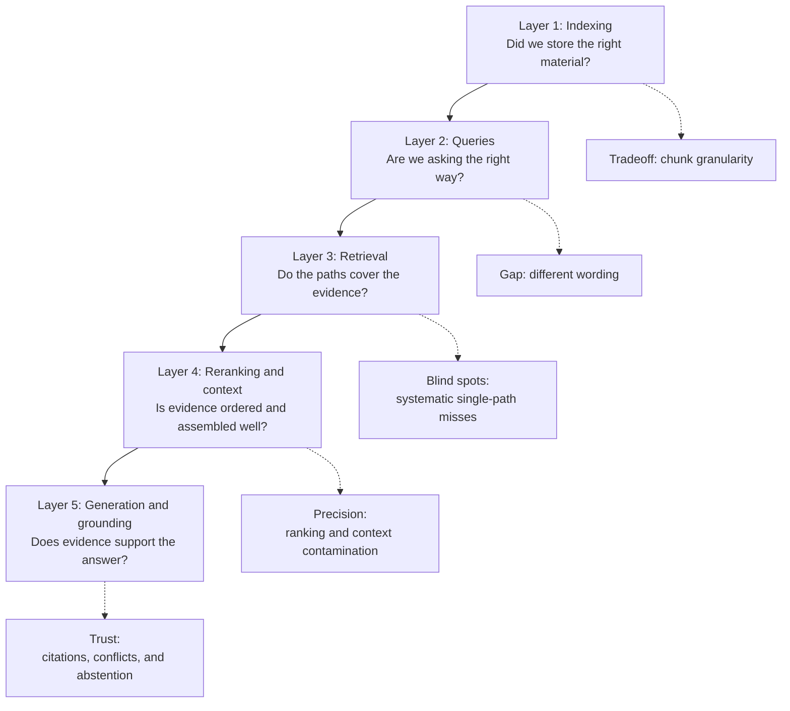
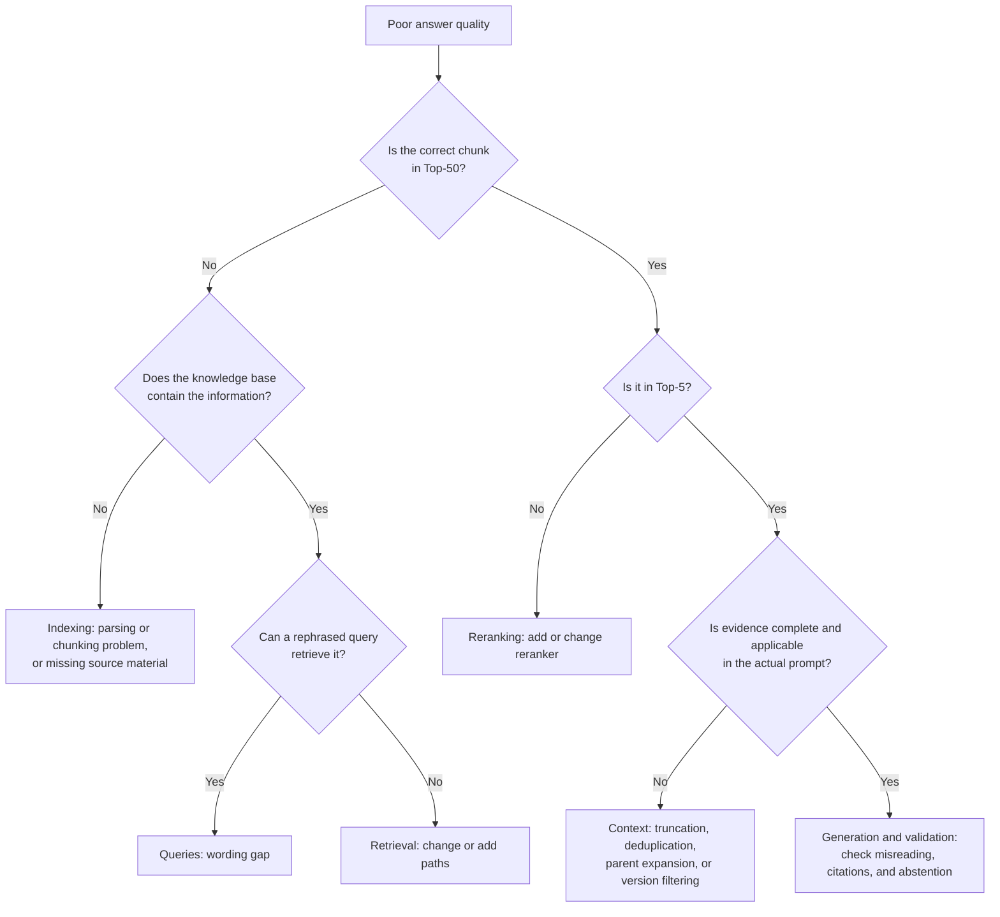
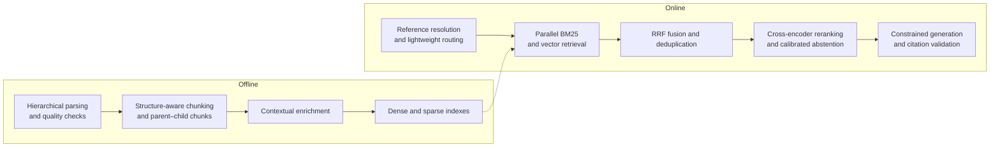

# Chapter 14: A Five-Layer Framework for RAG Optimization

## 14.1 Why use a framework?

“How do we improve a RAG system that performs poorly?” usually involves several stages.

The common problem is not a lack of options, but discussing “change chunk size, switch models, add reranking, and rewrite queries” as one undifferentiated list. Listing options tells us little because it does not identify where the failure occurs.

A layered framework groups improvements by pipeline stage, giving us a way to locate the problem.

Each layer offers a different diagnostic starting point, but the problems are not independent, and no optimization order fits every project. Find where evidence is lost or distorted, then fix that layer. Security, observability, and evaluation cut across all five.

## 14.2 Layer 1: indexing

**The central tradeoff**: small chunks fragment meaning; large chunks dilute it (Section 4.2).

| Method | Explanation | See |
|---|---|---|
| Adjust chunk size and overlap | Establish a simple baseline and check local evidence coverage against the context budget | 4.5 |
| Structure-aware chunking | Use reliable heading hierarchies, while accounting for the cost of recovering structure | 4.4 |
| Parent–child chunking | Retrieve small chunks; generate with larger ones | 5.3.2 |
| Contextual enrichment | Add background explanations to each chunk | 5.3.4 |
| Document parsing quality | **This sets the quality ceiling** | Chapter 3 |
| Metadata completeness | Support filtering, source tracing, and freshness | 3.6.1 |

This layer is often skipped, yet it underpins everything else. Teams can spend weeks tuning rerankers only to discover that every table in the knowledge base was parsed into garbled text.

## 14.3 Layer 2: queries

**The central problem**: the gap between how users ask and how documents are written (Section 12.1).

| Method | Gap addressed |
|---|---|
| Reference resolution | Omitted information in multi-turn conversations |
| Direct rewriting | Conversational versus written language and terminology differences |
| Multi-query expansion | Randomness in the particular wording chosen |
| HyDE | Differences in form between questions and documents |
| Step-back questions | Mismatched abstraction levels |
| Query decomposition | Granularity mismatches in compound questions |
| Routing | Different questions need different strategies |

Account for the actual call graph of rewriting, decomposition, and retrieval. Several actions can be generated in one call, or they may depend on multiple rounds. Choose by question type, then use ablations to determine whether combinations add evidence. Do not infer a fixed call count merely from the number of methods.

## 14.4 Layer 3: retrieval

**The central problem**: systematic blind spots in a single retrieval path (Section 13.1).

| Method | Explanation |
|---|---|
| Hybrid BM25 + vector retrieval | A common comparison baseline; enable it according to gains and costs |
| RRF fusion | No training required, but candidate windows, the smoothing constant, and weights still need configuration |
| Metadata filtering | Narrow the scope by time, department, and permissions |
| Multi-knowledge-base routing | Choose a knowledge base by question type |
| Adjust Top-K for each path | Balance recall against downstream cost |
| Late interaction as a third path | Consider it if the first two paths remain insufficient after proper tuning |

**Recall is the key metric at this layer.** If the evidence containing the correct answer is never retrieved, later stages cannot recover it.

Candidate evidence coverage constrains the current pipeline's attainable ceiling; it does not guarantee a minimum level of quality. Reranking cannot find evidence outside the candidate set, and later stages can still lose evidence that was retrieved.

## 14.5 Layer 4: reranking and context

**The central problem**: the precision limits of dual-encoder first-stage retrieval (Section 13.4.1).

| Method | Explanation |
|---|---|
| Cross-encoder reranking | Try it when the candidates contain complete evidence but rank it poorly |
| Calibrated evidence-sufficiency rules | Do not treat raw scores across queries as probabilities that answers are correct |
| Context trimming and ordering | Control volume without cutting essential conditions; compare ordering strategies |
| Deduplication and redundancy removal | Remove duplicates while preserving differences in entities, numbers, and negation |
| Temporal applicability | Select versions by query time and applicability before ordering; do not always choose the newest |

**The key metrics here are precision and ranking quality**, including MRR and NDCG.

## 14.6 Layer 5: generation and grounding

**The central problem**: relevant retrieval results do not guarantee a correct answer. A model may still ignore evidence, confuse conflicting versions, attach the wrong citations, or answer despite insufficient support.

| Method | Problem addressed | See |
|---|---|---|
| Evidence-based answers and claim–citation alignment | Trace every key conclusion back to supporting evidence | Chapters 17 and 18 |
| Conflict and temporal-applicability rules | Avoid combining obsolete or conflicting material into a conclusion | Chapter 17 |
| Abstention based on multiple signals | Stop when evidence coverage is insufficient rather than relying on a single score | Chapters 13 and 17 |
| Structured context and source labels | Reduce context contamination and citation mismatches | Chapter 17 |
| Output validation and security policies | Check factual support, unauthorized disclosure across ACL boundaries, and the influence of prompt injection | Chapters 18 and 20 |

## 14.7 How to locate the failing layer

A framework only classifies methods. Diagnosis is what makes it useful for optimization.

The value of this decision tree is that it turns a vague “poor performance” complaint into a sequence of yes/no questions that data can answer.

Top-50 and Top-5 are illustrative budgets. Before investigating evidence that “exists in the knowledge base but was not found,” confirm that it was published at query time and that the user was authorized to access it. Then examine the filter execution plan, indexing lag, and ANN approximation loss. Legitimate access filtering is not a retrieval miss to be “optimized away.”

In practice:

1. **Collect real queries with poor results**, rather than inventing examples.
2. **Manually label which chunk contains the correct answer for each query.**
3. **Check where that chunk appears in the retrieval results**:
   - **Absent from the candidates** → indexing or retrieval.
   - **Present but ranked too low** → reranking.
   - **Ranked near the top, but the answer is still wrong** → inspect the actual prompt to distinguish context-assembly failures from generation errors.

Then run two controlled experiments. Give complete, human-selected evidence directly to the generator to test its reading and citation ceiling. Hold the generator fixed and substitute actual retrieved evidence and human-selected evidence in turn to estimate retrieval losses. Record versioned evidence IDs for the candidate set, reranked results, parent expansion, and final prompt so you can identify exactly where evidence disappears. Multi-hop questions require complete evidence sets; tracking one correct chunk is not enough.

**Aggregate the failure distribution across a set of queries** to see which layer deserves investment first. Diagnosis is often more valuable than blindly adding another component.

## 14.8 A suggested optimization order

The following is an example diagnostic order, not a deployment dependency graph. ACLs, basic abstention, citation validation, and evaluation must exist from the first version; do not postpone them until retrieval tuning is finished.

| Observed problem | First action to test |
|---|---|
| No reproducible baseline | Build an evaluation set and record evidence traces and budgets |
| Evidence exists in the original but not in the ingested content | Fix parsing, structure, and metadata mapping |
| Chunk boundaries lose qualifying conditions | Adjust size/overlap and compare parent–child chunks or window expansion |
| Repeated misses on model numbers or synonymous wording | Compare evidence uniquely retrieved by BM25, vectors, and RRF fusion |
| Complete evidence is retrieved but ranked too low | Compare reranking and candidate truncation budgets |
| Multi-turn omissions or compound questions miss evidence | Apply reference resolution, rewriting, or query decomposition |
| Passages lack document context | Compare contextual enrichment and its construction and update costs |
| Evidence is complete but answers or citations are wrong | Fix generation constraints, citation validation, and abstention instead of adding retrieval components |
| Structural gaps remain in representations or control flow | Then evaluate embedding fine-tuning and the relevant advanced paradigms |

An evaluation set does not itself change answers, but it makes the results of each investment comparable. Cost includes annotation, rebuilding, query-time computation, and maintenance. Hybrid retrieval and reranking cannot universally be labeled “low cost, high return.”

## 14.9 A representative combination

The following is one starting point for experiments, not an architecture every enterprise system must eventually adopt:

**This design does not depend on experimental components**, yet it covers the main methods across all five layers. Whether each component belongs in a particular system still needs validation against its evaluation set, latency targets, and cost budget.

> **RAG optimization usually starts by getting the fundamentals right before adopting advanced paradigms.** The approaches in Chapters 15 and 16 are better considered as ways to address additional structural problems on top of that foundation.

## 14.10 Common mistakes

### 14.10.1 Listing methods without assigning them to layers

A list alone demonstrates neither diagnosis nor an understanding of tradeoffs.

### 14.10.2 Not knowing how to locate the failing layer

A framework without attribution usually leads to unfocused optimization.

### 14.10.3 Optimizing before building an evaluation set

Without one, it is impossible to tell whether a change helps or hurts; decisions rely on intuition. This is one of the most common and damaging mistakes.

### 14.10.4 Starting with the most complex approach

Before introducing GraphRAG, check that parsing, chunking, hybrid retrieval, and reranking are working properly.

### 14.10.5 Ignoring the indexing layer

No amount of optimization in the other four layers can recover documents that were parsed incorrectly.

### 14.10.6 Optimizing retrieval but not generation

Even with perfect retrieval, a model can go beyond what the evidence supports (Chapter 17).

### 14.10.7 Changing several variables at once

This prevents attribution of gains to a specific change and makes rollback difficult.

## 14.11 Summary

1. **The five layers are indexing, queries, retrieval, reranking and context, and generation and grounding.**
2. **Each layer provides a diagnostic entry point**: data quality, wording gaps, retrieval blind spots, ordering and assembly, or evidence support and abstention. These problems influence one another.
3. **Candidate coverage limits attainable quality.** Continue checking whether evidence survives reranking and reaches the final prompt.
4. **Locate failures by tracking the correct chunk's rank.** Distinguish “not in the candidates,” “present but ranked too low,” and “near the top but the answer is wrong,” then attribute the failure to a specific layer.
5. **Choose the next action by failure location**, not a fixed component-upgrade checklist. ACLs, abstention, and citation requirements apply from the first version.
6. **An evaluation set does not improve answers by itself, but without it, later work is blind trial and error.**
7. **Invest according to failure attribution.** Basic and advanced methods alike need ablation and regression tests under the same budgets.

## References

- [Searching for Best Practices in Retrieval-Augmented Generation](https://arxiv.org/abs/2407.01219)
- [Retrieval-Augmented Generation for Large Language Models: A Survey](https://arxiv.org/abs/2312.10997)
- [Anthropic: Introducing Contextual Retrieval](https://www.anthropic.com/engineering/contextual-retrieval)
- [Evaluation of Retrieval-Augmented Generation: A Survey](https://arxiv.org/abs/2405.07437)
