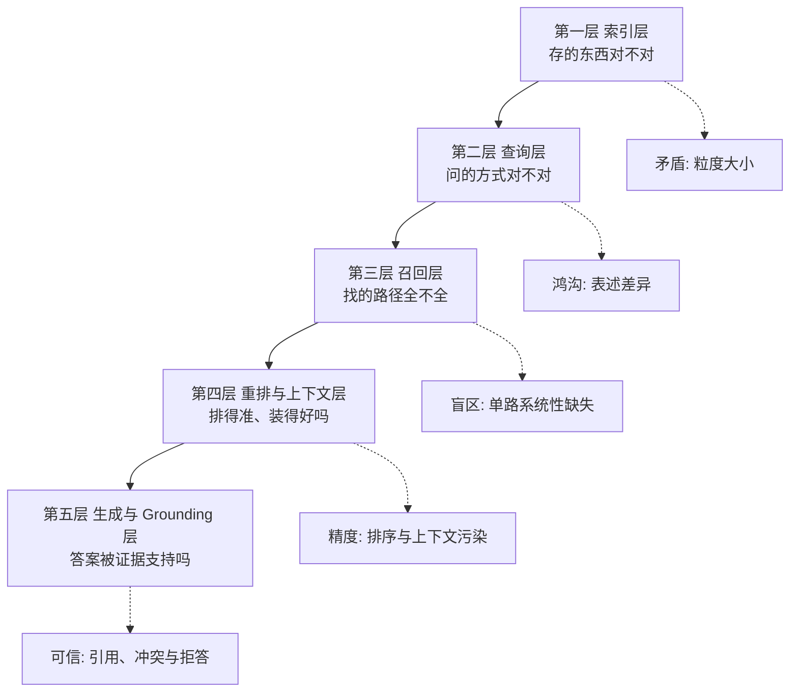
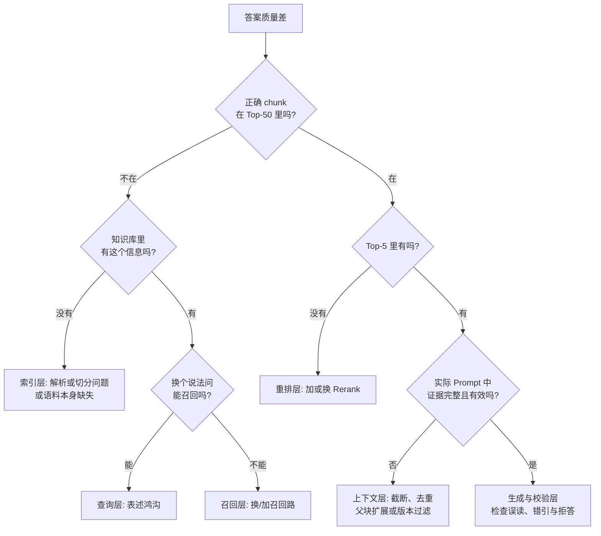
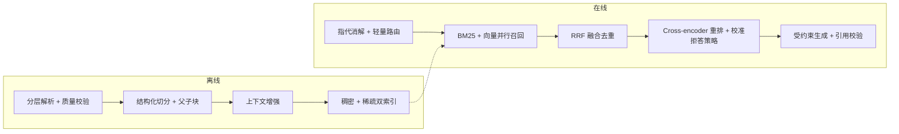

# 第十四章：RAG 优化的五层框架

## 14.1 为什么需要一个框架

「RAG 效果不好怎么优化」通常牵涉多个环节。

常见问题不是缺少可选手段，而是把「调 chunk 大小、换模型、加 rerank、做 query 改写」混在一起讨论。单纯罗列选项信息量很低，因为它没有回答问题究竟出在哪一层。

分层框架的作用，就是把优化手段按所处环节归类，再据此定位问题发生的位置。

每层提供不同的诊断入口，但问题并不独立，也没有所有项目都适用的优化顺序。先找证据丢失或失真的位置，再修相应层；安全、观测和评估是横切能力。

## 14.2 第一层：索引层

**要解决的核心矛盾**：粒度太小语义碎片化，粒度太大语义被稀释（第四章 4.2）。

| 手段 | 说明 | 详见 |
|---|---|---|
| 调整 chunk size 与 overlap | 建立简单基线，检查局部证据与上下文预算 | 4.5 |
| 结构化切分 | 利用可靠标题层级，结构恢复仍有成本 | 4.4 |
| 父子切分 | 检索用小的，生成用大的 | 5.3.2 |
| 上下文增强 | 给每个 chunk 加背景说明 | 5.3.4 |
| 文档解析质量 | **上限就在这里定死** | 第三章 |
| 元数据完整性 | 支撑过滤、溯源、时效 | 3.6.1 |

这一层经常被跳过，但它是所有效果的地基。很多团队花几周调 Rerank，最后才发现知识库里的表格全是乱码。

## 14.3 第二层：查询层

**要解决的核心问题**：用户的表达方式和文档的表达方式之间的鸿沟（第十二章 12.1）。

| 手段 | 治哪种鸿沟 |
|---|---|
| 指代消解 | 多轮对话的省略 |
| 直接改写 | 口语与书面、术语差异 |
| 多 Query 扩展 | 表述采样的随机性 |
| HyDE | 问题与文档的形式差异 |
| Step-back | 抽象层级不匹配 |
| 查询分解 | 复合问题的粒度不匹配 |
| 路由 | 不同问题需要不同策略 |

这一层要核算改写、分解和检索的实际调用图；多个动作可以同次生成，也可能依赖多轮。先按问题类型选择，再用消融判断组合是否带来新增证据，而不是按方法数估算固定调用次数。

## 14.4 第三层：召回层

**要解决的核心问题**：单路召回的系统性盲区（第十三章 13.1）。

| 手段 | 说明 |
|---|---|
| BM25 + 向量混合召回 | 常用对照基线，按增益和成本决定是否启用 |
| RRF 融合 | 无需训练，仍需设置候选窗口、平滑常数和权重 |
| 元数据过滤 | 按时间、部门、权限缩小范围 |
| 多知识库路由 | 按问题类型选库 |
| 调整各路 Top-K | 平衡召回与后续成本 |
| 后期交互作为第三路 | 前两路调到位后仍不够时再考虑 |

**这一层的关键指标是召回率**——如果正确答案根本没被召回，后面所有环节都无能为力。

候选证据覆盖约束当前链路的可达上限，而不是保证效果下限。重排找不回候选外的证据，后续也可能继续丢失已召回证据。

## 14.5 第四层：重排与上下文层

**要解决的核心问题**：双塔粗排的精度局限（第十三章 13.4.1）。

| 手段 | 说明 |
|---|---|
| Cross-encoder 重排 | 候选已有完整证据但排序不佳时尝试 |
| 校准的证据充分性规则 | 不把跨 Query 裸分当成答案正确概率 |
| 上下文裁剪与排序 | 控总量但不切断必要条件，比较排序策略 |
| 去重与去冗余 | 去重复，保留实体、数值和否定差异 |
| 时效选择 | 先按查询时刻和适用范围选版本，再考虑排序；不是总选最新 |

**这一层的关键指标是精度和排序质量**（MRR、NDCG）。

## 14.6 第五层：生成与 Grounding 层

**要解决的核心问题**：检索结果相关，不代表最终回答正确。模型仍可能忽略证据、混淆冲突版本、错配引用，或在证据不足时强行回答。

| 手段 | 解决什么问题 | 详见 |
|---|---|---|
| 证据化回答与 claim-citation 对齐 | 每个关键结论能回指支持证据 | 第十七、十八章 |
| 冲突与时效规则 | 避免把旧版本或冲突材料拼成结论 | 第十七章 |
| 组合式拒答 | 证据覆盖不足时停止，而非只看单一分数 | 第十三、十七章 |
| 结构化上下文与来源标签 | 降低上下文污染和引用错配 | 第十七章 |
| 输出验证与安全策略 | 检查事实支持、ACL 泄漏和注入影响 | 第十八、二十章 |

## 14.7 怎么定位问题在哪一层

框架本身只负责分类，真正能指导优化的是定位能力。

这个决策树的价值在于：它把一个模糊的「效果不好」，变成了一系列可以用数据回答的是非题。

图中的 Top-50/Top-5 是示例预算。排查“库里有却没找到”前，先确认该证据在查询时已发布且用户有权访问，再查过滤计划、索引滞后和 ANN 近似损失。合法的权限过滤不是应被“优化掉”的漏召回。

具体操作方法：

1. **取一批效果差的真实 Query**（不要用凭空构造的）；
2. **人工标注每个 Query 的正确答案在哪个 chunk**；
3. **检查这个 chunk 出现在检索结果的第几位**：
   - **根本不在候选里** → 索引层或召回层；
   - **在候选里但排名靠后** → 重排层；
   - **排在前列但答案还是错** → 继续查实际 Prompt，区分上下文装配和生成失真。

再做两个受控实验：把人工完整证据直接交给生成器，检查其阅读与引用上限；固定生成器、逐一替换实际召回与人工证据，估算检索损失。记录候选集、重排结果、父块扩展和最终 Prompt 的版本化证据 ID，才知道证据到底在哪一步消失。多跳问题需要完整证据组，不能只跟踪一个正确 chunk。

**统计一批 Query 的分布**，就能看出该优先投入哪一层。很多情况下，诊断本身比盲目加新组件更重要。

## 14.8 优化顺序建议

下面是排查顺序的示例，不是上线依赖关系。ACL、基本拒答、引用校验和评测应从第一版就具备，不能等检索调优结束再补：

| 观察到的问题 | 优先验证的动作 |
|---|---|
| 没有可复核的基线 | 建评测集、记录证据链与预算 |
| 原件有证据，入库内容却没有 | 修解析、结构和元数据映射 |
| 边界丢失限定条件 | 调整 size/overlap，比较父子块或窗口扩展 |
| 型号或同义说法持续漏检 | 比较 BM25、向量及 RRF 融合的独占召回 |
| 完整证据已召回但排名靠后 | 比较 Rerank 与候选截断预算 |
| 多轮省略或复合问题漏证据 | 做指代消解、改写或查询分解 |
| 片段缺少文档背景 | 比较上下文增强及其构建、更新成本 |
| 证据完整却答错或错引 | 修生成约束、引用校验与拒答，不继续堆检索 |
| 表示或控制流仍有结构性缺口 | 再评估 Embedding 微调和对应高级范式 |

评测集本身不修改答案，但让每次投入有可比较的结果。成本应包含标注、重建、在线计算与维护，不能通用地把混合召回或重排标成“低成本、高收益”。

## 14.9 一个典型的组合方案

下面是一种可作为实验起点的组合，不是所有企业系统必然收敛的架构：

**这套方案没有依赖实验性组件**，但覆盖了五层里的主要手段。每个组件是否适合，仍需由业务评测集、延迟与成本预算验证。

> **RAG 优化通常先把基础环节做对，再考虑高级范式。** 第十五、十六章提到的方案，更适合在这一基础上解决额外的结构性问题。

## 14.10 常见错误

### 14.10.1 罗列手段但不分层

这种写法无法体现问题定位和取舍判断。

### 14.10.2 不会定位问题在哪一层

有框架但不会归因，优化动作通常会失焦。

### 14.10.3 跳过评测集直接优化

无法判断改动是好是坏，只能凭感觉。这是最常见也最致命的错误。

### 14.10.4 从最复杂的手段开始

上 GraphRAG 之前，先确认解析、切分、混合召回、Rerank 都做对了。

### 14.10.5 忽略索引层

后面四层再优化，也救不回解析错误的文档。

### 14.10.6 只优化检索不优化生成

检索完美时模型仍可能过度发挥（第十七章）。

### 14.10.7 一次改多个变量

无法归因是哪个改动起了作用，也无法回退。

## 14.11 本章总结

1. **五层框架**：索引层、查询层、召回层、重排与上下文层、生成与 Grounding 层；
2. **每层提供一个诊断入口**：数据质量、表述鸿沟、召回盲区、排序与装配、证据支持与拒答；它们会相互影响；
3. **候选覆盖限制可达上限**，且需继续检查重排后和最终 Prompt 中的证据保留；
4. **定位方法**：标注正确 chunk 的排名位置，按「不在候选 / 在候选但靠后 / 在前列但答案错」三分法归因到具体层；
5. **按失败位置选择下一步**，不把组件清单当作固定升级顺序；ACL、拒答和引用要求从第一版就要落实；
6. **建立评测集本身不带来效果提升，但没有它后面全是盲目试错**；
7. **按失败归因决定投入**，基础方案和高级方法都需要相同预算下的消融与回归。

## 参考资料

- [Searching for Best Practices in Retrieval-Augmented Generation](https://arxiv.org/abs/2407.01219)
- [Retrieval-Augmented Generation for Large Language Models: A Survey](https://arxiv.org/abs/2312.10997)
- [Anthropic: Introducing Contextual Retrieval](https://www.anthropic.com/engineering/contextual-retrieval)
- [Evaluation of Retrieval-Augmented Generation: A Survey](https://arxiv.org/abs/2405.07437)
