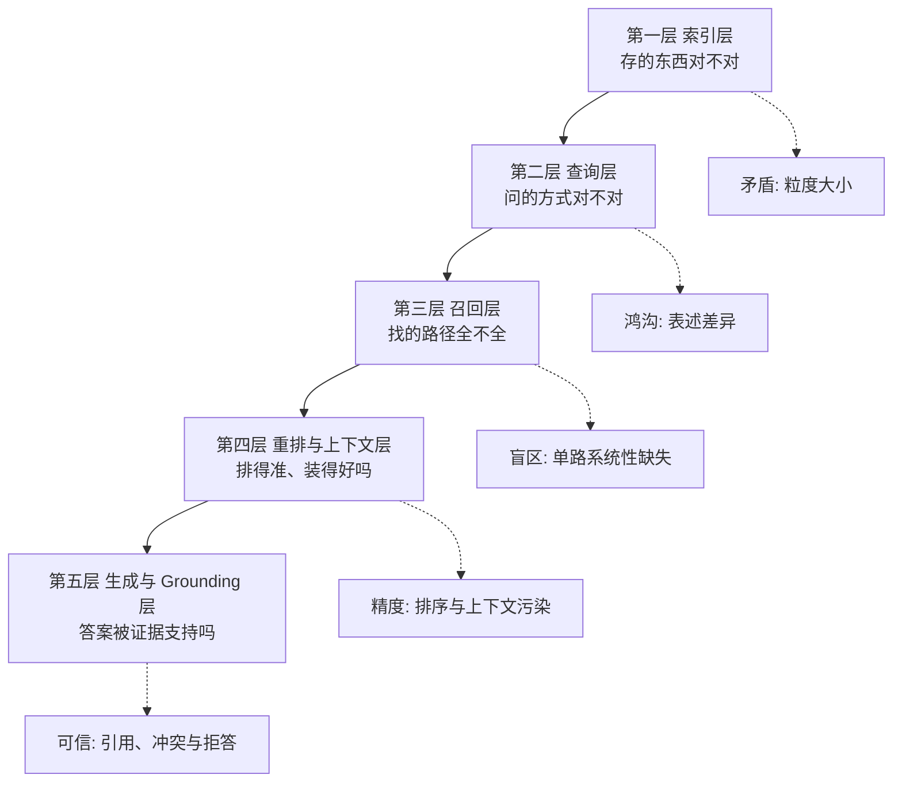
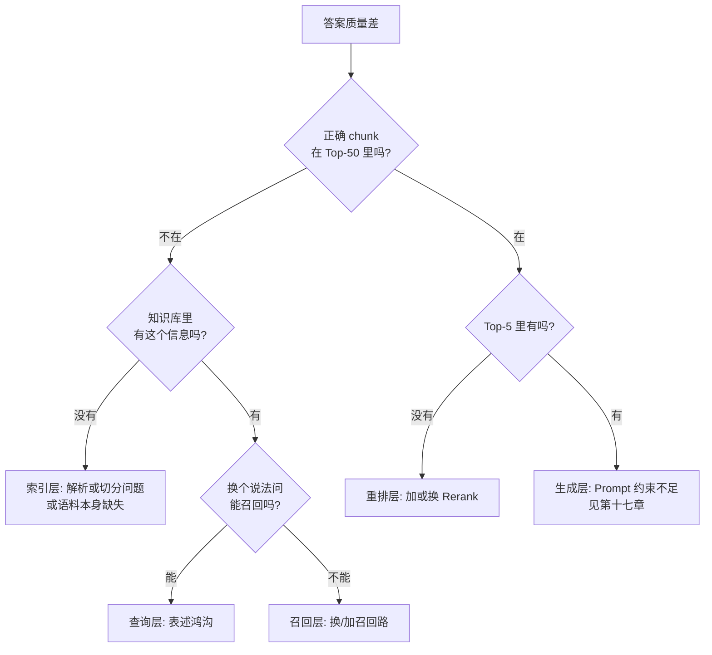
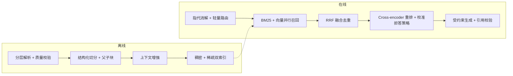

# 第十四章：RAG 优化的五层框架

## 14.1 为什么需要一个框架

「RAG 效果不好怎么优化」通常牵涉多个环节。

常见问题不是缺少可选手段，而是把「调 chunk 大小、换模型、加 rerank、做 query 改写」混在一起讨论。单纯罗列选项信息量很低，因为它没有回答问题究竟出在哪一层。

分层框架的作用，就是把优化手段按所处环节归类，再据此定位问题发生的位置。

**每一层解决一个独立的问题，且顺序不能颠倒**——索引层的数据如果就有问题，后面四层做得再好也没用。安全、观测和评估不是第六层，而是贯穿五层的横切能力。

## 14.2 第一层：索引层

**要解决的核心矛盾**：粒度太小语义碎片化，粒度太大语义被稀释（第四章 4.2）。

| 手段 | 说明 | 详见 |
|---|---|---|
| 调整 chunk size 与 overlap | **投入产出比最高的第一步** | 4.5 |
| 结构化切分 | 按标题层级切，成本近乎为零 | 4.4 |
| 父子切分 | 检索用小的，生成用大的 | 5.3.2 |
| 上下文增强 | 给每个 chunk 加背景说明 | 5.3.4 |
| 文档解析质量 | **上限就在这里定死** | 第三章 |
| 元数据完整性 | 支撑过滤、溯源、时效 | 3.6.1 |

这一层经常被跳过，但它是所有效果的地基。很多团队花几周调 Rerank，最后才发现知识库里的表格全是乱码。

## 14.3 第二层：查询层

**要解决的核心问题**：用户的表达方式和文档的表达方式之间的鸿沟（第十二章 12.1）。

| 手段 | 治哪种鸿沟 |
|---|---|
| 指代消解 | 多轮对话的省略 |
| 直接改写 | 口语与书面、术语差异 |
| 多 Query 扩展 | 表述采样的随机性 |
| HyDE | 问题与文档的形式差异 |
| Step-back | 抽象层级不匹配 |
| 查询分解 | 复合问题的粒度不匹配 |
| 路由 | 不同问题需要不同策略 |

这一层的成本特征是「每个手段通常都多一次 LLM 调用」，所以一般按问题类型选一种，而不是层层叠加。

## 14.4 第三层：召回层

**要解决的核心问题**：单路召回的系统性盲区（第十三章 13.1）。

| 手段 | 说明 |
|---|---|
| BM25 + 向量混合召回 | **必选项，不是可选项** |
| RRF 融合 | 规避量纲问题，零调参 |
| 元数据过滤 | 按时间、部门、权限缩小范围 |
| 多知识库路由 | 按问题类型选库 |
| 调整各路 Top-K | 平衡召回与后续成本 |
| 后期交互作为第三路 | 前两路调到位后仍不够时再考虑 |

**这一层的关键指标是召回率**——如果正确答案根本没被召回，后面所有环节都无能为力。

> **召回层是效果的下限**。它没找回来的东西，重排层变不出来。

## 14.5 第四层：重排与上下文层

**要解决的核心问题**：双塔粗排的精度局限（第十三章 13.4.1）。

| 手段 | 说明 |
|---|---|
| Cross-encoder 重排 | **单点性价比最高的优化** |
| 分数阈值过滤 | 拒答能力的基础 |
| 上下文裁剪与排序 | 控总量、把最相关的放首尾 |
| 去重与去冗余 | 尤其是新旧版本冲突 |
| 时效性加权 | 同等相关时优先新文档 |

**这一层的关键指标是精度和排序质量**（MRR、NDCG）。

## 14.6 第五层：生成与 Grounding 层

**要解决的核心问题**：检索结果相关，不代表最终回答正确。模型仍可能忽略证据、混淆冲突版本、错配引用，或在证据不足时强行回答。

| 手段 | 解决什么问题 | 详见 |
|---|---|---|
| 证据化回答与 claim-citation 对齐 | 每个关键结论能回指支持证据 | 第十七、十八章 |
| 冲突与时效规则 | 避免把旧版本或冲突材料拼成结论 | 第十七章 |
| 组合式拒答 | 证据覆盖不足时停止，而非只看单一分数 | 第十三、十七章 |
| 结构化上下文与来源标签 | 降低上下文污染和引用错配 | 第十七章 |
| 输出验证与安全策略 | 检查事实支持、ACL 泄漏和注入影响 | 第十八、二十章 |

## 14.7 怎么定位问题在哪一层

框架本身只负责分类，真正能指导优化的是定位能力。

这个决策树的价值在于：它把一个模糊的「效果不好」，变成了一系列可以用数据回答的是非题。

具体操作方法：

1. **取一批效果差的真实 Query**（不要用凭空构造的）；
2. **人工标注每个 Query 的正确答案在哪个 chunk**；
3. **检查这个 chunk 出现在检索结果的第几位**：
   - **根本不在候选里** → 索引层或召回层；
   - **在候选里但排名靠后** → 重排层；
   - **排在前列但答案还是错** → 生成层。

**统计一批 Query 的分布**，就能看出该优先投入哪一层。很多情况下，诊断本身比盲目加新组件更重要。

## 14.8 优化顺序建议

按**投入产出比**排序：

| 顺序 | 动作 | 成本 | 预期收益 |
|---|---|---|---|
| 1 | **建立评测集** | 中（人力） | **无收益，但没它什么都测不了** |
| 2 | 检查文档解析质量 | 低 | 可能极高 |
| 3 | 调 chunk size 与 overlap | 低 | 中到高 |
| 4 | 加 BM25 混合召回 + RRF | 低 | **高** |
| 5 | 加 Rerank | 低 | **高** |
| 6 | 父子切分 | 低 | 中到高 |
| 7 | Query 改写/指代消解 | 中 | 中（多轮场景为高） |
| 8 | 上下文增强 | 中 | 中到高 |
| 9 | Prompt 约束与拒答 | 低 | 中（但对可信度是高） |
| 10 | 微调 Embedding / 高级范式 | **高** | 视场景 |

**第 1 步本身不产生效果提升，但没有它，后面九步就很难判断改动是否真的有效。**

## 14.9 一个典型的组合方案

多数中等规模的企业 RAG 系统，最终会收敛到类似的配置：

**这套方案没有依赖实验性组件**，但覆盖了五层里的主要手段。每个组件是否适合，仍需由业务评测集、延迟与成本预算验证。

> **RAG 优化通常先把基础环节做对，再考虑高级范式。** 第十五、十六章提到的方案，更适合在这一基础上解决额外的结构性问题。

## 14.10 常见错误

### 14.10.1 罗列手段但不分层

这种写法无法体现问题定位和取舍判断。

### 14.10.2 不会定位问题在哪一层

有框架但不会归因，优化动作通常会失焦。

### 14.10.3 跳过评测集直接优化

无法判断改动是好是坏，只能凭感觉。这是最常见也最致命的错误。

### 14.10.4 从最复杂的手段开始

上 GraphRAG 之前，先确认解析、切分、混合召回、Rerank 都做对了。

### 14.10.5 忽略索引层

后面四层再优化，也救不回解析错误的文档。

### 14.10.6 只优化检索不优化生成

检索完美时模型仍可能过度发挥（第十七章）。

### 14.10.7 一次改多个变量

无法归因是哪个改动起了作用，也无法回退。

## 14.11 本章总结

1. **五层框架**：索引层、查询层、召回层、重排与上下文层、生成与 Grounding 层；
2. **每层解决一个独立问题**：数据质量、表述鸿沟、召回盲区、排序与装配、证据支持与拒答；
3. **召回层是效果的下限**——没召回的内容，重排变不出来；
4. **定位方法**：标注正确 chunk 的排名位置，按「不在候选 / 在候选但靠后 / 在前列但答案错」三分法归因到具体层；
5. **优化顺序按投入产出比**：评测集 → 解析质量 → 切分参数 → 混合召回 → Rerank → 父子块 → Query 改写 → 上下文增强 → 生成约束 → 高级方案；
6. **建立评测集本身不带来效果提升，但没有它后面全是盲目试错**；
7. **把基础做对的收益，远大于引入前沿技术**。

## 参考资料

- [Searching for Best Practices in Retrieval-Augmented Generation](https://arxiv.org/abs/2407.01219)
- [Retrieval-Augmented Generation for Large Language Models: A Survey](https://arxiv.org/abs/2312.10997)
- [Anthropic: Introducing Contextual Retrieval](https://www.anthropic.com/engineering/contextual-retrieval)
- [Evaluation of Retrieval-Augmented Generation: A Survey](https://arxiv.org/abs/2405.07437)
