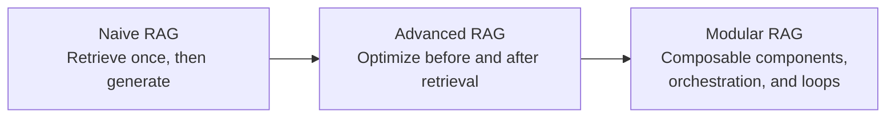
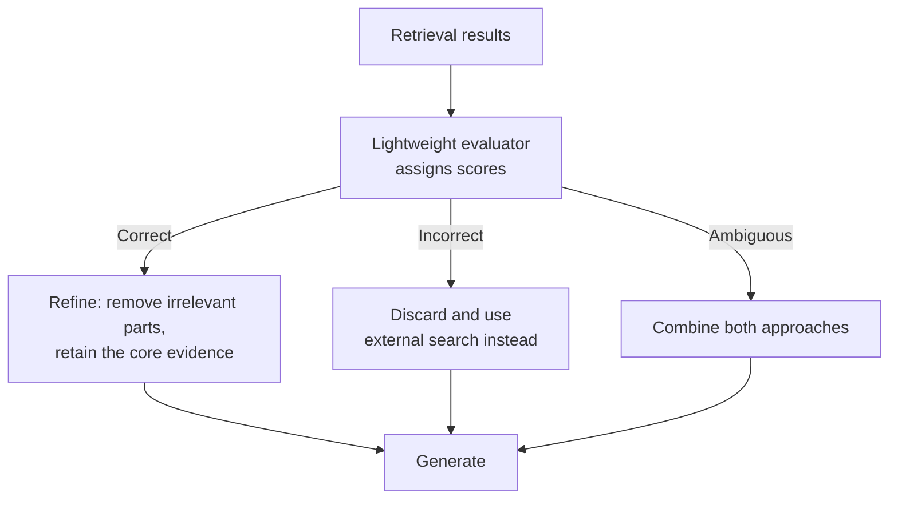
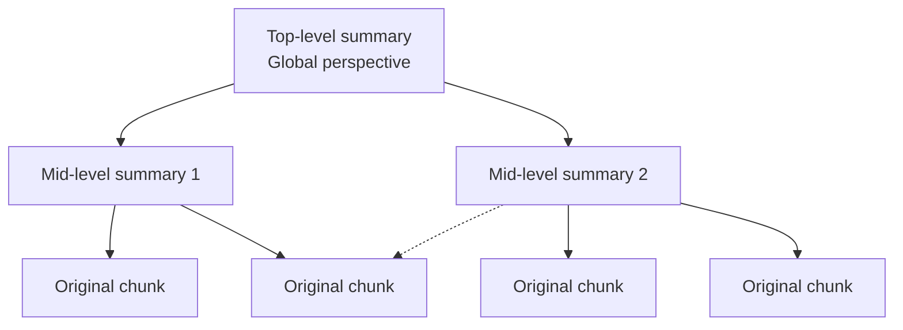
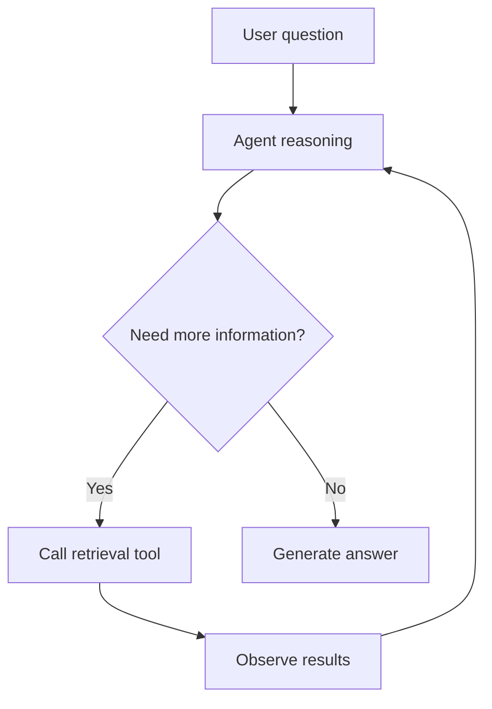
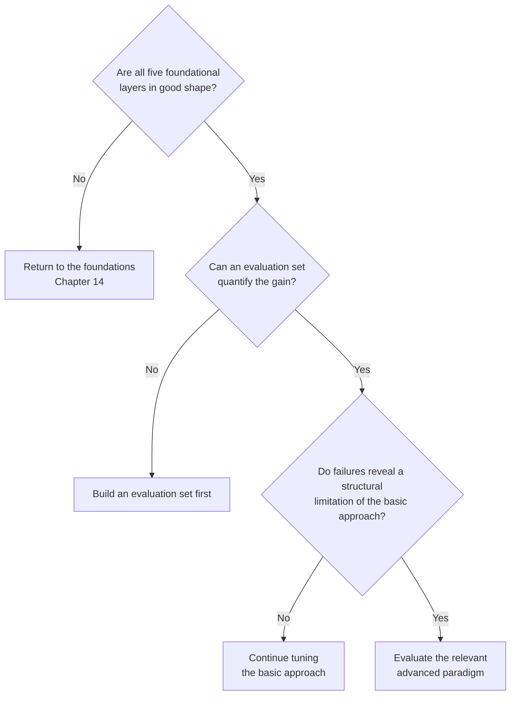

# Chapter 15: Advanced RAG Paradigms

## 15.1 How the Three RAG Paradigms Developed

Naive, Advanced, and Modular are categories used in a survey, not formal version standards or mandatory stages of development. To understand them, examine their control flow, training requirements, and target problems rather than simply listing names.

| Organization | Focus and boundaries |
|---|---|
| Naive RAG | Establishes a basic retrieval, concatenation, and generation pipeline; without quality controls, it can use irrelevant or insufficient evidence |
| Advanced RAG | Optimizes stages before and after retrieval, such as rewriting, hybrid retrieval, reranking, and compression; whether it includes loops depends on the implementation |
| Modular RAG | Emphasizes the ability to compose interchangeable components, routing, branches, and loops; greater flexibility also increases debugging and cost-management effort |

> **More useful than asking “Which generation is it?” is asking: who decides the next step, on the basis of which intermediate results, and when does the process stop?**

When the LLM itself receives the authority to change that course, the approach becomes Agentic RAG (Section 15.6).

## 15.2 Self-RAG: Learning Whether to Retrieve and Whether the Evidence Is Useful

Self-RAG trains a model to emit special **reflection tokens** during generation to assess the following:

| Judgment | Meaning |
|---|---|
| Is retrieval needed? | Does this question require external knowledge? |
| Is the retrieved content relevant? | Is each passage relevant to the question? |
| Is the generated content supported by the material? | Is there evidence for the output? |
| Is this answer useful? | An assessment of overall answer quality |

**The problem it addresses**: Naive RAG “always retrieves and always uses what it retrieves.” This is both wasteful, because it retrieves even when retrieval is unnecessary, and risky, because it uses retrieved content even when that content is irrelevant.

These reflection capabilities are **learned through training** and require dedicated training data and a fine-tuning process. **Many engineering implementations borrow only the idea, prompting a model to make similar judgments rather than reproducing the original paper’s training method.** The two should not be conflated.

## 15.3 CRAG: Recovering from Poor Retrieval

There is a common naming ambiguity:

> **Corrective RAG, a method, and the CRAG Benchmark, an evaluation benchmark, are two different things. Do not confuse them.**

Corrective RAG uses a lightweight evaluator to score retrieval results, then handles them in three categories:

**Its value lies in acknowledging a practical fact: retrieval can fail, and the system needs a recovery path.** That is a substantial improvement over simply using whatever retrieval returns.

In engineering, it is reasonable to borrow the “quality assessment plus recovery” control flow. However, neither a prompt nor a reranking threshold reproduces the original paper or guarantees most of its gains. Abstention rules need calibration. When retrieval over private knowledge fails, external web pages usually cannot fill the gap and may introduce data-disclosure and source risks. External search must remain subject to data and tool authorization.

## 15.4 RAPTOR: Organizing Knowledge into a Tree

**The problem it addresses**: Retrieving a small top-K set from a flat collection of passages may fail to cover the main conclusions of an entire report. RAPTOR builds multiple levels of summaries in advance, so retrieval can select both details and higher-level overviews. This does not mean that ordinary RAG, combined with full-document reading or grouped summarization, cannot answer synthesis questions.

RAPTOR works as follows:

1. Embed all chunks and **cluster** them.
2. Use an LLM to generate a **summary** for each cluster.
3. Embed the summaries, then **cluster and summarize again**, recursively building upward into a tree.
4. The original paper compares two retrieval strategies: tree traversal and collapsed tree. The latter retrieves from nodes across multiple levels together; “traverse every level on every query” is not the only implementation.

The dashed edge indicates that a passage may also contribute to another cluster’s summary. The original paper uses soft clustering, allowing a node to belong to multiple clusters. “Tree” is an intuitive description of the hierarchy, not a guarantee that each passage has exactly one parent. Deduplication and links back to sources must account for this overlap.

**Results**: Published evaluations show substantial improvements on long-document question-answering tasks that require synthesis across multiple passages.

**Costs and limits**:

- **Indexing requires many LLM calls**: one summary per cluster, recursively across levels.
- **Corpus updates may require part or even all of the tree to be rebuilt.**
- Summaries can omit details or propagate errors, so mappings back to the original leaf-level text must be retained. Whether building a tree is worthwhile depends on token volume, the need for cross-document evidence, and caching costs. There is no universal “200-page” threshold.

## 15.5 The Problems Each Paradigm Addresses

**Adaptive-RAG** trains a smaller language-model classifier to choose among no retrieval, single-round retrieval, and iterative retrieval based on question complexity. Its training labels come from signals such as the actual performance of candidate workflows. Rule-based routing can borrow this division of work, but it does not reproduce the paper’s classifier.

| Paradigm | Target problem and added burden |
|---|---|
| Self-RAG | Learns when to retrieve and how to assess evidence; requires reflection-token training and inference-time control |
| Corrective RAG | Provides recovery from low-quality retrieval; requires evaluator calibration, knowledge refinement, and controlled external search |
| RAPTOR | Expands the levels of evidence available for synthesis questions; adds clustering, summarization, source-maintenance, and update costs |
| Adaptive-RAG | Avoids excess computation for simple questions and insufficient retrieval for complex ones; adds classifier training and the cost of misrouting |
| GraphRAG | Uses relationships and community reports to support entity-specific or global questions; requires graph construction, evidence checks, and updates to derived artifacts |
| Agentic RAG | Autonomously performs multiple retrieval rounds based on intermediate results; requires budgets, stopping conditions, and tool-permission controls |

## 15.6 Agentic RAG: Making Retrieval an Agent Tool

This section describes a way to control execution. Neither its age nor its popularity is a reason to adopt it.

The key shift in Agentic RAG is:

> **Retrieval changes from “a step in a fixed workflow” to “a tool whose timing, number of calls, and use of results the agent can decide.”**

This enables the following capabilities:

| Capability | Explanation |
|---|---|
| **Multi-round retrieval** | If the first round is insufficient, launch another round based on what is already known |
| **Multi-hop reasoning** | First find out who company A’s CEO is, then retrieve information about that person |
| **Autonomous decomposition** | Break a complex question into subquestions |
| **Multi-source selection** | Choose among vector stores, SQL, web search, and APIs |
| **Self-correction** | Notice that retrieval results are wrong and retry with a different query |

The corresponding costs are equally clear:

- **Unpredictable latency**: a task may finish in one round or take ten.
- **Unpredictable cost**: each round involves a full LLM call.
- **Possible loops**: repeated retrieval may never converge, so **a hard limit on the number of rounds is essential**.
- **Difficult debugging**: the execution path can differ from run to run.

Engineering implementations usually set hard limits on iterations, total tokens, and elapsed time. These match the general requirements for agent systems; see the relevant chapters in the Agent section.

For every tool call, the execution layer must also check identity, the resource being accessed, and which data may be sent. Retrieved passages cannot grant new permissions on the user’s behalf or instruct an agent to forward internal queries to unapproved external search services.

Stopping conditions should also include “the latest round added no useful evidence” and “the required evidence is covered.” Record each round’s query, evidence, duplicate hits, and reason for stopping. Compare task success rate, average rounds, P95 latency, and cost per successful task against a fixed two-round query-decomposition baseline. Otherwise, more rounds may simply repeat the same mistakes at greater cost.

## 15.7 When to Adopt an Advanced Paradigm

In most cases, there is no need to start with these advanced paradigms.

As Chapter 14 explained, **getting the five foundational layers right is usually more effective than blindly stacking advanced paradigms**. Consider an advanced paradigm only when the following conditions hold:

**The test for a “structural limitation”** is that **parameter tuning cannot solve the problem**. For example:

- Single-round candidates do not adequately cover multi-hop evidence → compare query decomposition, multi-round retrieval, and graph expansion.
- Global themes require broader coverage → compare exhaustive grouped summarization, long context, RAPTOR, and GraphRAG.
- Retrieval failure rates remain high and cannot be reduced → consider adding a recovery path.

If failures come from corrupted parsing, omissions during chunking, or inadequate term matching, fix the corresponding stage first. The absence of BM25 alone does not make a system inadequate, and complex control flow should not conceal known data defects.

## 15.8 Common Mistakes

### 15.8.1 Listing Paradigm Names Without Explaining the Problems They Solve

A list of names, without an explanation of the problem each method addresses, rarely provides enough basis for choosing an approach.

### 15.8.2 Confusing Corrective RAG with the CRAG Benchmark

One is a method and the other is an evaluation benchmark. They share an acronym, not an identity.

### 15.8.3 Describing Self-RAG as Just an Extra Prompt

The original paper trains the model to emit reflection tokens. An engineering approximation based on prompting should be identified as a simplified version.

### 15.8.4 Ignoring RAPTOR’s Indexing and Update Costs

Many LLM calls, plus tree reconstruction when the corpus changes, can make it expensive for dynamic corpora.

### 15.8.5 Running Agentic RAG Without an Iteration Limit

It can get stuck in loops, leaving cost and latency uncontrolled.

### 15.8.6 Adopting Advanced Paradigms Before Fixing the Foundations

This is the most common mistake. Advanced paradigms do not repair foundational defects; they hide them and amplify costs.

### 15.8.7 Failing to Distinguish Research Methods from Production Implementations

A paper prototype, an official library implementation, and validation in a business setting are three different kinds of evidence. Explain which implementation version was actually used and which mechanisms were simplified, rather than broadly declaring a method “widely adopted” or “still only academic.”

## 15.9 Chapter Summary

1. **Three ways to organize RAG**: Naive establishes the basic pipeline, Advanced improves stages before and after retrieval, and Modular emphasizes composition. These are not strict versions or a mandatory upgrade sequence.
2. **Self-RAG** uses reflection tokens to judge whether retrieval is needed, content is relevant, and generation is supported. The original paper achieves this through training.
3. **Corrective RAG** assigns retrieval results to categories and provides recovery paths. **Distinguish it from the CRAG Benchmark.** Reranking thresholds can serve as an engineering simplification.
4. **RAPTOR** recursively clusters and summarizes into a tree. Compare its retrieval strategies and account for summary distortion, updates, and links back to sources.
5. **Agentic RAG** makes retrieval an agent tool, enabling multiple rounds, multiple hops, multiple sources, and self-correction. **Iteration limits and budgets are essential.**
6. **Prerequisites for advanced paradigms**: five sound foundational layers, an evaluation set, and failures caused by **structural limitations** rather than tuning problems.
7. **Distinguish paper mechanisms, specific implementations, and business validation.** A method’s name or year is not a substitute for evidence supporting its adoption.

## References

- [Self-RAG: Learning to Retrieve, Generate, and Critique through Self-Reflection](https://arxiv.org/abs/2310.11511)
- [Corrective Retrieval Augmented Generation](https://arxiv.org/abs/2401.15884)
- [RAPTOR: Recursive Abstractive Processing for Tree-Organized Retrieval](https://arxiv.org/abs/2401.18059)
- [Adaptive-RAG: Learning to Adapt Retrieval-Augmented Large Language Models through Question Complexity](https://arxiv.org/abs/2403.14403)
- [Agentic Retrieval-Augmented Generation: A Survey on Agentic RAG](https://arxiv.org/abs/2501.09136)
- [Active Retrieval Augmented Generation](https://arxiv.org/abs/2305.06983)
- [Retrieval-Augmented Generation for Large Language Models: A Survey](https://arxiv.org/abs/2312.10997)

Source checks for this translation covered the original papers’ reflection tokens, corrective branches, RAPTOR soft clustering and retrieval strategies, Adaptive-RAG routing, and the survey’s three organizational categories. The Agentic RAG survey and Active Retrieval Augmented Generation were checked at the abstract level only; their experiments were not reproduced.
