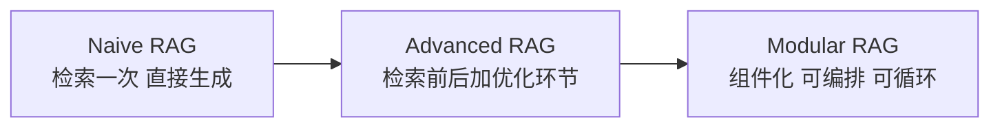
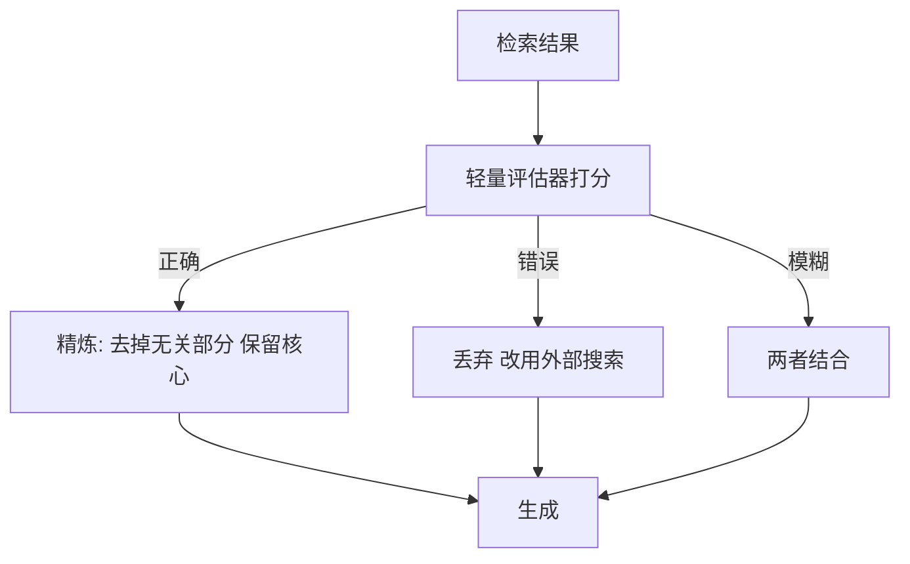
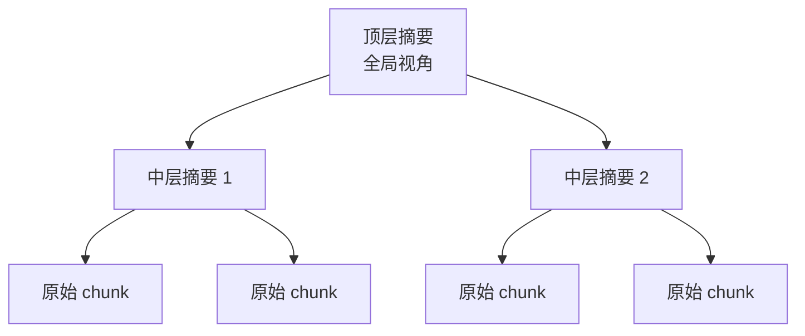
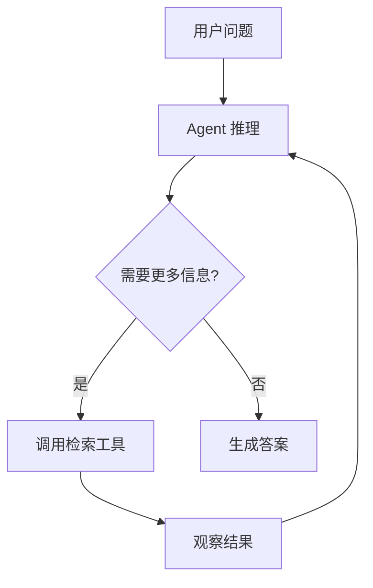
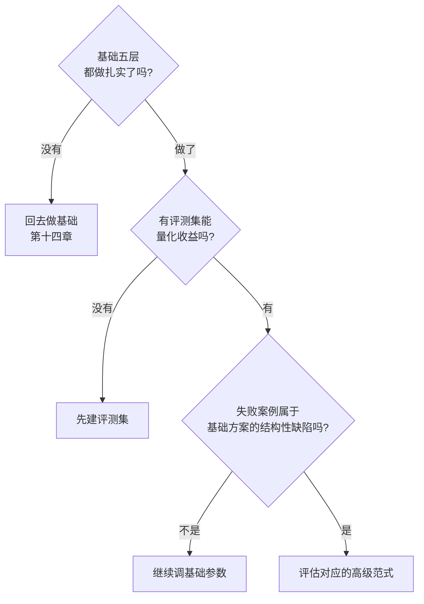

# 第十五章：高级 RAG 范式

## 15.1 三代 RAG 的演进逻辑

Naive、Advanced、Modular 是综述中的组织方式，不是严格的版本标准或必经代际。理解时应看控制流、训练要求和适用问题，而不是只列名字。

| 代际 | 结构 | 解决了什么 | 遗留问题 |
|---|---|---|---|
| Naive RAG | 检索 → 拼接 → 生成，**一次性、单向** | 让模型能用外部知识 | 检索质量差、无质量把关 |
| Advanced RAG | 加入 Query 改写、混合召回、Rerank、上下文压缩 | 大幅提升检索质量 | **流程仍是固定的一条直线** |
| Modular RAG | 组件化，支持路由、循环、条件分支 | 能按需组合与迭代 | 复杂度和成本上升 |

> **从第二代到第三代的本质变化，是流程从「固定直线」变成了「可以根据中间结果改变走向」。**

而当这个「改变走向」的决策权交给 LLM 自己时，就演变成了 Agentic RAG（15.6）。

## 15.2 Self-RAG：让模型自己决定要不要检索、检索得对不对

Self-RAG 的做法是训练模型在生成过程中输出特殊的**反思标记**，用来自我判断：

| 判断 | 含义 |
|---|---|
| 需不需要检索 | 这个问题是否需要外部知识 |
| 检索到的内容相关吗 | 每个片段是否与问题相关 |
| 生成的内容被材料支撑吗 | 输出是否有依据 |
| 这个回答有用吗 | 整体质量评估 |

**它解决的问题**：Naive RAG 是「无条件检索、无条件使用」，既浪费（不需要检索时也检索），又危险（检索到不相关内容也硬用）。

这些反思能力是**训练出来的**，需要专门的训练数据和微调流程。**很多工程实现只是借用了它的思路（用提示让模型做类似判断），而不是复现原论文的训练方法**，两者不能混为一谈。

## 15.3 CRAG：检索质量不行时怎么补救

这里有一个常见的命名歧义：

> **Corrective RAG（一种方法）和 CRAG Benchmark（一个评测基准）是完全不同的两个东西，不要混淆。**

Corrective RAG 的做法是用一个轻量的评估器给检索结果打分，再按分数分三档处理：

**它的价值在于承认了一个现实：检索是会失败的，系统需要有失败后的补救路径。** 这比「检索到什么就用什么」进了一大步。

工程上可以借用“质量判断 + 补救”的控制流，但不能声称提示词或 Rerank 阈值复现了原论文、或保证获得大部分收益。拒答规则需校准；私有知识检索失败时，外部网页通常无法补全，还可能带来泄密和来源风险，必须受数据与工具授权约束。

## 15.4 RAPTOR：把知识组织成树

**要解决的问题**：普通 RAG 检索的是**平铺的片段**，无法回答需要综合整篇甚至整个语料的问题（「这份报告的核心结论是什么」）。

RAPTOR 的流程如下：

1. 把所有 chunk 向量化后**聚类**；
2. 对每个簇用 LLM 生成**摘要**；
3. 把摘要也向量化，**再聚类、再摘要**，递归向上，形成一棵树；
4. 原论文比较了 tree traversal 与 collapsed tree 两种检索方式，后者把多层节点放在一起检索；不能把“每次遍历所有层”视为唯一实现。

**效果**：在需要多段落综合的长文档问答任务上，公开评测显示有显著提升。

**代价与适用边界**：

- **索引阶段需要大量 LLM 调用**（每个簇一次摘要，逐层递归）；
- **语料更新时树需要局部甚至整体重建**；
- 摘要可能省略细节或传播错误，必须保留到叶子原文的来源映射；判断是否值得建树应看 Token 量、跨文档证据需求和缓存成本，没有“两百页”通用阈值。

## 15.5 各范式对应的痛点

| 范式 | 治的痛点 | 成本 | 成熟度 |
|---|---|---|---|
| Self-RAG | 无条件检索、无质量把关 | 需要微调（或用提示近似） | 学术为主 |
| Corrective RAG | 检索失败无补救路径 | 中 | 思路已被工程广泛采纳 |
| RAPTOR | 无法回答需要全局综合的问题 | 索引成本高 | 学术为主 |
| Adaptive-RAG | 简单问题用重策略浪费 | 低 | **思路易落地** |
| GraphRAG | 无法做多跳和全局主题分析 | **很高** | 见第十六章 |
| Agentic RAG | 单轮检索无法处理复杂任务 | 高 | 快速发展中 |

## 15.6 Agentic RAG：把检索变成 Agent 的工具

这里讨论一种控制方式，不把年份或关注度作为采用依据。

Agentic RAG 的关键转变是：

> **从「固定流程中的一个步骤」，变成「Agent 可以自主决定何时调用、调用几次、怎么用结果的一个工具」。**

它带来的能力包括：

| 能力 | 说明 |
|---|---|
| **多轮检索** | 第一轮结果不够，基于已知信息发起新一轮检索 |
| **多跳推理** | 先查出 A 的 CEO 是谁，再查这个人的信息 |
| **自主分解** | 复杂问题自己拆成子问题 |
| **多源调度** | 在向量库、SQL、网页搜索、API 之间自主选择 |
| **自我纠错** | 发现检索结果不对，换个查询方式重试 |

相应的代价也很明确：

- **延迟不可预测**：可能一轮结束，也可能十轮；
- **成本不可预测**：每轮都是完整的 LLM 调用；
- **可能陷入循环**：反复检索却不收敛，**必须设最大轮次上限**；
- **调试困难**：执行路径每次都不同。

工程上通常会设置硬性的最大迭代次数、总 Token 预算和超时时间。这与 Agent 系统的通用要求一致（参见 Agent 部分的相关章节）。

停止条件还应包括“新一轮未增加有效证据”和“目标证据已覆盖”。记录每轮查询、证据、重复命中与停止原因，并与固定两轮查询分解基线比较任务成功率、平均轮次、P95 和每个成功任务的成本；否则更多轮次可能只是更贵地重复错误。

## 15.7 什么时候该上高级范式

多数情况下，不需要一开始就引入这些高级范式。

第十四章已经说过——**先把基础五层做对，通常比盲目叠加高级范式更有效**。高级范式应该在满足以下条件时才考虑：

**「结构性缺陷」的判断标准**：这个问题**不是调参能解决的**。例如：

- 多跳证据在单轮候选中覆盖不足 → 比较查询分解、多轮检索与图扩展；
- 全局主题需要更广覆盖 → 比较全量分组汇总、长上下文、RAPTOR 或 GraphRAG；
- 检索失败率高且无法降低 → 考虑加入补救路径。

**反之，如果失败原因是「chunk 切得不好」「没有 BM25 那一路」，那再高级的范式也救不了。**

## 15.8 常见错误

### 15.8.1 罗列范式名字不讲解决什么痛点

如果只列出范式名而不说明它们分别在解决什么问题，通常很难支撑选型判断。

### 15.8.2 混淆 Corrective RAG 和 CRAG Benchmark

一个是方法，一个是评测基准，名字撞车但毫不相干。

### 15.8.3 说 Self-RAG 只是加个提示词

原论文是通过训练让模型输出反思标记。工程上的提示词近似实现应该说明是简化版。

### 15.8.4 忽略 RAPTOR 的索引成本和更新代价

大量 LLM 调用 + 更新需重建树，在动态语料上代价很大。

### 15.8.5 Agentic RAG 不设迭代上限

会陷入循环，成本和延迟不可控。

### 15.8.6 基础没做好就上高级范式

这是最常见的错误。基础缺陷不会被高级范式弥补，只会被掩盖并放大成本。

### 15.8.7 不区分学术方案和生产方案

论文原型、官方库实现与业务验证是三种不同证据。说明实际采用哪一版实现、哪些机制被简化，而不是笼统宣布“已普及”或“仍是学术方案”。

## 15.9 本章总结

1. **三代演进**：Naive（固定直线）→ Advanced（前后加优化）→ Modular（可路由可循环）；本质变化是**流程能否根据中间结果改变走向**；
2. **Self-RAG** 用反思标记让模型自判是否检索、内容是否相关、生成是否有依据；原论文靠训练实现；
3. **Corrective RAG** 给检索结果分档处理并提供失败补救路径；**注意与 CRAG Benchmark 区分**；工程上可用 Rerank 阈值简化实现；
4. **RAPTOR** 递归聚类摘要成树，需比较不同检索方式，并核算摘要失真、更新与来源回链成本；
5. **Agentic RAG** 把检索变成 Agent 的工具，支持多轮、多跳、多源和自我纠错；**必须设迭代上限和预算**；
6. **上高级范式的前提**：基础五层已做扎实 + 有评测集 + 失败原因是**结构性缺陷**而非调参问题；
7. **区分论文机制、具体实现和业务验证**，不要以方法名字或年份替代采用依据。

## 参考资料

- [Self-RAG: Learning to Retrieve, Generate, and Critique through Self-Reflection](https://arxiv.org/abs/2310.11511)
- [Corrective Retrieval Augmented Generation](https://arxiv.org/abs/2401.15884)
- [RAPTOR: Recursive Abstractive Processing for Tree-Organized Retrieval](https://arxiv.org/abs/2401.18059)
- [Adaptive-RAG: Learning to Adapt Retrieval-Augmented Large Language Models through Question Complexity](https://arxiv.org/abs/2403.14403)
- [Agentic Retrieval-Augmented Generation: A Survey on Agentic RAG](https://arxiv.org/abs/2501.09136)
- [Active Retrieval Augmented Generation](https://arxiv.org/abs/2305.06983)
- [Retrieval-Augmented Generation for Large Language Models: A Survey](https://arxiv.org/abs/2312.10997)
