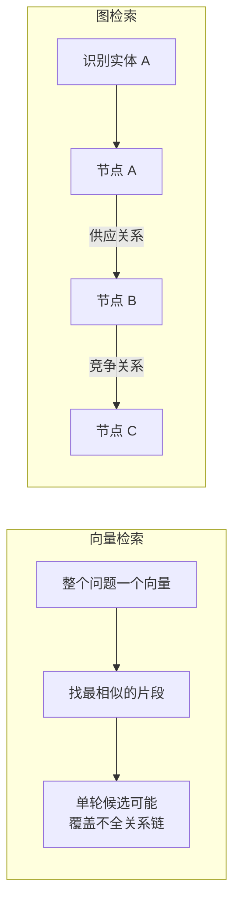
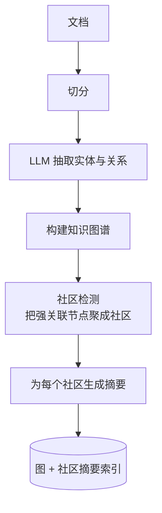
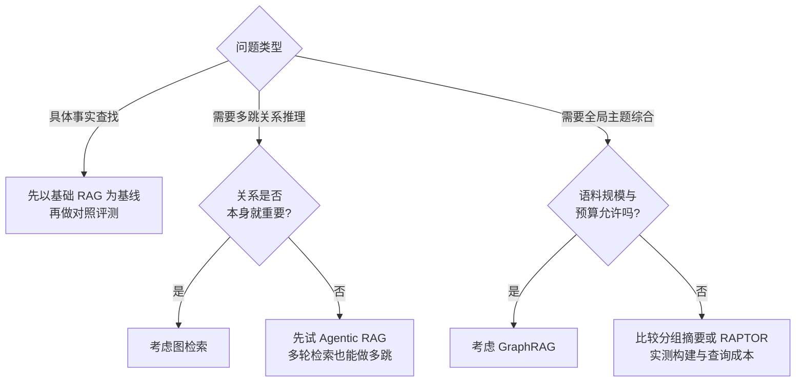

# 第十六章：GraphRAG 与图检索

## 16.1 向量检索的结构性局限

先看一个具体的失败案例。

**问题**：「A 公司的最大供应商的主要竞争对手是谁？」

这个问题需要三步：

1. 查出 A 公司的最大供应商是 B 公司；
2. 查出 B 公司的主要竞争对手是 C 公司；
3. 回答 C。

**单次向量检索的困难**：它通常把 Query 编码为一个向量，返回最相似的片段；若没有片段同时提到 A、B、C，单次召回未必能给出完整关系链。这个限制不等于向量方法“做不到”多跳：查询分解、多轮检索、实体扩展、后期交互或 Agent 都可以组合多个证据，只是需要额外的控制逻辑与验证。

> **标准的单轮向量召回不显式表示图拓扑，也不会自行沿关系边遍历。** 对关系链问题，它更适合作为找到证据入口的一环，而非完整推理器。

加大 Top-K、换模型或 rerank 有时能改善证据覆盖，但不能替代显式的多步检索、关系建模和答案验证；是否需要这些能力必须在任务集上验证。

**另一类单轮局部检索较难覆盖的问题**：全局性、主题性的问题。

「这一千份客户反馈的主要抱怨集中在哪几类？」——这需要**综合整个语料**，而不是找出最相关的几个片段。

## 16.2 GraphRAG 的思路

GraphRAG 泛指利用图结构辅助检索生成的路线。本章构图与社区摘要流程主要对应微软 **Standard GraphRAG**，不能代表所有图 RAG 都必须调用 LLM 抽取。

### 16.2.1 构建阶段

关键在于**社区摘要**这一步：把图划分成若干个紧密关联的子图（社区），为每个社区生成一段摘要。**这些摘要就是回答全局性问题的素材。**

### 16.2.2 检索阶段

| 检索模式 | 做法 | 适合 |
|---|---|---|
| **局部检索** | 定位问题涉及的实体节点，沿关系边扩展邻居，收集相关文本 | 具体实体的多跳问题 |
| **全局检索** | 对社区报告执行 map-reduce 式问答与汇总 | 主题性、全局性问题 |
| **DRIFT** | 以社区信息扩展入口，再生成细化追问 | 需要更广背景的实体问题 |
| **Basic** | 对文本单元进行基础向量 RAG | 建立普通检索对照 |

微软 Local Search 用实体描述嵌入定位入口，组合相关实体、关系、社区报告和原始文本，再按预算排序过滤。一般图检索可以设 1–3 跳扩展，但不能把这个示例范围说成官方 Local Search 固定算法。

**这个混合思路很重要**：向量负责「从文本世界跳进图世界」，图负责「在结构化世界里走关系」。

## 16.3 必须诚实说明的代价

只讲 GraphRAG 的优点而不谈代价，往往不足以支撑实际选型。

### 16.3.1 事实查找未必值得使用

微软的原始研究和官方文档都明确指出：

> **对具体事实查找，基础 RAG 往往已经足够，GraphRAG 的额外抽取和上下文可能不划算。**

原因不难理解：事实查找只需要找到那一个包含答案的片段，而图检索绕了一大圈的实体和关系，反而引入了噪音。

这是任务与实现相关的经验结论，不应泛化为所有 GraphRAG 都一定更差；应以同一数据集、预算和时延约束下的对照实验决定。

### 16.3.2 索引成本很高

构建阶段需要**对每个 chunk 调用 LLM 抽取实体和关系**，再对每个社区生成摘要。

不要套用“每百万 Token 几百美元”的固定估算。应统计抽取输入/输出、重复抽取、实体合并、社区报告与向量化，并按实际价格或自托管资源计费。实体密度和社区重组使成本不一定随原文 Token 线性增长。

官方 **FastGraphRAG** 用 NLP 名词短语与共现关系替代部分 LLM 抽取，降低成本但产生更噪声化的图；共现不等于真实业务关系。应区分 Standard 与 Fast，而不是把一种索引成本推广给整个产品。

### 16.3.3 更新极其困难

新增一份文档，可能改变实体之间的关系，进而改变社区划分，进而使**大量社区摘要失效**。

不能再把微软实现描述成“只能全量重建”：本次核验的官方 CLI 已列出 `standard-update` 与 `fast-update` 索引方法。但可运行 update 不等于任意修改、删除和派生摘要都会正确同步；应固定安装版本，分别测试新增、替换、撤销和权限变化的依赖更新。LightRAG 也研究增量处理，实际代价仍需同任务比较。

### 16.3.4 抽取质量与证据校验

Standard 路线依赖 LLM 抽取实体与关系，Fast 路线的 NLP 抽取与共现建图也会产生错误。需要关注：

- **实体消歧问题**：「张三」「张总」「张经理」可能是同一个人，也可能不是；
- **关系抽取错误**可能被后续路径和摘要反复使用；若没有来源回链，排查会更困难，但边并非“隐形”，可以通过图检查、原文对照和关系约束发现；
- **抽取的一致性差**：同样的关系在不同文档里可能被抽成不同的关系类型。

图中每条事实边应保留支持它的原文、版本、有效期与来源可信度。实体消歧、关系类型约束和人工抽检能改善质量；不能把 LLM 生成的边直接视为已验证事实。

例如“最大供应商”需要采购金额、统计时间和覆盖范围，只有 `供应商` 边并不能证明“最大”。图路径回答应逐边核验；社区摘要还需回链原文，不能仅引用二次生成的报告来证明具体数值。最坏情况下 h 跳邻域按分支因子约呈 `b^h` 增长，需控制实体数、边类型、遍历深度与 Token 预算。

## 16.4 相关方案对比

| 方案 | 特点 | 适合 |
|---|---|---|
| **GraphRAG**（微软） | 社区检测 + 分层摘要，全局问题能力强 | 主题分析、全局综合 |
| **LightRAG** | 更轻量，**支持增量更新** | 语料频繁变化的场景 |
| **HippoRAG** | 借鉴海马体索引理论，用个性化 PageRank 做图遍历 | **多跳问答** |
| **PathRAG** | 关注图上的关键路径，减少冗余信息 | 路径推理类问题 |

这些方案构图、检索和更新策略不同，不能只用“谁支持增量”区分；微软当前官方实现也有更新方法。

## 16.5 什么时候值得用

**值得用的信号**：

- 领域**本身就是关系密集的**：组织架构、供应链、知识产权、金融关联、代码依赖；
- 大量真实问题是**多跳的**；
- 需要**全局主题分析**，且预算允许；
- 语料**相对稳定**，更新不频繁。

**不值得用的信号**：

- 问题以事实查找为主；
- 语料**高频更新**；
- 预算敏感；
- 基础 RAG 还没调好。

**一个重要的替代方案**：**多跳问题也可以用 Agentic RAG 做**——让 Agent 分多轮检索，第一轮查出 B，第二轮查 B 的竞争对手。

| 对比 | GraphRAG | Agentic 多轮检索 |
|---|---|---|
| 索引成本 | 取决于 Standard/Fast、实体密度、抽取与社区报告规模 | 若复用普通索引则接近原检索方案；另建摘要或辅助索引会增加成本 |
| 查询成本 | Local、Global、DRIFT 等模式的候选量、报告读取与调用次数不同 | 取决于实际轮次、工具数量、缓存与停止策略 |
| 更新成本 | 取决于受影响的实体、关系、社区及所用更新方法 | 取决于底层索引和额外派生数据，不因采用 Agent 就自动降低 |
| 全局问题能力 | 社区报告可帮助扩大主题覆盖，但需验证摘要遗漏与汇总质量 | 可通过查询分解或分组遍历扩大覆盖，需控制漏检、轮次和预算 |
| 多跳能力 | 依赖关系准确性、实体链接与路径证据覆盖 | 依赖分解质量、逐轮证据覆盖与中间结果校验 |

> **结论：多跳不自动意味着需要 GraphRAG。** 先比较查询分解/Agentic 多轮检索、显式关系表与图检索的质量、成本、延迟和更新代价；社区摘要在全局综合中可能有价值，但也不是唯一选择。

## 16.6 一个务实的中间方案

不一定非要上完整的知识图谱。**很多多跳需求可以用更轻的手段满足**：

- **在元数据里存实体标签**，检索时按实体做过滤和关联；
- **建立文档之间的显式引用关系**（「本条参见第 X 条」），检索时自动带出被引用内容；
- **对结构化程度高的部分单独建关系表**，用 SQL 查询，与向量检索结果合并。

如果已有可靠实体标签、引用关系或结构化表，这些方案可能减少新增抽取与维护成本；若需要补做消歧、关系标注和持续治理，成本也可能很高。应在同一任务集上比较证据覆盖、更新滞后、索引维护人力、查询延迟与总成本，再判断是否比完整图方案更合适。

## 16.7 常见错误

### 16.7.1 只讲 GraphRAG 的优点

如果省略事实查找的对照结果、索引成本和更新困难，就很难完成实际选型。

### 16.7.2 把向量检索绝对化为“做不到多跳”

单轮向量召回不显式遍历关系，但查询分解、多轮检索、实体扩展和 Agent 能组合证据。关键是比较这些路径与图检索是否满足任务要求。

### 16.7.3 忽略抽取质量的风险

缺少来源回链时，错误边可能难以排查；应保留可检查的边属性与原文定位，并做关系约束和抽样复核。

### 16.7.4 不知道 GraphRAG 更新困难

这在动态语料场景里是决定性的劣势。

### 16.7.5 认为 GraphRAG 是通用升级

它针对特定问题类型；对事实查找应先以基础 RAG 为基线比较成本与质量。

### 16.7.6 不知道多跳还有更便宜的做法

Agentic 多轮检索、元数据实体关联都能覆盖部分需求。

## 16.8 本章总结

1. **单轮向量召回不显式遍历关系图**：对多跳问题常需查询分解、多轮检索、实体扩展或图结构；它不是“绝对做不到”；
2. **较难覆盖的任务**：多跳关系推理、全局主题综合；是否需要图取决于实测；
3. **GraphRAG 的思路**：LLM 抽取实体关系构图 → 社区检测 → 社区摘要；检索分**局部**（向量定位 + 图遍历）和**全局**（社区摘要汇总）；
4. **必须比较的四类约束**：事实查找的投入产出、具体索引与查询模式的成本、更新依赖范围、抽取与证据校验质量；这些都要用对照实验确认；
5. **相关方案**：LightRAG 支持增量更新，HippoRAG 专长多跳，PathRAG 关注关键路径；
6. **只需要多跳时，应比较 Agentic 多轮检索、结构化查询与图检索**；全局综合也应以任务评测而非“不可替代”判断；
7. **务实的中间方案**：元数据实体标签、显式引用关系、结构化部分单独建表。

## 参考资料

- [From Local to Global: A Graph RAG Approach to Query-Focused Summarization](https://arxiv.org/abs/2404.16130)
- [Microsoft GraphRAG 官方文档](https://microsoft.github.io/graphrag/)
- [Microsoft GraphRAG：索引方法](https://microsoft.github.io/graphrag/index/methods/)
- [Microsoft GraphRAG：CLI（含更新方法）](https://microsoft.github.io/graphrag/cli/)
- [Microsoft GraphRAG：查询模式](https://microsoft.github.io/graphrag/query/overview/)
- [Microsoft GraphRAG：Local Search](https://microsoft.github.io/graphrag/query/local_search/)
- [LightRAG: Simple and Fast Retrieval-Augmented Generation](https://arxiv.org/abs/2410.05779)
- [HippoRAG: Neurobiologically Inspired Long-Term Memory for Large Language Models](https://arxiv.org/abs/2405.14831)
- [PathRAG: Pruning Graph-based Retrieval Augmented Generation with Relational Paths](https://arxiv.org/abs/2502.14902)
- [Agentic Retrieval-Augmented Generation: A Survey on Agentic RAG](https://arxiv.org/abs/2501.09136)
