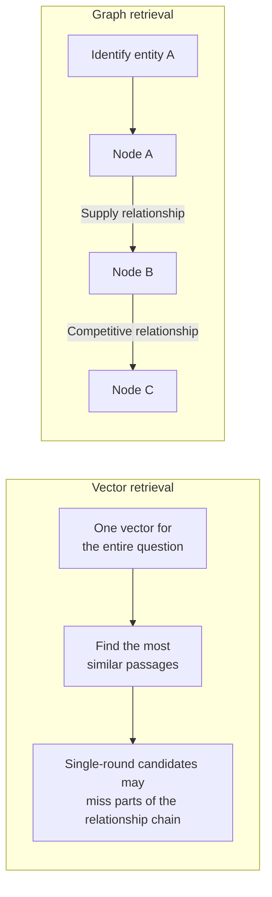
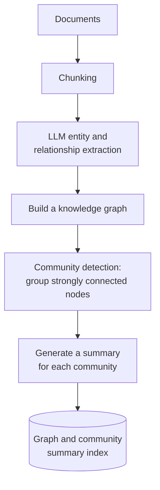
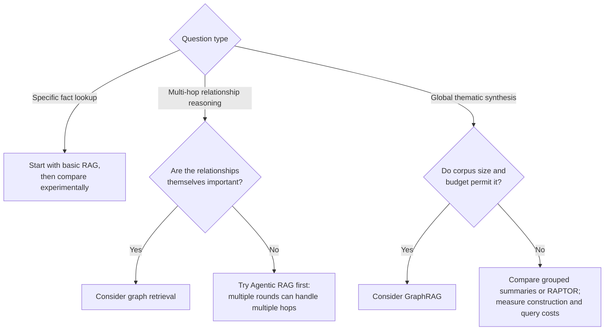

# Chapter 16: GraphRAG and Graph Retrieval

## 16.1 Structural Limits of Vector Retrieval

Start with a concrete failure case.

**Question**: “Who is the main competitor of company A’s largest supplier?”

Answering requires three steps:

1. Find that company A’s largest supplier is company B.
2. Find that company B’s main competitor is company C.
3. Answer C.

**The difficulty for a single vector search**: It usually encodes the query into one vector and returns the most similar passages. If no passage mentions A, B, and C together, one retrieval round may not provide the complete relationship chain. This does not mean that vector-based methods “cannot do” multi-hop reasoning. Query decomposition, multi-round retrieval, entity expansion, late interaction, and agents can all combine multiple pieces of evidence, but require additional control logic and verification.

> **Standard single-round vector retrieval does not explicitly represent graph topology or traverse relationship edges on its own.** For relationship-chain questions, it is better viewed as a way to find an entry point into the evidence than as a complete reasoning system.

Increasing top-K, changing the model, or adding reranking may improve evidence coverage, but cannot replace explicit multi-step retrieval, relationship modeling, and answer verification. Whether those capabilities are needed must be tested on a task set.

**Another class of questions that single-round local retrieval struggles to cover** is global or thematic questions.

“What are the main categories of complaints across these 1,000 pieces of customer feedback?” requires **synthesizing the whole corpus**, not finding a few highly relevant passages.

## 16.2 The GraphRAG Approach

GraphRAG broadly refers to approaches that use graph structures to support retrieval-augmented generation. The graph-construction and community-summary workflow in this chapter primarily describes Microsoft’s **Standard GraphRAG**. It does not imply that every graph-based RAG system must use LLM extraction.

### 16.2.1 Construction

The key step is **community summarization**: divide the graph into closely connected subgraphs, or communities, and generate a summary for each. **These summaries provide the material for answering global questions.**

### 16.2.2 Retrieval

| Retrieval mode | Approach | Suitable for |
|---|---|---|
| **Local Search** | Locate entity nodes mentioned in the question, expand through relationship edges, and gather relevant text | Multi-hop questions about specific entities |
| **Global Search** | Perform map-reduce-style question answering and synthesis over community reports | Thematic and global questions |
| **DRIFT** | Broaden the starting point with community information, then generate detailed follow-up questions | Entity questions that need wider context |
| **Basic** | Apply basic vector RAG to text units | Establishing an ordinary retrieval baseline |

Microsoft Local Search uses entity-description embeddings to find entry points. It combines related entities, relationships, community reports, and original text, then ranks and filters them to fit a budget. A general graph-retrieval system might expand by 1–3 hops, but that illustrative range is not a fixed algorithm in the official Local Search implementation.

**This hybrid approach matters**: vectors provide the bridge “from the world of text into the graph,” while the graph provides a way to “follow relationships in structured data.”

Community reports can help answer “What are the main themes?” They cannot, on the strength of a summary alone, justify “37% of complaints fall into this category.” Percentages and totals require a complete population to count, deduplication, and defined classification rules, followed by verification through structured computation. Summary coverage is not exhaustive counting.

## 16.3 Costs That Must Be Stated Clearly

Discussing GraphRAG’s benefits without its costs rarely provides enough information for a practical decision.

### 16.3.1 It May Not Be Worthwhile for Fact Lookup

Establish a baseline before choosing the approach:

> **For specific fact lookup, first test whether basic RAG is already sufficient. Then decide whether graph extraction and extra context are worth the cost.**

If one passage already contains the full answer, expanding to additional entities and relationships may add noise and expense. If the facts are scattered across multiple sources, graph expansion may still help.

This is an empirical judgment tied to the task and implementation, not a claim that every GraphRAG system necessarily performs worse. Decide through controlled comparisons on the same dataset, under the same budget and latency constraints.

### 16.3.2 Indexing Can Be Expensive

Construction requires **an LLM call for each chunk to extract entities and relationships**, followed by a summary for each community.

Do not apply a fixed estimate such as “a few hundred dollars per million tokens.” Count extraction input and output, repeated extraction, entity merging, community reports, and embedding, then price them using actual rates or self-hosted resources. Entity density and community reorganization mean that cost need not grow linearly with source-text tokens.

The official **FastGraphRAG** approach replaces some LLM extraction with NLP noun phrases and co-occurrence relationships. This reduces cost but produces a noisier graph; co-occurrence is not the same as a real business relationship. Distinguish Standard from Fast rather than generalizing one indexing cost to the whole product.

Fast’s default noun-phrase extraction configuration is primarily designed for English. The ability to read Chinese text does not establish that entity extraction supports Chinese adequately. After changing the NLP model, tokenization, or syntactic configuration, reevaluate entity coverage, relationship noise, and community-report quality.

### 16.3.3 Updates Are Particularly Difficult

Adding one document may change relationships between entities, which may change community assignments and invalidate **many community summaries**.

Microsoft’s CLI documentation provides `standard-update` and `fast-update` indexing methods, so it is incorrect to describe the system as supporting “only full rebuilds.” However, being able to run an update does not establish that arbitrary edits, deletions, and derived summaries will all synchronize correctly. Pin the installed version and separately test dependency updates for additions, replacements, withdrawals, and permission changes. LightRAG also investigates incremental processing; its actual costs still require comparison on the same tasks.

### 16.3.4 Extraction Quality and Evidence Verification

The Standard approach depends on LLM extraction of entities and relationships. The Fast approach’s NLP extraction and co-occurrence graph construction can also introduce errors. Watch for:

- **Entity disambiguation**: “张三,” “张总,” and “张经理” may refer to the same person, or they may not. These Chinese examples mean Zhang San, an executive addressed as Zhang, and a manager addressed as Zhang.
- **Relationship-extraction errors** can be reused repeatedly in later paths and summaries. Missing links back to sources make diagnosis harder, but edges are not “invisible”: graph inspection, comparison with source text, and relationship constraints can expose errors.
- **Inconsistent extraction**: the same relationship may receive different relationship types in different documents.

Every factual edge should retain its supporting source text, version, validity period, and source credibility. Entity disambiguation, relationship-type constraints, and human spot checks can improve quality. An LLM-generated edge is not automatically a verified fact.

Permissions must also propagate through derived relationships. If a community report combines material from multiple authorization domains, filtering only the original text chunks returned at the end is insufficient: the report itself may already contain restricted information. Either build graphs within each authorization domain or make edges, descriptions, reports, and caches inherit all source restrictions. Deletion, permission revocation, and rollback must cover these derived artifacts. Checking the ACL only on the entry entity is not enough.

For example, establishing the “largest supplier” requires purchase amounts, the measurement period, and the scope of the data. An edge labeled `供应商` (“supplier”) alone does not prove “largest.” Answers based on graph paths need verification edge by edge. Community summaries must also link back to original text; citing a generated report alone cannot substantiate a specific number. In the worst case, an h-hop neighborhood grows roughly as `b^h`, where b is the branching factor. Bound the number of entities, edge types, traversal depth, and token budget.

## 16.4 Comparing Related Approaches

| Approach | Characteristics | Suitable for |
|---|---|---|
| **GraphRAG** (Microsoft) | Community detection and hierarchical summaries, with strengths on global questions | Thematic analysis and global synthesis |
| **LightRAG** | A lighter-weight approach that **supports incremental updates** | Frequently changing corpora |
| **HippoRAG** | Draws on hippocampal indexing theory and uses personalized PageRank for graph traversal | **Multi-hop question answering** |
| **PathRAG** | Focuses on key graph paths to reduce redundant information | Questions involving reasoning over paths |

These approaches differ in graph construction, retrieval, and update strategies. “Which one supports incremental updates?” is not enough to distinguish them; Microsoft’s current official implementation also provides update methods.

## 16.5 When Is It Worth Using?

**Signals in favor**:

- The domain is **inherently relationship-dense**: organizational structures, supply chains, intellectual property, financial connections, or code dependencies.
- Many real questions are **multi-hop**.
- **Global thematic analysis** is needed and the budget permits it.
- The corpus is **relatively stable**, with infrequent updates.

**Signals against**:

- Questions mostly involve fact lookup.
- The corpus is **updated frequently**.
- The budget is tight.
- Basic RAG has not yet been tuned properly.

**An important alternative**: **Agentic RAG can also answer multi-hop questions**. An agent can retrieve over multiple rounds, identifying B in the first round and looking up B’s competitors in the second.

Keep two separate accounts when comparing them:

- **Graph retrieval**: index-construction costs include Standard/Fast extraction, entity merging, and community reports. Query costs depend on the candidates and calls used by Local, Global, or DRIFT. Updates must track affected entities, relationships, and communities. For global questions, check summary omissions; for multi-hop questions, check entity linking and evidence for every edge.
- **Agentic multi-round retrieval**: reusing an ordinary index avoids extra graph-construction costs, but auxiliary summaries still need maintenance. Query costs depend on actual rounds, tools, caching, and stopping strategies. Updates still depend on the underlying index. For global questions, check coverage across the corpus; for multi-hop questions, check decomposition and intermediate results. Using an agent does not automatically make updates cheaper.

> **Conclusion: multi-hop does not automatically mean GraphRAG is necessary.** First compare query decomposition or agentic multi-round retrieval, explicit relationship tables, and graph retrieval on quality, cost, latency, and update effort. Community summaries may be valuable for global synthesis, but they are not the only option.

## 16.6 A Practical Middle Ground

A full knowledge graph is not always necessary. **Lighter-weight methods can satisfy many multi-hop requirements**:

- **Store entity tags in metadata**, then filter and link results by entity during retrieval.
- **Create explicit references between documents**, such as “For this clause, see Clause X,” and automatically retrieve the referenced material.
- **Build separate relationship tables for highly structured portions**, query them with SQL, and merge the results with vector-retrieval results.

If reliable entity tags, references, or structured tables already exist, these options may reduce the cost of new extraction and maintenance. If disambiguation, relationship labeling, and ongoing governance must be added, they too may be expensive. Compare evidence coverage, update lag, index-maintenance labor, query latency, and total cost on the same task set before deciding whether they are preferable to a full graph approach.

## 16.7 Common Mistakes

### 16.7.1 Discussing Only GraphRAG’s Advantages

Leaving out fact-lookup comparisons, indexing cost, and update difficulties makes a practical selection difficult.

### 16.7.2 Claiming That Vector Retrieval “Cannot Do Multi-Hop”

Single-round vector retrieval does not explicitly traverse relationships, but query decomposition, multiple retrieval rounds, entity expansion, and agents can combine evidence. The important comparison is whether these approaches or graph retrieval meet the task’s requirements.

### 16.7.3 Ignoring Extraction-Quality Risks

Without links back to sources, incorrect edges can be hard to diagnose. Retain inspectable edge attributes and source locations, and apply relationship constraints and sample-based review.

### 16.7.4 Overlooking the Difficulty of GraphRAG Updates

For dynamic corpora, this can be a decisive disadvantage.

### 16.7.5 Treating GraphRAG as a Universal Upgrade

It targets particular kinds of questions. For fact lookup, compare cost and quality against a basic RAG baseline first.

### 16.7.6 Overlooking Less Expensive Ways to Handle Multiple Hops

Agentic multi-round retrieval and metadata-based entity linking can cover some of these needs.

## 16.8 Chapter Summary

1. **Single-round vector retrieval does not explicitly traverse a relationship graph.** Multi-hop questions often need query decomposition, multiple retrieval rounds, entity expansion, or graph structures; they are not “categorically impossible” for vector-based approaches.
2. **Challenging tasks** include multi-hop relationship reasoning and global thematic synthesis. Whether a graph is needed depends on measurement.
3. **Microsoft’s Standard approach** uses LLM extraction, community detection, and reports; Fast uses a different extraction mechanism. Local assembles entity-related evidence, Global synthesizes community reports, and DRIFT and Basic provide further options.
4. **Four constraints to compare**: the return on investment for fact lookup, the cost of the specific indexing and query modes, the scope of update dependencies, and the quality of extraction and evidence verification. All require controlled comparisons.
5. **Related approaches**: LightRAG supports incremental updates, HippoRAG specializes in multi-hop retrieval, and PathRAG focuses on key paths.
6. **If multiple hops are the only requirement, compare agentic multi-round retrieval, structured queries, and graph retrieval.** Global synthesis should also be judged through task evaluation rather than claims that an approach is “irreplaceable.”
7. **Practical middle ground**: metadata entity tags, explicit references, and separate tables for structured portions.

## References

- [From Local to Global: A Graph RAG Approach to Query-Focused Summarization](https://arxiv.org/abs/2404.16130)
- [Microsoft GraphRAG documentation](https://microsoft.github.io/graphrag/)
- [Microsoft GraphRAG: Indexing Methods](https://microsoft.github.io/graphrag/index/methods/)
- [Microsoft GraphRAG: CLI Reference, including update methods](https://microsoft.github.io/graphrag/cli/)
- [Microsoft GraphRAG: Query Modes](https://microsoft.github.io/graphrag/query/overview/)
- [Microsoft GraphRAG: Local Search](https://microsoft.github.io/graphrag/query/local_search/)
- [LightRAG: Simple and Fast Retrieval-Augmented Generation](https://arxiv.org/abs/2410.05779)
- [HippoRAG: Neurobiologically Inspired Long-Term Memory for Large Language Models](https://arxiv.org/abs/2405.14831)
- [PathRAG: Pruning Graph-based Retrieval Augmented Generation with Relational Paths](https://arxiv.org/abs/2502.14902)
- [Agentic Retrieval-Augmented Generation: A Survey on Agentic RAG](https://arxiv.org/abs/2501.09136)

The Chinese source records access to Microsoft’s online documentation on 2026-09-15. CLI options and library implementations can change; use a pinned version and its configuration when reproducing behavior.

For this translation, the linked official documentation was checked for Standard/Fast extraction, English-oriented NLP defaults, update methods, and Local/Global/DRIFT/Basic behavior. Relevant passages in the GraphRAG, LightRAG, HippoRAG, and PathRAG papers were also checked; the Agentic RAG survey was checked at the abstract level only. No indexing runs, update tests, or comparative benchmarks were performed.
