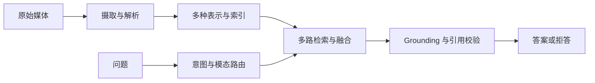

# 第二十一章：多模态 RAG

多模态 RAG 不只是“给 RAG 加图片”。它要让文本、页面图像、表格、图表、音频或视频证据在同一条可审计链路中被摄取、表示、检索、引用和评估。

> **多模态的难点不是能否识别媒体，而是能否把回答中的每个主张可靠地落回有权限、可定位、在查询时有效的原始证据。**

## 21.1 端到端链路

每个派生结果都应保留 `doc_id`、`version_id`、页/时间段、区域坐标、来源哈希、ACL 和解析器/模型版本。原始媒体是可复核证据；OCR、ASR、版面解析和 VLM 描述都是可出错的**派生表示**，不能替代原件。

## 21.2 Ingestion：保留原件，再提取可检索单元

1. **不可变原件与版本**：保存原始文件或媒体对象及内容哈希；变更时按[第十九章](../06-operations-security/19-dynamic-update.md)构建新版本并原子切换 alias，不能只覆盖派生文本。
2. **结构化解析**：提取页面、段落、表格单元格、图表区域、图片说明、音频说话人和视频时间段；每个单元回链原始位置。
3. **质量闸门**：OCR/ASR 接口若提供置信度，记录其定义、语言和失败原因；不同模型分数不可直接比较，VLM 自报把握也不是校准概率。抽样比对原件，低质量单元可降权、回退到视觉检索或不参与高风险回答。
4. **权限先行**：在解析、索引和检索前携带租户和 ACL，不将无权原件、缩略图或文本副本泄入缓存、日志或引用。

不要把一个页面或视频粗暴拼成一大段文本。表格关系、图表标注和时间顺序往往正是答案所需的证据。

## 21.3 Representation：多表示不等于任意向量可比较

| 证据单元 | 表示、用途与风险 |
|---|---|
| 文本、OCR、ASR | 稀疏索引和文本向量用于术语、段落与字幕检索；识别错误和布局丢失会污染表示 |
| 图片、页面、图表 | 视觉或图文共享向量用于找图、界面和页面；视觉相似不等于事实蕴含 |
| 表格 | 保留单元格、行列结构及文本表示，支持数值和条件查询；扁平化会丢掉数字归属 |
| 视频 | 镜头、关键帧和带时间的 ASR 支持事件与时序问题；采样可能漏掉短事件 |

可以使用发布者声明的图文共享空间进行跨模态召回，也可以保留每种模态的专用索引后融合。两者都要求记录模型、版本、预处理、归一化和相似度度量；**不能因维度相同就混算向量。** 文本 Query/Document 的兼容性要求见[第七章](../02-ingestion-indexing/07-embedding-selection.md)。

## 21.4 Retrieval：按意图路由，证据级融合

查询可能是文本找文本（“退款规则是什么”）、文本找图（“找到退款流程图”）、图找文本（上传截图后询问界面说明）、图找图，或需要表格和图表共同回答。稳妥流程是：

- 根据 Query 与可用媒体决定启用的模态，而不是对所有索引盲搜；
- 并行召回文本、视觉和结构化候选，并在**证据单元**而非整份文档上去重；
- 用支持该模态的 reranker 或验证器判断 Query—证据关系；
- 用标注业务集校准融合与拒答策略，不把某种融合算法或固定裸分当作通用标准（见[第十三章](../03-retrieval/13-hybrid-retrieval-rerank.md)）；
- 需要读数、比较或时序时，把原始区域/时间段交给专用解析或人工复核，不能只依赖相似度。

## 21.5 Grounding：答案必须落到可打开的媒体证据

多模态回答应为每个关键主张提供稳定引用：文档版本、页码或媒体时间段、区域/表格行列定位，以及用户有权访问的原件链接。生成前检查证据存在、可访问且版本适用；生成后再检查实际主张是否由对应证据支持，并在发布时复核访问限制。

模型对图表、视觉细节和 OCR 噪声尤其容易过度解读。证据不清晰、冲突或无法定位时，应说明不确定性、请求更高质量输入或拒答；不要将 VLM 的自然语言描述当成原始事实。幻觉和引用校验的通用防线见[第十七章](../05-generation-evaluation/17-generation-hallucination.md)。

## 21.6 Evaluation：同时测模态、证据和答案

除文本 RAG 的检索与生成指标外，多模态评测集应包含原始媒体、带位置的相关证据、查询时刻、ACL 和关键主张的引用标签。

| 维度 | 例子 |
|---|---|
| 摄取质量 | OCR/ASR 词错率、表格结构与图表标注的人工抽检 |
| 跨模态检索 | 文本→图、图→文本、图表/表格问题的 Recall@K 与定位正确率 |
| Grounding 与 Citation | 主张是否由指定页、区域、行列或时间段支持；引用能否访问 |
| 时效性 | 新版本图表、替换图片和撤销视频在固定查询时刻是否正确生效 |
| 鲁棒性 | 压缩、旋转、裁剪、OCR 噪声、无关图片和冲突字幕下的结果变化 |
| 安全与效用 | 恶意图片文字、PDF 隐藏层、音频提示注入下的攻击成功率和正常任务效用 |

不要只用“VQA 答对率”代表系统质量：它既看不到是否找到了正确媒体，也看不到答案是否引用了错误页、泄露了无权文件或使用了过期版本。评测设计和 Citation/时效/鲁棒性指标见[第十八章](../05-generation-evaluation/18-rag-evaluation.md)。

定位也要预先定义容差：页面命中不等于区域命中，区域可用 IoU（预测区域与标注区域的交集面积除以并集面积）辅助评估，视频可用时间段重叠与事件覆盖评估；这些几何指标仍不能替代事实支持判断。对图表数值须保留单位、坐标轴尺度、图例及读数误差，不能把估读值呈现为精确原始数据。

成本对比至少包含每页图像 Token、每页向量数与维度、关键帧采样密度、OCR/ASR 开销和生成输入。多向量 MaxSim 的朴素打分约为 `O(mnd)`：m 个查询向量与 n 个页面向量逐对比较，每对 d 维；专用索引与压缩可降低实际代价。减少帧或降低分辨率可省成本，却可能漏掉短事件或小字，需用相同证据任务验证，不宜仅按“每个文档一个向量”估算。

## 21.7 Security：媒体同样是不可信输入

图片内文字、PDF 隐藏层、字幕、元数据和工具返回的 URL 都可能携带间接 Prompt Injection。视觉分隔框、`<image>` 标签或“以下内容只是数据”的提示可辅助归因，**不是安全边界**。主防线仍是检索 ACL、处理不可信媒体的能力隔离、确定性数据流/参数校验、出口控制和高风险操作确认（见[第二十章](../06-operations-security/20-rag-challenges-security.md)与[Agent 安全](../../agent/05-production/15-agent-security.md)）。

特别注意：缩略图、OCR 文本、向量、缓存和日志都是原件的派生副本，必须受相同的租户、保留和删除策略约束。

## 21.8 本章总结

1. 保留可版本化的原始媒体，并让所有派生单元可回链到页、区域或时间段；
2. 文本、视觉、表格和时序证据需要各自合适的表示；同维向量不自动兼容；
3. 多路检索与融合必须按任务实测和校准，低置信度应拒答或升级核验；
4. Grounding 的标准是可访问、可定位且真正支撑主张的原始证据；
5. 评测覆盖摄取、跨模态检索、Citation、时效、鲁棒性与安全效用；
6. 媒体是潜在不可信输入，Prompt 分隔不能代替能力和数据流隔离。

## 参考资料

- [Learning Transferable Visual Models From Natural Language Supervision (CLIP)](https://arxiv.org/abs/2103.00020)
- [ColPali: Efficient Document Retrieval with Vision Language Models](https://arxiv.org/abs/2407.01449)
- [RAG-Anything: All-in-One RAG Framework](https://arxiv.org/abs/2510.12323)
- [Retrieval-Augmented Generation for Knowledge-Intensive NLP Tasks](https://arxiv.org/abs/2005.11401)
- [Not what you've signed up for: Compromising Real-World LLM-Integrated Applications with Indirect Prompt Injection](https://arxiv.org/abs/2302.12173)
