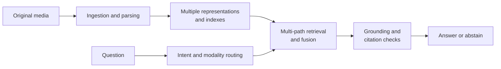

# Chapter 21: Multimodal RAG

Multimodal RAG is more than “adding images to RAG.” It must ingest, represent, retrieve, cite, and evaluate evidence from text, page images, tables, charts, audio, or video within one auditable pipeline.

> **The difficult part is not recognizing media. It is reliably tracing every claim in an answer to original evidence that is authorized for access, precisely locatable, and valid at query time.**

## 21.1 The End-to-End Pipeline

Every derived artifact should retain `doc_id`, `version_id`, its page or time interval, region coordinates, source hash, ACL, and parser/model version. Original media provide evidence that can be checked. OCR, ASR, layout parsing, and VLM descriptions are all fallible **derived representations**, not replacements for the originals.

## 21.2 Ingestion: Preserve Originals, Then Extract Retrievable Units

1. **Immutable originals and versions**: retain the original file or media object and its content hash. When content changes, build a new version and switch the alias atomically as described in [Chapter 19](../06-operations-security/19-dynamic-update.md), rather than merely overwriting derived text.
2. **Structured parsing**: extract pages, paragraphs, table cells, chart regions, image captions, audio speakers, and video time intervals. Link every unit back to its original location.
3. **Quality gates**: if an OCR/ASR interface provides confidence scores, record their definitions, the language, and failure reasons. Scores from different models are not directly comparable, and a VLM’s stated confidence is not a calibrated probability. Compare samples with the originals. Low-quality units can be downweighted, handled through a visual-retrieval fallback, or excluded from high-risk answers.
4. **Permissions first**: carry tenant and ACL information before parsing, indexing, and retrieval. Do not leak originals, thumbnails, or text copies into caches, logs, or citations where access is unauthorized.

Do not flatten an entire page or video into one large text block. Table relationships, chart labels, and temporal order are often precisely the evidence an answer needs.

## 21.3 Representation: Multiple Representations Do Not Make Arbitrary Vectors Comparable

| Evidence unit | Representations, uses, and risks |
|---|---|
| Text, OCR, ASR | Sparse indexes and text embeddings support retrieval of terms, passages, and transcripts; recognition errors and lost layout corrupt the representation |
| Images, pages, charts | Visual embeddings or shared image-text embeddings support retrieval of images, interfaces, and pages; visual similarity is not factual entailment |
| Tables | Retain cells, row-column structure, and text representations to support numeric and conditional queries; flattening loses the associations that give numbers their meaning |
| Video | Shots, keyframes, and timestamped ASR support questions about events and temporal order; sampling may miss brief events |

Cross-modal retrieval can use an image-text space that the model publisher explicitly identifies as shared. Alternatively, keep separate modality-specific indexes and fuse their results. Both approaches require recording the model, version, preprocessing, normalization, and similarity measure. **Equal vector dimensions do not make it valid to compare arbitrary vectors.** See [Chapter 7](../02-ingestion-indexing/07-embedding-selection.md) for text query/document compatibility requirements.

## 21.4 Retrieval: Route by Intent and Fuse at the Evidence Level

A query may involve text-to-text retrieval (“退款规则是什么,” meaning “What is the refund policy?”), text-to-image retrieval (“找到退款流程图,” meaning “Find the refund flowchart”), image-to-text retrieval, such as uploading a screenshot and asking about the interface, image-to-image retrieval, or a question requiring both tables and charts. A reliable workflow is to:

- Choose the active modalities based on the query and available media rather than blindly searching every index.
- Retrieve text, visual, and structured candidates in parallel, and deduplicate at the **evidence-unit** level rather than the whole-document level.
- Use a reranker or verifier that supports the modality to assess the relationship between the query and the evidence.
- Calibrate fusion and abstention strategies on a labeled business dataset. Neither one fusion algorithm nor a fixed raw score is a universal standard; see [Chapter 13](../03-retrieval/13-hybrid-retrieval-rerank.md).
- When a task requires reading values, making comparisons, or determining temporal order, pass the original region or time interval to a specialized parser or human reviewer. Similarity alone is insufficient.

## 21.5 Grounding: Answers Must Point to Media Evidence That Can Be Opened

A multimodal answer should provide stable citations for every key claim: the document version, page number or media time interval, region or table row-column location, and a link to the original that the user is authorized to access. Before generation, check that the evidence exists, is accessible, and has an applicable version. After generation, check that each actual claim is supported by its cited evidence, and recheck access restrictions when releasing the answer.

Models are particularly prone to overinterpreting charts, visual details, and OCR noise. If evidence is unclear, contradictory, or impossible to locate, state the uncertainty, request a higher-quality input, or abstain. Do not treat a VLM’s natural-language description as an original fact. See [Chapter 17](../05-generation-evaluation/17-generation-hallucination.md) for general defenses against hallucinations and for citation verification.

## 21.6 Evaluation: Test Modalities, Evidence, and Answers

In addition to text-RAG retrieval and generation metrics, a multimodal evaluation set should include original media, relevant evidence with location annotations, query timestamps, ACLs, and citation labels for key claims.

| Dimension | Examples |
|---|---|
| Ingestion quality | OCR/ASR word error rates; human spot checks of table structure and chart labels |
| Cross-modal retrieval | Recall@K and localization accuracy for text→image, image→text, and chart/table questions |
| Grounding and citations | Whether a claim is supported by the specified page, region, rows and columns, or time interval; whether the citation is accessible |
| Freshness | Whether new chart versions, replacement images, and withdrawn videos take effect correctly at a fixed query time |
| Robustness | Changes in results under compression, rotation, cropping, OCR noise, irrelevant images, and conflicting subtitles |
| Security and utility | Attack success rate and normal-task utility in the presence of malicious image text, hidden PDF layers, or audio prompt injection |

Do not use “VQA accuracy” alone to represent system quality. It reveals neither whether the correct media were retrieved nor whether the answer cited the wrong page, disclosed an unauthorized file, or used an outdated version. See [Chapter 18](../05-generation-evaluation/18-rag-evaluation.md) for evaluation design and citation, freshness, and robustness metrics.

Define localization tolerances in advance. A correct page is not the same as a correct region. Region evaluation can use IoU—the area of intersection between predicted and annotated regions divided by their union. Video evaluation can use temporal overlap and event coverage. These geometric metrics still do not replace a judgment of factual support. For chart values, retain units, axis scales, legends, and reading error; do not present an estimated reading as an exact original value.

Cost comparisons should include at least image tokens per page, the number and dimensionality of vectors per page, keyframe sampling density, OCR/ASR costs, and generation inputs. Naive multi-vector MaxSim scoring is approximately `O(mnd)`: m query vectors are compared pairwise with n page vectors, each comparison using d dimensions. Specialized indexes and compression can reduce the practical cost. Fewer frames or lower resolution may save money but can miss brief events or small text. Validate such changes on the same evidence tasks rather than estimating costs as “one vector per document.”

## 21.7 Security: Media Are Also Untrusted Input

Text inside images, hidden PDF layers, subtitles, metadata, and URLs returned by tools can all carry indirect prompt injection. Visual bounding boxes, `<image>` tags, or prompts saying “the following content is only data” can help identify the source of content, but **are not security boundaries**. The main defenses remain retrieval ACLs, isolation of capabilities available when processing untrusted media, deterministic data-flow and parameter validation, egress controls, and confirmation of high-risk operations. See [Chapter 20](../06-operations-security/20-rag-challenges-security.md) and [Agent Security](../../agent/05-production/15-agent-security.md).

In particular, thumbnails, OCR text, vectors, caches, and logs are derived copies of the originals and must follow the same tenant, retention, and deletion policies.

## 21.8 Chapter Summary

1. Preserve versioned original media and link every derived unit back to its page, region, or time interval.
2. Text, visual, tabular, and temporal evidence each need suitable representations; equal-dimensional vectors are not automatically compatible.
3. Multi-path retrieval and fusion require task-specific measurement and calibration. Low confidence should lead to abstention or escalated verification.
4. Grounding requires original evidence that is accessible, precisely locatable, and genuinely supports the claim.
5. Evaluation must cover ingestion, cross-modal retrieval, citations, freshness, robustness, and both security and normal-task utility.
6. Media are potentially untrusted input. Prompt delimiters cannot replace capability and data-flow isolation.

## References

- [Learning Transferable Visual Models From Natural Language Supervision (CLIP)](https://arxiv.org/abs/2103.00020)
- [ColPali: Efficient Document Retrieval with Vision Language Models](https://arxiv.org/abs/2407.01449)
- [RAG-Anything: All-in-One RAG Framework](https://arxiv.org/abs/2510.12323)
- [Retrieval-Augmented Generation for Knowledge-Intensive NLP Tasks](https://arxiv.org/abs/2005.11401)
- [Not what you've signed up for: Compromising Real-World LLM-Integrated Applications with Indirect Prompt Injection](https://arxiv.org/abs/2302.12173)

Source checks for this translation covered CLIP’s learned shared embedding space, ColPali’s page-image multi-vector representation and late interaction, and RAG-Anything’s cross-modal representation and retrieval approach. The original RAG and indirect prompt-injection papers were checked at the abstract level only. These checks do not constitute tests of media parsing, authorization, localization, or attack resistance.
