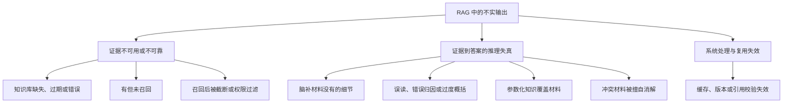
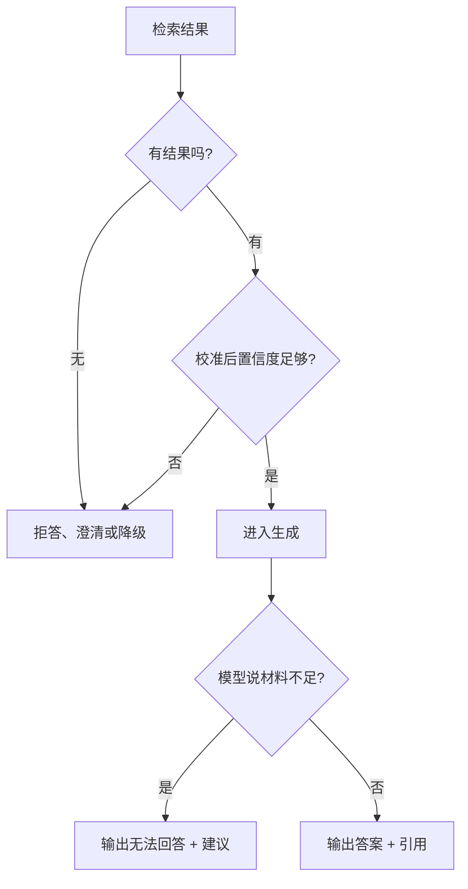

# 第十七章：生成、Grounding 与幻觉规避

## 17.1 幻觉不是单一检索问题

> **幻觉是多因素失效，不是单一检索问题。**

检索缺失、过期或冲突证据、上下文截断与处理错误、模型超出证据生成，以及缓存或工具返回的错误复用，都可能造成不实输出。检索质量是重要且常见的上游因素：材料缺失或错误时，生成层技巧无法把答案变成事实；但**检索充分时模型仍可能误读、过度概括或错误引用。** 因此要把数据治理、检索、grounding、引用校验、拒答和事后评估联合起来。

## 17.2 幻觉的主要来源

这些来源对应的治理手段不同，但可以组合使用；只优化单一环节，通常会遗漏其他失效模式。

| 来源 | 主要治法 |
|---|---|
| 证据缺失、陈旧或未召回 | **数据治理 + 检索优化 + 拒答机制** |
| 误读、超出证据或错误归因 | **Grounding 约束 + 引用校验 + 事后校验** |
| 缓存、版本与上下文处理失效 | **版本绑定、失效策略与回归评测** |

### 17.2.1 参数化知识覆盖

模型自己的训练知识和检索到的材料**冲突**时，它可能会**相信自己而不是材料**。

典型场景：企业内部规定与通用常识不同（比如公司规定的报销上限与行业惯例不同）。模型可能输出"常见的"数字而不是材料里的数字。

**这类幻觉最危险**，因为答案看起来完全合理，且与材料的差异很隐蔽。

可在 Prompt 中声明经授权、符合查询时刻的业务材料优先于参数常识，但这只是行为约束，不是可靠性保证。材料中的指令仍是不可信数据；来源或版本互相矛盾时，要显式报告冲突或按已定义规则裁决。

## 17.3 第一道防线：拒答

这是成本最低、也最常被漏掉的控制点之一。

目标是在证据不足时不进入常规生成链路。

如果检索结果为空，或经业务评测集校准的置信度不足，就直接返回「未找到足够依据的信息」、请求澄清或走受控降级，**不进入常规生成环节**（[第十三章 13.4.3](../03-retrieval/13-hybrid-retrieval-rerank.md)）。

这里需要按业务代价校准：拒答规则更保守时，错误接受可能下降，但拒答会增加；规则更宽松时，覆盖率提高，但无依据回答风险上升。

不同业务对拒答代价的容忍度不同：

| 场景 | 倾向 |
|---|---|
| 医疗、法律、财务 | **宁可拒答**，错误代价极高 |
| 内部知识助手 | 平衡 |
| 创意辅助、头脑风暴 | 可以宽松 |

因此，拒答策略需要和业务风险一起设计。

## 17.4 第二道防线：Prompt 约束

常用的 Prompt 约束包括五条：

**（1）限定信息来源**

明确要求只依据给定材料回答，不使用材料之外的知识。

**（2）声明材料优先级**

经授权、来源适当且在查询时有效的业务材料优先于参数常识；材料内嵌的操作指令不能提升为系统指令。

**（3）提供不知道的出口**

需要明确告诉模型：材料不足时可以直接回答不知道，并把这种行为定义为预期输出。

> **如果没有这条出口，模型更容易继续补全答案，而不是停在证据边界。**

**（4）要求标注来源**

每个结论后标注依据的材料编号。

**（5）处理材料冲突**

材料之间矛盾时，**说明存在冲突并列出各方说法**，而不是擅自选一个。

知识库里经常同时存在新旧版本或不同部门口径，这条约束会直接影响输出是否可审计。

### 17.4.1 上下文的组织方式也影响幻觉

- **给每个片段编号**，才能做引用；
- **标注来源、章节、日期**，让模型知道时效和权威性；
- **把最相关的放开头和结尾**（第二章 2.4.2）；
- **控制总量**，无关材料会主动损害质量（第二章 2.6）；
- **去除新旧版本冲突**（第十三章 13.6）。

## 17.5 第三道防线：引用与可验证性

引用的作用是把答案变成可核查对象，而不是增加表面可信感。

这里有个常见问题：

> **模型会编造引用编号。** 它可能标注 `[3]`，而实际内容来自 `[1]`，甚至压根不在任何材料里。

因此引用至少要做两级校验：

| 级别 | 做法 | 成本 |
|---|---|---|
| 基础 | 检查引用编号是否真实存在于材料列表中 | 几乎为零 |
| 进阶 | 检查实际被引片段是否支持相邻主张，包括实体、数值、否定、时间和适用条件 | 按主张与引用数量增长，可批量模型校验并抽样人工复核 |

未校验的引用会放大误判风险，因为用户可能据此相信一条并不存在的依据。

### 17.5.1 有编号、有支持、支持完整，是三回事

假设答案说“上海员工每晚报销上限为 800 元，自 7 月起生效”，引用却只写“北京员工每晚 800 元”。编号存在、金额相同都不能判定引用正确：地点和生效时间并未得到支持。应拆开可核查主张，绑定 `doc_id/version_id`、页或段落 span，按引用范围验证，而不是拿整个知识库替一个错引找补。

- **引用正确性**：所引证据是否支持对应主张；多引用时检查联合支持，也识别不必要或无关的附带引用。
- **引用完整性**：应有依据的关键主张是否都获得充分支持；不能靠只回答一句容易引用的话拿高分，还要看任务覆盖。
- **引用来源质量**：原文是否权威、当时有效、对当前用户可访问。可打开的网页也可能错误，生成摘要不是原始事实。

对“资料中没有规定”这类否定主张尤其谨慎：Top-K 未命中只支持“本次未找到”，通常不足以证明整个知识库不存在该规定。

## 17.6 第四道防线：事后校验

生成完之后，用一次额外的调用检查答案的每个陈述是否被材料支撑。

**成本**：一次额外的 LLM 调用，延迟增加。

**适合**：高风险场景，或者作为**离线的质量抽查**而非在线的每次校验。

低风险场景可以在线检查定位与授权、离线抽样核验蕴含。高风险场景则可先核验再发布或交人工复核。LLM 校验器也会漏报和误报，应保留无法判定状态，不把第二次模型调用当作事实认证。

## 17.7 四种防线的对比

| 防线 | 治哪个来源 | 成本 | 效果 | 优先级 |
|---|---|---|---|---|
| 检索优化 | 没检索到 | 中 | **高** | **1** |
| 拒答机制 | 没检索到 | **极低** | **高** | **2** |
| Prompt 约束 | 超出发挥 | **极低** | 中到高 | **3** |
| 引用有效性校验 | 超出发挥 | 极低 | 中 | 4 |
| 忠实度校验 | 超出发挥 | **高** | 高 | 5（可离线） |

前三条的成本都较低，通常应先落地，再决定是否增加更昂贵的深度校验。

## 17.8 Grounding 与事实正确性的边界

**「有依据」不等于「正确」。**

- 材料本身就是错的（知识库里存了过期或错误的文档）→ **答案忠实于材料，但事实上是错的**；
- 材料本身可靠、版本适用且支持主张 → 才有条件支持答案正确；还需检查推理、计算和问题覆盖。

生成层手段旨在提高忠实度，**并不保证忠实度，更不保证事实正确**。事实正确性还依赖来源质量、适用范围、推理和计算校验。

第十八章里的 Faithfulness 指标衡量的是前者，而不是后者；评估时需要单独区分这两个目标。

**推论**：知识库的内容治理（去除过期文档、标注版本、定期审核）**是幻觉治理的一部分**，而且是最上游的一部分。

## 17.9 常见错误

### 17.9.1 只讲 Prompt 技巧不讲检索

把幻觉归因为单一检索问题，忽略数据质量、上下文处理、生成与系统复用等失效模式。

### 17.9.2 不区分证据、生成与系统处理失效

应按实际失效位置选择治理手段；误读、错引和缓存错用不能都归咎于漏召回。

### 17.9.3 忽略拒答机制

拒答能降低无证据硬答风险，但还需要澄清、补充检索与校准；它不是消除所有幻觉的根治办法。

### 17.9.4 不提拒答率与幻觉率的权衡

说明没有在真实场景校准拒答策略。

### 17.9.5 Prompt 里不给"不知道"的出口

模型会倾向于硬答。给它合法退路是关键设计。

### 17.9.6 相信模型标注的引用

模型会编引用编号，必须校验。

### 17.9.7 不处理材料冲突

新旧版本共存很常见，不约束会导致模型擅自选一个。

### 17.9.8 混淆"忠实于材料"和"事实正确"

生成层不能保证前者；后者还需独立核实来源、适用条件和推理。

### 17.9.9 承诺 RAG 能消除幻觉

只能降低。检索失败、材料错误、模型超发挥三条路径都还在。

## 17.10 本章总结

1. **幻觉是多因素失效**：知识库质量、检索、上下文处理、生成与缓存/版本复用都要治理；
2. **证据缺失与证据到答案失真**需要不同但可组合的防线；检索重要，却不能独自解决幻觉；
3. **参数化知识覆盖材料**是最隐蔽的一类，需在 Prompt 中显式声明材料优先；
4. **第一道防线是拒答**：检索为空或校准后的置信度不足就不进入常规生成，可请求澄清或走受控降级；
5. **拒答率与错误接受率存在权衡**，应按业务风险在评测集上校准规则，而非固定裸分；
6. **Prompt 约束五要素**：限定来源、材料优先、**给"不知道"的出口**、要求标注来源、处理冲突；
7. **引用必须校验**——模型会编引用编号，未校验的引用比没有引用更危险；
8. **忠实度校验成本高**，可在线只做基础校验、离线抽样做深度校验；
9. **「有依据」不等于「正确」**：忠实度与事实正确性都需验证，不能由 Prompt 或校验器直接保证。

## 跨主题详解

- Agent 读取不可信检索内容并调用工具时的风险与隔离方式，见[Agent 安全](../../agent/05-production/15-agent-security.md)。
- 引用完整性、时效性和鲁棒性如何评测，见[RAG 评估](18-rag-evaluation.md)。

## 参考资料

- [Astute RAG: Overcoming Imperfect Retrieval Augmentation and Knowledge Conflicts for Large Language Models](https://arxiv.org/abs/2410.07176)
- [Making Retrieval-Augmented Language Models Robust to Irrelevant Context](https://arxiv.org/abs/2310.01558)
- [RAGAS: Automated Evaluation of Retrieval Augmented Generation](https://arxiv.org/abs/2309.15217)
- [ALCE：Enabling Large Language Models to Generate Text with Citations](https://arxiv.org/abs/2305.14627)
- [Corrective Retrieval Augmented Generation](https://arxiv.org/abs/2401.15884)
- [Searching for Best Practices in Retrieval-Augmented Generation](https://arxiv.org/abs/2407.01219)
