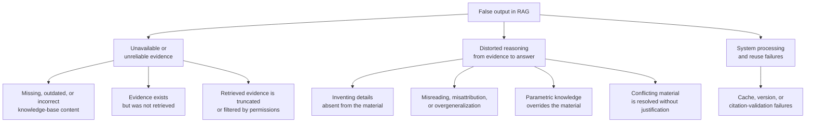
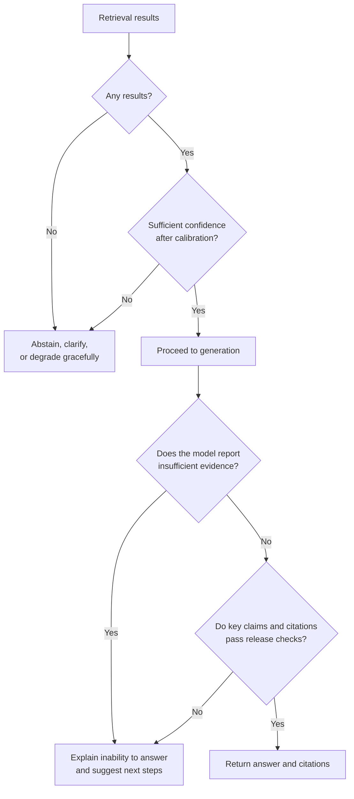

# Chapter 17: Generation, Grounding, and Hallucination Mitigation

## 17.1 Hallucination Is Not Just a Retrieval Problem

> **Hallucination is a multifactor failure, not simply a retrieval problem.**

Missing retrieval results, outdated or conflicting evidence, context truncation and processing errors, generation beyond the evidence, and incorrect reuse of caches or tool results can all produce false output. Retrieval quality is an important and common upstream factor: when material is missing or wrong, generation-layer techniques cannot make the answer factual. But **even with sufficient retrieval, the model can still misread, overgeneralize, or cite incorrectly.** Data governance, retrieval, grounding, citation validation, abstention, and post-hoc evaluation must therefore work together.

## 17.2 Main Sources of Hallucination

Different causes call for different controls, but those controls can be combined. Optimizing only one stage usually leaves other failure modes unaddressed.

| Source | Main controls |
|---|---|
| Missing, stale, or unretrieved evidence | **Data governance + retrieval optimization + abstention** |
| Misreading, going beyond evidence, or misattribution | **Grounding constraints + citation validation + post-hoc checks** |
| Cache, version, or context-processing failures | **Version binding, invalidation policies, and regression evaluation** |

### 17.2.1 Parametric Knowledge Overriding Evidence

When knowledge learned during training **conflicts** with retrieved material, the model may **trust itself rather than the material**.

A typical case is an internal company rule that differs from common practice—for example, a reimbursement limit that differs from the industry norm. The model may output the “usual” number rather than the number in the material.

**This is a particularly dangerous kind of hallucination** because the answer looks entirely plausible and the discrepancy is subtle.

The prompt can state that authorized business material valid at the time of the query takes precedence over general parametric knowledge. This is a behavioral constraint, not a reliability guarantee. Instructions inside the material remain untrusted data. Conflicts between sources or versions must be reported explicitly or resolved according to predefined rules.

## 17.3 First Line of Defense: Abstention

This is one of the cheapest—and most frequently omitted—control points.

The goal is to keep insufficient evidence out of the normal generation path and prevent unvalidated key claims from being released. Unauthorized material is not “missing evidence” that may be supplied to the model. Internally, distinguish retrieval failures, the absence of authorized evidence, and ordinary no-match results. Externally, responses must also avoid disclosing whether restricted material exists.

When retrieval returns nothing, or confidence is insufficient after calibration on a business evaluation set, directly return “No sufficiently supported information was found,” ask for clarification, or use controlled graceful degradation. **Do not enter the normal generation stage**; see [Chapter 13, Section 13.4.3](../03-retrieval/13-hybrid-retrieval-rerank.md).

Calibrate this decision against business costs. A more conservative abstention policy may reduce false acceptance but increase abstention. A more permissive policy increases coverage but also the risk of unsupported answers.

Different applications tolerate the cost of abstention differently:

| Scenario | Preference |
|---|---|
| Medical, legal, and financial applications | **Prefer abstention** because mistakes are extremely costly |
| Internal knowledge assistants | Balance the two |
| Creative assistance and brainstorming | A more permissive policy may be appropriate |

Abstention policies therefore need to be designed around business risk.

## 17.4 Second Line of Defense: Prompt Constraints

Five prompt constraints are commonly useful:

**(1) Limit the information sources**

Explicitly require answers to use only the supplied material, not outside knowledge.

**(2) Define the priority of the material**

Authorized business material from appropriate sources, valid at the time of the query, takes precedence over general parametric knowledge. Operational instructions embedded in that material must not be promoted to system instructions.

**(3) Allow “I don't know”**

Tell the model explicitly that it may say it does not know when the material is insufficient, and define this as an expected output.

> **Without this option, the model is more likely to continue completing an answer rather than stop at the evidence boundary.**

**(4) Require source citations**

Attach the supporting material's identifier to each conclusion.

**(5) Handle conflicting material**

When sources contradict one another, **state the conflict and present each account** rather than arbitrarily choosing one.

Knowledge bases often contain both old and new versions or differing departmental definitions. This constraint directly affects whether the output can be audited.

### 17.4.1 Context Organization Also Affects Hallucination

- **Assign each passage an identifier** so it can be cited.
- **Label its source, section, and date** so the model has information about freshness and authority.
- **Compare context orderings.** Placing evidence at the beginning or end, sorting by relevance, and preserving source order should all be tested on the current model; see Chapter 2, Section 2.4.2.
- **Control the total volume.** Irrelevant material can actively harm quality; see Chapter 2, Section 2.6.
- **Select versions by query time and scope of applicability.** For comparison questions, retain and clearly label old and new versions. Unresolved conflicts must not be silently removed; see Chapter 13, Section 13.6.

## 17.5 Third Line of Defense: Citations and Verifiability

Citations should make an answer verifiable, not merely make it look trustworthy.

A common problem is that:

> **Models invent citation identifiers.** A model may cite `[3]` when the content actually comes from `[1]`, or when no supplied material contains it at all.

At least two levels of citation validation are therefore needed:

| Level | Method | Cost |
|---|---|---|
| Basic | Check that the citation identifier actually exists in the supplied material list | Almost zero |
| Advanced | Check whether the passage actually cited supports the adjacent claim, including entities, values, negation, time, and applicability conditions | Grows with the number of claims and citations; model checks can be batched and supplemented with sampled human review |

Unchecked citations amplify the risk of mistaken trust: users may believe an answer has support that does not exist.

### 17.5.1 An Identifier, Some Support, and Complete Support Are Different Things

Suppose the answer says “上海员工每晚报销上限为 800 元，自 7 月起生效” (“Shanghai employees have a nightly reimbursement limit of 800 yuan, effective from July”), but the citation says only “北京员工每晚 800 元” (“Beijing employees: 800 yuan per night”). Neither the existence of the identifier nor the matching amount makes the citation correct: the location and effective date are unsupported. Split the answer into verifiable claims, bind each to a `doc_id/version_id` and a page or paragraph span, and validate against the cited scope. Do not search the entire knowledge base to rescue an incorrect citation.

- **Citation correctness:** Does the cited evidence support the corresponding claim? With multiple citations, check joint support and identify unnecessary or irrelevant additional citations.
- **Citation completeness:** Are all key claims that require evidence adequately supported? A system must not earn a high score merely by answering with one easily cited sentence; task coverage matters too.
- **Citation source quality:** Is the original source authoritative, valid at the relevant time, and accessible to the current user? A reachable web page can still be wrong, and a generated summary is not an original fact.

Be especially careful with negative claims such as “The documents contain no such rule.” A Top-K miss supports “We did not find it in this search,” but usually does not establish that the rule is absent from the entire knowledge base.

## 17.6 Fourth Line of Defense: Post-Generation Validation

After generation, make an additional call to check whether each statement in the answer is supported by the material.

**Cost:** An additional LLM call and increased latency.

**Suitable for:** High-risk scenarios, or **offline quality sampling** rather than validation of every production response.

Low-risk applications can check source locations and authorization online, then sample for entailment offline. High-risk applications can validate before release or route answers to human review. LLM validators also produce false negatives and false positives. Keep an “undetermined” state rather than treating a second model call as certification of truth.

## 17.7 How the Four Defenses Work Together

| Defense | Control point and cost |
|---|---|
| Abstention | Assess evidence sufficiency before generation and allow uncertainty to be stated afterward; account for policy calibration and false-abstention costs |
| Prompt constraints | Specify sources, applicable versions, citations, and conflict-handling rules; lightweight to implement, but not a deterministic guarantee |
| Citation validation | Identifiers and versions can be checked programmatically; claim support requires finer judgment. A valid identifier does not make a fact valid |
| Post-generation faithfulness checks | Check whether claims follow from the actual evidence; model calls, human review, and release delays increase with risk |

These four defenses build on reliable data and retrieval. They are not a launch sequence of “optimize retrieval first, consider abstention last.” Basic authorization, abstention, and citation constraints should exist from the first version. Business risk determines which claims need deeper validation and whether offline sampling is sufficient.

## 17.8 The Boundary Between Grounding and Factuality

**“Supported by evidence” does not mean “correct.”**

- If the material itself is wrong—for example, the knowledge base contains an outdated or erroneous document—**the answer may be faithful to the material but factually wrong**.
- Only when the material is reliable, the version applies, and the evidence supports the claim is there a basis for a correct answer. Reasoning, calculations, and coverage of the question still need checking.

Generation-layer measures aim to improve faithfulness. **They guarantee neither faithfulness nor, still less, factuality.** Factuality also depends on source quality, applicability, and checks on reasoning and computation.

The Faithfulness metric in Chapter 18 measures the former, not the latter. Evaluation must distinguish these two goals.

**The implication:** Knowledge-base governance—selecting versions valid at the query time, isolating erroneous material, and reviewing content regularly—**is part of hallucination mitigation**. A historical document may still be the right evidence for a historical question. “Outdated” does not automatically mean “should be deleted.”

## 17.9 Common Mistakes

### 17.9.1 Discussing Prompt Tricks but Not Retrieval

Changing prompts cannot restore evidence missing from the original material or overlooked by retrieval. Conversely, not all hallucinations should be attributed to retrieval; inspect where the actual failure occurred.

### 17.9.2 Conflating Evidence, Generation, and System-Processing Failures

Choose controls according to the actual failure point. Misreading, misattribution, and incorrect cache reuse cannot all be blamed on missed retrieval.

### 17.9.3 Omitting Abstention

Abstention reduces the risk of answering without evidence, but clarification, additional retrieval, and calibration are still needed. It is not a cure for every hallucination.

### 17.9.4 Ignoring the Tradeoff Between Abstention and Hallucination Rates

This suggests the abstention policy has not been calibrated against real scenarios.

### 17.9.5 Leaving “I Don't Know” Out of the Prompt

The model will tend to answer anyway. Giving it a legitimate way to stop is an important design choice.

### 17.9.6 Trusting Model-Generated Citations

Models invent citation identifiers. Validation is mandatory.

### 17.9.7 Failing to Handle Conflicting Material

Old and new versions commonly coexist. Without constraints, the model may arbitrarily select one.

### 17.9.8 Confusing Faithfulness to Material with Factual Correctness

The generation layer cannot guarantee the former. The latter additionally requires independent checks of sources, applicability conditions, and reasoning.

### 17.9.9 Promising That RAG Eliminates Hallucinations

It can only reduce them. Retrieval failure, incorrect material, and generation beyond the evidence all remain possible.

## 17.10 Chapter Summary

1. **Hallucination is a multifactor failure.** Knowledge-base quality, retrieval, context processing, generation, and cache/version reuse all need controls.
2. **Missing evidence and distortion between evidence and answer** call for different, complementary defenses. Retrieval matters, but cannot solve hallucination alone.
3. **Parametric knowledge overriding supplied material** is one of the most subtle failures. Explicitly state the material's priority in the prompt.
4. **The first line of defense is abstention.** Empty retrieval or insufficient calibrated confidence should bypass normal generation; ask for clarification or degrade gracefully instead.
5. **Abstention and false acceptance involve a tradeoff.** Calibrate rules on an evaluation set according to business risk rather than fixing an uncalibrated raw-score threshold.
6. **Five prompt constraints:** limit sources, prioritize the supplied material, **allow “I don't know,”** require citations, and handle conflicts.
7. **Citations must be validated.** Models invent citation identifiers; unchecked citations can be more dangerous than no citations.
8. **Validation depth and release timing depend on risk.** High-risk claims need validation before release; offline sampling cannot retract an error already shown.
9. **“Supported” does not mean “correct.”** Both faithfulness and factuality require validation; neither follows directly from a prompt or validator.

## Related Topics

- For risks and isolation measures when agents read untrusted retrieved content and call tools, see [Agent Security](../../agent/05-production/15-agent-security.md).
- For evaluating citation completeness, freshness, and robustness, see [RAG Evaluation](18-rag-evaluation.md).

## References

- [Astute RAG: Overcoming Imperfect Retrieval Augmentation and Knowledge Conflicts for Large Language Models](https://arxiv.org/abs/2410.07176)
- [Making Retrieval-Augmented Language Models Robust to Irrelevant Context](https://arxiv.org/abs/2310.01558)
- [RAGAS: Automated Evaluation of Retrieval Augmented Generation](https://arxiv.org/abs/2309.15217)
- [ALCE: Enabling Large Language Models to Generate Text with Citations](https://arxiv.org/abs/2305.14627)
- [Corrective Retrieval Augmented Generation](https://arxiv.org/abs/2401.15884)
- [Searching for Best Practices in Retrieval-Augmented Generation](https://arxiv.org/abs/2407.01219)
