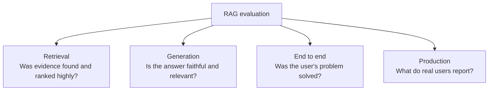
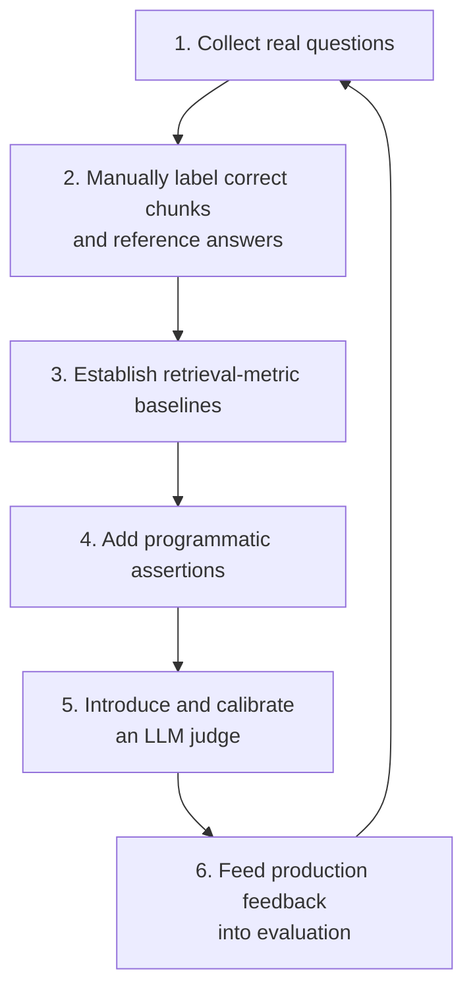

# Chapter 18: A Framework for Evaluating RAG

## 18.1 Why Evaluation Must Be Layered

RAG is a multistage pipeline. **A poor final answer could result from a failure at any stage.**

A single end-to-end score tells you that performance is poor, but not **where it is poor**. Layer-specific metrics can identify the responsible layer in the framework introduced in Chapter 14.

End-to-end scores alone detect regression without diagnosing its cause. Retrieval scores alone cannot establish whether the full pipeline completes the task. Both kinds of evaluation are necessary.

## 18.2 Retrieval Metrics

Prerequisites: fix the corpus snapshot, query time, and scope visible to the user; annotate evidence in the original text and its corresponding chunks. Relevance, support for a particular fact, and sufficiency to answer the entire question are not the same label. Multi-hop questions require evidence sets. Reprints and overlapping passages must not be counted repeatedly as independent evidence.

| Metric | What it measures | When to use it |
|---|---|---|
| **Hit@K** | Whether the Top-K contains **at least one** correct chunk | A commonly used core metric |
| **Recall@K** | **What proportion** of correct chunks the Top-K covers | When answering requires combining multiple passages |
| **MRR** | The mean reciprocal rank of the first correct result | Measuring **ranking quality** |
| **NDCG@K** | Overall ranking quality accounting for relevance grades and position | When relevance has multiple grades |
| **Precision@K** | The proportion of correct results in the Top-K | When the amount of noise matters |

### 18.2.1 Using These Metrics to Locate Problems

The metrics are more useful when combined for diagnosis.

| Observation | Diagnosis | Relevant layer |
|---|---|---|
| Low Hit@50 | **Evidence was not retrieved at all**; indexing or a retrieval path may be at fault | Indexing / retrieval |
| High Hit@50 but low Hit@5 | Evidence was retrieved, but **ranking is poor** | Reranking |
| High Hit@5 but poor answers | Only some evidence may have been found; assembly may truncate it, or generation may misread it | Evidence coverage / context / generation |
| Low Recall@K but high Hit@K | Some evidence was found, **but it is incomplete** | Indexing granularity / retrieval K too small |

In practice, use these metrics together as a diagnostic table.

### 18.2.2 Fix the Denominator Before Comparing Scores

Let G be the set of valid relevant evidence for a question, and R the deduplicated Top-K results:

- `Hit@K` is a binary hit: 1 if R and G intersect, otherwise 0, averaged across questions.
- `Recall@K = |R ∩ G| / |G|`. With only one relevant unit it equals Hit@K; with multiple required pieces of evidence it does not.
- `Precision@K = |R ∩ G| / K`. In this evaluation, unfilled positions count as irrelevant when fewer than K results are returned. If the actual number returned is used as the denominator, give that metric a separate name and report the result count.
- `MRR@K` considers only the first relevant piece of evidence within K, assigning 0 if none is found. It says nothing about whether the remaining necessary evidence is complete.
- `NDCG@K` combines graded relevance gains with positional discounts, then normalizes by the ideal ranking score under the same labels. Report whether gains are linear or exponential. Report examples with no relevant evidence separately rather than filling undefined scores with full marks.

For example, suppose a question requires three non-interchangeable pieces of evidence, A, B, and C. Returning only A gives Hit@5 of 1, evidence recall of 1/3, and a complete-evidence-set success rate of 0. If several equivalent evidence sets exist, annotate these alternatives so that “not finding every duplicate source” is not misclassified as being unable to answer.

When comparing chunking strategies, hold original-text span labels and the context token budget fixed, then map the spans to each strategy's chunks. Record coverage after first-stage ranking, reranking, and final prompt assembly. Do not compare only Top-5 across differently sized chunks. Annotations rarely exhaust all relevant documents; sample unjudged results for additional labeling rather than assuming they are all irrelevant.

Also distinguish **ANN Recall@K**. It compares approximate results against the exact Top-K under the same vectors, filters, and distance metric, measuring loss from the approximate index. The task-level recall above compares against human-annotated evidence. Exact nearest neighbors are not semantic ground truth.

## 18.3 Generation Metrics

Ragas provides several generation and context metrics, **not all of which are reference-free**. The table uses the LLM-based metric definitions in the official documentation. Actual runs must pin the package version, metric class, prompts, judge, and input fields rather than mixing different APIs.

| Metric | What it measures |
|---|---|
| **Faithfulness** | Whether each statement in the answer **can be inferred from the retrieved material** |
| **Answer Relevancy** | Whether the answer **addresses the question**, rather than drifting off topic or answering something else |
| **Context Precision** | Whether each chunk is useful relative to a reference answer, and whether useful chunks rank highly; this is not ordinary Precision@K |
| **Context Recall** | The proportion of claims in the reference answer covered by retrieved context; **requires a `reference`** |

Faithfulness generally requires only the generated answer and retrieved context, not a reference answer. Response/Answer Relevancy can also be reference-free, but does not check factual truth. The official documentation additionally distinguishes variants such as `ContextUtilization`, which uses the generated response, non-LLM text matching, and ID-based recall. Similar names do not imply identical inputs, denominators, or measurement goals.

Two calculation details deserve attention. LLM-based Context Precision first judges each chunk's usefulness, sums Precision@k at positions occupied by useful chunks, and divides by the number of chunks judged useful in the returned list. It does not penalize all evidence that has not been retrieved, so it still needs to be paired with recall. Answer Relevancy generates questions backward from the answer, then compares their embeddings with the original question's embedding. This proxy can remain high when an answer appears relevant but omits a condition.

The official documentation lists both collections and legacy APIs. For example, `ContextUtilization` in the former and `LLMContextPrecisionWithoutReference` in the latter both judge chunk usefulness against the generated response, not a reference answer. A report must identify the specific variant, not merely say “we ran Context Precision.”

### 18.3.1 Four Limitations to Keep in Mind

These metrics must be used with their limitations in view.

**(1) Faithfulness is not factuality**

First, make this distinction, also discussed in Chapter 17, Section 17.8:

> **Faithfulness measures whether an answer is faithful to the material, not whether it is factually correct.** If the material is wrong, faithfulness can still receive a perfect score.

**(2) Abstentions and answers without claims cannot be scored like ordinary answers**

“I don't know” may contain no verifiable claim. Depending on the implementation, the result may be NaN, invalid, or another conventional score—not necessarily full marks. “The material contains no relevant information” is not automatically a valid claim either.

Report abstentions, claim-free answers, and evaluation failures separately, along with the number of valid examples. Do not silently drop them. Read these results together with task accuracy, answer coverage, and an abstention confusion matrix, so that the system cannot hide errors by saying very little or abstaining on everything.

**(3) The circularity of LLM-as-judge**

Using an LLM to evaluate another LLM's output introduces **shared-model bias**: the judge may prefer answers resembling its own style or make the same mistakes as the evaluated model.

**Mitigation:** Use a judge **different from** the generation model, and **calibrate** its agreement with human judgments on a human-labeled subset.

**(4) Noise in reference-free evaluation**

Context Recall cannot know what evidence was missed without a reference answer, reference contexts, or reference IDs. Its noise comes from incomplete annotations, claim decomposition, and the judge's decisions. “No need to manually label every chunk” does not mean “no reference of any kind.”

These metrics are better suited to trends and relative comparisons than to being treated as absolute scores. A change such as “Faithfulness rose from 0.82 to 0.85” must be interpreted alongside the evaluation set and judgment variance.

## 18.4 End-to-End Evaluation

Ultimately, evaluation must answer: “Was the user's problem solved?”

| Method | What it can judge and what it cannot guarantee |
|---|---|
| Human scoring | Experts judge against business criteria; cost grows with scale, and disagreements require double annotation, adjudication, and spot checks |
| LLM-as-judge | Evaluate open-ended answers against evidence and reference answers; calibrate the judge and retain undetermined cases and judging failures |
| Programmatic assertions | Compare structured values, units, IDs, and constraints precisely; keyword-presence checks alone miss negation and attribution errors |
| A/B testing | Observe differences in real traffic; requires stable assignment, adequate sample size, guardrail metrics, and analysis of feedback bias |

**Recommended combination:** Use **programmatic assertions as the foundation**—fast, deterministic, and suitable for regression testing—**LLM-as-judge as a supplement** for open-ended questions, and **periodic human spot checks for calibration** to assess the trustworthiness of both.

Calibrate an LLM judge first by measuring agreement with human judgments on a labeled sample. Uncalibrated judge scores should not directly drive decisions.

### 18.4.1 Citations, Freshness, and Robustness

An end-to-end “correct answer” score does not establish that a system is auditable, suitable for current facts, or resilient to input perturbations. For answers that require evidence, add at least these dimensions:

| Dimension | What to test | Operational criterion |
|---|---|---|
| **Citation completeness** | Whether all key verifiable claims have sufficient support | Count “claims sufficiently supported by the evidence actually cited / claims requiring citations”; an identifier alone does not pass |
| **Citation correctness** | Whether each citation actually supports the adjacent claim | Verify the source, page/paragraph/time location, and entailment of the claim; checking identifier existence is insufficient |
| **Citation accessibility** | Whether users can open citations within their permissions | Check ACLs, stable `doc_id/version_id`, and location information without leaking paths |
| **Freshness** | Whether the answer uses the version valid at query time | Use known updates, revocations, and expiration cases to test version selection, date presentation, and cache invalidation |
| **Robustness** | Whether irrelevant noise, paraphrases, spelling/OCR errors, conflicts, or injected content change conclusions | Run original and perturbed examples in pairs; report changes in task success, false acceptance, abstention, and citations |

Freshness evaluation must fix the query time and visible versions. Otherwise, the system may cite material that is correct today but was wrong then. Robustness reports should include normal-task utility as well as attack success rates, so a system cannot earn superficially strong results by abstaining on everything. For security details, see [Chapter 20](../06-operations-security/20-rag-challenges-security.md).

Judge citation correctness by entailment within the paragraph or media region actually cited. Do not substitute “some supporting source somewhere in the context.” For claims with multiple citations, report joint support and the proportion of irrelevant citations separately. Values, subjects, negation, and temporal conditions all matter. ALCE evaluates answer correctness separately from citation quality; its decomposition is a useful model, unlike a check that merely tests whether a URL opens.

### 18.4.2 Abstention and Statistical Reliability

First label questions as answerable or unanswerable under the current permissions and corpus snapshot, then calculate:

| Metric | Definition |
|---|---|
| Answer coverage | Number of questions answered / total questions |
| False acceptance rate | Unanswerable questions receiving a factual answer / unanswerable questions |
| False abstention rate | Answerable questions on which the system abstains / answerable questions |
| Answered-question risk | Incorrect answers / questions actually answered |

For partial answers, identify supported and unsupported subquestions and separately measure question coverage. Plot a risk–coverage curve, select the gate on the development set, then report results on a frozen test set. Do not repeatedly tune thresholds on the test set.

Compare two systems through paired evaluation using the same questions, snapshot, budget, and scoring rules. Report the difference, sample size, and confidence intervals—for example, by bootstrapping over questions. When many similar questions come from one document, resample by document groups. Pin the judge version and prompt, hide system identities, randomize A/B order, and assess agreement through human double annotation and adjudication. Changing the judge can mitigate shared-model bias; it does not automatically eliminate position, length, or style biases.

## 18.5 Building an Evaluation Set

This is usually the most time-consuming part, but it determines whether the evaluation framework is useful.

### 18.5.1 Use Three Tiers

| Tier | Size | Frequency | Purpose |
|---|---|---|---|
| **Smoke** | 10–30 examples | Every change | Quickly check for obvious regressions |
| **Regression** | 100–300 examples | Every release | Prevent previously fixed failures from returning |
| **Full** | 500+ examples | Periodically / after major changes | Comprehensive evaluation |

These counts are examples for organizing regression testing, not proof of statistical sufficiency or universal minimums. Required sample size depends on the difference you want to detect, the baseline error rate, desired confidence-interval width, correlations between questions, and coverage of each business segment. Rare, high-risk failures usually require targeted sampling. Having “more than 500 examples” does not establish adequate evaluation.

### 18.5.2 Question Types That Must Be Covered

- **Simple factual lookup.**
- **Paraphrases:** users phrase the question differently from the document.
- **Technical terms and model numbers:** exercise the BM25 retrieval path.
- **Multi-hop and compound questions.**
- **Questions requiring synthesis across multiple passages.**
- **Freshness-sensitive questions:** fix the query time and test selection of the version valid then when old and new versions coexist.
- **Questions requiring citations:** annotate the evidence needed for each key claim and its page/paragraph-level location.
- **Paired robustness examples:** paraphrases, OCR noise, irrelevant documents, conflicting evidence, and malicious instructions.
- **Questions with no answer in the knowledge base:** **test abstention.**
- **Leading questions:** the premise itself is false; test whether the model follows it and fabricates an answer.

The last two categories directly affect trustworthiness and must not be omitted.

### 18.5.3 Data Sources

**In descending order of priority:**

1. **Real production user questions:** the most representative source.
2. **Questions written by domain experts:** cover important but infrequent scenarios.
3. **LLM-generated questions:** expand scale, but **must receive human review**.

A common bias in LLM-generated evaluation sets comes from asking the model to read a chunk and write a question. The resulting questions **mirror the chunk's wording too closely**, making retrieval artificially easy. Humans need to rewrite them as questions real users would ask.

## 18.6 The Value and Limits of Public Benchmarks

| Benchmark | Characteristics |
|---|---|
| TREC RAG | Standardized research evaluation with a rigorous methodology |
| CRAG Benchmark | Covers multiple domains and question types, including dynamically changing answers; **do not confuse it with Corrective RAG** |
| Domain-specific QA datasets | References for particular domains |

**Public benchmarks support comparisons between methods; they do not predict how your system will perform on your data.**

CRAG results must state the task, data version, model, and scoring rules. Scores from one paper's experiment are not a ceiling on the capabilities of current systems. TREC RAG also has year-specific tasks and judgment definitions; confirm that the corpora and evaluation goals match before comparing results.

## 18.7 Production Metrics

Strong offline results still need to be checked against real user feedback.

| Metric | Interpretation |
|---|---|
| **Thumbs-down / thumbs-up rate** | Satisfaction signals from users who actively give feedback; also report the feedback rate and sample composition, because these users do not directly represent all requests |
| **Human handoff rate** | A core customer-service metric |
| **Follow-up question rate** | May indicate an unresolved issue or natural deeper exploration; interpret with conversation annotations |
| **Citation click-through rate** | May reflect verification, interest, or an operational need; not a direct positive or negative measure of trust |
| **Abstention rate** | Must be considered alongside hallucination rate; see Chapter 17, Section 17.3 |
| **P95 latency / cost** | User experience and economics |

Thumbs-down feedback is a valuable diagnostic lead, but it may reflect factual errors, permission restrictions, latency, stylistic preferences, or unreasonable expectations. De-identify, triage, spot-check, and annotate it before adding it to the evaluation set. Voluntary feedback is subject to selection bias. Also draw random or stratified samples from all requests, including those with no feedback and positive feedback, and combine them with task-completion evidence to assess overall quality. Negative feedback alone cannot establish the overall error rate.

## 18.8 The Right Order for Establishing Evaluation

This is a feedback loop: production feedback supplements development and regression sets, which guide further improvements. Keep the frozen test set isolated and refresh it on an agreed schedule. Questions repeatedly used to choose thresholds or tune prompts are no longer unseen test examples.

## 18.9 Common Mistakes

### 18.9.1 Evaluating Only End to End, Without Layers

You know performance is poor but not where the failure occurs.

### 18.9.2 Treating Faithfulness as Factuality

It measures faithfulness to supplied material. Wrong material can still yield a perfect score. This is the most common misunderstanding.

### 18.9.3 Looking at Faithfulness but Not Answer Relevancy

Scores for abstentions or claim-free answers may be invalid. Report these cases separately, together with coverage, false abstention, and answered-question risk.

### 18.9.4 Using an LLM Judge Without Calibration

Uncalibrated judge scores lack credibility.

### 18.9.5 Using the Generator as Its Own Judge

Check for shared errors and style preferences. Switching models can mitigate shared-model bias, but blinded evaluation, order perturbations, and human calibration are still needed.

### 18.9.6 Omitting “No Answer” Questions

This prevents evaluation of abstention, the first line of defense against hallucination.

### 18.9.7 Skipping Human Rewriting of LLM-Generated Questions

Questions mirror chunk wording too closely, inflating retrieval scores.

### 18.9.8 Reporting RAGAS Scores as Absolute Measures

These metrics have substantial variance and are better suited to trends and relative comparisons.

### 18.9.9 Running Offline Evaluation Without Production Feedback

Production thumbs-down feedback is a valuable diagnostic source, but needs triage and spot checks. Also bring random or stratified samples of the overall request population into evaluation, rather than optimizing only for users and questions that elicit active negative feedback.

## 18.10 Chapter Summary

1. **Evaluate in layers:** retrieval, generation, end to end, and production. A total score alone cannot locate failures.
2. **Retrieval metrics must specify ground truth, denominators, and candidate stage.** A high Hit score does not establish sufficient evidence; ANN recall is not task-level evidence recall.
3. **Four RAGAS metrics:** Faithfulness, Answer Relevancy, Context Precision, and Context Recall.
4. **Respect their limits:** faithfulness is not correctness; claim-free answers need separate reporting; judges need human calibration; Context Recall requires a reference.
5. **End-to-end evaluation must also test citation completeness, correctness, and accessibility; freshness at a fixed query time; and robustness under paired perturbations.**
6. **Recommended end-to-end combination:** programmatic assertions as the foundation, an LLM judge as a supplement, and human spot checks for calibration.
7. **Use three evaluation tiers—Smoke, Regression, and Full—and include no-answer, leading, freshness-sensitive, citation, and paired robustness questions.**
8. **LLM-generated questions must be rewritten by humans**, or retrieval metrics will be inflated.
9. **Public benchmarks are for comparisons between methods.** Real-world scores depend on data, tasks, and judgment definitions; comparisons cannot ignore versions.
10. **Production thumbs-down feedback is a valuable source of failure cases.** De-identify, triage, and annotate it before adding it to the evaluation feedback loop.

## References

- [Ragas: Automated Evaluation of Retrieval Augmented Generation](https://arxiv.org/abs/2309.15217)
- [Ragas: Context Recall](https://docs.ragas.io/en/stable/concepts/metrics/available_metrics/context_recall/)
- [Ragas: Context Precision](https://docs.ragas.io/en/stable/concepts/metrics/available_metrics/context_precision/)
- [Ragas: Faithfulness](https://docs.ragas.io/en/stable/concepts/metrics/available_metrics/faithfulness/)
- [Ragas: Answer / Response Relevancy](https://docs.ragas.io/en/stable/concepts/metrics/available_metrics/answer_relevance/)
- [ALCE: Enabling Large Language Models to Generate Text with Citations](https://arxiv.org/abs/2305.14627)
- [Evaluation of Retrieval-Augmented Generation: A Survey](https://arxiv.org/abs/2405.07437)
- [CRAG - Comprehensive RAG Benchmark](https://arxiv.org/abs/2406.04744)
- [TREC RAG Track](https://trec-rag.github.io/)
- [Fact, Fetch, and Reason: A Unified Evaluation of Retrieval-Augmented Generation](https://arxiv.org/abs/2409.12941)

The Ragas online metric documentation was consulted on 2026-09-15. API names here distinguish measurement definitions; they do not imply that every historical version provides classes with those names.
