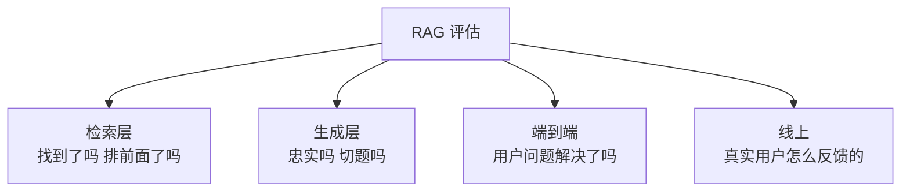
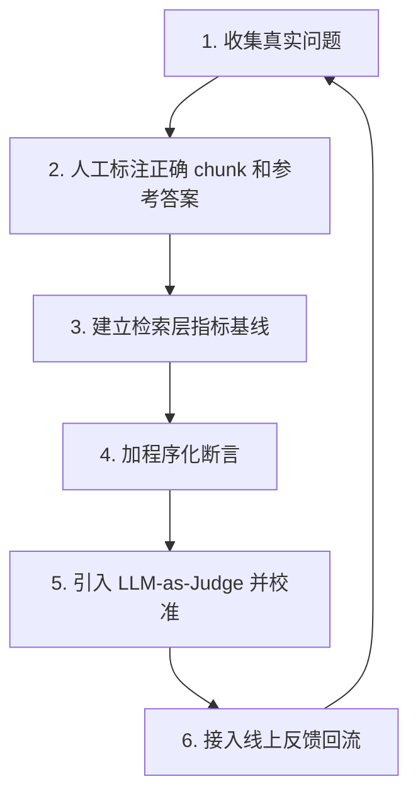

# 第十八章：RAG 评估体系

## 18.1 为什么必须分层评估

RAG 是一条多环节的流水线。**最终答案不好，可能是任何一个环节出了问题。**

如果只看一个端到端的总分，你能知道"效果差"，但不知道**差在哪**。而分层指标能直接告诉你问题落在第十四章框架的哪一层。

只看端到端分数只能发现退化，不能定位病因；只看检索又无法判断整条链路是否完成任务。两类评测需要同时存在。

## 18.2 检索层指标

前提：固定语料快照、查询时刻与用户可见范围，标注原文证据及其对应 chunk。相关性、能支持某个事实、足够回答整个问题不是同一标签；多跳题需要证据组，重复转载或 overlap 不能重复算作独立依据。

| 指标 | 衡量什么 | 什么时候用 |
|---|---|---|
| **Hit@K** | Top-K 里**是否至少有一个**正确 chunk | 最常用的核心指标 |
| **Recall@K** | Top-K 里覆盖了**多少比例**的正确 chunk | 答案需要多个片段综合时 |
| **MRR** | 第一个正确结果的排名倒数的平均 | 衡量**排序质量** |
| **NDCG@K** | 考虑相关性等级和位置的综合排序质量 | 相关性分多档时 |
| **Precision@K** | Top-K 里正确的比例 | 关注噪音比例时 |

### 18.2.1 怎么用这些指标定位问题

更有用的是把这些指标组合起来定位问题。

| 现象 | 诊断 | 对应的层 |
|---|---|---|
| Hit@50 低 | **根本没召回**，可能是索引或召回路问题 | 索引层 / 召回层 |
| Hit@50 高但 Hit@5 低 | 召回到了但**排序不好** | 重排层 |
| Hit@5 高但答案差 | 可能只命中部分证据，也可能被装配截断或生成误读 | 证据覆盖 / 上下文 / 生成层 |
| Recall@K 低但 Hit@K 高 | 找到了一部分依据，**但不完整** | 索引层（粒度）/ 召回层（K 太小） |

实际分析时，通常把这组指标作为诊断表来定位问题。

### 18.2.2 先固定分母，再比较分数

设某题的有效相关证据集合为 G，去重后的前 K 个结果为 R：

- `Hit@K` 为二值命中：R 与 G 有交集记 1，否则记 0，再按问题平均。
- `Recall@K = |R ∩ G| / |G|`。只有一个相关单元时它与 Hit@K 相同，多证据题则不同。
- `Precision@K = |R ∩ G| / K`。不足 K 条时，本评测按空位为不相关处理；若用实际返回数作分母，应另行命名并报告返回数。
- `MRR@K` 只看 K 内第一条相关证据，未命中记 0，不反映其余必要证据是否齐全。
- `NDCG@K` 用分级相关性增益与位置折扣，再除以相同标签下的理想排序分数；报告采用线性还是指数增益。没有相关证据的样本应单列，不把未定义分数填成满分。

例如一题需 A、B、C 三条互不替代的证据，只返回 A 时 Hit@5 为 1，但证据 Recall 为 1/3，完整证据组成功率为 0。存在多组等价依据时，应标注可替代证据组，避免把“没找齐所有重复来源”误判为不能作答。

比较切分方案时，固定原文 span 标签与上下文 Token 预算，再映射到各方案的块；同时记录粗排、重排和最终 Prompt 的覆盖，不能只比较不同大小块的 Top-5。标注往往不穷尽所有相关文档，未标注项应抽样补判，而不是默认全不相关。

还需区分 **ANN Recall@K**：它与相同向量、过滤和度量下的精确 Top-K 比较，衡量近似索引损失；上述业务 Recall 则与人工证据比较。精确近邻不是语义真值。

## 18.3 生成层指标

Ragas 提供多种生成和上下文指标，**并非全部无参考答案**。下表采用官方文档中基于 LLM 的指标口径；实际运行需固定包版本、指标类、提示词、Judge 和输入字段，不能混合不同 API：

| 指标 | 衡量什么 |
|---|---|
| **Faithfulness（忠实度）** | 答案中的每个陈述是否**能从检索材料中推出** |
| **Answer Relevancy（答案相关性）** | 答案是否**切题**（不跑题、不答非所问） |
| **Context Precision（上下文精确率）** | 基于参考答案判断各块是否有用，再评估相关块是否靠前；它不是普通 Precision@K |
| **Context Recall（上下文召回率）** | 将参考答案拆成主张，判断被检索上下文覆盖的比例，**需要 reference** |

Faithfulness 通常只需生成答案和检索上下文，不需标准答案；Response/Answer Relevancy 也可不依赖标准答案，但不检验事实真假。官方文档还区分基于生成回答的 `ContextUtilization`、非 LLM 文本匹配和 ID-based recall 等变体。名称相近不意味着输入、分母或统计目标一致。

两个计算细节值得单独说明。基于 LLM 的 Context Precision 先判每块是否有用，再对有用块所在位置的 Precision@k 求和，除以返回列表中被判为有用的块数；它不会惩罚所有尚未召回的证据，因此仍要配合 Recall。Answer Relevancy 则从回答反向生成问题，再比较这些问题与原问题的嵌入相似度；回答看似切题但漏掉一个条件时，这个代理分数仍可能很高。

官方文档同时列出 collections API 与 legacy API：例如前者的 `ContextUtilization` 和后者的 `LLMContextPrecisionWithoutReference` 都使用生成回答，而不是参考答案来判块的用途。报告不能只写“跑了 Context Precision”，还要写清具体变体。

### 18.3.1 四个使用边界

使用这些指标时，需要同时看清它们的边界。

**（1）Faithfulness 不等于事实正确性**

首先要区分这一点（与第十七章 17.8 呼应）：

> **Faithfulness 衡量的是「答案忠实于材料」，不是「答案事实正确」。** 材料本身错了，忠实度依然满分。

**（2）拒答和空主张不能按普通答案计分**

“我不知道”可能不含可验证主张，具体实现可能返回 NaN、无效或其他约定分数，并非必然满分。“材料中没有相关信息”也不自动成立。

应单列拒答、无主张和评测失败率，并报告有效样本数，不能静默丢弃它们。与任务正确率、答案覆盖和拒答混淆矩阵一起看，避免系统通过少说或全拒答隐藏错误。

**（3）LLM-as-Judge 的循环性问题**

用 LLM 评估 LLM 的输出，存在**同源偏见**：评判模型可能偏好与自己风格相似的回答，也可能与被评模型犯同样的错误。

**缓解**：用与生成模型**不同**的模型做评判；用人工标注的子集**校准**评判模型的一致性。

**（4）无参考答案带来的噪声**

Context Recall 不能凭空知道遗漏了哪些证据，需要参考答案、参考上下文或参考 ID。其噪声来自标注不全、主张拆分和 Judge 判断；“不用人工标注每个 chunk”不等于“不要任何参考”。

这些指标更适合看趋势和相对比较，不适合当作绝对分数。像「Faithfulness 从 0.82 涨到 0.85」这样的变化，需要结合评测集和判定方差一起解释。

## 18.4 端到端评估

最终还是要回答「用户的问题解决了吗」。

| 方式 | 能判断什么，不能保证什么 |
|---|---|
| 人工评分 | 专家按业务准则判断；成本随规模增加，需双标、仲裁和抽检控制分歧 |
| LLM-as-Judge | 对照证据和参考答案评价开放性回答；需校准，并保留无法判定和评判失败 |
| 程序化断言 | 精确比较结构化数值、单位、ID 与约束；仅检查关键词出现会漏掉否定和归属错误 |
| A/B 测试 | 观察真实流量中的差异；需稳定分流、样本量、护栏指标和反馈偏差分析 |

**推荐组合**：**程序化断言做主体**（快速、确定性、可回归），**LLM-as-Judge 做补充**（覆盖开放性问题），**定期人工抽查做校准**（验证前两者的可信度）。

LLM-as-Judge 需要先校准：用一批人工标注样本检查评判模型与人工的一致性。未校准的 Judge 分数不应直接用于决策。

### 18.4.1 Citation、时效与鲁棒性

端到端“答案正确”不足以说明系统可审计、可用于当前事实，或能抵抗输入扰动。对需要依据的答案，至少增加以下维度：

| 维度 | 要测什么 | 可操作判定 |
|---|---|---|
| **Citation 完整性** | 关键可核查主张是否都有充分支持 | 统计“被实际所引证据充分支持的主张 / 应引用主张”，不是有编号就算通过 |
| **Citation 正确性** | 引用是否真的支撑它旁边的主张 | 核验来源、页/段/时间定位与主张的蕴含关系；只检查编号存在不够 |
| **Citation 可访问性** | 用户能否在其权限内打开引用 | 检查 ACL、稳定 `doc_id/version_id` 与定位信息，不泄漏路径 |
| **时效性（freshness）** | 答案是否依据查询时有效的版本 | 用已知更新、撤销和过期样例，评测正确版本选择、日期呈现和缓存失效 |
| **鲁棒性** | 无关噪声、同义改写、拼写/OCR 错误、冲突或注入内容是否改变结论 | 成对运行原始与扰动样例，报告任务成功、错误接受、拒答和引用变化 |

时效评测必须固定“查询时刻”和可见版本；否则系统可能引用今天正确、当时错误的材料。鲁棒性不应只报告攻击成功率，还要报告正常任务效用，避免以全拒答获得表面高分（安全细节见[第二十章](../06-operations-security/20-rag-challenges-security.md)）。

引用正确性应在实际引用的段落或媒体区域上判断蕴含，不在整个上下文中“找一个能支持的来源”替代。对于多引用主张，分别报告联合支持和无关引用比例；数值、主体、否定及时间条件都在判定范围。ALCE 将回答正确性与引用质量分开评测，适合参考其拆分思路，而不是只做 URL 可访问检查。

### 18.4.2 拒答与统计可信度

先按当前权限和快照标注可回答/不可回答，再统计：

| 指标 | 口径 |
|---|---|
| 回答覆盖率 | 实际作答数 / 全部问题数 |
| 错误接受率 | 对不可回答题仍作事实回答的数量 / 不可回答题数 |
| 错误拒答率 | 对可回答题拒答的数量 / 可回答题数 |
| 作答风险 | 作答中的错误数 / 实际作答数 |

部分回答需标明已支持与未支持的子问题，另外测问题覆盖。绘制作答风险—覆盖曲线，在开发集选闸门，再用冻结测试集报告；不能在测试集上反复挑阈值。

比较两个系统时，在同一问题、快照、预算与评分规则下做成对评测，报告差值、样本量及置信区间，例如按问题 bootstrap；同一文档生成大量相似问题时按文档分组抽样。Judge 固定版本与提示词，盲化系统名称、随机化 A/B 顺序，并用人工双标与仲裁检查一致性。换一个 Judge 只能缓解同源偏见，不能自动消除位置、长度和风格偏置。

## 18.5 评测集怎么建

这一部分通常最耗时，但决定评估体系是否可用。

### 18.5.1 分三档

| 类型 | 规模 | 频率 | 用途 |
|---|---|---|---|
| **Smoke** | 10–30 条 | 每次改动 | 快速验证没有明显退化 |
| **Regression** | 100–300 条 | 每次发版 | 防止已修复的问题复发 |
| **Full** | 500+ 条 | 定期 / 大改动 | 全面评估 |

这些数量只是组织回归测试的示例，不代表统计充分性，也不是统一最低标准。需要多少样本取决于希望检出的差异、错误基线、置信区间宽度、问题间相关性及各业务分组的覆盖；低频高风险错误通常需要专门采样，不能凭“超过 500 条”认定评测充分。

### 18.5.2 必须覆盖的问题类型

- **简单事实查找**；
- **同义表述**（用户的说法与文档不同）；
- **专业术语与型号**（测 BM25 那一路）；
- **多跳/复合问题**；
- **需要综合多个片段的问题**；
- **时效性问题**（固定查询时刻，新旧版本共存时能否选择当时有效的信息）；
- **带引用的问题**（标注每个关键主张所需证据与页/段级定位）；
- **鲁棒性成对样例**（同义改写、OCR 噪声、无关文档、冲突证据和恶意指令）；
- **知识库里没有答案的问题**（**测拒答能力**）；
- **诱导性问题**（前提本身是错的，看模型是否会顺着编）。

最后两类直接关系到系统的可信度，评测集里不能缺。

### 18.5.3 数据来源

**优先级从高到低**：

1. **真实的线上用户问题**——最有代表性；
2. **业务专家出题**——覆盖重要但低频的场景；
3. **LLM 生成**——补充规模，但**必须人工审核**。

LLM 生成评测集时有个常见偏差：直接让 LLM 读一个 chunk 然后出题，生成的问题会**过度贴合该 chunk 的措辞**，导致检索"虚假地容易"。题目需要人工改写成真实用户会使用的问法。

## 18.6 公开基准的价值与局限

| 基准 | 特点 |
|---|---|
| TREC RAG | 学术界的标准化评测，方法论严谨 |
| CRAG Benchmark | 覆盖多领域、多类型问题，含动态变化的答案；**注意与 Corrective RAG 区分** |
| 各类领域 QA 数据集 | 特定领域的参考 |

**公开基准的作用是横向比较方法，而不是预测你的系统在你的数据上的表现。**

报告 CRAG 结果时必须附任务、数据版本、模型和计分规则，不能把某次论文实验的分数当作当前系统能力上限。TREC RAG 也有各年度任务与判断口径，横比前应确认语料和评价目标一致。

## 18.7 线上指标

离线评测跑得再好，也要看真实用户的反馈。

| 指标 | 说明 |
|---|---|
| **点踩率 / 点赞率** | 主动反馈用户的满意度信号；需同时报告反馈率与样本构成，不能直接代表全体请求 |
| **转人工率** | 客服场景的核心指标 |
| **追问率** | 可能表示未解决，也可能是自然深入探索，需结合会话标注 |
| **引用点击率** | 可能表示核查、兴趣或操作需要，不能直接当作信任的正向或反向指标 |
| **拒答率** | 需要与幻觉率一起看（第十七章 17.3） |
| **P95 延迟 / 成本** | 体验与经济性 |

点踩是高价值的问题线索，但可能来自事实错误、权限限制、延迟、表达偏好或不合理预期，需脱敏、分诊、抽检和标注后进入评测集。主动反馈存在选择偏差：还应从全部请求中随机或分层抽样，覆盖无反馈和正反馈，并结合任务完成情况评估总体质量，不能只用负反馈推断整体错误率。

## 18.8 建立评估的正确顺序

这是一条闭环流程：线上反馈补充开发集和回归集，再指导优化。冻结测试集应隔离保管、按约定周期更新，不能把已经反复用于选阈值和调提示词的测试题继续当作未见样本。

## 18.9 常见错误

### 18.9.1 只看端到端不分层

知道效果差，不知道差在哪。

### 18.9.2 把 Faithfulness 当作事实正确性

它衡量的是忠实于材料，材料错了也能满分。这是最常见的误解。

### 18.9.3 只看 Faithfulness 不看 Answer Relevancy

拒答或无主张的评分可能无效，必须单列并联合报告覆盖、错误拒答与作答风险。

### 18.9.4 LLM-as-Judge 不做校准

未校准的评判分数没有可信度。

### 18.9.5 用生成模型自己做评判

应检查共同错误与风格偏好；换模型可以缓解同源偏见，但仍需盲评、顺序扰动与人工校准。

### 18.9.6 评测集不含"无答案"问题

无法检验拒答能力，而拒答是防幻觉的第一道防线。

### 18.9.7 LLM 生成评测集不做人工改写

问题过度贴合 chunk 措辞，检索指标虚高。

### 18.9.8 把 RAGAS 分数当绝对值报告

这类指标方差大，适合看趋势和相对比较。

### 18.9.9 只有离线评测没有线上回流

线上点踩是高价值的诊断来源，需分诊与抽检；还应回流总体请求的随机或分层样本，避免只优化会主动负反馈的用户和问题。

## 18.10 本章总结

1. **必须分层评估**：检索层、生成层、端到端、线上——只看总分无法定位问题；
2. **检索指标要明确真值、分母和候选阶段**；Hit 高不代表证据充分，ANN 近似召回不等于业务证据召回；
3. **RAGAS 四指标**：Faithfulness、Answer Relevancy、Context Precision、Context Recall；
4. **使用边界**：忠实度不等于正确性，空主张要单列，Judge 需人工校准，Context Recall 需要参考；
5. **端到端还要测 Citation 完整性/正确性/可访问性、固定时刻的时效性，以及成对扰动下的鲁棒性**；
6. **端到端推荐组合**：程序化断言为主 + LLM-as-Judge 补充 + 人工抽查校准；
7. **评测集分三档**（Smoke / Regression / Full），**必须包含无答案、诱导、时效、引用和鲁棒性成对问题**；
8. **LLM 生成的题目必须人工改写**，否则检索指标虚高；
9. **公开基准用于横向比较**；真实场景分数依赖数据、任务和评判口径，不能脱离版本横比；
10. **线上点踩数据是高价值的问题来源**，经过脱敏、分诊和标注后再进入评测闭环。

## 参考资料

- [Ragas: Automated Evaluation of Retrieval Augmented Generation](https://arxiv.org/abs/2309.15217)
- [Ragas：Context Recall](https://docs.ragas.io/en/stable/concepts/metrics/available_metrics/context_recall/)
- [Ragas：Context Precision](https://docs.ragas.io/en/stable/concepts/metrics/available_metrics/context_precision/)
- [Ragas：Faithfulness](https://docs.ragas.io/en/stable/concepts/metrics/available_metrics/faithfulness/)
- [Ragas：Answer / Response Relevancy](https://docs.ragas.io/en/stable/concepts/metrics/available_metrics/answer_relevance/)
- [ALCE：Enabling Large Language Models to Generate Text with Citations](https://arxiv.org/abs/2305.14627)
- [Evaluation of Retrieval-Augmented Generation: A Survey](https://arxiv.org/abs/2405.07437)
- [CRAG - Comprehensive RAG Benchmark](https://arxiv.org/abs/2406.04744)
- [TREC RAG Track](https://trec-rag.github.io/)
- [Fact, Fetch, and Reason: A Unified Evaluation of Retrieval-Augmented Generation](https://arxiv.org/abs/2409.12941)

Ragas 在线指标文档查阅于 2026-09-15；文中的 API 名称用于区分统计口径，不代表所有历史版本都提供同名类。
