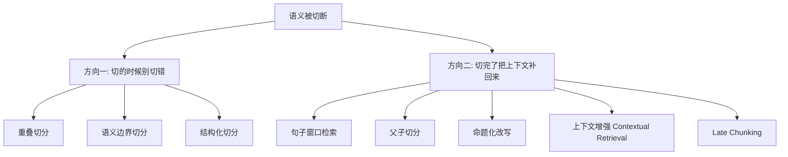
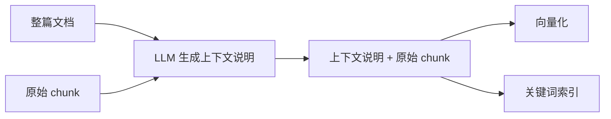
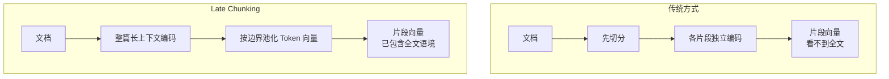

# 第五章：语义被切断怎么办

## 5.1 问题的两个方向

上一章说清了粒度的核心矛盾。这一章要解决的是它的直接后果：**一段话被切开后，片段丢失了理解它所必需的上下文**。

解决这个问题的方法可以分成两个完全不同的方向，**把它们分开讲是回答好这道题的关键**：

- **方向一是预防**：在切分时尽量不破坏语义单元；
- **方向二是补救**：承认小片段检索更准，但在**使用时**把它周围的上下文补回来。

> **方向二才是现代 RAG 的主流思路**，因为它同时拿到了「小片段检索精准」和「大上下文语义完整」这两个好处，而不是在两者之间妥协。

## 5.2 方向一：切的时候别切错

### 5.2.1 重叠切分

最简单的兜底手段：相邻片段共享一部分内容，让被切开的句子至少在某个片段里完整存在。

**优点**是零成本；**缺点**是它只能保证「不被截断」，无法保证「上下文完整」——一个片段可能语法完整但仍然指代不明。

### 5.2.2 结构化切分

按文档的天然结构（标题层级、条款编号、章节）切分。

**这是性价比最高的方法**：文档作者本来就是按语义单元组织内容的，直接沿用这个结构，比任何算法猜测都准。前提是第三章保留了结构信息。

### 5.2.3 语义边界切分

计算相邻句子的向量相似度，在相似度低谷处切断。

理论上很优雅，**但如第四章所述，实证对比显示它成本高、收益不稳定**。列出来是为了知道它存在，而不是推荐默认使用。

## 5.3 方向二：切完了把上下文补回来

### 5.3.1 句子窗口检索

**思路**：用**小单元**（句子或短片段）建索引参与检索，命中后返回它**前后若干个单元**一起送给模型。

**检索用小的，生成用大的**——这就是方向二的核心范式。

适合叙述性、上下文连贯的文本。缺点是固定窗口大小不适应变化的语义单元长度。

### 5.3.2 父子切分（Parent-Child）

句子窗口的结构化版本。把文档切成两级：

- **子片段**（小）：参与向量化和检索；
- **父片段**（大，通常是子片段所属的段落或章节）：命中子片段后，实际返回它的父片段。

| 对比 | 句子窗口 | 父子切分 |
|---|---|---|
| 扩展依据 | 位置（前后 N 个） | 结构（所属父块） |
| 边界是否语义完整 | 不保证 | 保证（父块是完整章节） |
| 是否依赖文档结构 | 否 | 是 |

**父子切分是 2026 年最主流的生产方案之一**，因为它兼顾了检索精度和语义完整性，且实现简单、成本几乎为零。

一个实用细节：多个子片段命中同一个父片段时要**去重**，否则会重复占用 Prompt 预算。

### 5.3.3 命题化改写

**思路**：用 LLM 把段落改写成一组**独立自足**的陈述句，每句话都不依赖上下文即可理解。

例如把：

> 「该比例不得超过前款规定的上限。」

改写为：

> 「差旅住宿费报销比例不得超过员工月基本工资的百分之十五。」

**这类方法在实体密集的问答任务上有明确的效果提升**，因为每个命题都是自足的，向量表达非常聚焦。

**代价也很明确**：

- 每个片段都要过一次 LLM，**建库成本显著上升**；
- 改写过程有**信息失真和幻觉风险**；
- 改写后**丢失了原文措辞**，不利于精确匹配和引用溯源。

**所以它适合高价值、语料规模可控的场景，不适合海量语料。**

### 5.3.4 上下文增强（Contextual Retrieval）

**这是目前工程上最推荐的方案之一。**

**思路**：不改写原文，而是在每个 chunk 前**拼接一段由 LLM 生成的、说明该片段在整篇文档中位置和背景的短说明**，然后再做向量化和关键词索引。

它与命题化的关键区别是：**原文一字不改，只是在前面加了一段背景说明**。所以既补上了上下文，又保留了原始措辞。

**Anthropic 公布的实验数据**（注意：这是厂商工程博客，非同行评审论文）：

| 方案 | Top-20 检索失败率 | 相对降幅 |
|---|---|---|
| 基线（普通嵌入 + BM25） | 5.7% | — |
| + 上下文增强嵌入 | 3.7% | −35% |
| + 上下文增强 BM25 | 2.9% | −49% |
| + Rerank | 1.9% | −67% |

**成本上的关键点**：给每个 chunk 生成上下文说明需要把整篇文档作为输入，看起来非常贵。但配合 **Prompt Caching**（整篇文档只算一次，后续 chunk 复用缓存），实测成本约为**每百万文档 Token 一美元量级**。

**这里必须区分清楚一个概念**：

> **Prompt Caching 是「计算层」的优化，它降低的是重复输入的计算成本；上下文增强是「信息层」的改造，它改变的是被索引的内容。两者是配合关系，不是替代关系。**

### 5.3.5 Late Chunking

**思路更进一步**：不是先切分再各自编码，而是**先把整篇文档送进长上下文 Embedding 模型完整编码**，得到每个 Token 的向量表示（此时每个 Token 都已经"看到"了全文），**然后再按 chunk 边界对 Token 向量做池化**，得到 chunk 向量。

它的巧妙之处在于：**上下文信息是在编码阶段自然注入的，不需要额外调用 LLM 生成说明。**

**局限**：

- 必须使用**支持长上下文的 Embedding 模型**；
- 文档超过模型上限时仍需分段处理；
- **2026 年尚未成为主流生产方案**，工具链支持有限。

## 5.4 方案对比与选择

| 方案 | 建库成本 | 检索精度 | 上下文完整性 | 保留原文 | 成熟度 |
|---|---|---|---|---|---|
| 重叠切分 | 极低 | 低 | 低 | 是 | 成熟 |
| 结构化切分 | 极低 | 中 | 中 | 是 | 成熟 |
| 语义边界切分 | 中 | 中 | 中 | 是 | 成熟但收益存疑 |
| 句子窗口 | 低 | 高 | 中 | 是 | 成熟 |
| 父子切分 | 低 | 高 | **高** | 是 | **成熟，主流** |
| 命题化改写 | **高** | **高** | 高 | **否** | 学术为主 |
| 上下文增强 | 中 | **高** | **高** | 是 | **成熟，推荐** |
| Late Chunking | 中 | 高 | 高 | 是 | 较新 |

**推荐的实施顺序**（按投入产出比）：

1. **结构化切分 + 合理的 size/overlap** —— 几乎零成本，先把这个做对；
2. **父子切分** —— 成本极低，收益明显，应该是默认配置；
3. **上下文增强** —— 有一定成本，但有公开数据支撑，值得投入；
4. **命题化 / Late Chunking** —— 视场景和语料规模评估。

## 5.5 常见错误

### 5.5.1 只答重叠切分

重叠只是最基础的兜底，只答这一个说明对这道题理解很浅。

### 5.5.2 不区分「预防」和「补救」两个方向

把六七种方法平铺罗列，听起来是背的。分成两个方向再讲，逻辑立刻清晰。

### 5.5.3 把 Prompt Caching 说成一种压缩或补上下文的方法

它是计算层优化，不改变被索引的内容。混淆这一点是典型的概念不清。

### 5.5.4 把上下文增强和命题化混为一谈

前者保留原文只加说明，后者重写原文。在溯源和精确匹配上差别很大。

### 5.5.5 忽略父子切分的去重

多个子片段命中同一父片段时不去重，会浪费大量 Prompt 预算。

### 5.5.6 认为越复杂的方法越好

第四章的实证结论已经说明，基础参数没调好时，上复杂方法收益有限。

## 5.6 本章总结

1. **两个方向**：预防（切的时候别切错）与补救（切完把上下文补回来）；**补救是现代主流思路**；
2. **核心范式**：**用小片段检索，用大上下文生成**；
3. **父子切分**成本极低、效果明显，应作为默认配置；
4. **上下文增强**用 LLM 生成背景说明拼在片段前，保留原文，有公开数据支撑（失败率降低 35%–67%），配合 Prompt Caching 后成本可控；
5. **Prompt Caching 是计算层优化，与信息层的上下文改造是互补关系**；
6. **命题化改写**效果好但成本高、会丢原文措辞，适合高价值小语料；
7. **Late Chunking** 在编码阶段注入全文语境，思路优雅但工具链尚不成熟；
8. **实施顺序**：结构化切分 → 父子切分 → 上下文增强 → 更前沿方案。

一句话概括：

> **不要试图找到一个"完美的切分点"，而应该接受「检索用小的、生成用大的」这个分离设计，然后把上下文在使用时补回来。**

## 参考资料

- [Anthropic: Introducing Contextual Retrieval](https://www.anthropic.com/engineering/contextual-retrieval)
- [Late Chunking: Contextual Chunk Embeddings Using Long-Context Embedding Models](https://arxiv.org/abs/2409.04701)
- [Dense X Retrieval: What Retrieval Granularity Should We Use?](https://arxiv.org/abs/2312.06648)
- [RAPTOR: Recursive Abstractive Processing for Tree-Organized Retrieval](https://arxiv.org/abs/2401.18059)
- [Searching for Best Practices in Retrieval-Augmented Generation](https://arxiv.org/abs/2407.01219)
