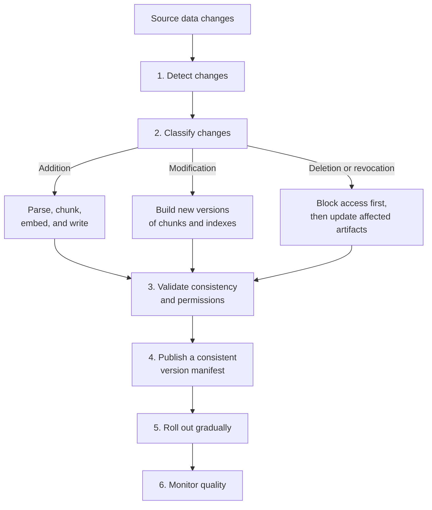
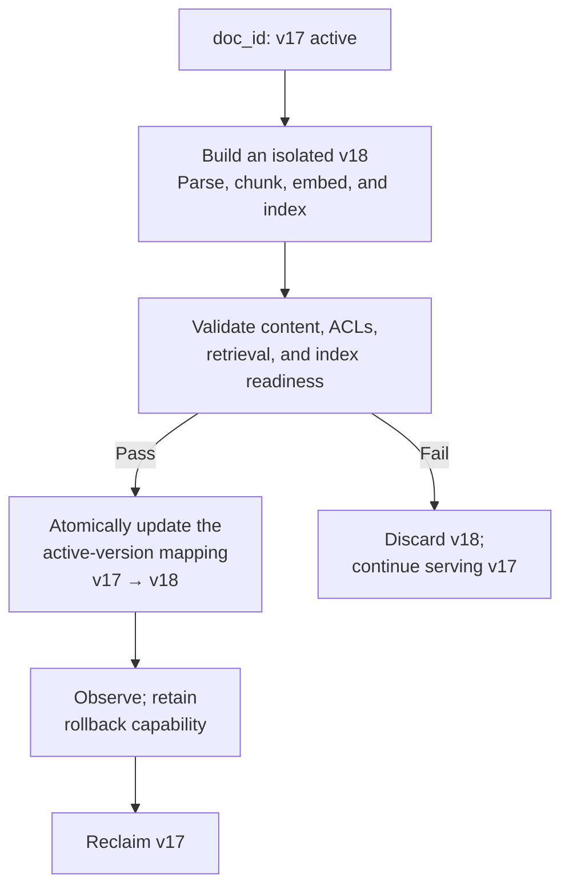
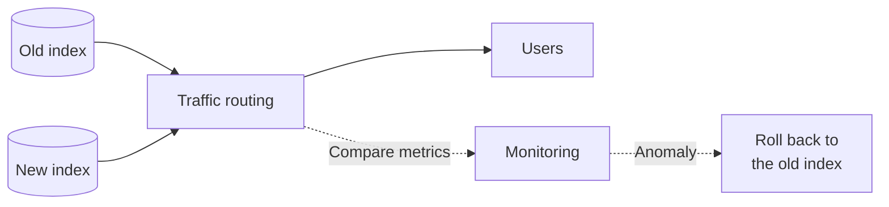

# Chapter 19: Dynamic Knowledge Base Updates and Incremental Indexing

## 19.1 Dependencies Determine the Unit of Update

A demo knowledge base is often built once, but documents in production systems keep changing.

RAG updates differ from ordinary database updates in one important respect: **changing even a single character in a document can shift chunk boundaries throughout the remaining text, changing the contents of subsequent chunks.**

This means you cannot blindly update just one existing chunk, not that incremental updates are impossible. Stable section boundaries and content hashes let you reuse unchanged passages; Late Chunking, document-wide contextual descriptions, or graph summaries may broaden the dependencies. Identify the affected artifacts first, then choose between a local update, a document-level rebuild, and a migration of the entire knowledge base.

## 19.2 The Complete Update Pipeline

## 19.3 Step 1: Change Detection

| Approach | Method and limitations |
|---|---|
| Polling + content hashes | Scan periodically and compare content, with fewer changes required at the data source; polling introduces lag and scanning costs, and comparisons must cover more than the body text |
| Event-driven | Trigger processing through webhooks or a message queue, usually reducing scanning; delivery failures, backlogs, retries, and lost events remain possible |
| Hybrid | Combine event processing with periodic reconciliation to better detect missed changes; requires maintaining both signals and their consistency rules |

Content hashes can reduce re-embedding triggered merely by saving a document again, but cannot by themselves detect changes to ACLs, deletion status, validity periods, or parser configuration. Track content, permissions, metadata, and processing versions separately; identical content does not mean the published state can be reused.

Events may be lost, duplicated, or backlogged. Log replay, sequence-number checks, and periodic reconciliation complement one another. Set the reconciliation frequency according to acceptable lag and data volume, covering content, deletion, and permission state together rather than imposing a daily schedule on every system.

## 19.4 Step 2: Versioned Copy-on-Write and Atomic Aliases

This is the central constraint of the release process. Inserting a paragraph at the beginning of a document can shift all subsequent chunk boundaries, so patching the serving index one record at a time is not a safe default. Yet deleting before inserting creates a gap in read availability: if the write fails or the index is not ready, users can see neither the old version nor the new one.

One robust approach is **copy-on-write** with immutable versions: build and validate the affected artifacts, then switch the active version. Transactional incremental updates to stable chunks can also meet the requirement. The essential point is that a request must not read a partially updated state; not every database needs to copy the entire collection.

A database alias usually points to a collection or index; it does not automatically provide a version transaction for each document. For document-level releases, a transactional table or manifest can maintain the active version. When a release spans vector search, BM25, and source-document storage, publish their combined versions as one snapshot and bind queries to that snapshot. Switching a vector database alias alone does not guarantee an atomic change across the other systems.

This avoids both obsolete chunks left behind by boundary shifts and the read gap between deletion and insertion. Each request is bound to one release snapshot, which may contain the respective versions of many documents; it must not inadvertently mix partially updated content. A historical comparison can explicitly select and label two versions. Current restrictions imposed by deletion and permission revocation apply independently of the snapshot, and rollback must not restore prohibited access.

### 19.4.1 Designing IDs, Versions, and Aliases

`doc_id` identifies the document; `version_id` identifies an immutable build artifact; the active-version mapping points to validated artifacts. Collection-level releases can use database aliases, while document-level releases are usually represented by a transactional table or manifest. Bulk deletion is one capability for reclaiming old versions, not a substitute for a consistent release protocol.

Recommended metadata:

| Field | Purpose |
|---|---|
| `doc_id` | Stable, unique document identifier |
| `version_id` | **Immutable build version; the unit selected for queries and rollback** |
| `chunk_id` | Unique chunk identifier, typically `doc_id + version_id + sequence_number` |
| `content_hash` | Change detection and reproducible builds |
| `active_alias` / `published_at` | Atomic publication, freshness checks, and gradual rollout control |
| `source_path` / `page` | Tracing citations to their source |
| `acl_tags` / `tenant_id` | Permission filtering |

**Lookups by `doc_id`, by `version_id`, and through the alias-resolution path all need an index or constant-time lookup**, otherwise reclamation, verification, or switching can degrade into full-table scans.

Design these mappings early. Existing data can have metadata and filter indexes backfilled without necessarily being re-embedded. During backfilling, deny access by default to records missing version or authorization information.

Events can be duplicated or arrive out of order. Use `doc_id + source_version` as an idempotency key, and prevent older events from overwriting a newer published version. Queue failed work for retry and retain checkpoints. Content hashes can enable reuse of computed artifacts, but cross-tenant reuse must not mix permissions between tenants. For deletion or revocation, block visibility first and reclaim asynchronously; rolling back to an old snapshot must not restore access.

## 19.5 Step 3: Two Technical Pitfalls in Deletion

### 19.5.1 Removal from Queries, Index Reclamation, and Physical Erasure Differ

As discussed in Chapter 8, deletion semantics depend on the implementation. HNSW alone does not imply that “real deletion is never possible.” For example, pgvector supports DELETE and VACUUM, while other implementations may use tombstones or segment compaction.

There are two immediate consequences:

**(1) Soft-deleted entries can accumulate.** Unreclaimed nodes may still occupy space and participate in traversal. Whether they occupy the result-candidate queue, and how they affect scan budgets and recall, depend on the implementation. “Still traversable” must not be equated with “necessarily consumes one slot in `ef`” (Chapter 9, Section 9.6.4).

Monitor the proportion of soft-deleted entries, recall, scan budgets, and reclamation progress, and set thresholds using the observed degradation curve. A 20% threshold is not a universal trigger for rebuilding every engine.

**(2) Availability during a rebuild.** Large rebuilds can take a long time. Follow **build a new version → validate → switch consistently**, retaining the old version for in-flight queries and rollback where the retention policy allows. Account for the old and new working sets and build buffers rather than assuming a fixed doubling of memory (Chapter 9, Section 9.3.3).

### 19.5.2 Special Requirements for Compliance-Driven Deletion

Deletion requirements may cover cessation of use, index reclamation, and erasure from underlying storage. **Soft deletion describes only a logical state; it does not prove that every copy has been handled.** Applicable rules and organizational policy should determine deadlines, statutory retention exceptions, and backup handling.

Additional procedures are needed:

- Record deletion requests, immediately stop querying the affected data and reusing its cached results, then complete underlying reclamation within the agreed deadline and retain audit evidence.
- Verify the retention and erasure mechanisms of databases, object storage, and backups. Neither “supports DELETE” nor “uses DiskANN” is proof of physical erasure.
- **Check related locations**: source documents, derived summaries, caches, logs, and backups. For copies that must be retained temporarily, record the basis, duration, and access restrictions. Reapply the deletion list when restoring backups; do not make revoked data accessible again.

## 19.6 Step 4: Consistency Validation

After an update, verify the following:

| Check | Method |
|---|---|
| Is the chunk count reasonable? | Check whether the ratio of chunks to document length falls within the normal range |
| Is the published version complete? | Confirm that all chunks, ACLs, and content hashes for the `version_id` are present |
| Is the alias consistent? | Within a request, the alias resolves to only one published version and can be rolled back atomically |
| Were the vectors written successfully? | Run sample queries against the candidate version to check that new content can be retrieved |
| Is querying ready? | Verify the required consistency, visibility of all candidates, and latency target; a flat-scan buffer path is acceptable if it meets the SLO |

Some vector databases provide exact scans over data that does not yet have an ANN index, so “not yet indexed” does not mean “not queryable.” Check write acknowledgment, visibility, settings that restrict search to indexed data, and performance separately; these semantics vary by product version.

**This is item 2 in the “Sudden Drop in Recall” troubleshooting checklist in Chapter 9, Section 9.6.4.**

## 19.7 Step 5: Gradual Rollout and Rollback

Large updates—changing the embedding model or chunking strategy, or importing a new corpus—**must be rolled out gradually**.

**Method**: keep both indexes, route a small share of traffic to the new one, and compare retrieval metrics and production feedback. Switch all traffic only after confirming there is no regression, **and retain the old index for a while to allow rollback**.

The cost is storage for both versions during the transition, in exchange for rollback capability and a comparison window.

**Comparison metrics that must be monitored**: Hit@K on a fixed evaluation set, production thumbs-down rate, refusal rate, and P95 latency.

## 19.8 Permission Isolation and Multitenancy

Enterprise deployments usually cannot avoid this issue.

### 19.8.1 Three Implementation Approaches

| Approach | Method and tradeoffs |
|---|---|
| Metadata filtering | Restrict results from a shared index using trusted authorization conditions; evaluate filter selectivity, execution plans, and insufficient result counts |
| Partitioning / separate indexes | Narrow the search space by tenant or permission domain; increases management overhead and still requires trusted routing, ACLs within each tenant, and cache isolation |
| Post-filtering | Generate candidates before checking permissions; may leave too few candidates or leak side-channel signals; unauthorized content must not first reach external reranking, generation, or logs |

One combination is a separate index per tenant with fine-grained filtering within each tenant. Shared indexes can also use filter-aware search. Separate indexes do not automatically provide complete security isolation; routing, storage credentials, and cross-domain derived data still need to be checked.

### 19.8.2 Three Essential Considerations

**(1) Post-filtering can leak information.** When retrieval precedes filtering, the excluded results are not returned, but **the fact that results were filtered can itself reveal information**, through result counts or latency differences, for example. Highly sensitive applications should use pre-filtering or separate indexes.

**(2) Permission changes must promptly block access.** A user removed from a department must not retain access through an old session or cache. If chunks store only a stable department ID and a current authorization service resolves the user's membership, it is usually unnecessary to update every chunk. If expanded user lists are stored in chunks, extensive backfilling may be required. Version resource ACLs and user membership separately; when necessary, deny access first and update indexes asynchronously.

**(3) Caches must account for permissions.** If retrieval-result caches do not distinguish users' permissions, **user B can hit a cache entry created for user A**—a serious authorization vulnerability.

## 19.9 Handling Time Validity

When old and new versions of a document coexist, or the knowledge itself is time-dependent:

- **Record when content takes effect and expires.** Select the version valid at the query time specified by the question, rather than always filtering for today.
- **Establish applicability and source authority before considering recency.** A newly uploaded copy of an old policy must not outrank the version that is actually in force.
- **Label each passage with its date in the context**, so the model can account for time validity (Chapter 10, Section 10.3.7).
- **Archive or reclaim according to the retention policy.** Historical versions may still be needed for audits and historical questions, but remain subject to current access permissions (Chapter 17, Section 17.8).

## 19.10 Common Mistakes

### 19.10.1 Overwriting Records or Deleting Before Inserting Without a Consistency Protocol

Validate the boundaries and dependencies of affected chunks. Use transactional incremental updates or versioned releases to avoid leftover chunks and read gaps, and keep versions consistent across retrieval paths. Do not treat an alias as a cross-system transaction.

### 19.10.2 Omitting doc_id or Failing to Index It

Bulk deletion becomes impossible, or deletion degrades into a full-table scan.

### 19.10.3 Using One Signal to Detect Every Kind of Change

Modification timestamps can trigger unnecessary rebuilds, while content hashes alone miss permission and validity-period changes. Track these separately and reconcile them.

### 19.10.4 Relying Only on Events, Without Reconciliation

Events may be lost or arrive out of order. Combine log replay, version checks, and periodic reconciliation. Reconciliation must cover permissions, deletions, and metadata, not just body-text hashes.

### 19.10.5 Ignoring the Accumulation of Soft-Deleted Entries

Accumulating too many soft-deleted entries can affect recall; the effect depends on the index implementation and maintenance strategies such as reclamation and rebuilding.

### 19.10.6 Assuming Soft Deletion Meets Compliance Requirements

The data still exists physically, with additional copies in caches, logs, and backups.

### 19.10.7 Not Checking Whether the Index Has Taken Effect

Distinguish write acknowledgment, queryability, and ANN index readiness. If a buffer participates in exact search, the absence of an ANN index does not necessarily cause retrieval misses.

### 19.10.8 Releasing Large Updates Without a Gradual Rollout

By the time a regression is noticed, rollback may no longer be possible.

### 19.10.9 Leaving the User Dimension Out of Permission Caches

This allows unauthorized access and is a serious security vulnerability.

### 19.10.10 Hard-Coding Permission Tags in Chunks

Expanded user lists embedded in chunks may require extensive updates. Stable resource tags combined with current authorization mappings can avoid this backfilling, but authorization caches still need to be invalidated.

## 19.11 Chapter Summary

1. **Dependencies determine update scope**: stable chunks can be reused incrementally, while boundary shifts or document-wide derived representations can expand the scope of recomputation.
2. **The complete pipeline**: change detection → change-specific processing → consistency validation → gradual rollout → quality monitoring.
3. **Detect content-hash changes, metadata-version changes, and permission events separately.** Idempotent consumption, out-of-order protection, and periodic reconciliation provide complementary safeguards.
4. **Consistent releases can use transactional incremental updates or versioned copy-on-write**: validate the affected artifacts first, then publish a snapshot consistent across retrieval paths. An alias is not a cross-system transaction, and retaining an old snapshot must not restore revoked access.
5. **Design IDs and metadata when building the knowledge base**: `doc_id`, `version_id`, `chunk_id`, `content_hash`, `active_alias`, and `acl_tags`.
6. **Deletion semantics depend on the vector database implementation**: common implementations use tombstones, segment compaction, or background physical reclamation. Monitor the proportion of soft-deleted entries, verify recall, and ensure that compliance-driven deletion ultimately covers indexes, caches, and backups.
7. **Check writes, visibility, and search performance separately.** Data without an ANN index may still be queryable through an exact-search buffer path.
8. **Large updates require gradual rollout**: keep the old and new indexes, compare a small share of traffic, and preserve rollback capability.
9. **Permission isolation must span the whole pipeline**: both separate indexes and shared-index filtering require trusted authorization. Rollback must not bypass revocation, cache invalidation, or restrictions on derived data.

## References

- [FreshDiskANN: A Fast and Accurate Graph-Based ANN Index for Streaming Similarity Search](https://arxiv.org/abs/2105.09613)
- [Official pgvector README: updates, deletion, and VACUUM](https://github.com/pgvector/pgvector)
- [Efficient and robust approximate nearest neighbor search using Hierarchical Navigable Small World graphs](https://arxiv.org/abs/1603.09320)
- [ACORN: Performant and Predicate-Agnostic Search Over Vector Embeddings and Structured Data](https://arxiv.org/abs/2403.04871)
- [LightRAG: Simple and Fast Retrieval-Augmented Generation](https://arxiv.org/abs/2410.05779)
- [Retrieval-Augmented Generation for Large Language Models: A Survey](https://arxiv.org/abs/2312.10997)
