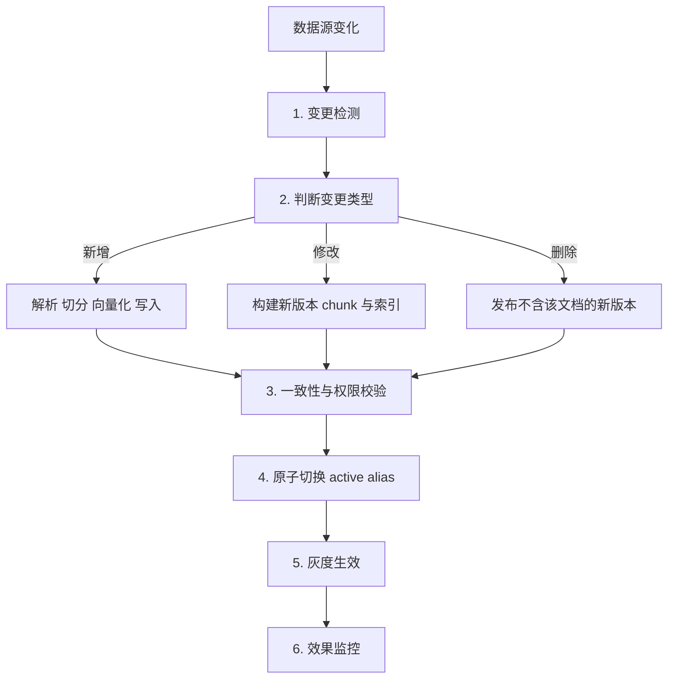
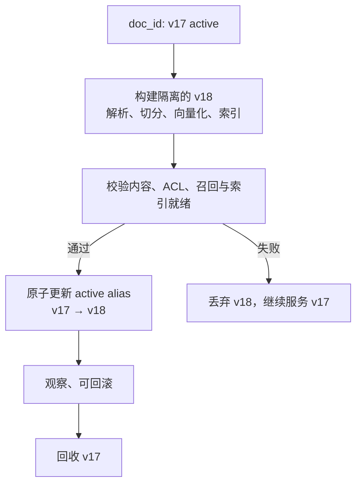
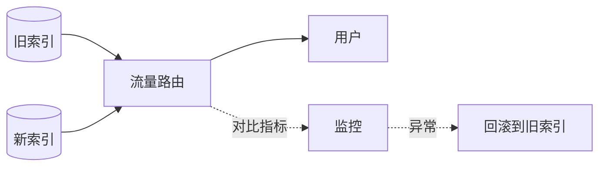

# 第十九章：知识库的动态更新与增量索引

## 19.1 为什么动态更新不能按记录增量处理

Demo 阶段的知识库往往一次性建好，但生产系统里的文档会持续变化。

RAG 更新和普通数据库更新的差异在于：**文档哪怕只改一个字，也可能让 chunk 边界整体偏移，后续 chunk 的内容随之改变。**

这意味着**很多场景都不能按数据库记录那样"局部改一条"**，而要按文档或版本重建。

## 19.2 完整的更新链路

## 19.3 第一步：变更检测

| 方式 | 做法 | 优点 | 缺点 |
|---|---|---|---|
| **轮询 + 内容哈希** | 定期扫描，对比文档内容的哈希值 | 实现简单、不依赖数据源改造 | 有延迟、大规模时扫描开销大 |
| **事件驱动** | 数据源变化时发消息（Webhook / 消息队列） | **实时、无扫描开销** | 需要数据源支持、需维护中间件 |
| 混合 | 事件驱动为主，定期全量对账兜底 | **可靠** | 复杂度最高 |

**为什么用内容哈希而不是修改时间**：很多系统的"修改时间"会因为元数据变动、重新保存、格式转换而更新，**内容其实没变**。用内容哈希能避免大量无谓的重建。

**混合方案的必要性**：事件驱动会丢消息（服务重启、网络故障、数据源没发出事件）。**定期全量对账是唯一能发现"漏了什么"的手段**——建议至少每天跑一次哈希对账。

## 19.4 第二步：版本化 Copy-on-Write + 原子 Alias

发布流程的关键约束在这里。文档开头插入一段话后，后续 chunk 的边界可能整体偏移，因而不应尝试在正在服务的索引中逐条“修补”。但“先删后增”会制造读空窗口：写入失败或索引尚未就绪时，用户既看不到旧版，也看不到新版。

正确做法是把一次文档变更作为不可变版本进行 **copy-on-write**：在候选版本中完整解析、切分、向量化和建索引；校验通过后，才把查询使用的 `active` alias（或路由指针）**原子地**切到新版本。旧版本保留到回滚窗口结束，再异步回收。

这同时避免了边界偏移造成的残留旧 chunk 和删后写入的不可用窗口。查询必须在一次请求内绑定同一个已发布版本；不得让同一上下文混入两个版本的片段。合规删除另有物理擦除要求，不能只依赖延迟回收。

### 19.4.1 ID、版本与 Alias 设计

`doc_id` 用于定位文档；`version_id` 标识不可变构建产物；`active` alias 只指向一个经过验证的可查询版本。批量删除是旧版本回收和合规流程的一项能力，而不是用户查询路径上的发布机制。

推荐的元数据设计：

| 字段 | 用途 |
|---|---|
| `doc_id` | 文档的稳定唯一标识 |
| `version_id` | **不可变构建版本；查询与回滚的单位** |
| `chunk_id` | chunk 唯一标识，通常是 `doc_id + version_id + 序号` |
| `content_hash` | 变更检测与构建可复现性 |
| `active_alias` / `published_at` | 原子发布、时效判断与灰度控制 |
| `source_path` / `page` | 引用溯源 |
| `acl_tags` / `tenant_id` | 权限过滤 |

**`doc_id`、`version_id` 和 alias 解析路径都必须有索引或常数时间查找**，否则回收、核验或切换会退化成全表扫描。

**这个设计必须在建库时就做好**——第三章 3.6.1 强调的「元数据事后补等于全量重建」，在这里体现得最直接。

## 19.5 第三步：删除的两个技术陷阱

### 19.5.1 HNSW 没有真正的删除

如第八章 8.2.1 所述，HNSW 图结构被破坏后难以修复，工程上普遍采用**软删除 + 定期重建**。

这会带来两个直接后果：

**（1）软删除会累积。** 被标记删除的向量仍占内存、仍参与图遍历、仍消耗 `ef` 预算，但会在结果中被过滤掉。**累积到一定比例后，实际召回率会显著下降**（第九章 9.6.4 的排查项之一）。

**应对**：**监控软删除比例**，超过阈值（比如 20%）触发重建。

**（2）重建期间的可用性。** 全量重建可能耗时数小时。始终采用**构建新版本 → 校验 → 原子切换 alias**，并保留旧版本供在途查询和回滚；代价是切换期间需要双份内存（第九章 9.3.3）。

### 19.5.2 合规删除的特殊要求

用户要求删除个人数据、或文档因合规原因必须移除时，**软删除不够——数据仍然物理存在**。

需要额外的流程：

- 记录删除请求，**确保在下次重建后数据真正消失**；
- 或使用支持真删除的索引结构（如 DiskANN 系）；
- **检查关联位置**：原文存储、缓存、日志、备份里的副本。只删向量而保留这些副本，合规审计仍然不通过。

## 19.6 第四步：一致性校验

更新完成后必须验证：

| 检查项 | 方法 |
|---|---|
| chunk 数量是否合理 | 与文档长度的比值是否在正常范围 |
| 发布版本是否完整 | `version_id` 的 chunk、ACL 与内容哈希均齐全 |
| Alias 是否一致 | 同一请求只解析到一个已发布版本，可原子回退 |
| 向量是否写入成功 | 抽样查询候选版本能否命中新内容 |
| 索引是否已就绪 | 候选版本进入 ANN 索引后才允许切换 alias |

很多向量库的新写入数据会先进入一个未建索引的缓冲区，**要等到达到阈值或手动触发才合并进主索引**。这段时间内，新数据可能检索不到，或者走的是低效路径。

**这是第九章 9.6.4「召回率突然下降」排查清单里的第 2 条。**

## 19.7 第五步：灰度与回滚

大批量更新（换 Embedding 模型、改切分策略、导入新语料）**必须灰度**。

**做法**：新旧索引并存，先切小比例流量，对比检索指标和线上反馈，确认无退化后再全量切换，**并保留旧索引一段时间以便回滚**。

代价是切换期需要双份存储，用来换取可回滚和对比窗口。

**必须监控的对比指标**：固定评测集的 Hit@K、线上点踩率、拒答率、P95 延迟。

## 19.8 权限隔离与多租户

这一块在企业场景里通常绕不开。

### 19.8.1 三种实现方式

| 方式 | 做法 | 优点 | 缺点 |
|---|---|---|---|
| **元数据过滤** | 每个 chunk 带权限标签，检索时按标签过滤 | 实现简单、单索引 | **踩第八章 8.4 的过滤陷阱** |
| **分区/分索引** | 每个租户或权限域独立索引 | **彻底隔离、无过滤陷阱** | 索引数量多、管理成本高 |
| 后过滤 | 检索后再按权限过滤 | 实现最简单 | **高选择性时结果可能为空**；且有信息泄漏风险 |

常见做法是：**租户级隔离用分索引，租户内的细粒度权限用元数据过滤。**

### 19.8.2 三个必须注意的点

**（1）后过滤有信息泄漏风险。** 如果先检索再过滤，被过滤掉的结果虽然没返回，但**"有结果被过滤"这个事实本身可能泄漏信息**（比如返回结果数、延迟差异）。高敏感场景应使用预过滤或分索引。

**（2）权限变更要能即时生效。** 用户被移出某个部门后，应立即无法检索到该部门的文档。**如果权限标签是写死在 chunk 元数据里的，权限变更就需要更新大量 chunk**——更好的做法是**存资源标识，在查询时映射到当前的权限**。

**（3）缓存必须带权限维度。** 检索结果缓存如果不区分用户权限，**会导致 A 用户的缓存被 B 用户命中**——这是严重的越权漏洞。

## 19.9 时效性处理

同一份文档的新旧版本共存，或者知识本身有时效性时：

- **在元数据里记录生效时间和失效时间**，检索时过滤掉已失效的；
- **同等相关性时按时间加权**，优先返回新的；
- **在上下文中标注每个片段的日期**，让模型知道时效（第十章 10.3.7）；
- **定期清理过期内容**——这属于知识库治理，是幻觉治理的最上游（第十七章 17.8）。

## 19.10 常见错误

### 19.10.1 在活动索引中局部更新或先删后增

chunk 边界会偏移，逐条修补会残留旧内容；先删后增又会产生读空窗口。**应构建不可变新版本、验证后原子切换 alias。**

### 19.10.2 没有 doc_id 或 doc_id 未建索引

无法批量删除，或删除操作退化成全表扫描。

### 19.10.3 用修改时间而非内容哈希检测变更

会触发大量无谓的重建。

### 19.10.4 只用事件驱动不做对账

事件会丢，必须有定期全量哈希对账兜底。

### 19.10.5 忽略软删除的累积

累积过多会导致召回率静默下降。

### 19.10.6 认为软删除满足合规要求

数据仍物理存在，且缓存、日志、备份里还有副本。

### 19.10.7 不检查索引是否已生效

新写入数据可能还在未建索引的缓冲区里。

### 19.10.8 大批量更新不灰度

发现退化时已经无法回滚。

### 19.10.9 权限缓存不带用户维度

会造成越权访问，是严重的安全漏洞。

### 19.10.10 权限标签写死在 chunk 里

权限变更需要更新大量 chunk，无法即时生效。

## 19.11 本章总结

1. **RAG 更新的特殊约束**：文档改动会导致 chunk 边界整体偏移，**无法局部更新**；
2. **完整链路**：变更检测 → 分类处理 → 一致性校验 → 灰度生效 → 效果监控；
3. **变更检测用内容哈希而非修改时间**；事件驱动为主 + **定期全量对账兜底**；
4. **修改采用版本化 copy-on-write**：先构建并验证完整新版本，再原子切换 alias；旧版本保留用于在途请求和回滚，随后回收；
5. **ID 与元数据设计要在建库时做好**：`doc_id`、`version_id`、`chunk_id`、`content_hash`、`active_alias`、`acl_tags`；
6. **删除语义取决于向量库实现**：常见实现用 tombstone、segment compaction 或后台物理回收；需监控软删比例、验证召回，并确认合规删除最终覆盖索引、缓存与备份；
7. **必须检查索引是否已生效**，新数据可能还在未建索引的缓冲区；
8. **大批量更新必须灰度**，新旧索引并存、小流量对比、保留回滚能力；
9. **权限隔离**：租户级用分索引，细粒度用元数据过滤；**注意后过滤的泄漏风险、权限变更的即时性、缓存必须带权限维度**。

## 参考资料

- [FreshDiskANN: A Fast and Accurate Graph-Based ANN Index for Streaming Similarity Search](https://arxiv.org/abs/2105.09613)
- [Efficient and robust approximate nearest neighbor search using Hierarchical Navigable Small World graphs](https://arxiv.org/abs/1603.09320)
- [ACORN: Performant and Predicate-Agnostic Search Over Vector Embeddings and Structured Data](https://arxiv.org/abs/2403.04871)
- [LightRAG: Simple and Fast Retrieval-Augmented Generation](https://arxiv.org/abs/2410.05779)
- [Retrieval-Augmented Generation for Large Language Models: A Survey](https://arxiv.org/abs/2312.10997)
