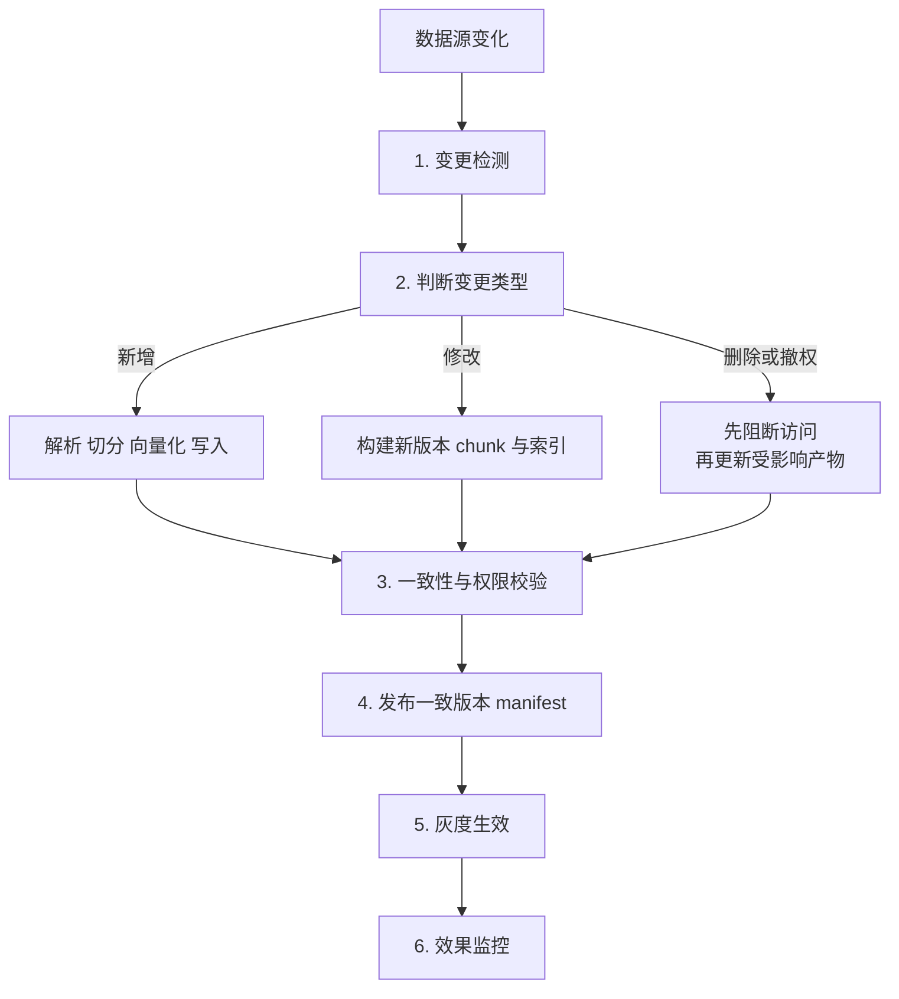
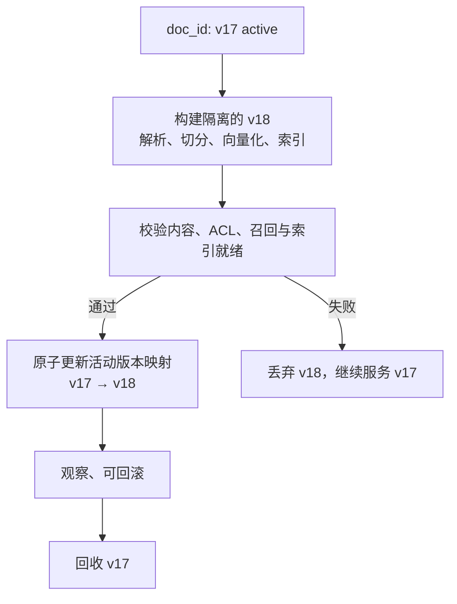
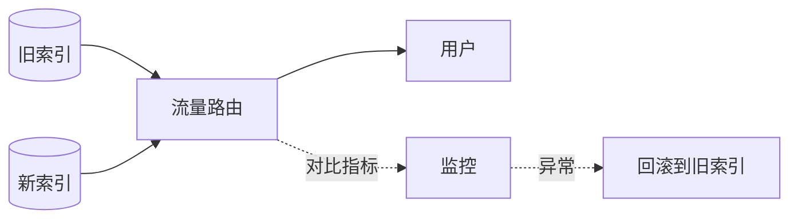

# 第十九章：知识库的动态更新与增量索引

## 19.1 动态更新的单位由依赖关系决定

Demo 阶段的知识库往往一次性建好，但生产系统里的文档会持续变化。

RAG 更新和普通数据库更新的差异在于：**文档哪怕只改一个字，也可能让 chunk 边界整体偏移，后续 chunk 的内容随之改变。**

这意味着不能盲目只改一个旧 chunk，但不代表不能增量更新。稳定章节边界加内容哈希可以复用未变片段；Late Chunking、全文上下文说明或图摘要则可能扩大依赖范围。应先识别受影响产物，再选择局部更新、文档级重建或全库迁移。

## 19.2 完整的更新链路

## 19.3 第一步：变更检测

| 方式 | 做法与边界 |
|---|---|
| 轮询 + 内容哈希 | 定期扫描并比内容，较少依赖数据源改造；有轮询滞后和扫描成本，不能只比正文 |
| 事件驱动 | 用 Webhook 或消息队列触发处理，通常减少扫描；仍有投递、积压、重试与丢事件风险 |
| 混合 | 事件处理配合定期对账，提高遗漏发现能力；需要维护两个信号及一致性规则 |

内容哈希可减少仅因重新保存而触发的重嵌入，但不能单独检测 ACL、删除、生效期或解析器配置变化。内容、权限、元数据和处理版本应分别跟踪；仅内容相同不代表发布状态可以复用。

事件可能遗漏、重复或积压，重放日志、序列号检查与定期对账可以互补。对账频率按允许的滞后和数据规模设置，并同时覆盖内容、删除与权限状态，不固定为所有系统每天一次。

## 19.4 第二步：版本化 Copy-on-Write + 原子 Alias

发布流程的关键约束在这里。文档开头插入一段话后，后续 chunk 的边界可能整体偏移，因而不应尝试在正在服务的索引中逐条“修补”。但“先删后增”会制造读空窗口：写入失败或索引尚未就绪时，用户既看不到旧版，也看不到新版。

一种稳妥做法是不可变版本 **copy-on-write**：构建受影响产物并校验，再切换活动版本。稳定块的事务增量更新也可满足要求，关键是请求不能读到半新半旧状态，不是所有数据库都必须整库复制。

数据库 alias 通常指向 collection/index，并不自动提供每个文档的版本事务。文档级发布可用事务表或 manifest 维护活动版本；跨向量、BM25、原文存储时，将它们的版本组合发布为同一快照，查询绑定这个快照。单独切一个向量库 alias 并不能保证其他系统原子同步。

这避免了边界偏移造成的残留旧块和删后写入窗口。一次请求绑定同一发布快照，其中可以包含多份文档的各自版本；不能无意混入半新半旧内容。历史对比题可显式选取两版并标注。删除与撤权的当前限制独立于快照生效，回滚不能恢复已禁止的访问。

### 19.4.1 ID、版本与 Alias 设计

`doc_id` 用于定位文档；`version_id` 标识不可变构建产物；活动版本映射指向已验证产物。集合级发布可使用数据库 alias，文档级发布通常由事务表或 manifest 表达。批量删除是旧版本回收的一项能力，不应替代一致发布协议。

推荐的元数据设计：

| 字段 | 用途 |
|---|---|
| `doc_id` | 文档的稳定唯一标识 |
| `version_id` | **不可变构建版本；查询与回滚的单位** |
| `chunk_id` | chunk 唯一标识，通常是 `doc_id + version_id + 序号` |
| `content_hash` | 变更检测与构建可复现性 |
| `active_alias` / `published_at` | 原子发布、时效判断与灰度控制 |
| `source_path` / `page` | 引用溯源 |
| `acl_tags` / `tenant_id` | 权限过滤 |

**`doc_id`、`version_id` 和 alias 解析路径都必须有索引或常数时间查找**，否则回收、核验或切换会退化成全表扫描。

这些映射应提前设计。已有数据也可回填 metadata 和过滤索引，不必一概重嵌入；回填期间应默认拒绝缺少版本或授权信息的记录。

事件可能重复或乱序：以 `doc_id + source_version` 做幂等键，旧事件不能覆盖已发布新版本；失败进入可重试队列并保留检查点。内容哈希可复用计算产物，但跨租户复用不得造成权限串用。删除或撤权要先阻断可见性，再异步回收，且不能因回滚旧快照恢复访问。

## 19.5 第三步：删除的两个技术陷阱

### 19.5.1 查询删除、索引回收与物理擦除不同

如第八章所述，删除语义取决于实现。HNSW 本身不能推出“永远没有真删除”；例如 pgvector 支持 DELETE 与 VACUUM，其他实现可能采用 tombstone 或 segment compaction。

这会带来两个直接后果：

**（1）软删除可能累积。** 未回收的节点可能仍占空间并参与遍历，但是否占据结果候选队列、如何影响扫描预算和召回，取决于实现。不能把“仍可遍历”直接等同于“必然吃掉一个 `ef` 名额”（第九章 9.6.4）。

应监控软删除比例、召回、扫描预算与回收进度，在实际退化曲线上设阈值；20% 不能作为所有引擎的固定重建阈值。

**（2）重建期间的可用性。** 大规模重建可能耗时很长。采用**构建新版本 → 校验 → 一致切换**，并在保留策略允许时保留旧版供在途查询和回滚；核算新旧工作集与构建缓冲，而不是固定假设双份内存（第九章 9.3.3）。

### 19.5.2 合规删除的特殊要求

删除要求可能同时涉及停止使用、索引回收和底层擦除；**软删除只能说明一种逻辑状态，不能证明全部副本已处理**。具体期限、法定留存例外和备份处置应由适用规则与组织政策确定。

需要额外的流程：

- 记录删除请求，立即停止查询与缓存复用，再按约定时限完成底层回收并保留审计证据；
- 核实数据库、对象存储与备份的保留/擦除机制；“支持 DELETE”或“使用 DiskANN”都不能替代物理擦除证明；
- **检查关联位置**：原文、派生摘要、缓存、日志与备份。对必须暂存的副本记录依据、期限和访问限制；备份恢复时重新应用删除清单，不能重新开放已撤销数据。

## 19.6 第四步：一致性校验

更新完成后必须验证：

| 检查项 | 方法 |
|---|---|
| chunk 数量是否合理 | 与文档长度的比值是否在正常范围 |
| 发布版本是否完整 | `version_id` 的 chunk、ACL 与内容哈希均齐全 |
| Alias 是否一致 | 同一请求只解析到一个已发布版本，可原子回退 |
| 向量是否写入成功 | 抽样查询候选版本能否命中新内容 |
| 查询是否已就绪 | 验证目标一致性、完整候选可见和延迟达标；允许符合 SLO 的 flat 缓冲路径 |

有些向量库对未建 ANN 索引的数据提供精确扫描，所以“尚未建索引”不等于“不可查询”。应分别检查写入确认、可见性、是否只搜已索引数据的配置和性能；这些语义依产品版本而异。

**这是第九章 9.6.4「召回率突然下降」排查清单里的第 2 条。**

## 19.7 第五步：灰度与回滚

大批量更新（换 Embedding 模型、改切分策略、导入新语料）**必须灰度**。

**做法**：新旧索引并存，先切小比例流量，对比检索指标和线上反馈，确认无退化后再全量切换，**并保留旧索引一段时间以便回滚**。

代价是切换期需要双份存储，用来换取可回滚和对比窗口。

**必须监控的对比指标**：固定评测集的 Hit@K、线上点踩率、拒答率、P95 延迟。

## 19.8 权限隔离与多租户

这一块在企业场景里通常绕不开。

### 19.8.1 三种实现方式

| 方式 | 做法与取舍 |
|---|---|
| 元数据过滤 | 共享索引按可信授权条件限制返回范围；需评测过滤选择性、执行计划与结果不足 |
| 分区/分索引 | 按租户或权限域缩小搜索域；管理成本增加，仍需可信路由、租户内 ACL 和缓存隔离 |
| 后过滤 | 先产生候选再检查权限；可能候选不足或泄漏旁路信号，无权内容不能先进入外部重排、生成或日志 |

一种组合是租户级分索引、租户内细粒度过滤；共享索引也可采用过滤感知搜索。独立索引不自动提供完整安全隔离，仍要检验路由、存储凭据和跨域派生数据。

### 19.8.2 三个必须注意的点

**（1）后过滤有信息泄漏风险。** 如果先检索再过滤，被过滤掉的结果虽然没返回，但**"有结果被过滤"这个事实本身可能泄漏信息**（比如返回结果数、延迟差异）。高敏感场景应使用预过滤或分索引。

**（2）权限变更要及时阻断访问。** 用户被移出部门后，不能继续凭旧会话或缓存读取资料。若块上只存稳定部门 ID、用户成员关系由当前授权服务解析，通常不必修改所有块；若把用户列表展开写入块，则可能大量回填。资源 ACL 与用户成员关系应分别版本化，必要时先拒绝访问，再异步更新索引。

**（3）缓存必须带权限维度。** 检索结果缓存如果不区分用户权限，**会导致 A 用户的缓存被 B 用户命中**——这是严重的越权漏洞。

## 19.9 时效性处理

同一份文档的新旧版本共存，或者知识本身有时效性时：

- **记录生效与失效时间**，按问题指定的查询时刻选择有效版本，不是始终按今天过滤；
- **先确认适用范围与来源权威性，再考虑新近程度**；新上传的旧制度不应压过正确生效版本；
- **在上下文中标注每个片段的日期**，让模型知道时效（第十章 10.3.7）；
- **按保留策略归档或回收**；历史版本仍可能用于审计与历史问答，需受当前访问权限约束（第十七章 17.8）。

## 19.10 常见错误

### 19.10.1 没有一致性协议就逐条覆盖或先删后增

应验证受影响块的边界与依赖。采用事务增量或版本化发布，保证无残留、无读空、跨检索路版本一致；不把 alias 当作跨系统事务。

### 19.10.2 没有 doc_id 或 doc_id 未建索引

无法批量删除，或删除操作退化成全表扫描。

### 19.10.3 只用一种信号检测所有变更

修改时间可触发无谓重建，只看内容哈希又会漏掉权限和生效期变更，应分别跟踪并对账。

### 19.10.4 只用事件驱动不做对账

事件可能遗漏或乱序，应以日志重放、版本检查和定期对账互补；对账要覆盖权限、删除与元数据，不能只有正文哈希。

### 19.10.5 忽略软删除的累积

累积过多会导致召回率静默下降。

### 19.10.6 认为软删除满足合规要求

数据仍物理存在，且缓存、日志、备份里还有副本。

### 19.10.7 不检查索引是否已生效

要区分写入确认、可查询性和 ANN 索引就绪；若缓冲区参加精确搜索，未建 ANN 索引不一定漏召回。

### 19.10.8 大批量更新不灰度

发现退化时已经无法回滚。

### 19.10.9 权限缓存不带用户维度

会造成越权访问，是严重的安全漏洞。

### 19.10.10 权限标签写死在 chunk 里

嵌入块中的展开用户列表可能需要大量更新；稳定资源标签配合当前授权映射可避免这类回填，但仍须处理授权缓存失效。

## 19.11 本章总结

1. **更新范围由依赖决定**：稳定块可增量复用，边界偏移或全文派生表示可能扩大重算范围；
2. **完整链路**：变更检测 → 分类处理 → 一致性校验 → 灰度生效 → 效果监控；
3. **内容哈希、元数据版本与权限事件分别检测**；幂等消费、乱序保护和定期对账共同兜底；
4. **一致发布可用事务增量或版本化 copy-on-write**：先验证受影响产物，再发布跨检索路一致的快照；alias 不等于跨系统事务，旧快照保留也不能复活已撤销的访问权限；
5. **ID 与元数据设计要在建库时做好**：`doc_id`、`version_id`、`chunk_id`、`content_hash`、`active_alias`、`acl_tags`；
6. **删除语义取决于向量库实现**：常见实现用 tombstone、segment compaction 或后台物理回收；需监控软删比例、验证召回，并确认合规删除最终覆盖索引、缓存与备份；
7. **分别检查写入、可见性和搜索性能**，未建 ANN 索引的数据可能仍可经精确缓冲路径查询；
8. **大批量更新必须灰度**，新旧索引并存、小流量对比、保留回滚能力；
9. **权限隔离要覆盖整条链路**：分索引或共享过滤都需可信授权；撤权、缓存失效和派生数据限制不能被回滚绕过。

## 参考资料

- [FreshDiskANN: A Fast and Accurate Graph-Based ANN Index for Streaming Similarity Search](https://arxiv.org/abs/2105.09613)
- [pgvector 官方 README：更新、删除与 VACUUM](https://github.com/pgvector/pgvector)
- [Efficient and robust approximate nearest neighbor search using Hierarchical Navigable Small World graphs](https://arxiv.org/abs/1603.09320)
- [ACORN: Performant and Predicate-Agnostic Search Over Vector Embeddings and Structured Data](https://arxiv.org/abs/2403.04871)
- [LightRAG: Simple and Fast Retrieval-Augmented Generation](https://arxiv.org/abs/2410.05779)
- [Retrieval-Augmented Generation for Large Language Models: A Survey](https://arxiv.org/abs/2312.10997)
