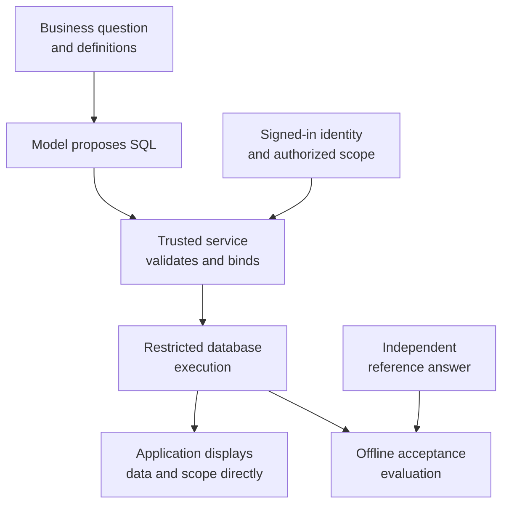

# Chapter 22: Text-to-SQL: From Business Questions to Verifiable Queries

## 22.1 Order statistics require more than a few retrieved passages

When a support representative asks, “How many orders from last week are still incomplete?”, retrieving a few orders and asking the model to add them up leaves every missed order out of the calculation. The problem is not poor model arithmetic: the input does not cover the population being counted.

[Chapter 3](../02-ingestion-indexing/03-document-parsing.md), §3.4, distinguishes locating a table from aggregating all its rows. [Chapter 16](../04-advanced/16-graphrag.md), §16.6, also explains that reliable relational tables can be queried directly without first extracting a knowledge graph. Text-to-SQL follows that route: **the model translates the question into SQL, the database performs the computation, and the application delivers the result.**

The [“Generating SQL Queries” discussion](https://github.com/bojieli/ai-agent-book/blob/985a49d35b9f50937f1f757cf25867672991ded7/book/chapter5.md) in Chapter 5 of Bojie Li's *AI Agents in Depth* has the model generate a query and the application execute it and present the result, rather than asking the model to carry data row by row. Its companion ERP example uses two SQLite tables, for employees and salaries, generates a query in a single model call, and compares the result with an independent Python reference answer.

This chapter keeps that division of responsibility but uses an order-aggregation case. It does not require a multi-turn agent. If an existing report meets the need, let the model select the report and supply validated parameters first. Allow it to generate SQL structure only when users genuinely need new combinations of queries.

## 22.2 Ask the business team what “incomplete” means

> The following fictional spare-parts order case calculates quantities awaiting shipment. Amounts are in renminbi fen, the hundredths of a yuan, excluding taxes, shipping fees, and discounts.

Zhou in operations asks Lin in customer support to export “incomplete orders from September 1 through 7.” Lin notices that “incomplete” could include orders that have shipped but have not been received; finance might instead interpret it as “not fully paid.” Rather than starting with a prompt, the engineer asks them to confirm that this request concerns goods still awaiting shipment from the warehouse.

| What needs clarification | Agreed definition for this request |
|---|---|
| What is incomplete? | The order is not cancelled, and at least one line still has an unshipped quantity. Shipped but not yet received goods do not count as unshipped. |
| What do quantity and amount mean? | Count distinct orders. Quantity means units still unshipped. Amount means those units multiplied by the line's unit price, not the full order contract value. |
| Which time window? | Orders placed from 2026-09-01 through 09-07 in Shanghai time, including both dates. |
| As of when? | Use a fixed snapshot with a cutoff of 09-08 at 09:00 Shanghai time, containing only events before that cutoff. |
| Whose orders? | Tenant T1 from the signed-in identity, with current authorization for customers C1 and C2. This request does not narrow that customer scope further. |
| How should results appear? | Aggregate by customer, show only customers with unshipped quantities, and sort by customer ID in ascending order. |

There are two time conditions: **the order-placement window determines which orders qualify; the snapshot cutoff determines how much had shipped by that point.** Adding an order-date predicate to today's order table cannot reconstruct last week's shipment state.

The [FDE order-exception assistant](../../fde/01-foundations/01-forward-deployed-engineering.md), §1.11.2, similarly distinguishes “shipped,” “received by the customer,” and “expected arrival at the warehouse from procurement.” Text-to-SQL must not collapse these distinctions into a vague `status != 'completed'`.

## 22.3 Fix the two tables and establish what one row represents

This chapter uses **the SQLite dialect only**. The following DDL is for maintainers to create the teaching snapshot; it is not among the queries a model is allowed to execute. In `orders`, each tenant has one row per order. An order can have multiple rows in `order_lines`, whose shipped quantities are cumulative as of the snapshot.

```sql
PRAGMA foreign_keys = ON;
CREATE TABLE orders (
    tenant_id TEXT NOT NULL,
    order_id TEXT NOT NULL,
    customer_id TEXT NOT NULL,
    created_at TEXT NOT NULL,
    status TEXT NOT NULL CHECK (status IN ('open', 'shipped', 'cancelled')),
    total_amount_cents INTEGER NOT NULL CHECK (total_amount_cents >= 0),
    promised_at TEXT,
    PRIMARY KEY (tenant_id, order_id)
);
CREATE TABLE order_lines (
    tenant_id TEXT NOT NULL,
    order_id TEXT NOT NULL,
    line_id INTEGER NOT NULL,
    ordered_qty INTEGER NOT NULL CHECK (ordered_qty > 0),
    shipped_qty INTEGER NOT NULL CHECK (
        shipped_qty >= 0 AND shipped_qty <= ordered_qty
    ),
    unit_price_cents INTEGER NOT NULL CHECK (unit_price_cents >= 0),
    PRIMARY KEY (tenant_id, order_id, line_id),
    FOREIGN KEY (tenant_id, order_id) REFERENCES orders (tenant_id, order_id)
);
```

The snapshot is named `orders-20260908-shanghai-v1`, with a logical cutoff of `2026-09-08T01:00:00Z`. Every non-null timestamp uses fixed-width UTC text in the format `YYYY-MM-DDTHH:MM:SSZ`, validated at ingestion. These constraints make text comparison equivalent to time comparison here. Do not mix in local times, different offsets, or inconsistent precision.

`orders` contains 8 rows. For narrow screens, they are displayed in two tables sharing the same composite key. `T1/O101` means `tenant_id=T1` and `order_id=O101`; it is not an additional database field.

| Tenant/order | Customer | Status | Full order amount (fen) |
|---|---|---|---|
| T1/O101 | C1 | open | 10000 |
| T1/O102 | C1 | open | 4000 |
| T1/O103 | C2 | cancelled | 6000 |
| T1/O104 | C2 | shipped | 4000 |
| T1/O105 | C2 | open | 3000 |
| T1/O106 | C2 | open | 4000 |
| T1/O107 | C3 | open | 8000 |
| T2/O101 | C1 | open | 50000 |

| Tenant/order | Order time `created_at` | Promised time `promised_at` |
|---|---|---|
| T1/O101 | 2026-08-31T16:00:00Z | NULL |
| T1/O102 | 2026-09-03T02:00:00Z | 2026-09-10T04:00:00Z |
| T1/O103 | 2026-09-04T02:00:00Z | NULL |
| T1/O104 | 2026-09-05T02:00:00Z | NULL |
| T1/O105 | 2026-09-07T16:00:00Z | NULL |
| T1/O106 | 2026-09-06T02:00:00Z | NULL |
| T1/O107 | 2026-09-07T02:00:00Z | NULL |
| T2/O101 | 2026-09-02T02:00:00Z | NULL |

`order_lines` contains 9 rows, keyed by tenant, order, and `line_id`. The last three columns correspond to `ordered_qty`, `shipped_qty`, and `unit_price_cents`:

| Tenant/order/line | Units ordered | Units shipped | Unit price (fen) |
|---|---|---|---|
| T1/O101/1 | 10 | 4 | 500 |
| T1/O101/2 | 5 | 5 | 1000 |
| T1/O102/1 | 4 | 0 | 1000 |
| T1/O103/1 | 3 | 0 | 2000 |
| T1/O104/1 | 2 | 2 | 2000 |
| T1/O105/1 | 1 | 0 | 3000 |
| T1/O106/1 | 2 | 0 | 2000 |
| T1/O107/1 | 1 | 0 | 8000 |
| T2/O101/1 | 100 | 0 | 500 |

O105 already exists in the snapshot but falls exactly on the right endpoint of the order-placement window, so it is excluded. Every record's status and shipped quantity reflect events before the snapshot cutoff. To replay history in a real system, use the corresponding historical snapshot or reconstruct it from events; do not present current cumulative values as historical ones.

`promised_at = NULL` means no promised date has been confirmed, not “delivery today.” `shipped_qty = 0` means it is confirmed that nothing has shipped. If the source system lacks a shipped quantity, report incomplete data rather than turning an unknown into zero with `COALESCE(shipped_qty, 0)`.

This snapshot assumes every order has at least one line, the header amount agrees with the line amounts, cancellations apply to entire orders, and returns and over-shipments are out of scope. Primary keys, foreign keys, and `CHECK` constraints do not automatically validate every cross-row rule; these still need checking before the snapshot is released. Supporting partial cancellations requires a cancelled quantity and its effective time, rather than simply reusing the subtraction below.

Storage types also need validation. In an ordinary SQLite table, `INTEGER` specifies type affinity; the column declaration alone does not reject every fractional value. Here, the maintenance program is assumed to have validated the types of quantities, amounts in fen, and IDs. To enforce integer storage in the database, add `typeof` checks or use `STRICT` tables in SQLite 3.37.0 or later. Both per-line products and aggregate amounts must remain within the safe integer range. A floating-point approximation after overflow must not be described as “exact to the fen.”

## 22.4 The model submits a query proposal, not an authorization

The model's context should contain the relevant tables and columns, composite primary and foreign keys, row granularity, units, status definitions, time conventions, and expected output columns—not the entire database's data dictionary. With many tables, schema retrieval can help, but it must include the necessary join paths. Missing a table during retrieval does not mean “the database has no such data.”

The model outputs SQL containing named placeholders. The trusted server converts confirmed dates to UTC and binds authorization values derived from the current signed-in identity:

| Binding | Value for this request | Source of the value |
|---|---|---|
| `tenant_id` | `T1` | Server-side session |
| `customer_a`, `customer_b` | `C1`, `C2` | Server-side authorization result; this example has exactly two customers |
| `start_utc` | `2026-08-31T16:00:00Z` | Confirmed date window in Shanghai time |
| `end_utc` | `2026-09-07T16:00:00Z` | Exclusive upper bound of the same window |

Convert “September 1 through 7” into `[start, end)` rather than constructing a `23:59:59` endpoint that could miss fractional seconds. The server handles the Shanghai time zone; the SQL does not depend on SQLite's `now` or the machine's local time zone. In a region with daylight saving time, calculate both endpoints using the local calendar rather than always adding a fixed number of hours.

For a larger authorized customer set, use a controlled relation or a collection of bound parameters constructed by the server, not a concatenated customer list returned by the model. A user may request a narrower scope, but saying “query all tenants” cannot expand the scope granted by the server.



[Tools Chapter 3](../../tools/01-function-calling/03-tool-schema-design.md), §3.2.3, warns that a description saying “SELECT only” cannot replace read-only credentials, object permissions, and query limits. The upstream [`agent.py`](https://github.com/bojieli/ai-agent-book/blob/985a49d35b9f50937f1f757cf25867672991ded7/chapter5/erp-agent/agent.py#L31-L87) also restricts the prompt to SELECT, but [`demo.py`](https://github.com/bojieli/ai-agent-book/blob/985a49d35b9f50937f1f757cf25867672991ded7/chapter5/erp-agent/demo.py#L119-L165) directly calls `cur.execute(sql)`. That execution pattern must not be mistaken for enforced database read-only access.

## 22.5 A complete query aggregates by order first

The following query proposal reflects the agreed business definitions. It first reduces the lines to one row per order, then aggregates by customer. Its filters illustrate the query semantics. **The execution layer must prevent unauthorized access even if a filter is missing**; it cannot depend on the model always writing every predicate correctly.

```sql
WITH per_order AS (
    SELECT
        o.tenant_id,
        o.order_id,
        o.customer_id,
        SUM(l.ordered_qty - l.shipped_qty) AS remaining_qty,
        SUM((l.ordered_qty - l.shipped_qty) * l.unit_price_cents)
            AS remaining_amount_cents
    FROM orders AS o
    JOIN order_lines AS l
      ON l.tenant_id = o.tenant_id AND l.order_id = o.order_id
    WHERE o.tenant_id = :tenant_id
      AND o.customer_id IN (:customer_a, :customer_b)
      AND o.created_at >= :start_utc
      AND o.created_at < :end_utc
      AND o.status != 'cancelled'
    GROUP BY o.tenant_id, o.order_id, o.customer_id
)
SELECT
    customer_id,
    COUNT(*) AS pending_orders,
    SUM(remaining_qty) AS remaining_qty,
    SUM(remaining_amount_cents) AS remaining_amount_cents
FROM per_order
WHERE remaining_qty > 0
GROUP BY customer_id
ORDER BY customer_id;
```

The first line of O101 has 6 units worth 3000 fen remaining; its second line is fully shipped. O102 has 4 units worth 4000 fen remaining. C1 therefore has 2 orders, 10 units, and 7000 fen outstanding. For C2, only O106 contributes: 2 units and 4000 fen. Cancelled orders, fully shipped orders, and the order on the right endpoint are excluded. C3 is outside the authorized customer set, and T2's order with the same order ID does not join into T1's calculation.

The exact result is below. The application may convert fen to yuan for display without changing the underlying integers:

| Customer | Orders awaiting shipment | Unshipped units | Unshipped amount (fen) |
|---|---|---|---|
| C1 | 2 | 10 | 7000 |
| C2 | 1 | 2 | 4000 |

On first reviewing the draft, Lin notices that `COUNT(*)` immediately after the join would count O101 as two orders. `SUM(o.total_amount_cents)` would also count its 10000 fen twice.

`SUM(DISTINCT amount)` is not a general remedy: if O102 and O106 were summed across customers in one aggregate, their equal contract values of 4000 fen would turn an 8000-fen total into 4000 fen. They belong to different customers, so this does not happen between their separate groups in the query above; aggregate `DISTINCT` removes duplicates within each group. A regression case for that query should include two distinct orders with equal unshipped totals for the same customer. Establish the row granularity first rather than adding `DISTINCT` whenever a number looks too large.

This request displays only customers with unshipped quantities, so customers with none have no result row. To list every authorized customer, including those with zero outstanding shipments, start from the authorized customer set, left-join the aggregates, and fill in zeros according to the business definition. [SQLite's `SUM`](https://www.sqlite.org/lang_aggfunc.html) returns `NULL` when there are no non-null inputs. An empty result, unknown data, and zero must not be treated as the same thing.

## 22.6 What must the execution service restrict before running a query?

Read-only access does not mean unrestricted reading, and SELECT is not inherently free of side effects. SQLite supports application-defined functions. If one can write files or access the network, invoking it in SELECT may still have side effects; see the [official function security guidance](https://www.sqlite.org/appfunc.html#security_implications).

| Layer | Restrictions to enforce | Mistaken assumption to avoid |
|---|---|---|
| Identity and data scope | The trusted server supplies identity and checks tenant, customer, and column permissions on every request; caches are isolated by authorization scope too. | Binding `tenant_id` prevents the model from omitting the entire WHERE clause. |
| Database access | In a database server, use read-only roles, restricted views, or row-level policies, and prevent direct access to base tables that bypasses them. | A SQL parser can replace database authorization. |
| SQL structure | Use a parser for the SQLite dialect to inspect the entire syntax tree; allow only one approved SELECT/CTE statement and restrict objects, columns, functions, and subqueries. | Finding SELECT with a regular expression is sufficient, or checking only the outermost query is enough. |
| Dangerous capabilities | Reject DDL, DML, multiple statements, ATTACH, unapproved PRAGMAs, extension loading, and unapproved functions; do not register functions with external side effects on the connection. | Parameterization protects arbitrary generated SQL structure. |
| Execution resources | Apply an overall deadline covering preparation and execution; limit SQL length, expression complexity, memory, concurrency, and result size. | Appending LIMIT prevents large scans or sorts. |

Parameterization separates **bound values** from SQL syntax. Table names, sort expressions, and the overall query structure still require validation. Do not pass an unvalidated query to `executescript`, or retry a failed query through a more privileged connection.

SQLite does not have the built-in user roles and row-level authorization of a database server. If this case is extended to open-ended queries, a trusted service can first create a consistent snapshot containing only the authorized customers and necessary columns for the request. An isolated process can open it with [`mode=ro`](https://www.sqlite.org/uri.html), combined with file permissions, a ban on attaching databases, function restrictions, and an [authorizer](https://www.sqlite.org/c3ref/set_authorizer.html) that rejects unapproved operations. The authorizer checks operations and objects; it does not automatically filter rows by tenant. Opening a shared multitenant file read-only is not tenant isolation either.

The teaching data retains out-of-scope records so that filtering and join mistakes can be caught. That does not mean the model's query process should receive a database containing every tenant. Authorized snapshots incur copying costs and freshness tradeoffs. For large datasets, real-time requirements, or frequently changing permissions, prefer an established data-access service or fixed templates rather than improvising a “general-purpose SQL sandbox.”

Before execution, [`EXPLAIN QUERY PLAN`](https://www.sqlite.org/eqp.html) can show whether composite keys are used and whether large-table scans or temporary sorts appear. Evaluate indexes at realistic data volumes—for example, an index organized by tenant, customer, and order time. Scanning a small table is not necessarily a problem. A query plan is not a runtime or cost guarantee, and its textual format is not a stable interface.

During execution, enforce deadlines through progress callbacks or interruption, with separate budgets for result rows, bytes, and concurrency. SQLite does not offer a cloud-warehouse-style scan-cost cap; a local demonstration's runtime cannot be turned into a production cost promise. The [SQLite security guide](https://www.sqlite.org/security.html) describes limiting and interruption interfaces. Report a timeout as “not completed” and truncated output as “incomplete”; never call partial results a complete aggregate.

## 22.7 Validate results, not the appearance of the SQL

The engineer runs the two tables and query above using Python's standard-library `sqlite3`. A separate computation, without SQL, walks the lines of each order, excludes cancelled and out-of-scope orders, and adds the remaining quantities and amounts. Both produce `C1: (2, 10, 7000)` and `C2: (1, 2, 4000)`. The reference logic is written from the business agreement; the same model generation must not serve as both question setter and judge.

This validates the query result on a fixed snapshot, not any model's SQL-generation accuracy, and it does not establish that authorization isolation has been implemented. The upstream [`demo.py` comparison flow](https://github.com/bojieli/ai-agent-book/blob/985a49d35b9f50937f1f757cf25867672991ded7/chapter5/erp-agent/demo.py#L40-L165) also separates database execution from Python reference answers, but tolerances and ordering rules must be defined for this business case.

| Acceptance criterion | How this example compares results |
|---|---|
| Equivalent queries | CTEs, subqueries, and other equivalent formulations are acceptable; do not compare SQL strings. |
| Rows and duplicates | When order is unspecified, compare multisets. Do not silently remove duplicate rows by using sets; set comparison is appropriate only after uniqueness is established. |
| Ordering | This question requires ascending customer IDs, so compare row order as well. Ranking tasks need an explicit tie policy. |
| Numbers | Compare unit counts and renminbi fen as exact integers, with range limits to prevent overflow. Define separate absolute or relative tolerances for floating-point metrics. |
| Empty results and errors | A legitimate empty result is success with zero rows. Record timeouts, authorization denials, syntax errors, and missing source data separately rather than returning an empty table for all of them. |
| Temporal consistency | SQL and the reference computation read the same snapshot, not separate reads from a continually changing business database. |

A small dataset can let incorrect SQL produce the right answer by coincidence. Regression cases should include order IDs shared across tenants, customers with different permissions within one tenant, two orders with equal amounts, multiline orders, partial shipments, cancelled orders with remaining quantities, and orders exactly at both date boundaries. Test empty results and missing fields separately. Authorization tests should deliberately omit scope predicates or request base tables or prohibited functions, confirming that the execution service rejects the request or can return only authorized data—not merely that the model follows its prompt.

Report separate metrics. **Execution success rate** measures whether queries finish within the rules and resource budgets. **Execution accuracy** measures whether results match reference answers. **Business correctness** additionally requires the right question definition, authorized scope, temporal version, and final explanation. A valid query can compute the wrong question precisely; high scores on the first two metrics cannot replace business acceptance. Rerun the same task set after prompt changes, schema upgrades, or model replacements, retaining every failure category.

## 22.8 Deliver the data—and explain what it establishes

Zhou's interface does not need a model to restate the results first. The application can display the result table directly, together with the order-placement window, Shanghai time zone, snapshot cutoff, authorized customer scope, amount unit, and completeness status. Retain a query identifier so the SQL, bound parameters, and schema version can be traced later. Logs still follow data-access permissions so customer information does not leak into debugging systems.

This table establishes “how much of these orders remained unshipped as of this snapshot.” It does not establish “how much customers have not received,” still less “everything can be delivered tomorrow.” If the user also needs an explanation of split-shipment policy, retrieve the applicable documents. If a natural-language summary is needed, send only the necessary results and evidence to the model and recheck numbers, units, and promised dates. Keeping result rows away from the model is not a missing feature; it is a deliberate way to reduce transcription errors and data exposure.

When explaining this design in an interview, the point is not to recite complex SQL. Explain who defines the business meaning, which keys govern joins, where authorization is enforced, and what independent evidence confirms the answer. Do not expose arbitrary queries merely to demonstrate an agent when a fixed report solves the problem.

## References

- Bojie Li, *AI Agents in Depth*, [Chapter 5: Code as an Interaction Interface and Generating SQL Queries](https://github.com/bojieli/ai-agent-book/blob/985a49d35b9f50937f1f757cf25867672991ded7/book/chapter5.md). This chapter adopts the separation of query generation from execution; the business case, data, SQL, and diagram were designed separately.
- ERP example at the same pinned commit: [README](https://github.com/bojieli/ai-agent-book/blob/985a49d35b9f50937f1f757cf25867672991ded7/chapter5/erp-agent/README.md), [agent.py](https://github.com/bojieli/ai-agent-book/blob/985a49d35b9f50937f1f757cf25867672991ded7/chapter5/erp-agent/agent.py), and [demo.py](https://github.com/bojieli/ai-agent-book/blob/985a49d35b9f50937f1f757cf25867672991ded7/chapter5/erp-agent/demo.py). The book's experiment description uses PostgreSQL, while the runnable companion uses SQLite. The review here inspects source code without running the upstream program; its reported pass rates are not presented as this chapter's experimental results or customer benefits.
- Official SQLite documentation: [aggregate functions](https://www.sqlite.org/lang_aggfunc.html), [read-only URI mode](https://www.sqlite.org/uri.html), [authorization callbacks](https://www.sqlite.org/c3ref/set_authorizer.html), [defenses for untrusted SQL](https://www.sqlite.org/security.html), [application-defined function security](https://www.sqlite.org/appfunc.html#security_implications), and [query plans](https://www.sqlite.org/eqp.html).
- Official SQLite documentation: [type affinity](https://www.sqlite.org/datatype3.html) and [STRICT tables and version requirements](https://www.sqlite.org/stricttables.html).

Sources were consulted on 2026-09-14; the pinned commit and SQLite typing, aggregation, and execution limits were rechecked on 2026-09-15. The English migration rechecked these cited sources on 2026-09-20.
