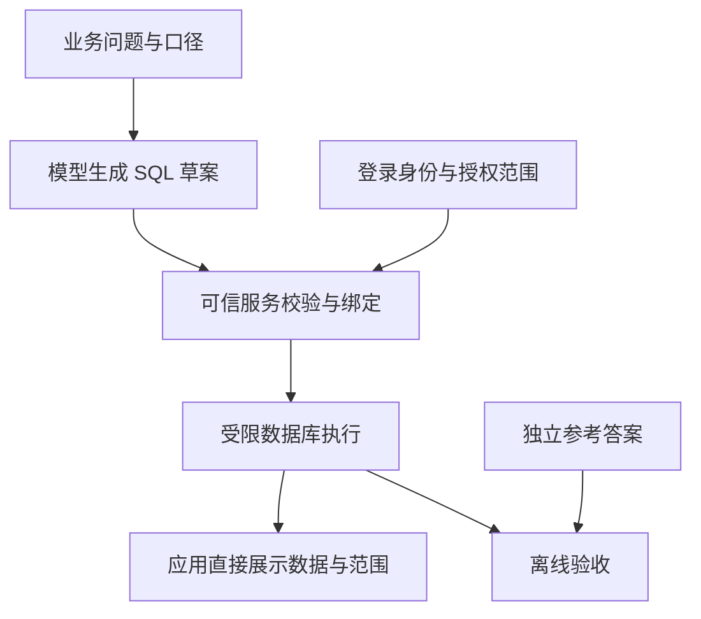

# 第二十二章：Text-to-SQL：从业务问题到可验证查询

## 22.1 订单统计不是多找几段文档

客服问“上周还有多少订单没完成”，如果系统只检索到几张订单，再让模型加总，遗漏的订单根本不会进入计算。问题不是模型算术差，而是输入没有覆盖统计范围。

[第三章](../02-ingestion-indexing/03-document-parsing.zh.md) §3.4 已经区分了定位表格与全表聚合；[第十六章](../04-advanced/16-graphrag.zh.md) §16.6 也提出，已有可靠关系表时可以直接查询，不必先抽成知识图谱。Text-to-SQL 接上这条路径：**模型把问题翻译成 SQL，数据库计算，应用交付结果。**

李博杰《深入理解 AI Agent》第五章的[“生成 SQL 查询”](https://github.com/bojieli/ai-agent-book/blob/985a49d35b9f50937f1f757cf25867672991ded7/book/chapter5.md)让模型生成查询，由应用执行和展示结果，而不是要求模型逐行搬运数据。配套 ERP 示例用 SQLite 员工、工资两表，单次模型调用生成查询，再与独立 Python 参考答案比较。

本章沿用这种分工，换成订单统计案例，不要求增加多轮 Agent。已有固定报表时，先让模型选择报表并填写经过校验的参数；只有用户确实需要新的组合查询，才开放 SQL 结构生成。

## 22.2 先请业务同事把“未完成”说清楚

> 下面用一个虚构的备件订单案例计算待发货数量。金额以人民币分表示，不含税费、运费与折扣。

运营小周请客服小林导出“9 月 1 日到 7 日未完成订单”。小林发现，已发货但未签收也可能叫“未完成”；财务还可能把它理解为“未结清”。工程师没有先写提示词，而是让他们确认这次要解决的是仓库待发货统计。

| 要确认的事 | 本次约定 |
|---|---|
| 未完成什么 | 未取消，且至少一条明细仍有未发数量；已发未签收不算欠发 |
| 数量和金额是什么 | 订单数按订单去重；件数是剩余未发件数；金额是剩余件数乘该行单价，不是整单合同额 |
| 哪段时间 | 筛选上海时间 2026-09-01 至 09-07 下单的订单，含首尾两天 |
| “截至”何时 | 采用上海时间 09-08 09:00 截止、只包含此前事件的固定快照 |
| 谁的订单 | 登录身份所属租户 T1，当前获准查看客户 C1、C2；本次请求不进一步缩小客户范围 |
| 怎么展示 | 按客户汇总，仅显示有欠发的客户，按客户编号升序 |

这里有两个时间条件：**下单窗口决定哪些订单入选，快照截止点决定这些订单当时发了多少。**只在今天的订单表加一个下单日期条件，不能还原上周的发货状态。

[FDE 订单异常助手](../../fde/01-foundations/01-forward-deployed-engineering.zh.md) §1.11.2 同样把“已发出”“客户已收到”“采购预计到仓库”分开。Text-to-SQL 不能把这些差别压成一个模糊的 `status != 'completed'`。

## 22.3 固定两张表，先看清一行代表什么

本章只使用 **SQLite 方言**。下列 DDL 是维护人员建立教学快照的步骤，不属于允许模型执行的查询。`orders` 每个租户内一单一行；`order_lines` 一单可有多行，发货量是截至快照的累计值。

```sql
PRAGMA foreign_keys = ON;
CREATE TABLE orders (
    tenant_id TEXT NOT NULL,
    order_id TEXT NOT NULL,
    customer_id TEXT NOT NULL,
    created_at TEXT NOT NULL,
    status TEXT NOT NULL CHECK (status IN ('open', 'shipped', 'cancelled')),
    total_amount_cents INTEGER NOT NULL CHECK (total_amount_cents >= 0),
    promised_at TEXT,
    PRIMARY KEY (tenant_id, order_id)
);
CREATE TABLE order_lines (
    tenant_id TEXT NOT NULL,
    order_id TEXT NOT NULL,
    line_id INTEGER NOT NULL,
    ordered_qty INTEGER NOT NULL CHECK (ordered_qty > 0),
    shipped_qty INTEGER NOT NULL CHECK (
        shipped_qty >= 0 AND shipped_qty <= ordered_qty
    ),
    unit_price_cents INTEGER NOT NULL CHECK (unit_price_cents >= 0),
    PRIMARY KEY (tenant_id, order_id, line_id),
    FOREIGN KEY (tenant_id, order_id) REFERENCES orders (tenant_id, order_id)
);
```

快照名为 `orders-20260908-shanghai-v1`，逻辑截止点是 `2026-09-08T01:00:00Z`。所有非空时间统一为固定宽度 UTC 文本 `YYYY-MM-DDTHH:MM:SSZ`，并在入库时校验；这里的文本比较才等价于时间比较。不要混入本地时间、不同偏移量或不一致的精度。

`orders` 共 8 行。为便于窄屏阅读，按同一个联合键分两张展示表；`T1/O101` 表示 `tenant_id=T1`、`order_id=O101`，不是数据库里新增的字段。

| 租户/订单 | 客户 | 状态 | 整单金额（分） |
|---|---|---|---|
| T1/O101 | C1 | open | 10000 |
| T1/O102 | C1 | open | 4000 |
| T1/O103 | C2 | cancelled | 6000 |
| T1/O104 | C2 | shipped | 4000 |
| T1/O105 | C2 | open | 3000 |
| T1/O106 | C2 | open | 4000 |
| T1/O107 | C3 | open | 8000 |
| T2/O101 | C1 | open | 50000 |

| 租户/订单 | 下单时间 `created_at` | 承诺时间 `promised_at` |
|---|---|---|
| T1/O101 | 2026-08-31T16:00:00Z | NULL |
| T1/O102 | 2026-09-03T02:00:00Z | 2026-09-10T04:00:00Z |
| T1/O103 | 2026-09-04T02:00:00Z | NULL |
| T1/O104 | 2026-09-05T02:00:00Z | NULL |
| T1/O105 | 2026-09-07T16:00:00Z | NULL |
| T1/O106 | 2026-09-06T02:00:00Z | NULL |
| T1/O107 | 2026-09-07T02:00:00Z | NULL |
| T2/O101 | 2026-09-02T02:00:00Z | NULL |

`order_lines` 共 9 行，键依次为租户、订单和 `line_id`。后三列分别对应 `ordered_qty`、`shipped_qty`、`unit_price_cents`：

| 租户/订单/行 | 订购件数 | 已发件数 | 单价（分） |
|---|---|---|---|
| T1/O101/1 | 10 | 4 | 500 |
| T1/O101/2 | 5 | 5 | 1000 |
| T1/O102/1 | 4 | 0 | 1000 |
| T1/O103/1 | 3 | 0 | 2000 |
| T1/O104/1 | 2 | 2 | 2000 |
| T1/O105/1 | 1 | 0 | 3000 |
| T1/O106/1 | 2 | 0 | 2000 |
| T1/O107/1 | 1 | 0 | 8000 |
| T2/O101/1 | 100 | 0 | 500 |

O105 在快照中已经存在，但恰好落在下单窗口的右端点，不进入本次统计。所有记录的状态和发货量均按快照截止前事件确定。实际回放历史时，应使用对应历史快照或事件重建，不能拿当前累计值冒充历史值。

`promised_at = NULL` 表示没有已确认的承诺日期，不是“今天交付”。`shipped_qty = 0` 才是已确认尚未发货；若源系统发货量缺失，应报告数据不完整，不能用 `COALESCE(shipped_qty, 0)` 把未知改成零。

这份快照假设每单至少一条明细、头表金额与行金额一致，取消只发生在整单，不处理退货或超发。主外键和 `CHECK` 不会自动验证所有跨行规则，发布快照前仍需核对；支持部分取消时，要增加取消数量及其生效时间，不能直接套用下面的减法。

还要核验存储类型：普通 SQLite 表的 `INTEGER` 是类型亲和性，不会仅凭列声明拒绝所有小数。这里假设维护程序已经验证件数、分金额与 ID 类型；需要数据库强制整数类型时，可增加 `typeof` 检查，或在 SQLite 3.37.0 及以上采用 `STRICT` 表。单行乘积与汇总值也应落在整数安全范围内，不能等溢出后再把浮点近似结果称为“精确到分”。

## 22.4 模型交的是查询草案，不是通行证

给模型的上下文应包含相关表与字段、联合主外键、一行的粒度、单位、状态含义、时间约定和返回列，而不是整个数据库的数据字典。表多时可检索 schema，但要补齐必要关联路径；检索漏表不能被解释成“数据库没有这项数据”。

模型输出含命名占位符的 SQL。可信服务端负责把已确认的日期转为 UTC，并根据当前登录身份绑定权限值：

| 绑定名 | 本次值 | 值从哪里来 |
|---|---|---|
| `tenant_id` | `T1` | 服务端会话 |
| `customer_a`、`customer_b` | `C1`、`C2` | 服务端授权结果；示例固定为两个客户 |
| `start_utc` | `2026-08-31T16:00:00Z` | 已确认的上海日期窗口 |
| `end_utc` | `2026-09-07T16:00:00Z` | 同一窗口的排他上界 |

“9 月 1 日至 7 日”转成 `[开始, 结束)`，避免拼一个会漏掉小数秒的 `23:59:59`。这里由服务端处理上海时区，SQL 不依赖 SQLite `now` 或机器的本地时区；换到有夏令时的地区，也应按当地日历计算两端，不能一律加固定小时数。

权限客户较多时，用受控关系或服务端构造的绑定参数集合，不拼接模型返回的客户列表。用户可以申请缩小范围，但不能通过一句“查所有租户”扩大服务端授予的范围。



[Tools 第三章](../../tools/01-function-calling/03-tool-schema-design.zh.md) §3.2.3 提醒过：“只支持 SELECT”的描述不能代替只读凭据、对象权限和查询限制。上游 [`agent.py`](https://github.com/bojieli/ai-agent-book/blob/985a49d35b9f50937f1f757cf25867672991ded7/chapter5/erp-agent/agent.py#L31-L87)也在提示词里限定 SELECT，但 [`demo.py`](https://github.com/bojieli/ai-agent-book/blob/985a49d35b9f50937f1f757cf25867672991ded7/chapter5/erp-agent/demo.py#L119-L165)直接调用 `cur.execute(sql)`；不能把这种执行方式当作已落实数据库只读权限。

## 22.5 一条完整查询，先按订单汇总

下面是确认业务口径后的查询草案。它先把明细折回“一单一行”，再统计客户。过滤条件用于说明查询语义，**即使条件遗漏，也必须由执行层阻止越权**，不能靠模型总能写对它们。

```sql
WITH per_order AS (
    SELECT
        o.tenant_id,
        o.order_id,
        o.customer_id,
        SUM(l.ordered_qty - l.shipped_qty) AS remaining_qty,
        SUM((l.ordered_qty - l.shipped_qty) * l.unit_price_cents)
            AS remaining_amount_cents
    FROM orders AS o
    JOIN order_lines AS l
      ON l.tenant_id = o.tenant_id AND l.order_id = o.order_id
    WHERE o.tenant_id = :tenant_id
      AND o.customer_id IN (:customer_a, :customer_b)
      AND o.created_at >= :start_utc
      AND o.created_at < :end_utc
      AND o.status != 'cancelled'
    GROUP BY o.tenant_id, o.order_id, o.customer_id
)
SELECT
    customer_id,
    COUNT(*) AS pending_orders,
    SUM(remaining_qty) AS remaining_qty,
    SUM(remaining_amount_cents) AS remaining_amount_cents
FROM per_order
WHERE remaining_qty > 0
GROUP BY customer_id
ORDER BY customer_id;
```

O101 第一行剩 6 件、3000 分，第二行全部发完；O102 剩 4 件、4000 分。因此 C1 有 2 单、10 件、7000 分。C2 只有 O106 的 2 件、4000 分；取消单、全发单和右端点订单不计入。C3 不在授权客户集合，T2 的同号订单也不参与关联。

确切结果如下，应用显示金额时可将分转换为元，不改动底层整数：

| 客户 | 欠发订单数 | 未发件数 | 未发金额（分） |
|---|---|---|---|
| C1 | 2 | 10 | 7000 |
| C2 | 1 | 2 | 4000 |

小林第一次看草案时发现，直接关联后 `COUNT(*)` 会把 O101 算成两单；`SUM(o.total_amount_cents)` 也会把它的 10000 分算两遍。

`SUM(DISTINCT 金额)` 不是通用补救办法：如果把 O102 与 O106 跨客户放进同一组汇总合同额，两单恰好都是 4000 分，去重金额会把 8000 分变成 4000 分。两单属于不同客户，因此上面的按客户分组查询不会在它们之间发生这种去重；聚合中的 `DISTINCT` 只在各组内部去重。要为本题覆盖这一回归场景，应另加入同一客户两笔不同订单未发货金额相等的用例。应该先确认粒度，而不是看数字偏大就加 `DISTINCT`。

本次只显示有欠发的客户，所以无欠发客户没有结果行。若要列出所有授权客户，包括欠发为零的客户，应从授权客户集合出发左连接聚合结果，再按业务定义补零。[SQLite 的 `SUM`](https://www.sqlite.org/lang_aggfunc.html) 在没有非空输入时返回 `NULL`；空结果、未知数据和零不能混成一种含义。

## 22.6 放行之前，执行服务还要拦住什么

只读不等于可以随便读，SELECT 也不天然没有副作用。SQLite 可注册应用自定义函数；函数若能写文件或访问网络，出现在 SELECT 中仍可能产生副作用，参见[官方函数安全说明](https://www.sqlite.org/appfunc.html#security_implications)。

| 层次 | 应落实的限制 | 不能误以为 |
|---|---|---|
| 身份与数据范围 | 可信服务端注入身份，每次校验租户、客户、列权限；缓存同样按权限隔离 | 绑定了 `tenant_id` 就能阻止模型删掉整个 WHERE |
| 数据库访问 | 服务型数据库用只读角色、受限视图或行级策略，并禁止绕过它们访问基表 | SQL 解析器可以替代数据库授权 |
| SQL 结构 | 用匹配 SQLite 方言的解析器检查整棵语法树，仅允许单条已批准的 SELECT/CTE，限定对象、列、函数与子查询 | 正则搜到 SELECT 就安全，或只检查最外层即可 |
| 危险能力 | 拒绝 DDL、DML、多语句、ATTACH、非批准 PRAGMA、扩展加载及未批准函数；连接不注册有外部副作用的函数 | 参数化会保护任意生成的 SQL 结构 |
| 执行资源 | 准备与执行都有总截止时间，限制 SQL 长度、表达式复杂度、内存、并发及结果大小 | 最后加 LIMIT 就不会扫描或排序大量数据 |

参数化只隔离**绑定值**与 SQL 语法；表名、排序表达式和整个查询结构仍需验证。不要把未经校验的查询塞进 `executescript`，也不要失败后改用高权限连接重试。

SQLite 没有服务型数据库那样的内置用户角色和行级授权。本案例若用于开放查询，可以由可信服务先生成只含本次授权客户及必要列的一致快照，在隔离进程中用 [`mode=ro`](https://www.sqlite.org/uri.html) 打开，配合文件权限、禁止附加库、函数限制和 [authorizer](https://www.sqlite.org/c3ref/set_authorizer.html) 拒绝未批准操作。authorizer 检查操作与对象，不会自动按租户逐行过滤；只读打开共享多租户文件也不构成租户隔离。

教学数据保留越权记录，是为了验收筛选和关联错误，不代表应把全租户库交给模型查询进程。授权快照有复制成本和新鲜度代价；数据量大、要求实时或权限频繁变化时，优先采用成熟数据访问服务或固定模板，不要临时拼一个“通用 SQL 沙箱”。

执行前可用 [`EXPLAIN QUERY PLAN`](https://www.sqlite.org/eqp.html) 看联合键是否被使用、是否出现大表扫描或临时排序；对真实数据规模再评估索引，如按租户、客户和下单时间组织索引。小表扫描未必有问题，执行计划也不是运行时间或费用的保证，且其文本格式不是稳定接口。

执行期间使用进度回调或中断机制落实截止时间，另设结果行数、字节数与并发预算；SQLite 没有云仓库式扫描费用上限，不能把本地演示耗时换算成生产费用承诺。[SQLite 安全指南](https://www.sqlite.org/security.html)给出了限制与中断接口。超时要返回“未完成”，截断要标明“不完整”，不能把部分结果称为完整统计。

## 22.7 验收结果，不验收 SQL 长得像不像

工程师用 Python 标准库 `sqlite3` 把上面的两表数据与查询执行一遍，再让另一段不使用 SQL 的计算按订单遍历明细、排除取消与范围外订单、累加剩余量和金额，得到同样的 `C1: (2, 10, 7000)`、`C2: (1, 2, 4000)`。参考逻辑根据业务约定编写，不让同一次模型生成同时充当出题人和裁判。

这样的校验验证的是固定快照上的查询结果，不是某个模型的生成准确率，也没有证明权限隔离已经实现。上游 [`demo.py` 的比较流程](https://github.com/bojieli/ai-agent-book/blob/985a49d35b9f50937f1f757cf25867672991ded7/chapter5/erp-agent/demo.py#L40-L165)也区分数据库执行和 Python 参考答案，但具体容差、排序规则要按本业务重新规定。

| 验收项 | 本例怎么比较 |
|---|---|
| 等价查询 | CTE、子查询或其他等价写法都可接受，不比较 SQL 字符串 |
| 行与重复 | 未声明顺序时按多重集比较，不能用集合悄悄去掉重复行；只有确认唯一性后才可按行集合比较 |
| 排序 | 本题要求客户编号升序，因此还要比较行顺序；排名题要约定并列规则 |
| 数值 | 件数和人民币分用整数精确比较，并限制范围避免溢出；浮点指标单独约定绝对或相对容差 |
| 空与错误 | 合法空结果是成功且零行；超时、权限拒绝、语法错误、源数据缺失分别记录，不能都返回空表 |
| 时间一致性 | SQL 与参考计算读取同一快照，不能各自读取不断变化的业务库 |

一份小数据可能让错误 SQL 碰巧答对。回归时应加入“相同订单号跨租户”“同租户不同权限客户”“两单金额相同”“多明细订单”“部分发货”“取消但仍有剩余量”“恰好在日期两端”的数据；还应单独测空结果和缺失字段。权限测试要故意删除范围条件、请求基表或禁止函数，确认执行服务拒绝或只能返回授权数据，而不只是模型遵守了提示。

报告指标时分开看：**执行成功率**是查询能否在规则和预算内完成；**执行正确率**是结果是否匹配参考答案；**业务正确率**还要确认问题口径、授权范围、时间版本和最终说明都正确。一次合法查询可能精准地算错问题，前两项再高也不能替代业务验收。提示词改动、schema 升级和模型替换都要重跑同一任务集，并保留各类失败。

## 22.8 最终交付的是数据，加上它能说明什么

小周看到的界面不必先经过模型复述：应用直接展示结果表，并注明下单窗口、上海时区、快照截止点、授权客户范围、金额单位和是否完整；保留查询标识，方便回查 SQL、绑定参数和 schema 版本。日志仍按数据权限保存，避免把客户信息泄露到调试系统。

本次表格说明“这些订单截至该快照尚有多少未发”，不说明“客户尚未收到多少”，更不能推出“明天能全部交付”。如果还要解释拆单政策，再检索适用文档；如果要生成自然语言总结，只把必要结果与证据交给模型，并重新核对数字、单位和承诺日期。模型可以不看结果行，这不是功能缺失，而是减少抄写错误和数据暴露的一种选择。

面试中解释这套设计，关键不是背出一条复杂 SQL，而是说清楚：谁确定口径，哪个键决定关联，权限在哪里强制生效，以及用什么独立证据确认答案。固定报表能解决的问题，不应为了展示 Agent 而开放任意查询。

## 参考资料

- 李博杰，《深入理解 AI Agent》[第五章：代码作为交互接口与生成 SQL 查询](https://github.com/bojieli/ai-agent-book/blob/985a49d35b9f50937f1f757cf25867672991ded7/book/chapter5.md)。本章借鉴查询生成与执行的分工，业务、数据、SQL 与图为重新设计。
- 同一固定提交的 ERP 示例：[README](https://github.com/bojieli/ai-agent-book/blob/985a49d35b9f50937f1f757cf25867672991ded7/chapter5/erp-agent/README.md)、[agent.py](https://github.com/bojieli/ai-agent-book/blob/985a49d35b9f50937f1f757cf25867672991ded7/chapter5/erp-agent/agent.py)、[demo.py](https://github.com/bojieli/ai-agent-book/blob/985a49d35b9f50937f1f757cf25867672991ded7/chapter5/erp-agent/demo.py)。书中实验描述使用 PostgreSQL，配套运行示例使用 SQLite；这里核读源码，不运行上游程序，不引用其通过率为本章实验结论或客户收益。
- SQLite 官方：[聚合函数](https://www.sqlite.org/lang_aggfunc.html)、[URI 只读模式](https://www.sqlite.org/uri.html)、[授权回调](https://www.sqlite.org/c3ref/set_authorizer.html)、[不可信 SQL 的安全措施](https://www.sqlite.org/security.html)、[应用函数安全](https://www.sqlite.org/appfunc.html#security_implications)、[执行计划](https://www.sqlite.org/eqp.html)。
- SQLite 官方：[类型亲和性](https://www.sqlite.org/datatype3.html)、[STRICT 表及版本要求](https://www.sqlite.org/stricttables.html)。

资料查阅于 2026-09-14，2026-09-15 复核固定提交与 SQLite 类型、聚合及执行限制。
