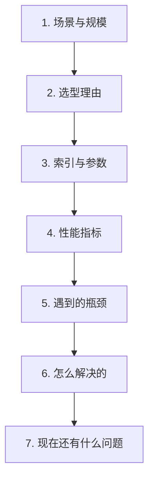

# 第九章：向量库生产实践与性能调优

## 9.1 这类问题考什么

「你们线上向量库是怎么用的」这类问题，考的不是你会不会用某个产品，而是**你有没有真的把它跑在生产环境里**。

区分「用过」和「跑过生产」的标志只有一个：**你能不能说出具体数字。**

数据量、维度、索引参数、P50/P99 延迟、QPS、内存占用、遇到的瓶颈和怎么解决的——**没有数字的回答，听起来就是照着文档念的。**

本章给出一套完整的叙述框架和参考量级。**请用你自己项目的真实数字替换，不要背这里的数字。**

## 9.2 一个可复用的叙述框架

**第 5、6、7 步是这道题真正的分水岭。** 前四步任何人看文档都能编，只有讲清楚踩过什么坑、怎么定位、怎么解决，才能证明是真做过。

## 9.3 容量规划：先把账算清楚

上线前必须能回答「这套系统要多少内存」。

### 9.3.1 向量本身的内存

以 150 万条、1024 维、float32 为例：

$$
1{,}500{,}000 \times 1024 \times 4\ \text{Bytes} \approx 6.1\ \text{GB}
$$

### 9.3.2 索引结构的额外开销

HNSW 的图结构本身也要占内存，量级大致是**每个节点存 M 个邻居 ID**：

$$
1{,}500{,}000 \times 32 \times 2 \times 8\ \text{Bytes} \approx 0.77\ \text{GB}
$$

（式中 32 为 `M`，乘 2 是因为底层通常有约 2M 个连接，8 字节为一个节点 ID 的大致占用。）

### 9.3.3 还要算上

- **原文存储**：chunk 文本本身，通常比向量小得多，但如果做了上下文增强会变大；
- **元数据与过滤索引**；
- **重建索引时的峰值内存**：**这一项最容易被漏掉**——重建期间新旧索引可能同时存在，内存需求接近翻倍。

> **一条实用经验：按算出来的结果乘以 1.5 到 2 倍来准备内存。** 差额来自索引开销、碎片、峰值和增长空间。

## 9.4 参数怎么调

### 9.4.1 调参的正确顺序

**先定召回率目标，再调延迟；不要反过来。**

原因是：召回率是**效果的下限**（漏了就是漏了，后面所有环节都救不回来），而延迟是可以通过扩容、缓存等手段缓解的。

流程：

1. 用 FLAT（精确搜索）跑一遍评测集，得到**召回率的天花板**和 Top-K 的**标准答案**；
2. 建 ANN 索引，调 `ef_search` / `nprobe`，找到**达到目标召回率的最小值**；
3. 在这个配置下测延迟和吞吐；
4. 如果延迟不达标，再考虑量化、分片、加机器。

**第 1 步经常被跳过，但它是唯一能让你知道「ANN 到底漏了多少」的方法。**

### 9.4.2 关键参数的调节方向

| 参数 | 调大 | 调小 |
|---|---|---|
| `ef_search`（HNSW） | 召回↑ 延迟↑ | 召回↓ 延迟↓ |
| `nprobe`（IVF） | 召回↑ 延迟↑ | 召回↓ 延迟↓ |
| `M`（HNSW） | 召回↑ 内存↑ 建库慢 | 反之 |
| `ef_construction` | 索引质量↑ 建库慢 | 反之 |

**注意 `M` 和 `ef_construction` 是建索引时确定的，改动需要重建；只有 `ef_search` / `nprobe` 可以在线调整。**

这意味着：**`ef_search` 是你在生产环境里唯一的实时旋钮**，可以用它做降级——流量高峰时调小换取延迟，平峰时调大换取召回。

## 9.5 延迟：把预算拆开看

**整条 RAG 链路的延迟不是由向量检索主导的。** 参考量级：

| 环节 | 典型耗时 |
|---|---|
| Query 向量化 | 10–50 ms |
| 向量检索（HNSW，百万级） | 1–10 ms |
| 关键词检索（BM25） | 5–50 ms |
| Rerank（cross-encoder，top-100） | **100–400 ms** |
| LLM 首 Token | **300 ms–2 s** |
| **端到端 P95** | **800 ms–3 s** |

**两个重要结论：**

1. **向量检索通常不是瓶颈。** 花大力气把检索从 10ms 优化到 5ms，对用户毫无感知；
2. **真正的大头是 Rerank 和 LLM 生成。** 优化延迟应该从这两处入手——减少 Rerank 候选数、用流式输出让首 Token 尽快返回。

> **同理，成本结构也由 LLM 生成主导，向量检索的成本占比通常不到 1%。** 讨论 RAG 降本时盯着向量库省钱，方向是错的。

## 9.6 常见瓶颈与解决思路

### 9.6.1 内存不够

| 手段 | 效果 | 代价 |
|---|---|---|
| Scalar int8 量化 | 内存降至约 1/4 | 召回掉 2%–3% |
| 换 DiskANN 类索引 | 内存大幅下降 | 延迟上升 |
| 降低向量维度（MRL 截断） | 按比例下降 | 轻微掉点 |
| 分片到多机 | 线性扩展 | 架构复杂度上升 |

### 9.6.2 写入影响查询性能

批量写入会挤占 CPU 和内存带宽，导致查询延迟抖动。

**解决思路**：

- **错峰**：把全量重建放到业务低峰期；
- **批量而非逐条**：逐条写入的开销远高于批量；
- **读写分离**：写入新索引，构建完成后原子切换（**代价是需要双份内存**）。

### 9.6.3 P99 延迟毛刺

P50 正常但 P99 很高，常见原因：

- **GC 停顿**（JVM 系的向量库）；
- **索引后台合并/重建**；
- **冷数据从磁盘加载**；
- **少数超长 Query** 导致向量化耗时异常。

**定位方法**：把端到端延迟按环节打点，看毛刺出现在哪一段——**不分段打点就无法定位**。

### 9.6.4 召回率突然下降

这是最难排查的一类，常见原因按排查顺序：

1. **Embedding 模型版本变了**（API 静默升级，见第七章 7.4.2）；
2. **新写入的数据没有建索引**（增量数据在 flat 缓冲区里）；
3. **软删除累积过多**，有效候选被大量过滤掉；
4. **过滤条件的选择性变高**，触发了第八章 8.4 节的陷阱。

**这四条应该做成固定的排查清单**，因为症状完全一样（"最近搜不准了"），原因却截然不同。

## 9.7 必须建立的监控

| 类别 | 指标 |
|---|---|
| 性能 | P50/P95/P99 检索延迟、QPS、错误率 |
| 容量 | 向量总数、内存使用率、磁盘使用率、软删除比例 |
| 质量 | **固定评测集上的 Hit@K 定期回归** |
| 数据 | 增量写入量、索引滞后时间、解析失败率 |

**「质量」这一行是最容易被漏掉、也最重要的一行。**

性能指标正常不代表效果正常。**检索质量的退化是静默的**——延迟、错误率、内存都看不出任何异常，只有跑一遍固定评测集才能发现。

建议：**每天定时用同一套评测集跑一遍，把 Hit@K 曲线画出来。** 这是唯一能在用户投诉之前发现质量退化的手段。

## 9.8 常见错误

### 9.8.1 只讲用了什么产品，没有数字

规模、参数、延迟、QPS 一个都说不出，等于没做过。

### 9.8.2 不讲遇到的问题

没有踩过坑的系统不存在。只讲顺利部分反而显得不真实。

### 9.8.3 先调延迟后看召回

召回是效果下限，必须先定住。

### 9.8.4 不跑 FLAT 基线

不知道 ANN 到底漏了多少，就无法判断参数是否合理。

### 9.8.5 忽略重建索引的峰值内存

新旧索引共存时内存接近翻倍，是典型的上线事故来源。

### 9.8.6 优化方向错误

盯着占几毫秒的向量检索优化，而不是占几百毫秒的 Rerank 和 LLM 生成。

### 9.8.7 只监控性能不监控质量

质量退化是静默的，必须靠定期回归评测才能发现。

## 9.9 本章总结

1. **这类问题考的是有没有真的跑过生产，标志是能不能说出具体数字**；
2. **叙述框架**：场景规模 → 选型理由 → 索引参数 → 性能指标 → 瓶颈 → 解决 → 遗留问题；后三步是分水岭；
3. **容量规划**要算向量、索引结构、原文、元数据和**重建时的峰值**，最后乘 1.5–2 倍冗余；
4. **调参顺序：先定召回率目标，再调延迟**；必须先跑 FLAT 拿到基线；
5. **`ef_search` / `nprobe` 是生产环境唯一的实时旋钮**，可用于流量高峰降级；
6. **向量检索不是延迟和成本的瓶颈**，Rerank 和 LLM 生成才是；
7. **常见瓶颈**：内存不足（量化/DiskANN/降维/分片）、写入影响查询（错峰/批量/读写分离）、P99 毛刺（分段打点定位）、召回下降（四条固定排查清单）；
8. **监控必须包含质量回归**，因为效果退化是静默的。

一句话概括：

> **向量库的生产实践，本质上是在内存预算、召回目标和延迟目标这三个约束里找一个可持续运行的配置，并且能在它退化时及时发现。**

## 参考资料

- [Efficient and robust approximate nearest neighbor search using Hierarchical Navigable Small World graphs](https://arxiv.org/abs/1603.09320)
- [FreshDiskANN: A Fast and Accurate Graph-Based ANN Index for Streaming Similarity Search](https://arxiv.org/abs/2105.09613)
- [Matryoshka Representation Learning](https://arxiv.org/abs/2205.13147)
- [Searching for Best Practices in Retrieval-Augmented Generation](https://arxiv.org/abs/2407.01219)
