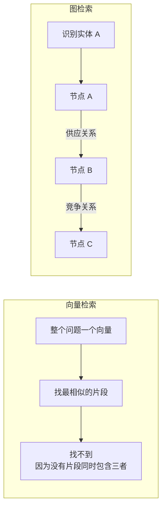
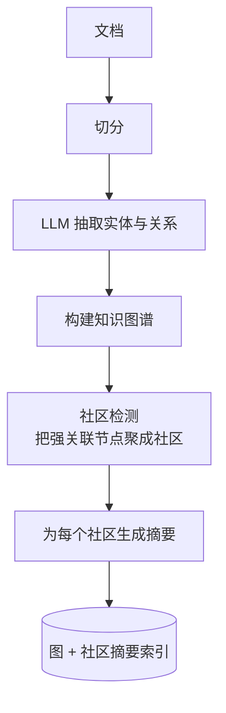
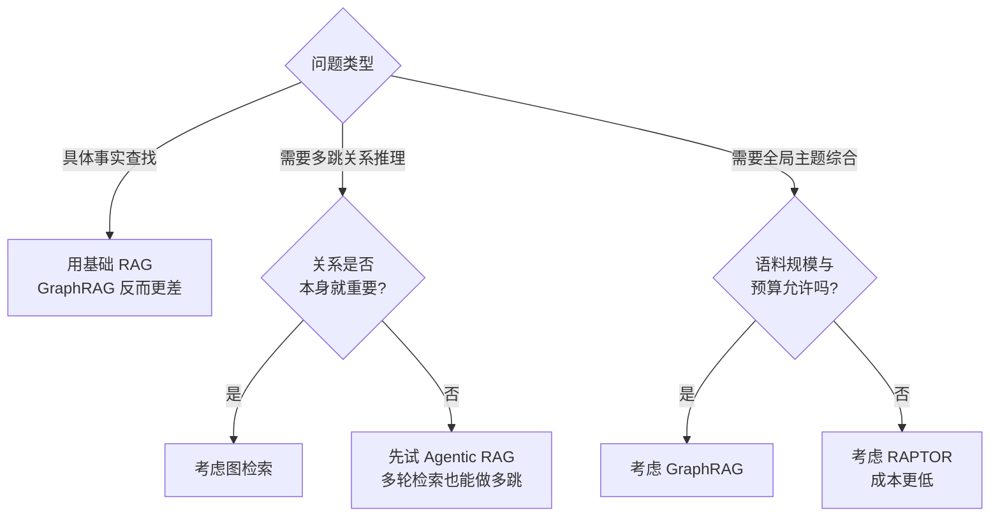

# 第十六章：GraphRAG 与图检索

## 16.1 向量检索的结构性局限

先看一个具体的失败案例。

**问题**：「A 公司的最大供应商的主要竞争对手是谁？」

这个问题需要三步：

1. 查出 A 公司的最大供应商是 B 公司；
2. 查出 B 公司的主要竞争对手是 C 公司；
3. 回答 C。

**向量检索为什么做不到**：它把整个 Query 编码成一个向量，去找**最相似的片段**。但知识库里根本不存在一个同时提到 A、B、C 三者关系的片段——这个信息是**分散在两个文档里的**。

> **向量检索本质上是「单跳」的：给一个查询，返回最相似的内容。它没有「实体」和「关系」的概念，因此无法沿着关系链条走下去。**

**这是结构性的缺陷，不是调参能解决的。** 加大 Top-K、换更好的 Embedding 模型、加 Rerank——都没用，因为要找的信息压根不在任何单个片段里。

**第二类向量检索做不到的问题**：全局性、主题性的问题。

「这一千份客户反馈的主要抱怨集中在哪几类？」——这需要**综合整个语料**，而不是找出最相关的几个片段。

## 16.2 GraphRAG 的思路

**核心是把非结构化文本转成结构化的知识图谱，再在图上做检索。**

### 16.2.1 构建阶段

关键在于**社区摘要**这一步：把图划分成若干个紧密关联的子图（社区），为每个社区生成一段摘要。**这些摘要就是回答全局性问题的素材。**

### 16.2.2 检索阶段

| 检索模式 | 做法 | 适合 |
|---|---|---|
| **局部检索** | 定位问题涉及的实体节点，沿关系边扩展邻居，收集相关文本 | 具体实体的多跳问题 |
| **全局检索** | 用社区摘要作为素材，逐层汇总回答 | 主题性、全局性问题 |

**局部检索的典型流程**是「**向量定位入口 + 图遍历接力**」：先用向量检索找到问题涉及的实体节点，再沿着关系边走 1–3 跳收集关联信息。

**这个混合思路很重要**：向量负责「从文本世界跳进图世界」，图负责「在结构化世界里走关系」。

## 16.3 必须诚实说明的代价

**这是这道题的关键分水岭。** 只讲 GraphRAG 的优点，说明没有真正评估过它。

### 16.3.1 事实查找上它反而更差

微软的原始研究和官方文档都明确指出：

> **在具体的事实查找类问题上，GraphRAG 的表现劣于基础 RAG。**

原因不难理解：事实查找只需要找到那一个包含答案的片段，而图检索绕了一大圈的实体和关系，反而引入了噪音。

**微软官方文档自己的建议**：基础 RAG 够用的场景，就用基础检索。

### 16.3.2 索引成本很高

构建阶段需要**对每个 chunk 调用 LLM 抽取实体和关系**，再对每个社区生成摘要。

参考量级：**百万 Token 规模的语料，索引成本在几十到几百美元**，且随语料规模线性增长。

**对比一下**：普通向量索引的成本是几美分。**这是两三个数量级的差距。**

### 16.3.3 更新极其困难

新增一份文档，可能改变实体之间的关系，进而改变社区划分，进而使**大量社区摘要失效**。

原始的 GraphRAG 方案基本上**需要重建**。后续的一些改进方案（如 LightRAG）专门针对这一点做了增量更新支持，**在动态语料上更实用**。

### 16.3.4 抽取质量决定一切

实体和关系是**用 LLM 抽出来的**，这意味着：

- **实体消歧问题**：「张三」「张总」「张经理」可能是同一个人，也可能不是；
- **关系抽取错误**会被固化进图里，且**比文本错误更难发现**——文本错了还能人工看出来，图里的一条错误的边是隐形的；
- **抽取的一致性差**：同样的关系在不同文档里可能被抽成不同的关系类型。

> **图的质量上限，等于 LLM 抽取的质量上限。** 而这一层通常没有任何校验。

## 16.4 相关方案对比

| 方案 | 特点 | 适合 |
|---|---|---|
| **GraphRAG**（微软） | 社区检测 + 分层摘要，全局问题能力强 | 主题分析、全局综合 |
| **LightRAG** | 更轻量，**支持增量更新** | 语料频繁变化的场景 |
| **HippoRAG** | 借鉴海马体索引理论，用个性化 PageRank 做图遍历 | **多跳问答** |
| **PathRAG** | 关注图上的关键路径，减少冗余信息 | 路径推理类问题 |

**面试时能说出「原始 GraphRAG 更新困难，LightRAG 专门解决了这个问题」，是有实际调研过的标志。**

## 16.5 什么时候值得用

**值得用的信号**：

- 领域**本身就是关系密集的**：组织架构、供应链、知识产权、金融关联、代码依赖；
- 大量真实问题是**多跳的**；
- 需要**全局主题分析**，且预算允许；
- 语料**相对稳定**，更新不频繁。

**不值得用的信号**：

- 问题以事实查找为主；
- 语料**高频更新**；
- 预算敏感；
- 基础 RAG 还没调好。

**一个重要的替代方案**：**多跳问题也可以用 Agentic RAG 做**——让 Agent 分多轮检索，第一轮查出 B，第二轮查 B 的竞争对手。

| 对比 | GraphRAG | Agentic 多轮检索 |
|---|---|---|
| 索引成本 | **很高** | 与普通 RAG 相同 |
| 查询成本 | 中 | **高**（多轮 LLM 调用） |
| 更新成本 | **很高** | 与普通 RAG 相同 |
| 全局问题能力 | **强** | 弱 |
| 多跳能力 | 强 | 强 |

> **结论：如果只需要多跳，Agentic RAG 通常更划算（成本转移到查询侧，且没有索引和更新负担）；只有在需要全局主题综合时，GraphRAG 的社区摘要才有不可替代的价值。**

## 16.6 一个务实的中间方案

不一定非要上完整的知识图谱。**很多多跳需求可以用更轻的手段满足**：

- **在元数据里存实体标签**，检索时按实体做过滤和关联；
- **建立文档之间的显式引用关系**（「本条参见第 X 条」），检索时自动带出被引用内容；
- **对结构化程度高的部分单独建关系表**，用 SQL 查询，与向量检索结果合并。

**这类方案的成本远低于完整 GraphRAG，却能覆盖相当一部分需求。** 提到这一点通常是加分项，因为它体现了成本意识。

## 16.7 常见错误

### 16.7.1 只讲 GraphRAG 的优点

不提事实查找上更差、索引成本高、更新困难，说明没实际评估过。

### 16.7.2 说不清向量检索为什么做不到多跳

核心是「没有实体和关系概念，只能单跳找相似」。这是本章最重要的论点。

### 16.7.3 忽略抽取质量的风险

图里的错误边是隐形的，比文本错误更难发现。

### 16.7.4 不知道 GraphRAG 更新困难

这在动态语料场景里是决定性的劣势。

### 16.7.5 认为 GraphRAG 是通用升级

它是针对特定问题类型的方案，在事实查找上是降级。

### 16.7.6 不知道多跳还有更便宜的做法

Agentic 多轮检索、元数据实体关联都能覆盖部分需求。

## 16.8 本章总结

1. **向量检索是单跳的**：没有实体和关系概念，无法沿关系链条走——这是**结构性缺陷，调参无解**；
2. **两类做不到的问题**：多跳关系推理、全局主题综合；
3. **GraphRAG 的思路**：LLM 抽取实体关系构图 → 社区检测 → 社区摘要；检索分**局部**（向量定位 + 图遍历）和**全局**（社区摘要汇总）；
4. **必须说明的四个代价**：事实查找上**劣于**基础 RAG、索引成本高两三个数量级、更新几乎要重建、抽取质量决定上限且错误隐形；
5. **相关方案**：LightRAG 支持增量更新，HippoRAG 专长多跳，PathRAG 关注关键路径；
6. **只需要多跳时，Agentic RAG 通常更划算**；**只有需要全局综合时**，社区摘要才不可替代；
7. **务实的中间方案**：元数据实体标签、显式引用关系、结构化部分单独建表。

一句话概括：

> **GraphRAG 不是基础 RAG 的升级版，而是针对「关系推理」和「全局综合」这两类问题的专用方案——用错了地方，它比基础 RAG 更差还更贵。**

## 参考资料

- [From Local to Global: A Graph RAG Approach to Query-Focused Summarization](https://arxiv.org/abs/2404.16130)
- [Microsoft GraphRAG 官方文档](https://microsoft.github.io/graphrag/)
- [LightRAG: Simple and Fast Retrieval-Augmented Generation](https://arxiv.org/abs/2410.05779)
- [HippoRAG: Neurobiologically Inspired Long-Term Memory for Large Language Models](https://arxiv.org/abs/2405.14831)
- [PathRAG: Pruning Graph-based Retrieval Augmented Generation with Relational Paths](https://arxiv.org/abs/2502.14902)
- [Agentic Retrieval-Augmented Generation: A Survey on Agentic RAG](https://arxiv.org/abs/2501.09136)
