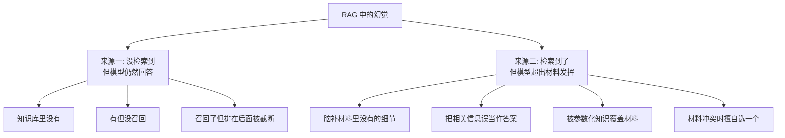
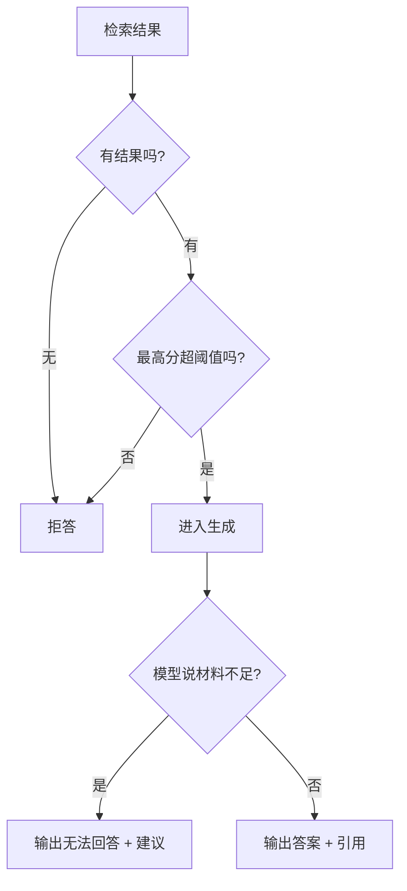

# 第十七章：生成、Grounding 与幻觉规避

## 17.1 一句必须记住的话

> **治幻觉，先治检索。**

这是这道题的核心判断。生成层的所有技巧，都建立在「检索到了正确材料」这个前提之上。**如果材料本身就是错的或缺失的，任何 Prompt 技巧都无法拯救。**

但反过来也成立：**检索完美，模型仍可能出错。** 所以两层都要做。

## 17.2 幻觉的两个来源

**这两个来源需要完全不同的治法**——分不清就会把力气用错地方。

| 来源 | 主要治法 |
|---|---|
| 没检索到 | **检索优化 + 拒答机制** |
| 超出材料发挥 | **Prompt 约束 + 引用 + 事后校验** |

### 17.2.1 一个特别需要注意的子类：参数化知识覆盖

模型自己的训练知识和检索到的材料**冲突**时，它可能会**相信自己而不是材料**。

典型场景：企业内部规定与通用常识不同（比如公司规定的报销上限与行业惯例不同）。模型可能输出"常见的"数字而不是材料里的数字。

**这类幻觉最危险**，因为答案看起来完全合理，且与材料的差异很隐蔽。

**治法**：在 Prompt 里显式声明「**材料中的信息优先于你的已有知识，两者冲突时以材料为准**」。

## 17.3 第一道防线：拒答

**这是最便宜、最有效、也最常被忽略的手段。**

**核心思想**：**根本不给模型编造的机会。**

如果检索结果为空，或者 Rerank 最高分低于阈值，就直接返回「未找到相关信息」，**不进入生成环节**（第十三章 13.4.3）。

**这里有一个必须承认的权衡**：

> **拒答率和幻觉率是此消彼长的。** 阈值调高，幻觉少了但拒答多了；阈值调低，覆盖率高了但幻觉也多了。

**这个阈值应该由业务场景决定**：

| 场景 | 倾向 |
|---|---|
| 医疗、法律、财务 | **宁可拒答**，错误代价极高 |
| 内部知识助手 | 平衡 |
| 创意辅助、头脑风暴 | 可以宽松 |

**能主动说出这个权衡，比只说"要拒答"深一层。**

## 17.4 第二道防线：Prompt 约束

一个可用的约束框架包含四条：

**（1）限定信息来源**

明确要求只依据给定材料回答，不使用材料之外的知识。

**（2）声明材料优先级**

材料中的信息优先于模型自身知识，冲突时以材料为准。

**（3）提供不知道的出口**

**这条最关键**：必须明确告诉模型「材料不足时可以说不知道」，并说明这是**被期望的行为而非失败**。

> **没有这个出口，模型会倾向于硬答**——因为它的训练目标就是生成有用的回复。给它一条合法的退路，它才会用。

**（4）要求标注来源**

每个结论后标注依据的材料编号。

**（5）处理材料冲突**

材料之间矛盾时，**说明存在冲突并列出各方说法**，而不是擅自选一个。

**第五条经常被漏掉**，但知识库里存在新旧版本、不同部门口径不一致，是非常常见的情况。

### 17.4.1 上下文的组织方式也影响幻觉

- **给每个片段编号**，才能做引用；
- **标注来源、章节、日期**，让模型知道时效和权威性；
- **把最相关的放开头和结尾**（第二章 2.4.2）；
- **控制总量**，无关材料会主动损害质量（第二章 2.6）；
- **去除新旧版本冲突**（第十三章 13.6）。

## 17.5 第三道防线：引用与可验证性

**引用的价值不只是"看起来专业"，而是把「相信模型」变成「可以核查」。**

但这里有一个**必须知道的陷阱**：

> **模型会编造引用编号。** 它可能标注 `[3]`，而实际内容来自 `[1]`，甚至压根不在任何材料里。

**所以引用必须校验**，至少做两级：

| 级别 | 做法 | 成本 |
|---|---|---|
| 基础 | 检查引用编号是否真实存在于材料列表中 | 几乎为零 |
| 进阶 | 检查被引材料是否**真的支撑**该结论 | 一次额外模型调用 |

**没有校验的引用，比没有引用更危险**——因为它给了用户虚假的可信感。

## 17.6 第四道防线：事后校验

生成完之后，用一次额外的调用检查答案的每个陈述是否被材料支撑。

**成本**：一次额外的 LLM 调用，延迟增加。

**适合**：高风险场景，或者作为**离线的质量抽查**而非在线的每次校验。

**一个务实的做法**：在线只做基础的引用有效性检查（几乎零成本），把昂贵的忠实度校验放到离线**抽样跑**，用来监控质量趋势。

## 17.7 四种防线的对比

| 防线 | 治哪个来源 | 成本 | 效果 | 优先级 |
|---|---|---|---|---|
| 检索优化 | 没检索到 | 中 | **高** | **1** |
| 拒答机制 | 没检索到 | **极低** | **高** | **2** |
| Prompt 约束 | 超出发挥 | **极低** | 中到高 | **3** |
| 引用有效性校验 | 超出发挥 | 极低 | 中 | 4 |
| 忠实度校验 | 超出发挥 | **高** | 高 | 5（可离线） |

**注意前三条的成本都很低。** 很多团队跳过它们直接上复杂的校验方案，是典型的次序错误。

## 17.8 一个重要的概念澄清

**「有依据」不等于「正确」。**

- 材料本身就是错的（知识库里存了过期或错误的文档）→ **答案忠实于材料，但事实上是错的**；
- 材料是对的，模型也忠实引用了 → 答案正确。

> **所有生成层的手段，保证的都是「答案忠实于材料」，而不是「答案事实正确」。** 事实正确性取决于知识库本身的质量。

**这个区分在第十八章讲评估指标时会再次出现**——Faithfulness 指标衡量的是前者，不是后者。**混淆两者是评估环节最常见的误解。**

**推论**：知识库的内容治理（去除过期文档、标注版本、定期审核）**是幻觉治理的一部分**，而且是最上游的一部分。

## 17.9 常见错误

### 17.9.1 只讲 Prompt 技巧不讲检索

「治幻觉先治检索」是这道题的核心判断。只谈生成层说明没抓住重点。

### 17.9.2 不区分幻觉的两个来源

两个来源需要完全不同的治法。

### 17.9.3 忽略拒答机制

最便宜最有效的手段，且是防"没检索到还硬答"的唯一根治办法。

### 17.9.4 不提拒答率与幻觉率的权衡

说明没有在真实场景里调过阈值。

### 17.9.5 Prompt 里不给"不知道"的出口

模型会倾向于硬答。给它合法退路是关键设计。

### 17.9.6 相信模型标注的引用

模型会编引用编号，必须校验。

### 17.9.7 不处理材料冲突

新旧版本共存很常见，不约束会导致模型擅自选一个。

### 17.9.8 混淆"忠实于材料"和"事实正确"

生成层只能保证前者，后者取决于知识库质量。

### 17.9.9 承诺 RAG 能消除幻觉

只能降低。检索失败、材料错误、模型超发挥三条路径都还在。

## 17.10 本章总结

1. **治幻觉先治检索**——生成层的技巧都建立在材料正确的前提上；
2. **幻觉两个来源**：没检索到还回答、检索到了但超出材料发挥；**治法完全不同**；
3. **参数化知识覆盖材料**是最隐蔽的一类，需在 Prompt 中显式声明材料优先；
4. **第一道防线是拒答**：检索为空或分数低于阈值就不进入生成，**成本极低效果极好**；
5. **拒答率与幻觉率此消彼长**，阈值应由业务风险等级决定；
6. **Prompt 约束五要素**：限定来源、材料优先、**给"不知道"的出口**、要求标注来源、处理冲突；
7. **引用必须校验**——模型会编引用编号，未校验的引用比没有引用更危险；
8. **忠实度校验成本高**，可在线只做基础校验、离线抽样做深度校验；
9. **「有依据」不等于「正确」**：生成层只能保证忠实于材料，事实正确性取决于知识库治理。

一句话概括：

> **RAG 防幻觉的顺序是：先让正确材料被检索到，再让模型只能依据材料回答，最后让每句话都能被核查——三步都做到，仍然只是降低而非消除。**

## 参考资料

- [Astute RAG: Overcoming Imperfect Retrieval Augmentation and Knowledge Conflicts for Large Language Models](https://arxiv.org/abs/2410.07176)
- [Making Retrieval-Augmented Language Models Robust to Irrelevant Context](https://arxiv.org/abs/2310.01558)
- [RAGAS: Automated Evaluation of Retrieval Augmented Generation](https://arxiv.org/abs/2309.15217)
- [Corrective Retrieval Augmented Generation](https://arxiv.org/abs/2401.15884)
- [Searching for Best Practices in Retrieval-Augmented Generation](https://arxiv.org/abs/2407.01219)
