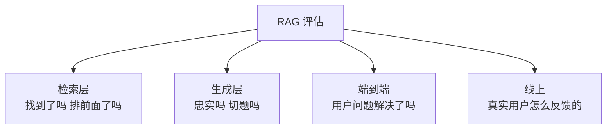
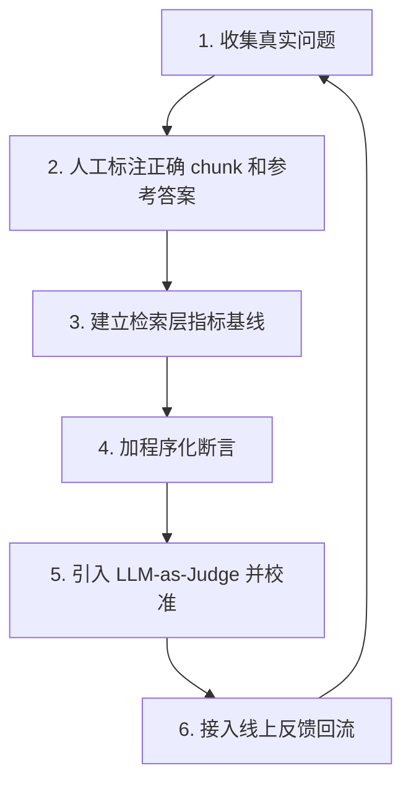

# 第十八章：RAG 评估体系

## 18.1 为什么必须分层评估

RAG 是一条多环节的流水线。**最终答案不好，可能是任何一个环节出了问题。**

如果只看一个端到端的总分，你能知道"效果差"，但不知道**差在哪**。而分层指标能直接告诉你问题落在第十四章框架的哪一层。

> **只测端到端 = 知道病了但不知道病因；只测检索 = 知道零件合格但不知道整机能不能跑。两个都要。**

## 18.2 检索层指标

前提：需要一个**标注了每个 Query 对应哪些 chunk 是正确依据**的评测集。

| 指标 | 衡量什么 | 什么时候用 |
|---|---|---|
| **Hit@K** | Top-K 里**是否至少有一个**正确 chunk | 最常用的核心指标 |
| **Recall@K** | Top-K 里覆盖了**多少比例**的正确 chunk | 答案需要多个片段综合时 |
| **MRR** | 第一个正确结果的排名倒数的平均 | 衡量**排序质量** |
| **NDCG@K** | 考虑相关性等级和位置的综合排序质量 | 相关性分多档时 |
| **Precision@K** | Top-K 里正确的比例 | 关注噪音比例时 |

### 18.2.1 怎么用这些指标定位问题

**这才是重点，而不是背定义。**

| 现象 | 诊断 | 对应的层 |
|---|---|---|
| Hit@50 低 | **根本没召回**，可能是索引或召回路问题 | 索引层 / 召回层 |
| Hit@50 高但 Hit@5 低 | 召回到了但**排序不好** | 重排层 |
| Hit@5 高但答案差 | 检索没问题，**生成层有问题** | 生成层 |
| Recall@K 低但 Hit@K 高 | 找到了一部分依据，**但不完整** | 索引层（粒度）/ 召回层（K 太小） |

**这张表本身就是一个诊断工具**，比任何单个指标的定义都有用。

## 18.3 生成层指标

RAGAS 这类框架提供了几个常用的无参考答案指标：

| 指标 | 衡量什么 |
|---|---|
| **Faithfulness（忠实度）** | 答案中的每个陈述是否**能从检索材料中推出** |
| **Answer Relevancy（答案相关性）** | 答案是否**切题**（不跑题、不答非所问） |
| **Context Precision（上下文精确率）** | 检索到的材料中，**相关的是否排在前面** |
| **Context Recall（上下文召回率）** | 回答所需的信息**是否都被检索到了** |

### 18.3.1 必须知道的四条局限

**只会说"用 RAGAS"是浅层回答，能说出局限才说明真用过。**

**（1）Faithfulness 不等于事实正确性**

**这是最重要的一条**（与第十七章 17.8 呼应）：

> **Faithfulness 衡量的是「答案忠实于材料」，不是「答案事实正确」。** 材料本身错了，忠实度依然满分。

**（2）Faithfulness 可以被"我不知道"刷满**

模型回答「材料中没有相关信息」时，这个陈述完全忠实于材料，**忠实度得分很高**。

**推论：Faithfulness 必须与 Answer Relevancy 一起看**，否则一个只会拒答的系统能拿到很好的忠实度分数。

**（3）LLM-as-Judge 的循环性问题**

用 LLM 评估 LLM 的输出，存在**同源偏见**：评判模型可能偏好与自己风格相似的回答，也可能与被评模型犯同样的错误。

**缓解**：用与生成模型**不同**的模型做评判；用人工标注的子集**校准**评判模型的一致性。

**（4）无参考答案带来的噪声**

Context Recall 等指标在没有标准答案时依赖 LLM 推断，**方差较大**。

**结论**：**这些指标适合看趋势和做相对比较，不适合当作绝对分数。** 「Faithfulness 从 0.82 涨到 0.85」这种说法要谨慎。

## 18.4 端到端评估

最终还是要回答「用户的问题解决了吗」。

| 方式 | 说明 | 成本 | 可靠性 |
|---|---|---|---|
| **人工评分** | 专家按维度打分 | 高 | **最高** |
| **LLM-as-Judge** | 模型对照参考答案打分 | 中 | 中（**需校准**） |
| **程序化断言** | 检查答案是否包含关键事实 | 低 | 高（**但覆盖窄**） |
| **AB 测试** | 线上对比两个版本 | 中 | **最贴近真实** |

**推荐组合**：**程序化断言做主体**（快速、确定性、可回归），**LLM-as-Judge 做补充**（覆盖开放性问题），**定期人工抽查做校准**（验证前两者的可信度）。

**LLM-as-Judge 必须校准**：用一批人工标注的样本，检查评判模型的打分与人工的一致性。**没校准过的 Judge 分数没有意义。**

## 18.5 评测集怎么建

**这是整个评估体系里最花时间、也最有价值的部分。**

### 18.5.1 分三档

| 类型 | 规模 | 频率 | 用途 |
|---|---|---|---|
| **Smoke** | 10–30 条 | 每次改动 | 快速验证没有明显退化 |
| **Regression** | 100–300 条 | 每次发版 | 防止已修复的问题复发 |
| **Full** | 500+ 条 | 定期 / 大改动 | 全面评估 |

### 18.5.2 必须覆盖的问题类型

- **简单事实查找**；
- **同义表述**（用户的说法与文档不同）；
- **专业术语与型号**（测 BM25 那一路）；
- **多跳/复合问题**；
- **需要综合多个片段的问题**；
- **时效性问题**（新旧版本共存时能否给出最新的）；
- **知识库里没有答案的问题**（**测拒答能力**）；
- **诱导性问题**（前提本身是错的，看模型是否会顺着编）。

**最后两类最容易被漏掉，但它们是检验系统可信度的关键。**

### 18.5.3 数据来源

**优先级从高到低**：

1. **真实的线上用户问题**——最有代表性；
2. **业务专家出题**——覆盖重要但低频的场景；
3. **LLM 生成**——补充规模，但**必须人工审核**。

**关于 LLM 生成的评测集有个陷阱**：直接让 LLM 读一个 chunk 然后出题，生成的问题会**过度贴合该 chunk 的措辞**，导致检索"虚假地容易"。**必须人工改写成用户真实会问的样子。**

## 18.6 公开基准的价值与局限

| 基准 | 特点 |
|---|---|
| TREC RAG | 学术界的标准化评测，方法论严谨 |
| CRAG Benchmark | 覆盖多领域、多类型问题，含动态变化的答案；**注意与 Corrective RAG 区分** |
| 各类领域 QA 数据集 | 特定领域的参考 |

**公开基准的作用是横向比较方法，而不是预测你的系统在你的数据上的表现。**

**一个值得记住的参考点**：在 CRAG Benchmark 这类贴近真实的评测上，**即使是当时最好的系统，准确率也只在 50% 上下**。这说明 RAG 远未被解决——**知道这个数字，能避免对 RAG 能力的过度承诺**。

## 18.7 线上指标

离线评测跑得再好，也要看真实用户的反馈。

| 指标 | 说明 |
|---|---|
| **点踩率 / 点赞率** | 最直接的用户满意度信号 |
| **转人工率** | 客服场景的核心指标 |
| **追问率** | 用户需要追问，说明首次回答不完整 |
| **引用点击率** | 用户是否在核查来源（信任度的反向信号） |
| **拒答率** | 需要与幻觉率一起看（第十七章 17.3） |
| **P95 延迟 / 成本** | 体验与经济性 |

**点踩数据的最大价值不是统计比例，而是作为评测集的来源**——把点踩的 Query 收集起来人工分析，是最高质量的问题发现渠道。

## 18.8 建立评估的正确顺序

**注意这是一个闭环**：线上反馈会不断补充评测集，评测集又指导下一轮优化。

## 18.9 常见错误

### 18.9.1 只看端到端不分层

知道效果差，不知道差在哪。

### 18.9.2 把 Faithfulness 当作事实正确性

它衡量的是忠实于材料，材料错了也能满分。这是最常见的误解。

### 18.9.3 只看 Faithfulness 不看 Answer Relevancy

一个只会拒答的系统忠实度很高。

### 18.9.4 LLM-as-Judge 不做校准

未校准的评判分数没有可信度。

### 18.9.5 用生成模型自己做评判

存在同源偏见，应该换一个模型。

### 18.9.6 评测集不含"无答案"问题

无法检验拒答能力，而拒答是防幻觉的第一道防线。

### 18.9.7 LLM 生成评测集不做人工改写

问题过度贴合 chunk 措辞，检索指标虚高。

### 18.9.8 把 RAGAS 分数当绝对值报告

这类指标方差大，适合看趋势和相对比较。

### 18.9.9 只有离线评测没有线上回流

线上点踩数据是最高质量的问题来源。

## 18.10 本章总结

1. **必须分层评估**：检索层、生成层、端到端、线上——只看总分无法定位问题；
2. **检索层指标**（Hit@K、Recall@K、MRR、NDCG）的价值在于**组合起来做诊断**：Hit@50 低 = 召回问题，Hit@50 高但 Hit@5 低 = 排序问题，Hit@5 高但答案差 = 生成问题；
3. **RAGAS 四指标**：Faithfulness、Answer Relevancy、Context Precision、Context Recall；
4. **四条局限**：忠实度≠正确性、可被拒答刷满、LLM-as-Judge 有同源偏见、无参考答案导致方差大；**适合看趋势不适合当绝对分**；
5. **端到端推荐组合**：程序化断言为主 + LLM-as-Judge 补充 + 人工抽查校准；
6. **评测集分三档**（Smoke / Regression / Full），**必须包含无答案问题和诱导性问题**；
7. **LLM 生成的题目必须人工改写**，否则检索指标虚高；
8. **公开基准用于横向比较**；真实场景基准上最优系统也只有 50% 上下的准确率；
9. **线上点踩数据是最高价值的评测集来源**，评估应该形成闭环。

一句话概括：

> **评估的目的不是给系统打个分，而是每次改动之后能明确回答「变好了还是变差了，以及是哪一层变的」。**

## 参考资料

- [Ragas: Automated Evaluation of Retrieval Augmented Generation](https://arxiv.org/abs/2309.15217)
- [Evaluation of Retrieval-Augmented Generation: A Survey](https://arxiv.org/abs/2405.07437)
- [CRAG - Comprehensive RAG Benchmark](https://arxiv.org/abs/2406.04744)
- [TREC RAG Track](https://trec-rag.github.io/)
- [Fact, Fetch, and Reason: A Unified Evaluation of Retrieval-Augmented Generation](https://arxiv.org/abs/2409.12941)
