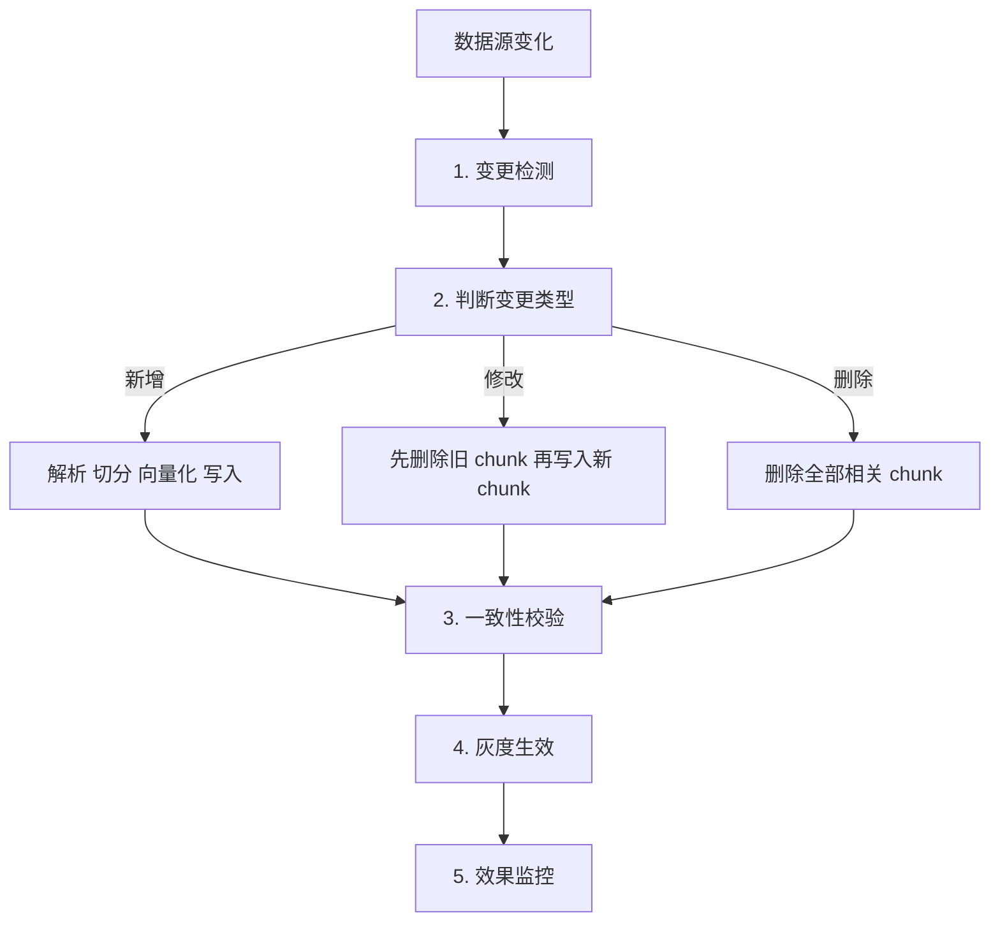
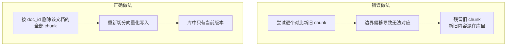
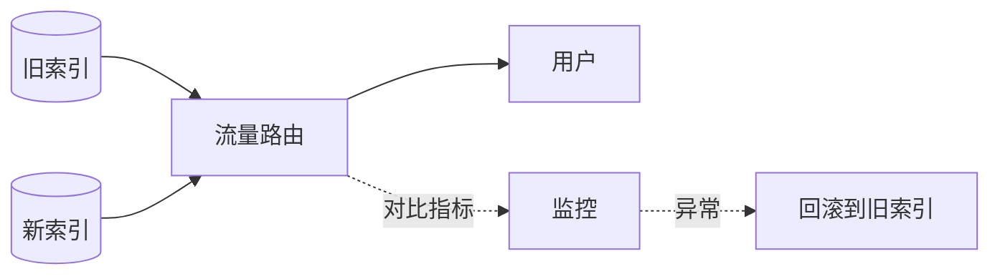

# 第十九章：知识库的动态更新与增量索引

## 19.1 为什么这道题能区分做过和没做过

Demo 阶段的知识库是一次性建好的。**但真实系统里，文档每天都在变。**

而 RAG 的更新有一个别的系统没有的特殊约束：

> **文档改一个字，它的 chunk 边界可能整体偏移，导致后面所有 chunk 的内容都变了。**

这意味着**你无法像改数据库记录那样"局部更新一条"**。理解这一点，是回答这道题的起点。

## 19.2 完整的更新链路

## 19.3 第一步：变更检测

| 方式 | 做法 | 优点 | 缺点 |
|---|---|---|---|
| **轮询 + 内容哈希** | 定期扫描，对比文档内容的哈希值 | 实现简单、不依赖数据源改造 | 有延迟、大规模时扫描开销大 |
| **事件驱动** | 数据源变化时发消息（Webhook / 消息队列） | **实时、无扫描开销** | 需要数据源支持、需维护中间件 |
| 混合 | 事件驱动为主，定期全量对账兜底 | **可靠** | 复杂度最高 |

**为什么用内容哈希而不是修改时间**：很多系统的"修改时间"会因为元数据变动、重新保存、格式转换而更新，**内容其实没变**。用内容哈希能避免大量无谓的重建。

**混合方案的必要性**：事件驱动会丢消息（服务重启、网络故障、数据源没发出事件）。**定期全量对账是唯一能发现"漏了什么"的手段**——建议至少每天跑一次哈希对账。

## 19.4 第二步：为什么必须"先删后增"

**这是本章最核心的技术点。**

假设一份文档原本切成 10 个 chunk。现在在文档开头插入一段话，重新切分后：

- chunk 数量可能变成 11 个；
- **原来的 chunk 2 到 10 的内容全部偏移了**；
- 无法建立新旧 chunk 之间的一一对应关系。

**残留旧 chunk 的后果非常严重**：新旧版本同时被召回，模型面对矛盾材料（第十三章 13.6、第十七章 17.4）。而且这种问题**极难排查**——检索指标看起来正常，只是偶尔给出过时的答案。

### 19.4.1 这要求 ID 设计支持批量删除

**必须能通过文档 ID 一次性找到并删除它的所有 chunk。**

推荐的元数据设计：

| 字段 | 用途 |
|---|---|
| `doc_id` | **文档唯一标识，删除时的依据** |
| `chunk_id` | chunk 唯一标识，通常是 `doc_id + 序号` |
| `content_hash` | 变更检测 |
| `version` / `updated_at` | 时效判断、灰度控制 |
| `source_path` / `page` | 引用溯源 |
| `acl_tags` / `tenant_id` | 权限过滤 |

**`doc_id` 必须建索引**，否则删除操作会退化成全表扫描。

**这个设计必须在建库时就做好**——第三章 3.6.1 强调的「元数据事后补等于全量重建」，在这里体现得最直接。

## 19.5 第三步：删除的两个技术陷阱

### 19.5.1 HNSW 没有真正的删除

如第八章 8.2.1 所述，HNSW 图结构被破坏后难以修复，工程上普遍采用**软删除 + 定期重建**。

这带来两个必须处理的问题：

**（1）软删除会累积。** 被标记删除的向量仍占内存、仍参与图遍历、仍消耗 `ef` 预算，但会在结果中被过滤掉。**累积到一定比例后，实际召回率会显著下降**（第九章 9.6.4 的排查项之一）。

**应对**：**监控软删除比例**，超过阈值（比如 20%）触发重建。

**（2）重建期间的可用性。** 全量重建可能耗时数小时。做法是**构建新索引 → 校验 → 原子切换**，代价是**期间需要双份内存**（第九章 9.3.3）。

### 19.5.2 合规删除的特殊要求

用户要求删除个人数据、或文档因合规原因必须移除时，**软删除不够——数据仍然物理存在**。

需要额外的流程：

- 记录删除请求，**确保在下次重建后数据真正消失**；
- 或使用支持真删除的索引结构（如 DiskANN 系）；
- **检查关联位置**：原文存储、缓存、日志、备份里的副本。

**最后一条最容易被忽略**：向量删了，但缓存里还有、日志里还记着原文——这在合规审计中是不合格的。

## 19.6 第四步：一致性校验

更新完成后必须验证：

| 检查项 | 方法 |
|---|---|
| chunk 数量是否合理 | 与文档长度的比值是否在正常范围 |
| 是否有残留旧版本 | 按 `doc_id` 查询，检查 `version` 是否唯一 |
| 向量是否写入成功 | 抽样查询能否命中新内容 |
| 索引是否已生效 | 新写入的数据是否已进入 ANN 索引 |

**最后一条容易被忽略**：很多向量库的新写入数据会先进入一个未建索引的缓冲区，**要等到达到阈值或手动触发才合并进主索引**。这段时间内，新数据可能检索不到，或者走的是低效路径。

**这是第九章 9.6.4「召回率突然下降」排查清单里的第 2 条。**

## 19.7 第五步：灰度与回滚

大批量更新（换 Embedding 模型、改切分策略、导入新语料）**必须灰度**。

**做法**：新旧索引并存，先切小比例流量，对比检索指标和线上反馈，确认无退化后再全量切换，**并保留旧索引一段时间以便回滚**。

**代价是双份存储**，但相比"全量切换后发现效果退化却回不去"，这个代价是值得的。

**必须监控的对比指标**：固定评测集的 Hit@K、线上点踩率、拒答率、P95 延迟。

## 19.8 权限隔离与多租户

**这是学术界几乎没有覆盖、但企业场景绕不开的一块。**

### 19.8.1 三种实现方式

| 方式 | 做法 | 优点 | 缺点 |
|---|---|---|---|
| **元数据过滤** | 每个 chunk 带权限标签，检索时按标签过滤 | 实现简单、单索引 | **踩第八章 8.4 的过滤陷阱** |
| **分区/分索引** | 每个租户或权限域独立索引 | **彻底隔离、无过滤陷阱** | 索引数量多、管理成本高 |
| 后过滤 | 检索后再按权限过滤 | 实现最简单 | **高选择性时结果可能为空**；且有信息泄漏风险 |

**推荐**：**租户级隔离用分索引，租户内的细粒度权限用元数据过滤。**

### 19.8.2 三个必须注意的点

**（1）后过滤有信息泄漏风险。** 如果先检索再过滤，被过滤掉的结果虽然没返回，但**"有结果被过滤"这个事实本身可能泄漏信息**（比如返回结果数、延迟差异）。高敏感场景应使用预过滤或分索引。

**（2）权限变更要能即时生效。** 用户被移出某个部门后，应立即无法检索到该部门的文档。**如果权限标签是写死在 chunk 元数据里的，权限变更就需要更新大量 chunk**——更好的做法是**存资源标识，在查询时映射到当前的权限**。

**（3）缓存必须带权限维度。** 检索结果缓存如果不区分用户权限，**会导致 A 用户的缓存被 B 用户命中**——这是严重的越权漏洞。

## 19.9 时效性处理

同一份文档的新旧版本共存，或者知识本身有时效性时：

- **在元数据里记录生效时间和失效时间**，检索时过滤掉已失效的；
- **同等相关性时按时间加权**，优先返回新的；
- **在上下文中标注每个片段的日期**，让模型知道时效（第十章 10.3.7）；
- **定期清理过期内容**——这属于知识库治理，是幻觉治理的最上游（第十七章 17.8）。

## 19.10 常见错误

### 19.10.1 尝试局部更新 chunk

chunk 边界会偏移，无法建立新旧对应关系。**必须先删后增。**

### 19.10.2 没有 doc_id 或 doc_id 未建索引

无法批量删除，或删除操作退化成全表扫描。

### 19.10.3 用修改时间而非内容哈希检测变更

会触发大量无谓的重建。

### 19.10.4 只用事件驱动不做对账

事件会丢，必须有定期全量哈希对账兜底。

### 19.10.5 忽略软删除的累积

累积过多会导致召回率静默下降。

### 19.10.6 认为软删除满足合规要求

数据仍物理存在，且缓存、日志、备份里还有副本。

### 19.10.7 不检查索引是否已生效

新写入数据可能还在未建索引的缓冲区里。

### 19.10.8 大批量更新不灰度

发现退化时已经无法回滚。

### 19.10.9 权限缓存不带用户维度

会造成越权访问，是严重的安全漏洞。

### 19.10.10 权限标签写死在 chunk 里

权限变更需要更新大量 chunk，无法即时生效。

## 19.11 本章总结

1. **RAG 更新的特殊约束**：文档改动会导致 chunk 边界整体偏移，**无法局部更新**；
2. **完整链路**：变更检测 → 分类处理 → 一致性校验 → 灰度生效 → 效果监控；
3. **变更检测用内容哈希而非修改时间**；事件驱动为主 + **定期全量对账兜底**；
4. **修改必须"先删后增"**，残留旧 chunk 会导致新旧版本冲突，且极难排查；
5. **ID 与元数据设计要在建库时做好**：`doc_id`（建索引）、`chunk_id`、`content_hash`、`version`、`acl_tags`；
6. **HNSW 无真删除**：软删累积会静默降低召回，需监控比例并定期重建；**软删不满足合规删除要求**；
7. **必须检查索引是否已生效**，新数据可能还在未建索引的缓冲区；
8. **大批量更新必须灰度**，新旧索引并存、小流量对比、保留回滚能力；
9. **权限隔离**：租户级用分索引，细粒度用元数据过滤；**注意后过滤的泄漏风险、权限变更的即时性、缓存必须带权限维度**。

一句话概括：

> **RAG 知识库的更新不是"改几条数据"，而是"以文档为单位的原子替换"——而这个约束会一路传导到 ID 设计、索引选型、权限方案和发布流程。**

## 参考资料

- [FreshDiskANN: A Fast and Accurate Graph-Based ANN Index for Streaming Similarity Search](https://arxiv.org/abs/2105.09613)
- [Efficient and robust approximate nearest neighbor search using Hierarchical Navigable Small World graphs](https://arxiv.org/abs/1603.09320)
- [ACORN: Performant and Predicate-Agnostic Search Over Vector Embeddings and Structured Data](https://arxiv.org/abs/2403.04871)
- [LightRAG: Simple and Fast Retrieval-Augmented Generation](https://arxiv.org/abs/2410.05779)
- [Retrieval-Augmented Generation for Large Language Models: A Survey](https://arxiv.org/abs/2312.10997)
