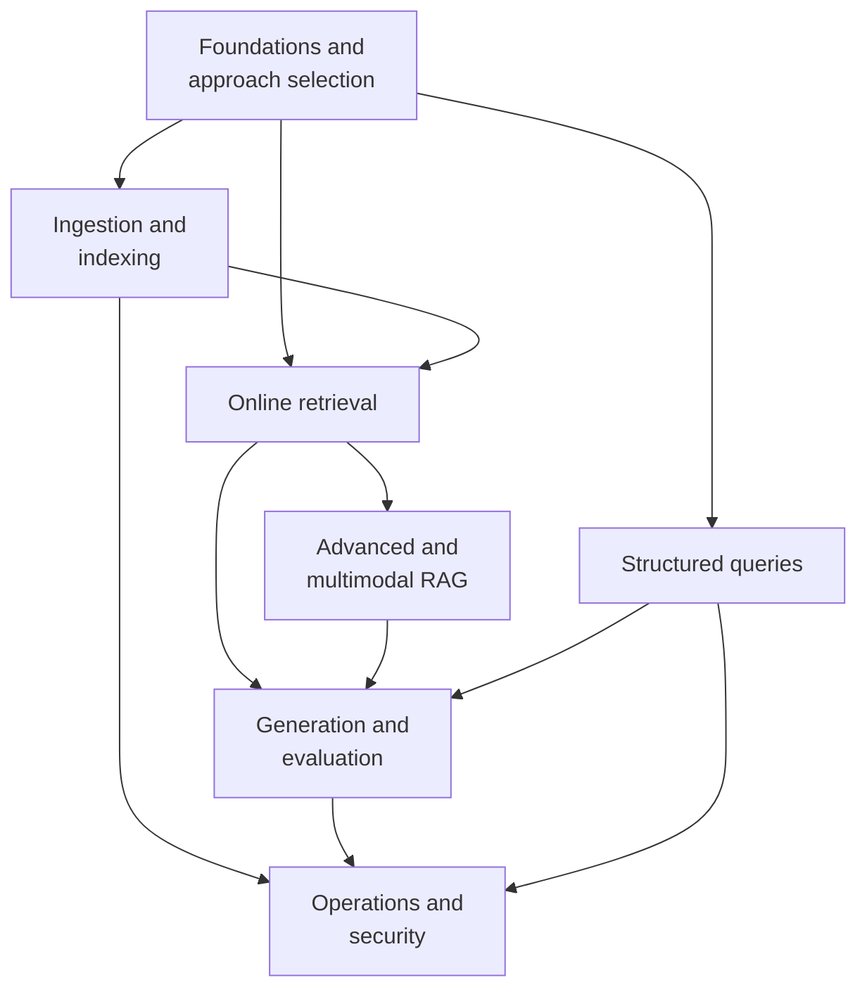

# Retrieval-Augmented Generation

This topic addresses application architecture. It starts with the tradeoffs of keeping knowledge outside the model, then covers ingestion and indexing, online retrieval, advanced and multimodal approaches, generation and evaluation, and ongoing updates and security.

Retrieving a few relevant passages is not enough when a question requires counting every eligible order or calculating a total amount. The structured queries module uses a Text-to-SQL case to explain this complementary approach without conflating database computation with vector retrieval.

## Modules

1. [Foundations and approach selection (Chapters 1–2)](01-foundations/README.md)
2. [Ingestion and indexing (Chapters 3–9)](02-ingestion-indexing/README.md)
3. [Online retrieval (Chapters 10–14)](03-retrieval/README.md)
4. [Advanced and multimodal RAG (Chapters 15–16, 21)](04-advanced/README.md)
5. [Generation and evaluation (Chapters 17–18)](05-generation-evaluation/README.md)
6. [Operations and security (Chapters 19–20)](06-operations-security/README.md)
7. [Structured queries (Chapter 22)](07-structured-queries/README.md)

## How the modules fit together

## Suggested reading paths

- **A quick overview**: foundations and approach selection → online retrieval → generation and evaluation.
- **Knowledge-base engineering**: ingestion and indexing → online retrieval → operations and security.
- **Improving answer quality**: online retrieval → generation and evaluation.
- **Complex source material**: ingestion and indexing → advanced and multimodal RAG → generation and evaluation.
- **Questions about business statistics**: foundations and approach selection → structured queries → generation and evaluation.

## Frequently asked questions

### Can RAG eliminate LLM hallucinations?

No. RAG can supply verifiable external evidence, but retrieval may miss relevant material or return the wrong content, and the model may ignore or misinterpret the evidence. Production systems still need citations, abstention, output validation, and end-to-end evaluation.

### How should you choose between RAG, fine-tuning, and long context?

Consider RAG when you need to select evidence from large or continually changing collections, and fine-tuning when you need a lasting change in model behavior. Long context is a useful baseline when the material fits within a manageable input and the task depends on seeing it as a whole. Long-context systems can also include citations and enforce authorization before constructing the input. Compare evidence quality and the costs of updates and caching rather than treating these approaches as mutually exclusive.

### Do smaller chunks always improve retrieval?

Not necessarily. Smaller chunks can locate evidence more precisely but may lose context. Larger chunks retain more context but may also introduce noise and consume more tokens. Evaluate chunk size and overlap under the same context budget, taking document structure, question granularity, and reranking capabilities into account.

Back to the [documentation topics](../README.md).
