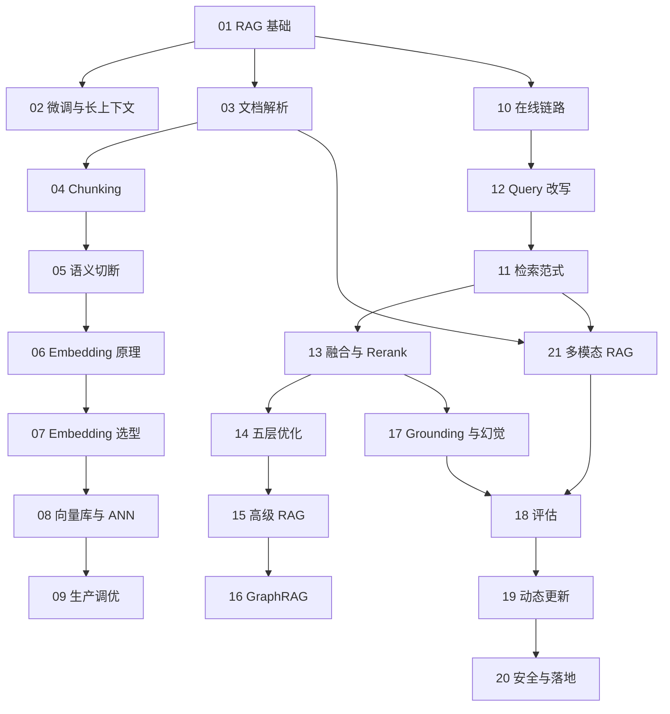

# RAG 相关知识点

本目录系统梳理 Retrieval-Augmented Generation 的完整工程链路，从知识为什么要外置，一路讲到检索优化、评估体系、增量更新与安全。

## 目录

1. [RAG 是什么，解决什么问题](01-what-is-rag.md)
2. [RAG、微调与长上下文的三方取舍](02-rag-finetune-longcontext.md)
3. [文档解析与预处理](03-document-parsing.md)
4. [Chunking 策略与粒度选择](04-chunking-strategy.md)
5. [语义被切断怎么办](05-semantic-truncation.md)
6. [Embedding 原理与技术演进](06-embedding-principles.md)
7. [Embedding 模型选型与评估](07-embedding-selection.md)
8. [向量数据库与 ANN 索引](08-vector-database.md)
9. [向量库生产实践与性能调优](09-vectordb-production.md)
10. [RAG 在线链路全流程](10-online-pipeline.md)
11. [检索范式：稀疏、稠密与后期交互](11-retrieval-paradigms.md)
12. [Query 理解与改写](12-query-rewriting.md)
13. [多路召回、RRF 融合与 Rerank](13-hybrid-retrieval-rerank.md)
14. [RAG 优化的五层框架](14-retrieval-optimization.md)
15. [高级 RAG 范式](15-advanced-rag-paradigms.md)
16. [GraphRAG 与图检索](16-graphrag.md)
17. [生成、Grounding 与幻觉规避](17-generation-hallucination.md)
18. [RAG 评估体系](18-rag-evaluation.md)
19. [知识库的动态更新与增量索引](19-dynamic-update.md)
20. [RAG 落地难点与安全](20-rag-challenges-security.md)
21. [多模态 RAG](21-multimodal-rag.md)

## 知识图谱

## 阅读建议

- **入门路线**：第 1、2、10 章先建立全局认知，再按需深入具体环节；
- **工程落地路线**：第 3、4、5、13、14 章是投入产出比最高的部分；
- **优化排障路线**：第 14 章的五层框架 + 第 18 章的分层指标，组成完整的诊断方法；
- **生产上线路线**：第 9、18、19、20 章覆盖评测、性能、更新与安全；多模态系统再补第 21 章。

返回[文档主题索引](../README.md)。
