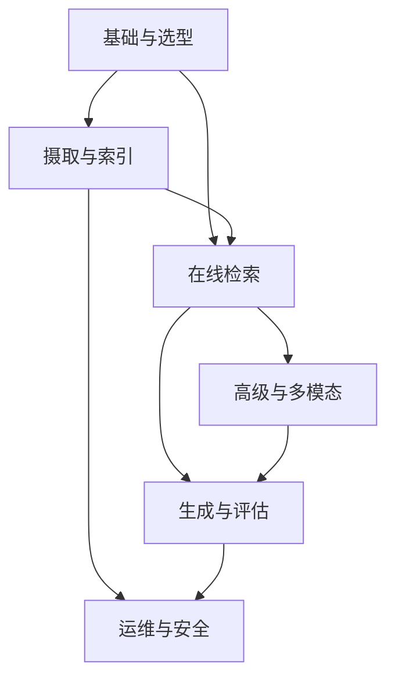

# RAG 相关知识点

本主题位于应用架构层，从知识外置的基本取舍出发，覆盖摄取索引、在线检索、高级与多模态方案、生成评估，以及动态更新和安全治理。

## 子模块

1. [基础与选型（第 1–2 章）](01-foundations/README.md)
2. [摄取与索引（第 3–9 章）](02-ingestion-indexing/README.md)
3. [在线检索（第 10–14 章）](03-retrieval/README.md)
4. [高级与多模态（第 15–16、21 章）](04-advanced/README.md)
5. [生成与评估（第 17–18 章）](05-generation-evaluation/README.md)
6. [运维与安全（第 19–20 章）](06-operations-security/README.md)

## 模块关系

## 阅读建议

- **快速建立全貌**：基础与选型 → 在线检索 → 生成与评估；
- **知识库工程**：摄取与索引 → 在线检索 → 运维与安全；
- **效果优化**：在线检索 → 生成与评估；
- **复杂语料**：摄取与索引 → 高级与多模态 → 生成与评估。

## 常见问题

### RAG 能完全消除大模型幻觉吗？

不能。RAG 可以给模型提供可核验的外部证据，但检索可能漏召回、召回错误内容，模型也可能忽略或误读证据。生产系统仍需要引用、拒答、输出校验和端到端评测。

### RAG、微调和长上下文应该怎么选？

需要频繁更新或可追溯的知识时优先考虑 RAG；需要稳定改变模型行为时考虑微调；资料规模可控且任务依赖整体上下文时可以直接使用长上下文。实际系统经常组合三者，而不是三选一。

### Chunk 越小，检索效果越好吗？

不一定。小 Chunk 定位更精确，但可能丢失上下文；大 Chunk 信息完整，却会引入噪声并增加 Token 成本。应根据文档结构、问题粒度和重排能力，通过真实查询集评测块大小与重叠率。

返回[文档主题索引](../README.md)。
