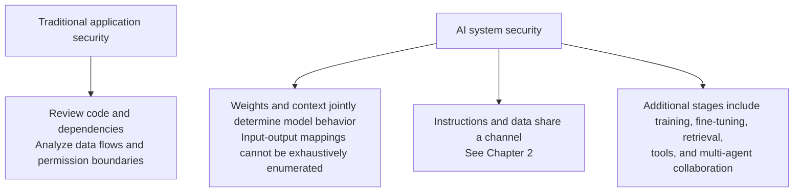
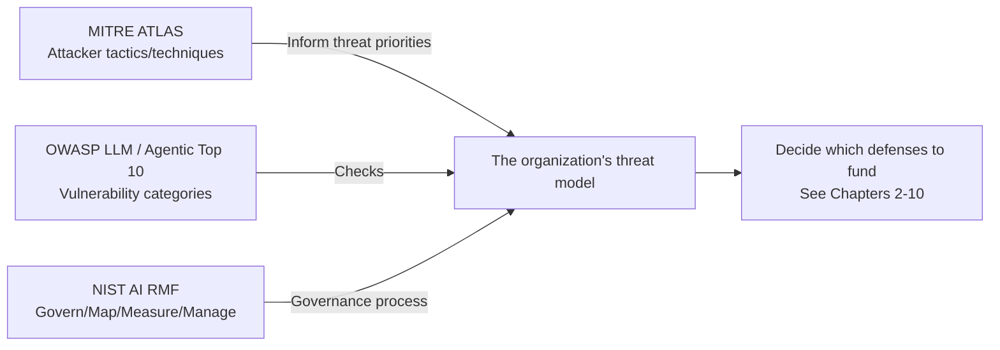
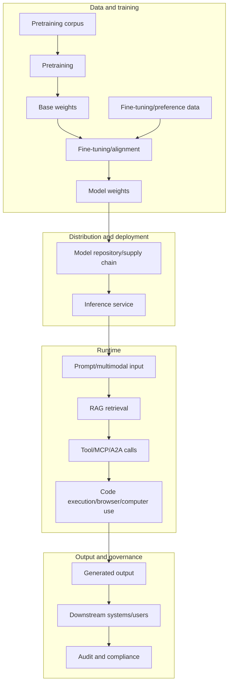

# Chapter 1: AI System Threat Modeling and the Attack Surface

## 1.1 Why AI Security Needs Its Own Threat Model

LLM interfaces typically distinguish roles such as system, user, and tool. Yet a model may still interpret lower-trust content as instructions it should follow: **role labels are not a deterministic security boundary**. This is an important root cause of prompt injection, but it does not explain every AI risk. Data poisoning changes training material; deserialization risks arise from loaders; unauthorized access arises from failures in identity and resource authorization. Each has its own mechanism. Traditional applications cannot assume that code and supply chains are trustworthy, either.

AI threat modeling therefore needs to go beyond the usual assets, trust boundaries, and attacker profiles to answer three more questions: **Where did the model's current behavior come from? Which untrusted content enters its decision process at runtime? What consequences can its output trigger?** The remaining chapters examine these questions at specific stages of the system.

## 1.2 Assets and Trust Boundaries in AI Systems

To discuss threats meaningfully, first break a typical production LLM application down into its assets.

| Asset category | Specific assets | Main risks |
|---|---|---|
| Model weights and configuration | Pretrained/fine-tuned weights, system prompts, guardrail configuration | Theft, tampering, backdoor insertion (Chapters 4 and 5) |
| Training, fine-tuning, and retrieval data | Pretraining corpora, SFT/RLHF data, RAG knowledge bases | Poisoning and privacy leakage (Chapters 4 and 6); RAG ingestion is not itself training |
| Runtime context | User input, retrieved passages, tool results, multimodal content | Prompt injection and jailbreaks (Chapter 2) |
| Tools and execution environments | Functions/MCP servers, code interpreters, browsers, computer use | Unauthorized calls and sandbox escapes (Chapters 7 and 8) |
| Outputs and downstream systems | Generated text, tool-call arguments, rendered interfaces | Secondary injection and secret exfiltration (Chapter 3) |
| Identities and credentials | User/agent/server identities, OAuth tokens, API keys | Impersonation and confused deputy attacks (Chapter 7) |
| Governance and audit data | Logs, model cards, evaluation reports, content provenance | Tampering and compliance gaps (Chapters 9 and 10) |

An internal-versus-external network distinction is not enough to define trust boundaries. Check **which lower-trust content enters the model's context, and when model output gains the ability to trigger actions**. The host or caller must enforce its own policy, and the resource service must independently authorize access. Approval of a call by the former does not mean that the latter has confirmed the user's permission to act on that resource (see [Tool Protocol Security](../../tools/02-mcp/15-tool-protocol-security.md), Section 15.1).

## 1.3 Three Major Threat Modeling Frameworks

Production systems usually need three complementary kinds of framework: an attacker-oriented knowledge base of tactics, an organization-level risk governance process, and a checklist of vulnerability categories. These serve different purposes rather than competing with one another.

### 1.3.1 MITRE ATLAS: A Knowledge Base of Attacker Tactics and Techniques

MITRE ATLAS (Adversarial Threat Landscape for Artificial-Intelligence Systems) describes AI attacks through tactics, techniques, and case studies. It includes both real-world incidents and research or red-team demonstrations. When citing a case, state its nature and the prerequisites for the attack. A technique's inclusion does not mean it has been exploited in every production system. ATLAS helps teams consider possible paths; it does not replace analysis of reachability and impact in their own system.

### 1.3.2 NIST AI RMF: Governance Across the Lifecycle

NIST AI RMF 1.0 is a voluntary risk management framework, not a law or a product security certification. **Govern, Map, Measure, and Manage** address accountability, contextual risk identification, risk measurement, and risk treatment, respectively. Govern spans the other functions; these are not a one-off, linear process. Generative AI teams can also use the NIST AI 600-1 Generative AI Profile, published in 2024. NIST's website states that the RMF is being revised. That does not make an unpublished successor an established standard.

### 1.3.3 OWASP Top 10: Vulnerability Categories and a Quick Reference

The **OWASP Top 10 for LLM Applications 2025** is not limited to single-model architectures: LLM01 Prompt Injection, LLM02 Sensitive Information Disclosure, LLM03 Supply Chain, LLM04 Data and Model Poisoning, LLM05 Improper Output Handling, LLM06 Excessive Agency, LLM07 System Prompt Leakage, LLM08 Vector and Embedding Weaknesses, LLM09 Misinformation, and LLM10 Unbounded Consumption.

The separate **Top 10 for Agentic Applications 2026** focuses on tool, identity, delegation, and cascading risks in autonomous agents. It is not the same document as the Agentic AI Threats and Mitigations guide. A Top 10 is a risk list, not a weakness taxonomy with a one-to-one correspondence to CWE, nor a certification standard.

The division of work is straightforward: ATLAS describes attacker tactics and techniques, the RMF manages organizational risk, and OWASP supplies vulnerability checks for application implementations.

## 1.4 Mapping the Attack Surface Across the Data and Model Lifecycle

Organizing the attack surface by lifecycle stage makes omissions easier to spot than a list of isolated vulnerabilities does.

This diagram identifies places to inspect at each stage; it is not a fixed sequence that every request must follow. RAG, tools, and desktop execution are optional capabilities. Adding any of them requires corresponding controls over data and permissions.

| Stage | Typical attacks | Further reading |
|---|---|---|
| Training/fine-tuning data | Data poisoning and backdoor triggers | Chapter 4 |
| Model distribution | Supply chain tampering and deserialization RCE | Chapter 5 |
| Runtime input | Direct/indirect prompt injection and jailbreaks | Chapter 2; [Agent Security](../../agent/05-production/15-agent-security.md) |
| RAG retrieval | Corpus poisoning and indirect injection | [RAG Security](../../rag/06-operations-security/20-rag-challenges-security.md); Chapter 4 |
| Tool/protocol calls | Unauthorized access and confused deputy attacks | Chapter 7; [Tool Protocol Security](../../tools/02-mcp/15-tool-protocol-security.md) |
| Code/browser/computer use | Sandbox escapes, SSRF, and clipboard hijacking | Chapter 8 |
| Output | Secondary injection, secret exfiltration, and unsafe rendering | Chapter 3 |
| Privacy | Extraction of memorized data and PII leakage | Chapter 6 |
| Entire lifecycle | Missing evaluation and governance | Chapters 9 and 10 |

## 1.5 Attacker Profiles and Capability Levels

The same threat can carry very different risk depending on the attacker's capabilities. Make those differences explicit in the model.

| Capability level | Description | Examples |
|---|---|---|
| L0: Anonymous user | Can only submit prompts through a public interface | Direct injection and jailbreaks; indirect injection additionally requires a route for placing third-party content |
| L1: Authenticated user | Has a legitimate account with normal permissions | Abusing legitimate access to probe for unauthorized access or perform differential probing |
| L2: Content supplier | Can get content into a training corpus or knowledge base | Data poisoning and backdoor triggers |
| L3: Supply chain participant | Can publish models, dependencies, or tool descriptions | Supply chain poisoning and tool poisoning |
| L4: Insider | Has access to deployments, logs, or secrets | Privilege abuse and log leakage |
| L5: Research-level attacker with compute resources | Can train shadow models for transfer attacks | Model stealing and membership inference |

L0–L5 are discussion labels used in this chapter, not an industry standard or a strictly increasing privilege hierarchy. Compute resources, insider privileges, and content control are different dimensions. Prioritize investment by asset value, reachability, harm, and existing controls; do not assume that anonymous users always pose the greatest risk.

For example, both a read-only customer support assistant and an agent that can issue refunds read untrusted documents. The latter also introduces financial actions, delegated identity, and replay risks. Draw the data flow as “document → model → refund arguments → authorization service.” Check whether the authorization service independently verifies the user, order, amount, and approval, then map the attack categories to concrete controls.

## 1.6 This Topic's Scope and Cross-References

The Agent, Tools, and RAG topics in this repository already explain defenses for specific architectures:

- [Agent Security](../../agent/05-production/15-agent-security.md): architectural defenses against prompt injection, including Dual LLM and CaMeL; the lethal trifecta; least privilege; and execution isolation.
- [Tool Protocol Security](../../tools/02-mcp/15-tool-protocol-security.md): OAuth, audience, token passthrough, and SSRF defenses at the MCP/A2A protocol layer.
- [RAG Implementation Challenges and Security](../../rag/06-operations-security/20-rag-challenges-security.md): corpus poisoning, retrieval-side indirect injection, permission filtering, and differential probing.

Rather than repeating those architectural patterns, `docs/safety/` has three responsibilities:

1. **Provide a cross-layer threat modeling framework and mappings to standards** in this chapter, so readers can place a specific attack within the larger picture.
2. **Cover equally important areas not yet addressed by those topics**: the taxonomy of jailbreaks and system prompt leakage (Chapter 2), output handling (Chapter 3), training and supply chain poisoning (Chapters 4 and 5), privacy and memory leakage (Chapter 6), and cross-system identity governance and computer-use sandboxes (Chapters 7 and 8).
3. **Explain organization-level evaluation, red teaming, and governance processes** (Chapters 9 and 10), which lie outside the scope of an individual application architecture.

Read this chapter first to establish the framework, then consult the relevant chapters as needed. Readers who have already read the Agent, Tools, and RAG security chapters can move directly to Chapter 2 and the chapters that follow.

## 1.7 Common Mistakes

### 1.7.1 Using Only One Framework

Using only the OWASP Top 10 leaves out governance processes; using only the NIST RMF leaves out a concrete technical checklist; relying only on ATLAS case studies overlooks emerging risks that have not yet been publicly reported. Use the three together.

### 1.7.2 Treating the Threat Model as a One-Time Document

Models, prompts, tool sets, and dependencies keep changing. Review the threat model with each architecture change or dependency upgrade, rather than writing it once before launch and archiving it.

### 1.7.3 Ignoring Differences in Attacker Capabilities

Failing to distinguish which data an attacker controls, whether they can invoke tools, and whether they hold internal credentials leads to misallocated resources. Labels such as “internal network” or “anonymous” are not sufficient to assess risk.

### 1.7.4 Treating Threat Modeling as the Security Team's Job Alone

Product and engineering teams decide model behavior, prompt structure, and the scope of tool authorization. They must participate in threat modeling; the security team cannot produce an effective model in isolation.

## 1.8 Chapter Summary

1. AI threat modeling must answer three additional questions: where model behavior comes from, what enters the decision process at runtime, and what the output can trigger.
2. **MITRE ATLAS** supplies a knowledge base of attacker tactics and techniques; **NIST AI RMF** supplies Govern/Map/Measure/Manage risk governance functions; and the **OWASP LLM/Agentic Top 10** supplies vulnerability checklists. Their roles are complementary.
3. Map the attack surface across “training/fine-tuning → distribution → runtime input/retrieval/tool calls/execution → output → governance,” rather than listing isolated vulnerabilities.
4. Describe attacker capabilities in terms of actual control. Set priorities using reachability and harm, not a mechanical ranking of fixed labels.
5. `docs/safety/` provides the cross-layer framework, mappings to standards, and the additional areas covered in Chapters 2–10. Cross-references reuse the architectural defenses already explained in Agent, Tools, and RAG rather than repeating them.

## References

- [MITRE ATLAS](https://atlas.mitre.org/)
- [NIST AI Risk Management Framework (AI RMF 1.0)](https://www.nist.gov/itl/ai-risk-management-framework)
- [NIST Generative AI Profile (NIST AI 600-1)](https://www.nist.gov/publications/artificial-intelligence-risk-management-framework-generative-artificial-intelligence)
- [OWASP Top 10 for Large Language Model Applications](https://genai.owasp.org/llm-top-10/)
- [OWASP Agentic AI Threats and Mitigations](https://genai.owasp.org/resource/agentic-ai-threats-and-mitigations/)
- [OWASP Top 10 for Agentic Applications 2026](https://genai.owasp.org/resource/owasp-top-10-for-agentic-applications-for-2026/)
- [NIST AI 100-2 E2025: Adversarial Machine Learning Taxonomy](https://doi.org/10.6028/NIST.AI.100-2e2025)
