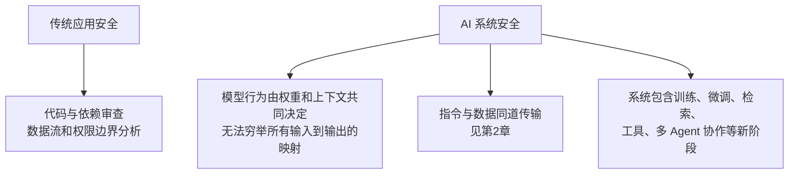
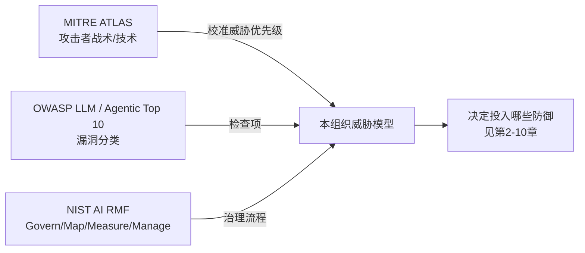
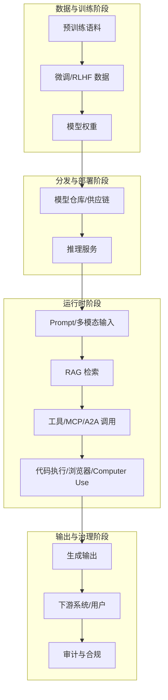

# 第一章：AI 系统威胁建模与攻击面全景

## 1.1 为什么 AI 安全需要单独的威胁模型

LLM 接口通常有 system、user、tool 等角色结构，但模型仍可能把低信任内容理解为应服从的指令，**角色标签不是确定性的安全边界**。这是提示注入的重要根因，却不能解释全部 AI 风险：数据投毒改变训练材料，反序列化风险来自加载器，越权来自身份与资源授权，各有独立机制。传统应用同样不能默认代码及供应链可信。

因此，AI 系统的威胁建模需要在传统的资产、信任边界和攻击者画像之外，额外回答三个问题：**模型从哪里获得了它现在的行为？运行时哪些不可信内容会进入模型的决策链路？模型的输出能触发什么后果？** 后续章节只是把这三个问题拆到具体环节里展开。

## 1.2 AI 系统的资产与信任边界

把一个典型的生产级 LLM 应用拆成资产,才能谈威胁。

| 资产类别 | 具体对象 | 面临的核心风险 |
|---|---|---|
| 模型权重与配置 | 预训练/微调权重、System Prompt、护栏配置 | 窃取、篡改、后门植入（第4、5章） |
| 训练与微调数据 | 预训练语料、SFT/RLHF 数据、RAG 知识库 | 投毒、隐私泄漏（第4、6章） |
| 运行时上下文 | 用户输入、检索片段、工具返回值、多模态内容 | 提示注入、越狱（第2章） |
| 工具与执行环境 | Function/MCP Server、代码解释器、浏览器、Computer Use | 越权调用、沙箱逃逸（第7、8章） |
| 输出与下游系统 | 生成文本、工具调用参数、渲染界面 | 二次注入、密钥外泄（第3章） |
| 身份与凭据 | 用户/Agent/Server 身份、OAuth 令牌、API Key | 冒充、confused deputy（第7章） |
| 治理与审计数据 | 日志、模型卡、评测报告、内容出处 | 篡改、合规缺失（第9、10章） |

信任边界不再是单一的「内网/外网」，而是**每一次内容进入模型上下文、每一次模型输出触发动作**都构成一次边界穿越。这也是「Host/调用方必须是策略执行点」（详见[Tool Protocol 安全](../../tools/02-mcp/15-tool-protocol-security.md) 15.1）这一原则的根源。

## 1.3 三个主流威胁建模框架

生产环境通常需要同时使用三类框架：一类给出攻击者视角的战术知识库，一类给出组织级风险治理流程，一类给出漏洞分类清单。三者互补而非互斥。

### 1.3.1 MITRE ATLAS：攻击者战术与技术知识库

MITRE ATLAS（Adversarial Threat Landscape for Artificial-Intelligence Systems）以战术、技术和案例描述 AI 攻击，既包含现实事件，也包含研究或红队演示。引用时应注明案例性质与攻击前提；某技术被收录不代表已在所有生产系统中被利用。它适合帮助团队检查可能路径，而非替代本系统的可达性和影响分析。

### 1.3.2 NIST AI RMF：治理生命周期

NIST AI RMF 1.0 是自愿使用的风险管理框架，不是法律或产品安全认证。**Govern、Map、Measure、Manage** 分别涉及问责制度、场景风险识别、风险测量和处置，Govern 贯穿其他功能，并非一次性的线性流程。生成式 AI 可结合 2024 年发布的 NIST AI 600-1 Generative AI Profile。NIST 官网说明 RMF 正在修订，不应据此把尚未发布的后续版本当作既定标准。

### 1.3.3 OWASP Top 10：漏洞分类与速查

**OWASP Top 10 for LLM Applications 2025** 不限于单模型架构：LLM01 Prompt Injection、LLM02 Sensitive Information Disclosure、LLM03 Supply Chain、LLM04 Data and Model Poisoning、LLM05 Improper Output Handling、LLM06 Excessive Agency、LLM07 System Prompt Leakage、LLM08 Vector and Embedding Weaknesses、LLM09 Misinformation、LLM10 Unbounded Consumption。

另有 **Top 10 for Agentic Applications 2026**，聚焦自主 Agent 的工具、身份、委托和级联风险。它与 Agentic AI Threats and Mitigations 指南不是同一份文档。Top 10 是风险清单，不是与 CWE 逐项等价的弱点分类，也不是认证标准。

三者分工不同：ATLAS 描述攻击者的战术与技术，RMF 管理组织风险，OWASP 提供应用实现层的漏洞检查项。

## 1.4 攻击面总览：沿数据与模型生命周期铺开

按 AI 系统的生命周期阶段梳理攻击面，比按单点漏洞罗列更容易做到不遗漏。

| 阶段 | 典型攻击 | 详解章节 |
|---|---|---|
| 训练/微调数据 | 数据投毒、后门触发器 | 第4章 |
| 模型分发 | 供应链篡改、反序列化 RCE | 第5章 |
| 运行时输入 | 直接/间接 Prompt Injection、越狱 | 第2章、[Agent 安全](../../agent/05-production/15-agent-security.md) |
| RAG 检索 | 语料投毒、间接注入 | [RAG 安全](../../rag/06-operations-security/20-rag-challenges-security.md)、第4章 |
| 工具/协议调用 | 越权、confused deputy | 第7章、[Tool Protocol 安全](../../tools/02-mcp/15-tool-protocol-security.md) |
| 代码/浏览器/Computer Use | 沙箱逃逸、SSRF、剪贴板劫持 | 第8章 |
| 输出 | 二次注入、密钥外泄、不安全渲染 | 第3章 |
| 隐私 | 记忆化抽取、PII 泄漏 | 第6章 |
| 全生命周期 | 评测缺失、治理缺位 | 第9、10章 |

## 1.5 攻击者画像与能力分级

同一威胁在不同攻击者能力下风险等级完全不同，建模时应显式区分。

| 能力等级 | 描述 | 举例 |
|---|---|---|
| L0 匿名用户 | 仅能通过公开接口发送 Prompt | 直接注入、越狱；间接注入还需第三方内容投放路径 |
| L1 认证用户 | 拥有合法账号和正常权限 | 滥用自身权限做越权探测、差分探测 |
| L2 内容供应方 | 能让内容进入训练语料或知识库 | 数据投毒、后门触发器 |
| L3 供应链角色 | 能发布模型/依赖/工具描述 | 供应链投毒、Tool poisoning |
| L4 内部人员 | 拥有部署、日志或密钥访问权限 | 权限滥用、日志泄漏 |
| L5 具备算力的研究级攻击者 | 可训练影子模型做迁移攻击 | 模型窃取、成员推断 |

L0–L5 是本章的讨论标签，不是行业标准或严格递增的权限等级；算力、内部权限和内容控制是不同维度。投入应根据资产价值、可达性、损害与现有控制排序，不能统一认定匿名用户风险最高。

例如只读客服助手与可退款 Agent 都会读取不可信文档，但后者多了资金动作、委托身份和重放风险。应写出「文档 → 模型 → 退款参数 → 授权服务」的数据流，验证授权服务能否独立检查用户、订单、金额和审批，再把攻击分类映射成具体控制。

## 1.6 本主题的定位与交叉引用约定

本仓库已经在 Agent、Tools、RAG 三个应用主题中，针对具体架构给出了防御细节：

- [Agent 安全](../../agent/05-production/15-agent-security.md)：Prompt Injection 的架构级防御模式（Dual LLM、CaMeL 等）、致命三要素、权限最小化、执行隔离。
- [Tool Protocol 安全](../../tools/02-mcp/15-tool-protocol-security.md)：MCP/A2A 协议层的 OAuth、audience、token passthrough、SSRF 防护。
- [RAG 落地难点与安全](../../rag/06-operations-security/20-rag-challenges-security.md)：语料投毒、检索侧间接注入、权限过滤、差分探测。

`docs/safety/` 不重复展开这些已经讲清楚的架构模式，而是承担三件事：

1. **提供跨层的威胁建模框架和标准映射**（本章），让读者知道任意一个具体攻击落在整体图景的什么位置；
2. **补充这些主题尚未覆盖、但同样关键的环节**：越狱与系统提示泄漏的分类学（第2章）、输出侧处理（第3章）、训练/供应链投毒（第4、5章）、隐私与记忆泄漏（第6章）、跨系统身份治理与 Computer Use 沙箱（第7、8章）；
3. **提供组织级的评测、红队与治理流程**（第9、10章），这是单个应用架构文档不会覆盖的层面。

阅读顺序建议：先读本章建立框架，再按需查阅具体章节；已经读过 Agent/Tools/RAG 安全章节的读者可以直接跳到第2章之后。

## 1.7 常见错误

### 1.7.1 只用一个框架

只套 OWASP Top 10 会漏掉治理流程；只用 NIST RMF 会缺少具体技术清单；只看 ATLAS 案例会忽略尚未被公开报道的新型风险。三者应配合使用。

### 1.7.2 把威胁建模做成一次性文档

模型、Prompt、工具集和依赖库都在持续变化，威胁模型需要随每次架构变更或依赖升级重新评审，而不是上线前写一次就归档。

### 1.7.3 忽略攻击者能力分级

不区分攻击者控制哪些数据、能否调用工具、是否拥有内部凭据，会导致资源错配；不能只凭「内网」或「匿名」标签判断风险。

### 1.7.4 认为威胁模型是安全团队的事

模型行为、Prompt 结构、工具授权范围的决定权在产品和工程团队手里，威胁建模必须让这些团队参与，而不是安全团队闭门产出一份文档。

## 1.8 本章总结

1. AI 系统的威胁建模需要额外回答「模型行为从哪来、运行时什么内容会进入决策链路、输出能触发什么」三个问题；
2. **MITRE ATLAS** 给出攻击者战术技术知识库，**NIST AI RMF** 给出 Govern/Map/Measure/Manage 治理流程，**OWASP LLM/Agentic Top 10** 给出漏洞检查清单，三者互补；
3. 攻击面应沿「训练/微调 → 分发 → 运行时输入/检索/工具调用/执行 → 输出 → 治理」的生命周期铺开，而不是零散罗列；
4. 攻击者能力要按实际控制面描述，优先级结合可达性与损害，不按固定标签机械排序；
5. `docs/safety/` 负责跨层框架、标准映射和第2-10章覆盖的补充环节，Agent/Tools/RAG 已有的架构级防御细节通过交叉引用复用，不重复展开。

## 参考资料

- [MITRE ATLAS](https://atlas.mitre.org/)
- [NIST AI Risk Management Framework (AI RMF 1.0)](https://www.nist.gov/itl/ai-risk-management-framework)
- [NIST Generative AI Profile (NIST AI 600-1)](https://www.nist.gov/publications/artificial-intelligence-risk-management-framework-generative-artificial-intelligence)
- [OWASP Top 10 for Large Language Model Applications](https://genai.owasp.org/llm-top-10/)
- [OWASP Agentic AI Threats and Mitigations](https://genai.owasp.org/resource/agentic-ai-threats-and-mitigations/)
- [OWASP Top 10 for Agentic Applications 2026](https://genai.owasp.org/resource/owasp-top-10-for-agentic-applications-for-2026/)
- [NIST AI 100-2 E2025: Adversarial Machine Learning Taxonomy](https://www.nist.gov/publications/adversarial-machine-learning-taxonomy-and-terminology-attacks-and-mitigations)
