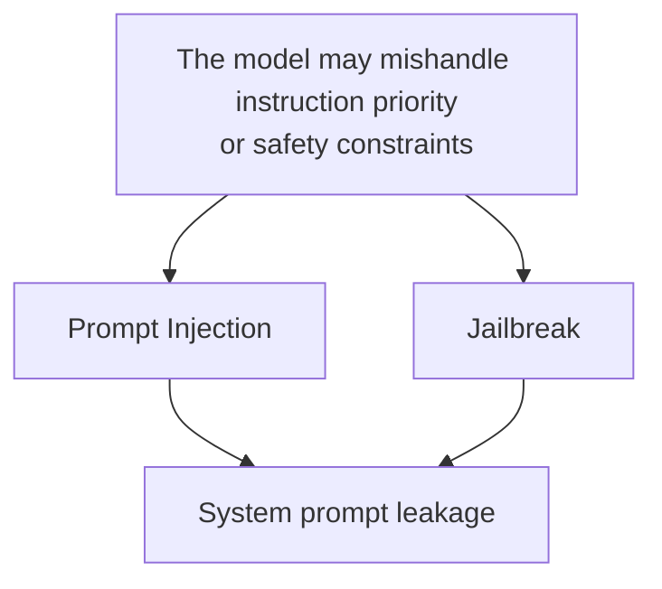
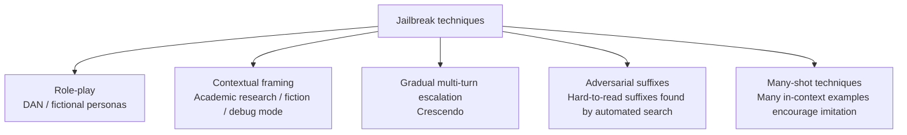

# Chapter 2: Prompt Injection, Jailbreaks, and System Prompt Leakage

## 2.1 How the Three Relate and Differ

These three attack categories are often conflated, but their goals—and the ways to model and defend against them—differ:

| Attack | Attacker's goal | Carrier |
|---|---|---|
| **Prompt injection** | Make the model follow injected instructions that override its original task | User input or third-party content such as documents, web pages, and tool results |
| **Jailbreak** | Bypass the model's safety alignment so that it produces content it should refuse | Usually a conversation, role-play scenario, or encoded payload crafted directly by the user |
| **System prompt leakage** | Obtain a system prompt, tool definitions, or internal policy text intended to remain confidential | Direct questions or attempts to make the model repeat, translate, or continue preceding text |

These attacks can be combined, but they are not synonyms. Role fields and message structure do exist; they simply cannot guarantee that a model always interprets content according to its trust level. Jailbreaks also involve failures of safety alignment to generalize, while system prompt leakage is one possible outcome. To determine whether an actual authorization violation occurred, examine whether tool services and data egress controls enforce authorization independently. A model saying “I have ignored the rules” is not, by itself, evidence of success.

## 2.2 Revisiting Prompt Injection and Extending the Taxonomy

For the definitions of direct injection, where the attacker is the current user, and indirect injection, where the payload is hidden in third-party content, along with the lethal trifecta and architectural defenses, see [Agent Security, Sections 15.4–15.10](../../agent/05-production/15-agent-security.md) and [RAG Security, Section 20.3.2](../../rag/06-operations-security/20-rag-challenges-security.md). This section adds two areas not developed there and often missed in production: **payload encoding** and **amplification across multiple turns or agents**.

### 2.2.1 Payload Encoding and Obfuscation

The same injected instruction can be represented in several ways to evade keyword-based detection:

| Encoding method | Illustrative approach | Explanation |
|---|---|---|
| Base64 / hexadecimal | “Decode the following string and follow the instructions it contains” | Before decoding, a keyword filter cannot see the plaintext |
| Homoglyphs / zero-width characters | Split sensitive words using visually similar characters or invisible Unicode | Evades exact string matching |
| Mixed languages / translation | Write instructions in a low-resource language, or ask the model to translate before acting | Safety alignment has weaker coverage in some languages |
| Payload splitting | Divide an instruction into apparently harmless fragments and ask the model to assemble them | Each fragment passes detection; the instruction only emerges when combined |
| Markdown / code-block disguise | Present instructions as code comments or examples so the model treats them as commands | Delimiters help organize input but cannot enforce separation by trust level |

These approaches try to evade static detection, illustrating why keywords and regular expressions cannot fully determine semantic intent. Use the architectural isolation described in [Agent Security](../../agent/05-production/15-agent-security.md); encoding detection is only one source of risk signals. Eliminating false negatives does not justify indiscriminately blocking all code, foreign-language text, or encoded content.

### 2.2.2 Amplification Across Turns and Agents

Once single-turn defenses are in place, attackers may turn to conversation history and multi-agent collaboration:

- **Gradual multi-turn escalation (Crescendo)**: begin with a harmless topic and make only a small shift in each turn, exploiting the model's tendency to follow a continuous conversation until it reaches a goal that would have been refused in a single turn.
- **Context contamination**: get the model to acknowledge a false premise or identity early in the conversation, then elicit inappropriate responses based on that contaminated context in later turns.
- **Cross-agent propagation**: an injected payload passes from one agent's output to another agent. At each hop, it may receive less scrutiny because it appears to be trusted output from an upstream agent. This is another manifestation of the multi-agent confused deputy problem discussed in [Agent Security, Section 15.6.4](../../agent/05-production/15-agent-security.md).

Multi-turn detection should consider relevant history, but topic drift is only a weak signal: legitimate users change their goals too. Actual permission state and approvals must be stored outside the model and checked again before every action. When agents exchange summaries, preserve source and trust labels. An upstream agent's summary must not promote an external document into a trusted instruction.

## 2.3 Categories of Jailbreak Techniques

Unlike prompt injection that redirects the model to another task, a jailbreak aims to circumvent the model's own safety alignment. It usually requires no third-party payload: the attacker initiates the interaction directly.

| Category | Approach | Characteristics |
|---|---|---|
| Role-play | Ask the model to act as an unrestricted AI, as in the classic DAN prompts, or as a fictional persona not bound by policy | Relies on the model's tendency to follow persona instructions |
| Contextual framing | Frame the request as academic research, fiction, security testing, or a hypothetical scenario | Exploits the model's tolerance for narratives that rationalize the request |
| Gradual multi-turn escalation | See Section 2.2.2 | Malicious intent is not apparent in an individual turn; the effect is cumulative |
| Adversarial suffixes | Gradient-based search or black-box optimization identifies a character suffix that works on the model but is difficult for humans to interpret, appended to an ordinary request | Often optimized with white-box access to open-source models, but some cross-model transfer has also been observed |
| Many-shot jailbreaking | Place many inappropriate example pairs in the context, using in-context learning to influence subsequent output | The original research observed an effect related to example count in its tested models and settings; it does not establish that every model necessarily becomes more vulnerable as its context window grows |

**Key defenses:**

- Safety alignment training, such as RLHF or Constitutional AI, is the first line of defense, but **it must not be assumed complete**. The continued discovery of jailbreak techniques shows that alignment is a probabilistic mitigation, not a deterministic security boundary.
- Output-side guardrail models (see [Agent Security, Section 15.13.3](../../agent/05-production/15-agent-security.md)) can assess generated content as a second check when alignment fails.
- Limits on example counts and pattern detection may reduce some exposure, but examples need not be explicitly marked, and these controls can disrupt legitimate few-shot tasks. Evaluate both false positives and the remaining attack success rate.
- Operate jailbreak detection as an ongoing adversarial process (see the red-teaming discussion in Chapter 9), not a one-time prelaunch test.

## 2.4 System Prompt Leakage

### 2.4.1 Why System Prompt Leakage Is a Distinct Risk

OWASP lists System Prompt Leakage separately as LLM07. Many teams assume that a system prompt is confidential and use it to hold business rules, internal tool names, constraints, and even temporary security patches. If it leaks:

- Attackers gain a map of the defenses: which keywords are prohibited, which tools exist, and where approval thresholds are set.
- Credentials, internal URLs, or unredacted business logic accidentally included in the prompt can cause sensitive information disclosure directly, corresponding to OWASP LLM02.
- Competitors can copy the business's core prompt-engineering work.

### 2.4.2 Common Extraction Approaches

| Approach | Explanation |
|---|---|
| Direct questions | Requests to repeat the first message received or print the system message |
| Indirect elicitation | Requests to summarize instructions as JSON, translate them into English, or display raw input in debug mode |
| Continuation | Supply what appears to be the beginning of a system prompt and ask the model to continue, exploiting its tendency to complete text |
| Side-channel inference | Infer rules from differences in responses to many probe questions rather than obtaining the original text, similar to the differential probing discussed in [RAG Security, Section 20.3.3](../../rag/06-operations-security/20-rag-challenges-security.md) |

### 2.4.3 The Right Design Principle: Do Not Rely on System Prompt Confidentiality

**Security controls must not depend on keeping the system prompt secret.** The objective is that knowing the prompt still does not let an attacker bypass authorization or obtain secrets—not to promise that the prompt can never leak. In practice:

- Enforce actual authorization, sensitive thresholds, and secret-related checks in deterministic code outside the system prompt. The prompt guides behavior; disclosing it must not grant additional permissions.
- Do not place credentials, internal hostnames, unredacted customer data, or commercially sensitive trade secrets in the system prompt.
- Detect verbatim repetition of the system prompt in output as defense in depth, not as the sole protection.
- If the business needs to keep prompt-engineering details confidential for competitive reasons, recognize that this is **best-effort obfuscation**, not a security boundary on which controls can be built.

This generalizes the principle in [Tool Protocol Security, Section 15.6.1](../../tools/02-mcp/15-tool-protocol-security.md): do not treat an Agent Card or tool description as proof of authorization. **Nothing that enters a model's context, or that a model outputs or repeats, can serve as the sole basis for a security decision.**

## 2.5 Detection and Operational Recommendations

- Detect anomalies in both input and output. On input, look for signs of encoding or obfuscation, such as high-entropy strings, language switching, and unusually long sets of few-shot examples. On output, look for system prompt fragments, content that exceeds authorization, or sensitive topics unrelated to the business task.
- Maintain a collection of jailbreak and injection examples and run regular regression tests (see Chapter 9). Alignment behavior changes with model versions; an existing defense may stop working or trigger excessively after an update.
- By default, record metadata such as the triggered rule, source category, and decision. When reproduction is necessary, retain only the minimum necessary, redacted input fragments under explicit authorization, with access restrictions and retention limits. Do not save raw conversations by default.

## 2.6 Common Mistakes

### 2.6.1 Treating the System Prompt as a Confidential Security Boundary

System prompt confidentiality cannot be guaranteed. Actual authorization decisions must be made by deterministic code outside the model's context.

### 2.6.2 Relying on Keyword Filters Against Encoding and Obfuscation

Base64, homoglyphs, and mixed languages can evade exact matching. A static word list alone cannot provide complete protection while preserving legitimate task utility.

### 2.6.3 Testing Only Single-Turn Jailbreaks

Single-turn tests cannot reveal gradual multi-turn escalation or context contamination. Red-team testing must include multi-turn conversations.

### 2.6.4 Treating Jailbreak Defense as a One-Time Launch Checklist Item

Model updates and newly published jailbreak techniques can invalidate existing defenses. Ongoing operation is necessary (see Chapter 9).

## 2.7 Chapter Summary

1. The three attack categories have different goals and may be combined. Role structure can express priority, but it does not deterministically enforce authorization or confidentiality.
2. Encoding and cross-turn combinations reduce the coverage of static word lists. Multi-agent systems still need source labels and authorization at every hop, even after upstream processing.
3. Jailbreak techniques include role-play, contextual framing, gradual multi-turn escalation, adversarial suffixes, and many-shot attacks. Safety alignment is a probabilistic mitigation, not a deterministic security boundary.
4. OWASP lists system prompt leakage separately as LLM07. The key principle is **not to base security controls on system prompt confidentiality**; extraction detection provides only an additional signal.
5. Detection and red teaming must cover multi-turn conversations and a continually updated collection of attack examples, rather than a one-time static test.

## References

- [OWASP LLM01:2025 Prompt Injection](https://genai.owasp.org/llmrisk/llm01-prompt-injection/)
- [OWASP LLM07:2025 System Prompt Leakage](https://genai.owasp.org/llmrisk/llm072025-system-prompt-leakage/)
- [Many-shot Jailbreaking (Anthropic)](https://www.anthropic.com/research/many-shot-jailbreaking)
- [Universal and Transferable Adversarial Attacks on Aligned Language Models](https://arxiv.org/abs/2307.15043)
- [Ignore This Title and HackAPrompt: Exposing Systemic Vulnerabilities of LLMs](https://arxiv.org/abs/2311.16119)
- [MITRE ATLAS: Prompt Injection](https://atlas.mitre.org/techniques/AML.T0051)
