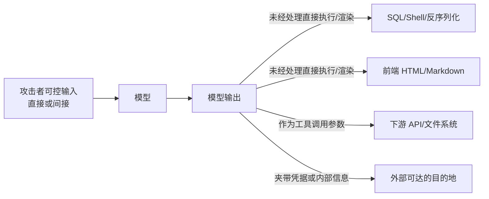

# 第三章：输出处理与 Secret Exfiltration

## 3.1 为什么输出侧需要单独的一章

前两章关注「不可信内容怎么进入模型」，本章关注**模型的输出本身应被当作不可信内容**。这是 OWASP LLM05（Improper Output Handling）的核心命题：很多团队严格校验输入，却把模型输出直接拼进 SQL、Shell 命令、HTML、Markdown 渲染器或下游 API 调用参数，相当于把模型变成了一个「可被攻击者远程编程的模板引擎」。

模型输出之所以危险，是因为它同时具备两个特征：**内容可被攻击者间接操纵**（通过 Prompt Injection 或越狱），**又天然被下游系统当作「AI 生成的正常结果」而降低审查力度**。后面就沿着几个最容易出事的消费点往下看：执行、渲染、工具参数，以及单独拎出来看的密钥与敏感数据外泄（secret exfiltration）。

## 3.2 不安全输出处理的典型路径

### 3.2.1 注入类：输出被当作可执行内容

| 下游消费方式 | 风险 | 示例 |
|---|---|---|
| 拼接 SQL/命令行 | 注入攻击 | 模型生成的「用户名」字段被直接拼进 SQL WHERE 子句 |
| eval / 动态代码执行 | 远程代码执行 | 把模型返回的「表达式」直接传给 `eval()` |
| 反序列化（pickle 等） | 反序列化 RCE，详见第五章 | 模型输出被当作可信的序列化对象加载 |
| Shell 调用 | 命令注入 | 模型生成的文件名/参数未转义就传给 shell |

**防御**：对模型输出的处理方式，应遵循与「任意不可信用户输入」完全相同的安全编码规范——参数化查询、禁止拼接式 shell 调用、白名单校验、沙箱执行（第八章）。**「这是 AI 生成的」不能成为跳过校验的理由。**

### 3.2.2 渲染类：输出被当作可信前端内容

| 渲染场景 | 风险 |
|---|---|
| 直接渲染 HTML/Markdown | 存储型 XSS：模型输出中的 `<script>` 或事件处理属性被浏览器执行 |
| 渲染为可点击链接 | 钓鱼：模型被诱导生成指向攻击者站点的链接，用户信任「AI 推荐的链接」而点击 |
| 富文本/Markdown 图片语法 | 隐蔽外带：见 3.3 |
| 表格/CSV 导出 | CSV 注入：以 `=`、`+`、`-`、`@` 开头的单元格被电子表格软件当作公式执行 |

**防御**：输出必须经过与用户生成内容（UGC）同等强度的净化——HTML 转义或使用白名单 Sanitizer、Markdown 渲染器禁用危险语法（如自动加载外部图片）、导出 CSV 前对公式前缀字符做转义或加前导单引号。

### 3.2.3 工具调用参数：输出直接驱动动作

Agent 场景下，模型输出不只是展示文本，还会直接成为工具调用的参数。若下游工具对参数「因为来自模型」而信任度过高，就会重现 [Tool Protocol 安全 15.3.2](../../tools/02-mcp/15-tool-protocol-security.md) 描述的问题。这部分的权限与校验设计已在 [Agent 安全](../../agent/05-production/15-agent-security.md) 和 [Tool Protocol 安全](../../tools/02-mcp/15-tool-protocol-security.md) 讲清楚；这里直接盯住一个最容易失手的点：**服务端重新校验参数，不能相信「这是模型自己算出来的」**。

## 3.3 隐蔽外带通道（Covert Exfiltration Channels）

即使系统本身没有明显的「发送数据」功能，模型仍可能通过一些容易被忽视的输出形式把上下文中的敏感数据带出系统边界，这是 [Agent 安全 15.5.1](../../agent/05-production/15-agent-security.md)「对外通信比想象中广」的具体展开。

| 通道 | 原理 |
|---|---|
| Markdown 图片自动加载 | `` 被渲染器自动请求，秘密作为查询参数发给攻击者服务器，无需用户点击 |
| 超链接文本 | 生成的链接 URL 本身携带编码后的数据，用户点击后触发外带 |
| 隐藏字符编码 | 用零宽字符或非打印 Unicode 把数据编码进看似正常的文本 |
| 分批/隐写式外带 | 把秘密拆分到多轮回复或多个字段中，单次输出体量小、不触发异常检测 |
| 副信道时序/长度 | 通过回复长度、是否报错、响应时间的差异间接传递 1 bit 信息（类似 [RAG 安全 20.3.3](../../rag/06-operations-security/20-rag-challenges-security.md) 的差分探测，但方向是「模型主动泄漏」） |

**防御**：

- 渲染层禁止未经审查的外部资源自动加载（图片、iframe、字体等），或强制经过代理并记录/限速；
- 对输出中的 URL 做域名白名单校验，不允许指向不在允许列表内的主机；
- 输出侧异常检测应关注「结构异常但语义正常」的模式，例如异常多的编码字符、异常规律的字符间隔；
- 从根源上限制模型上下文中能接触到的敏感数据（最小化原则，见 [Agent 安全 15.9](../../agent/05-production/15-agent-security.md)），因为**外带通道几乎不可能穷举防御，能被外带的前提是数据先进入了上下文**。

## 3.4 密钥、凭据与内部信息的外泄

这是隐蔽外带的一个高价值特例，值得单独强调排查清单：

| 泄漏源 | 场景 |
|---|---|
| System Prompt 中硬编码的密钥 | 见第二章系统提示泄漏 |
| 工具返回值中的原始凭据 | 工具把数据库连接串、内部 Token 直接返回给模型，模型可能在后续回复中复述 |
| 代码执行环境变量 | 代码解释器/Computer Use 环境中的环境变量、云凭据被模型读取后写入输出（见第八章） |
| 训练数据记忆化 | 模型直接背诵训练语料中出现过的密钥或个人数据（见第六章） |
| 日志与可观测系统 | 完整 Prompt/输出被记录到日志，日志访问权限过宽 |

**上线前应做的最小检查**：

- 传给模型上下文的任何字段，若不是完成当前任务所必需，就不应该出现在上下文里（凭据尤其如此）；
- 工具设计上，需要凭据的操作应在工具内部完成鉴权，**不把凭据本身透传给模型**，模型只应看到「操作是否成功」；
- 输出侧接入密钥格式检测（如常见云厂商 Key 的正则特征）作为最后一道防线，命中则拦截或脱敏；
- 日志、追踪系统对 Prompt 和输出做默认脱敏，访问权限单独收紧。

## 3.5 上线检查表

- [ ] 模型输出在拼接进 SQL/Shell/反序列化前，经过与用户输入同等强度的转义或参数化处理；
- [ ] 富文本/Markdown 渲染禁止自动加载未经域名白名单校验的外部资源；
- [ ] CSV/表格导出对公式前缀字符做转义；
- [ ] 输出中的链接经过域名白名单或安全网关跳转；
- [ ] 工具调用参数在服务端重新校验，不直接信任模型生成的 JSON；
- [ ] 上下文中不出现非必要的凭据、内部主机名、未脱敏个人数据；
- [ ] 输出侧接入密钥格式检测和敏感信息 DLP 规则；
- [ ] 日志与追踪系统默认脱敏，访问权限单独控制。

## 3.6 常见错误

### 3.6.1 认为「AI 生成的内容」天然可信

模型输出的风险等级应等同于任意不可信用户输入，所有下游消费点都要按此设计。

### 3.6.2 只做输入过滤，不做输出净化

即使输入侧防御完备，越狱或对齐失效仍可能让模型生成危险内容；输出净化是独立的、必需的一层。

### 3.6.3 忽视图片、链接等隐蔽外带通道

这是最容易被忽视但危害很大的一类问题，防御重点应放在限制上下文中的敏感数据和渲染层资源加载策略上。

### 3.6.4 把凭据透传给模型而不是在工具内部鉴权

一旦凭据进入模型上下文，就有被外带、被记忆或被复述的风险，工具设计应让模型「看不到」凭据本身。

## 3.7 本章总结

1. 模型输出应被当作不可信内容处理，风险等级等同于任意用户输入，不能因为「是 AI 生成的」而放松校验；
2. 注入类风险（SQL/Shell/反序列化）与渲染类风险（XSS/CSV 注入/钓鱼链接）需要与处理 UGC 相同强度的净化；
3. 图片自动加载、隐藏字符编码、分批外带、响应时序差异都是隐蔽外带通道；与其穷举通道，不如先把敏感数据尽量挡在上下文外；
4. 密钥与凭据的外泄往往源于「工具把凭据透传给模型」，正确设计是让工具内部完成鉴权，模型只看到操作结果；
5. 输出侧防御是纵深防御的最后一层，不能替代第二章和 [Agent 安全](../../agent/05-production/15-agent-security.md) 中的架构级隔离，但同样不可或缺。

## 参考资料

- [OWASP LLM05:2025 Improper Output Handling](https://genai.owasp.org/llmrisk/llm05-improper-output-handling/)
- [OWASP LLM02:2025 Sensitive Information Disclosure](https://genai.owasp.org/llmrisk/llm02-sensitive-information-disclosure/)
- [Imprompter: Tricking LLM Agents into Improper Tool Use](https://arxiv.org/abs/2410.14923)
- [Not what you've signed up for: Compromising Real-World LLM-Integrated Applications with Indirect Prompt Injection](https://arxiv.org/abs/2302.12173)
- [OWASP Top 10:2021 A03 Injection (CSV Injection background)](https://owasp.org/Top10/A03_2021-Injection/)
