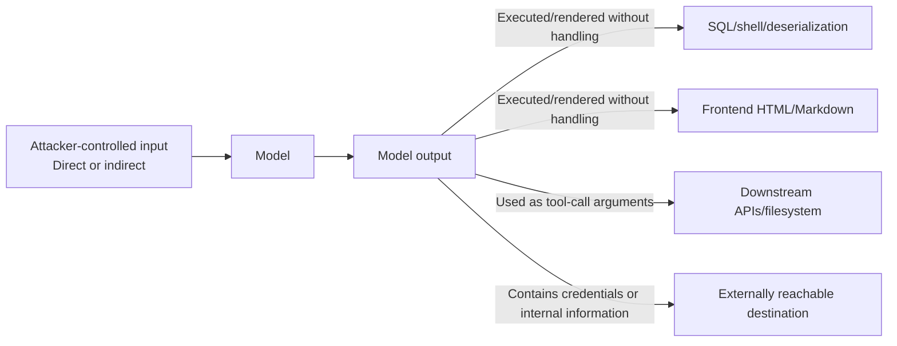

# Chapter 3: Output Handling and Secret Exfiltration

## 3.1 Why Output Handling Deserves Its Own Chapter

The first two chapters examined how untrusted content enters a model. This chapter starts from a different principle: **the model's output must itself be treated as untrusted content**. This is the central concern of OWASP LLM05, Improper Output Handling. Teams may carefully validate input yet interpolate model output directly into SQL, shell commands, HTML, Markdown renderers, or downstream API arguments. In effect, they turn the model into a template engine that an attacker can program remotely.

Model output is risky because it combines two properties: **attackers can influence its content indirectly**, through prompt injection or jailbreaks, and **downstream systems may scrutinize it less because it looks like a normal AI-generated result**. We will examine the consumption points most prone to failure—execution, rendering, and tool arguments—then address secret exfiltration separately.

## 3.2 Common Paths to Improper Output Handling

### 3.2.1 Injection: Treating Output as Executable Content

| Downstream use | Risk | Example |
|---|---|---|
| SQL/command-line string concatenation | Injection | A model-generated username field is interpolated directly into a SQL WHERE clause |
| eval / dynamic code execution | Remote code execution | A model-generated expression is passed directly to `eval()` |
| Deserialization, such as pickle | Deserialization RCE; see Chapter 5 | Model output is loaded as a trusted serialized object |
| Shell invocation | Command injection | Model-generated filenames or arguments are passed to a shell without escaping |

**Defense:** apply exactly the same secure coding practices as for arbitrary untrusted user input: parameterized queries, no concatenated shell commands, allowlist validation, and sandboxed execution (Chapter 8). **“The AI generated it” is not a reason to skip validation.**

### 3.2.2 Rendering: Treating Output as Trusted Frontend Content

| Rendering scenario | Risk |
|---|---|
| Direct HTML/Markdown rendering | XSS without safe sanitization; whether it is stored XSS depends on whether the output is saved before being displayed |
| Clickable links | Phishing: the model is induced to generate links to attacker-controlled sites, which users follow because they trust an AI recommendation |
| Rich text / Markdown image syntax | Covert exfiltration; see Section 3.3 |
| Spreadsheet/CSV exports | CSV injection: spreadsheet software interprets cells beginning with `=`, `+`, `-`, or `@` as formulas |

**The defense must match the consumption context.** Use parameterized queries for SQL. For shell operations, prefer a fixed command with an argument array and validate the options. For HTML, use context-appropriate encoding or a maintained allowlist sanitizer. JSON Schema cannot replace these controls. Markdown also requires restrictions on URL schemes and external resources. Ordinary CSV quote escaping does not prevent formula execution, and the effectiveness of a leading apostrophe depends on the spreadsheet application. Prefer exports with explicitly text-typed cells, and test opening, saving, and reopening in the intended client.

### 3.2.3 Tool-Call Arguments: Output That Directly Drives Actions

In an agent system, model output is more than display text: it also becomes tool-call arguments. If a downstream tool trusts those arguments simply because a model generated them, it recreates the problem described in [Tool Protocol Security, Section 15.3.2](../../tools/02-mcp/15-tool-protocol-security.md). [Agent Security](../../agent/05-production/15-agent-security.md) and [Tool Protocol Security](../../tools/02-mcp/15-tool-protocol-security.md) already explain the necessary authorization and validation design. The easily missed point here is simple: **revalidate arguments on the server; “the model calculated it” is not a trust guarantee**.

## 3.3 Covert Exfiltration Channels

Even if a system has no obvious “send data” feature, easily overlooked output formats can carry sensitive context data out of it. This expands on the observation in [Agent Security, Section 15.5.1](../../agent/05-production/15-agent-security.md) that external communication is broader than it first appears.

| Channel | Mechanism |
|---|---|
| Automatic Markdown image loading | A renderer automatically requests ``. Data in the URL goes to the destination server without a user click; `示意数据` means “illustrative data” |
| Hyperlinks | The generated URL itself contains encoded data, which is sent when the user clicks |
| Hidden-character encoding | Zero-width characters or nonprinting Unicode encode data in apparently ordinary text |
| Incremental / steganographic exfiltration | A secret is split across replies or fields, keeping each output small enough to avoid anomaly detection |
| Timing / length side channels | Differences in response length, errors, or timing indirectly convey 1 bit of information, similar to the differential probing in [RAG Security, Section 20.3.3](../../rag/06-operations-security/20-rag-challenges-security.md), but with the model actively leaking information |

**Defenses:**

- Prevent the rendering layer from automatically loading unreviewed external resources. A proxy alone is insufficient: forwarding a secret-bearing URL unchanged still leaks it and may introduce server-side SSRF.
- Enforce egress policy by destination, path, and data category. A domain allowlist does not prevent uploads to an attacker-controlled account on an allowed domain. Revalidate redirects and the final connection address too.
- Output anomaly detection should look for text whose meaning appears normal but whose structure is unusual, such as excessive encoded characters or unusually regular character spacing.
- Limit the sensitive data accessible to both the model and its execution environment at the source (the minimization principle; see [Agent Security, Section 15.9](../../agent/05-production/15-agent-security.md)). A model must encounter a secret to repeat it, but a tool can also read and transmit data directly without first showing the raw content to the model. Protecting context while leaving tool filesystem and network permissions unrestricted is therefore insufficient.

## 3.4 Exfiltration of Secrets, Credentials, and Internal Information

This high-value subset of covert exfiltration deserves its own review checklist:

| Source of leakage | Scenario |
|---|---|
| Secrets hardcoded in the system prompt | See system prompt leakage in Chapter 2 |
| Raw credentials in tool results | A tool returns a database connection string or internal token directly to the model, which may repeat it in a later response |
| Environment variables in the execution environment | The model reads environment variables or cloud credentials from a code interpreter or computer-use environment and includes them in output (see Chapter 8) |
| Training data memorization | The model reproduces secrets or personal data from its training corpus (see Chapter 6) |
| Logging and observability systems | Full prompts and outputs are logged, with overly broad access to those logs |

A model request is not itself online training. Credentials in context primarily create risks of repetition in the current interaction, transmission through tools, and log retention. Whether they later enter model weights depends on subsequent data-use processes. After a leak, revoke or rotate the credentials and audit their use; deleting the conversation alone does not contain the damage.

**Minimum prelaunch checks:**

- Any field that is unnecessary for the current task should be absent from the model's context, especially credentials.
- Tools that require credentials should authenticate internally, **without passing the credentials themselves through to the model**. The model should see only whether the operation succeeded.
- Add secret-format detection to the output path, such as regular-expression patterns for common cloud-provider keys, as a final defense. Block or redact matches.
- Redact prompts and outputs by default in logging and tracing systems, and restrict access separately.

## 3.5 Launch Checklist

- [ ] SQL uses parameterized queries; shell calls avoid string concatenation; untrusted pickle is never deserialized. No single escaping method solves all three risks.
- [ ] Rich text/Markdown cannot automatically load unapproved external resources, and proxies do not forward URLs containing sensitive data.
- [ ] Spreadsheet exports preferably use explicitly text-typed cells. If CSV is required, verify formula defenses and save/reopen behavior in the target application; ordinary quote escaping is not complete protection.
- [ ] Link checks cover schemes, destinations, paths, and redirects. Egress policy also restricts sending data to third-party accounts on allowed domains.
- [ ] Tool-call arguments are revalidated on the server; model-generated JSON is not trusted directly.
- [ ] Context contains no unnecessary credentials, internal hostnames, or unredacted personal data.
- [ ] Output checks include secret-format detection and sensitive-information DLP rules.
- [ ] Logging and tracing systems redact by default and have separately controlled access.

## 3.6 Common Mistakes

### 3.6.1 Assuming AI-Generated Content Is Inherently Trustworthy

Treat model output as carrying the same risk as arbitrary untrusted user input, and design every downstream consumer accordingly.

### 3.6.2 Filtering Input but Not Sanitizing Output

Even thorough input defenses do not rule out dangerous model output caused by a jailbreak or alignment failure. Output sanitization is a separate, necessary layer.

### 3.6.3 Overlooking Images and Links as Covert Exfiltration Channels

These channels are easy to miss and can cause substantial harm. Focus defenses on reducing sensitive context data and controlling resource loading in the renderer.

### 3.6.4 Passing Credentials to the Model Instead of Authenticating Inside Tools

Once credentials enter the model's context, they can be repeated, retained, or exfiltrated. That does not mean the current inference writes them into the model's weights. Tools should use credentials within an execution environment that does not expose them to the model.

## 3.7 Chapter Summary

1. Treat model output as untrusted content, just like arbitrary user input. AI generation does not justify weaker validation.
2. Match controls to each consumer: SQL parameterization, fixed commands and argument validation, safe rendering, spreadsheet formula defenses, and tool authorization. One sanitization step cannot replace all of them.
3. Automatic image loading, hidden-character encoding, incremental exfiltration, and response timing differences can all carry data covertly. Before trying to enumerate every channel, keep as much sensitive data out of context as possible.
4. Secret and credential leakage often begins with a tool passing credentials through to the model. Tools should authenticate internally and expose only the operation's result.
5. Output defenses are the final layer of defense in depth. They do not replace the architectural isolation discussed in Chapter 2 and [Agent Security](../../agent/05-production/15-agent-security.md), but they remain essential.

## References

- [OWASP LLM05:2025 Improper Output Handling](https://genai.owasp.org/llmrisk/llm052025-improper-output-handling/)
- [OWASP LLM02:2025 Sensitive Information Disclosure](https://genai.owasp.org/llmrisk/llm022025-sensitive-information-disclosure/)
- [Imprompter: Tricking LLM Agents into Improper Tool Use](https://arxiv.org/abs/2410.14923)
- [Not what you've signed up for: Compromising Real-World LLM-Integrated Applications with Indirect Prompt Injection](https://arxiv.org/abs/2302.12173)
- [OWASP: CSV Injection](https://owasp.org/www-community/attacks/CSV_Injection)
