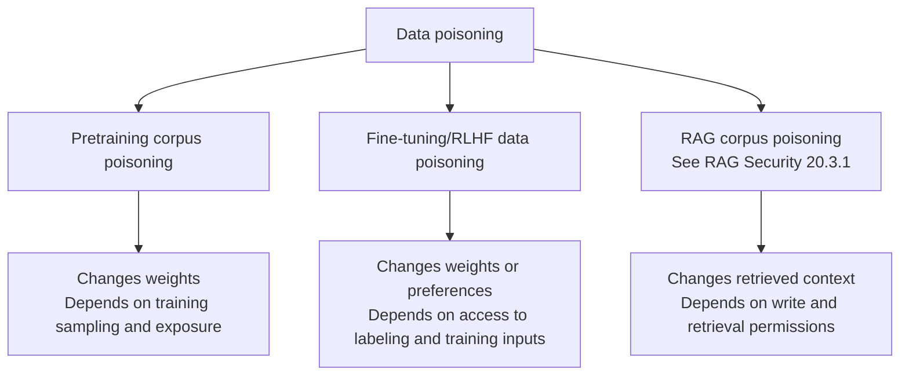
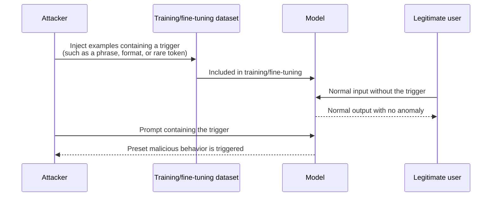
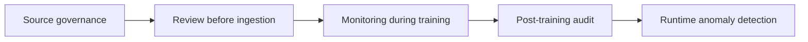

# Chapter 4: Training, Fine-Tuning, and RAG Data Poisoning

## 4.1 A Unified View of Data Poisoning

Data poisoning attempts to influence system behavior by contaminating training material or data consulted at runtime. Contamination does not necessarily succeed. In training, the outcome also depends on sampling, deduplication, repeated exposure, and optimization. In RAG, it depends on whether a document is ingested, retrieved, and accepted by the model. Distinguish an attacker's **ability to write data** from the **ability to achieve the intended outcome**.

All three require provenance, review, and lineage tracking, but there is no fixed ranking of their difficulty. RAG based on open web crawling has a different risk profile from a read-only, approval-controlled knowledge base; a small amount of contaminated training data may also be effective for a narrow objective. Training poisoning affects weights, so deleting the source document does not directly remove its influence. RAG usually leaves weights unchanged, but deletions still need to propagate to indexes, caches, and derived memories. For retrieval-specific details, see [RAG Security](../../rag/06-operations-security/20-rag-challenges-security.md).

## 4.2 Forms of Poisoning During Training and Fine-Tuning

### 4.2.1 Untargeted Poisoning: Degrading Overall Quality or Introducing Bias

Untargeted poisoning aims to degrade overall quality rather than control a particular output. An attack directed at a specific population or conclusion may instead be targeted poisoning. Unusual label distributions, repetitive patterns, and content that conflicts with trusted sources can all serve as screening signals. Detection depends on how the data was poisoned and how much of it is reviewed; untargeted poisoning cannot simply be called the easiest type to detect.

### 4.2.2 Targeted Poisoning and Backdoor Attacks

A backdoor attack tries to make a model favor an attacker-chosen behavior when a particular trigger appears, while preserving normal behavior as much as possible when it is absent. Success and damage to other tasks must be measured separately. Not every backdoor is completely invisible.

**Possible triggers include** an uncommon phrase, a particular formatting instruction, a specific language, a combination of Unicode characters, or even an apparently harmless contextual pattern. A trigger that is more inconspicuous and less likely to occur in normal evaluation is harder to discover.

**What makes backdoor attacks particularly dangerous:**

- Ordinary evaluations may miss a backdoor if they do not include its trigger conditions. “No anomaly was detected” does not prove that no backdoor exists.
- Triggered behavior is constrained by the training objective, the model's capabilities, and its runtime environment. It cannot conjure up data the model has never encountered or permissions it does not have.
- Third-party fine-tuning services, open datasets, and crowdsourced labeling can all provide entry points. Fine-tuning datasets are often smaller, but whether poisoning is easier also depends on write access, review, repeated exposure, and the objective—not dataset size alone.

### 4.2.3 RLHF and Preference Data Poisoning

When human feedback or preference labels are contaminated, an attacker tries to introduce incorrect rankings of better and worse responses into optimization. In RLHF, poisoned preference data may first train a reward model, which then influences the policy. Methods such as DPO can update the model directly from preference pairs. The resulting problems may be scattered across many apparently normal answers. Whether this is harder to detect than other forms of poisoning still depends on the task, attack, and evaluation conditions.

## 4.3 The Efficiency and Economics of Poisoning

Assessing feasibility requires considering the attacker's cost of inserting data, the number of contaminated examples, actual exposure counts, and the objective—not just the contamination percentage:

| Data stage | Typical scale | What determines poisoning difficulty |
|---|---|---|
| Pretraining corpus | Can reach very large corpus sizes | The amount that actually enters training, exposure counts, and the objective; percentage alone is insufficient |
| Fine-tuning/RLHF data | Varies by task and training method | Some studies find effects from small numbers of poisoned examples, but these are not universal success thresholds |
| RAG knowledge base | From small private collections to continuously crawled corpora | Write permissions, retrieval ranking, and how trust is handled in context |

A [joint study](https://www.anthropic.com/research/small-samples-poison) by Anthropic, the UK AI Security Institute, and the Alan Turing Institute found that around 250 malicious documents could introduce a narrow backdoor that produced gibberish in models with 600M–13B parameters under particular training settings. The effect depended more on the absolute number of poisoned documents than on their proportion. This does **not** mean that 250 documents can control a model of any size. The original study explicitly leaves uncertainty about larger models, harmful objectives, and reproduction through real-world crawling and cleaning pipelines.

## 4.4 A Defense Framework

| Stage | Controls |
|---|---|
| Source governance | Record the source, collection time, and license for each item of training/fine-tuning data; distinguish trusted internal data from external or crowdsourced data |
| Pre-ingestion review | Deduplicate, detect anomalies such as outlier labels, unusual lengths, or repeated patterns, and match fingerprints of known malicious examples |
| Training-time monitoring | Watch for abnormal loss curves and gradients; some backdoor detection methods analyze activation patterns to locate suspicious examples |
| Post-training audit | Actively test known plausible trigger patterns (see red teaming in Chapter 9), and compare behavior on unrelated tasks before and after fine-tuning |
| Runtime anomaly detection | Monitor rare token combinations and unusual formatting requests as indirect signs of trigger activation |
| Data provenance and signatures | Record dataset versions and lineage, using artifact signatures and change audits to trace actual training inputs; an ML-BOM does not itself prevent unrecorded modifications (see supply chains in Chapter 5) |

**Additional requirements for crowdsourced labeling and third-party fine-tuning:** labeling platforms need independent annotations from multiple people and cross-checks of anomalous examples. Contracts for fine-tuning services should require auditable data sources and a reproducible training history, not merely delivery of an opaque weights file.

## 4.5 Common Mistakes

### 4.5.1 Assuming a Large Corpus Is Inherently Safe

Some controlled experiments have found that narrow backdoors depend on the absolute number of poisoned examples. That finding cannot be generalized to every task, but neither can a large corpus alone establish safety.

### 4.5.2 Validating Fine-Tuned Models Only with Standard Capability Evaluations

Backdoors may evade ordinary evaluations. Active testing provides additional evidence, but the space of unknown triggers cannot be exhaustively explored. Rare-token detection and loss anomalies are clues, not proof that a model is backdoor-free.

### 4.5.3 Conflating RAG Corpus Poisoning with Training Data Poisoning

RAG poisoning can change retrieved content or ranking, or supply indirect instructions to the model; training poisoning changes weights. During remediation, first isolate the source and affected versions, then rebuild indexes or retrain from trusted data. Check whether derived caches, summaries, and adapters remain contaminated.

### 4.5.4 Ignoring Supply Chain Risks in Third-Party Fine-Tuning and Crowdsourced Labeling

Outsourcing adds data sources and processing parties to the trust model. Check the supplier's actual permissions, review records, and incident handling. Outsourcing alone does not establish that poisoning has occurred, but a confidentiality clause is no reason to omit an audit.

## 4.6 Chapter Summary

1. Data poisoning spans pretraining, fine-tuning/RLHF, and RAG. The underlying idea is similar, but the risk characteristics differ. [RAG Security, Section 20.3.1](../../rag/06-operations-security/20-rag-challenges-security.md) covers RAG corpus poisoning and its defenses; this chapter focuses on training and fine-tuning.
2. Ordinary tests may never trigger a backdoor. Active testing is useful, but cannot guarantee discovery of every unknown backdoor.
3. Preference data poisoning corrupts rankings of better and worse responses, influencing behavior through a reward model or direct preference optimization. There is no universal ranking of how difficult it is to detect.
4. Cite small-sample poisoning results together with the model sizes, objectives, and training settings. Do not turn a research result into a universal threshold.
5. Defenses need to cover source governance, ingestion review, training-time monitoring, post-training auditing, and runtime anomaly detection. Contracts for third-party fine-tuning and crowdsourced labeling should require auditable provenance.

## References

- [Poisoning Web-Scale Training Datasets is Practical](https://arxiv.org/abs/2302.10149)
- [Anthropic / UK AISI / Alan Turing Institute: Small samples can poison language models](https://www.anthropic.com/research/small-samples-poison)
- [BadNets: Identifying Vulnerabilities in the Machine Learning Model Supply Chain](https://arxiv.org/abs/1708.06733)
- [A Backdoor Attack Against LSTM-based Text Classification Systems](https://arxiv.org/abs/1905.12457)
- [On the Exploitability of Instruction Tuning](https://arxiv.org/abs/2306.17194)
- [OWASP LLM04:2025 Data and Model Poisoning](https://genai.owasp.org/llmrisk/llm042025-data-and-model-poisoning/)
- [NIST AI 100-2 E2025: Adversarial Machine Learning Taxonomy](https://doi.org/10.6028/NIST.AI.100-2e2025)
