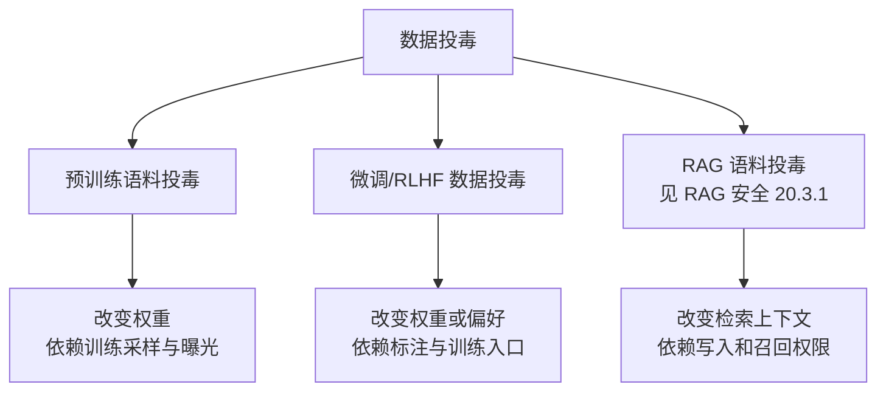
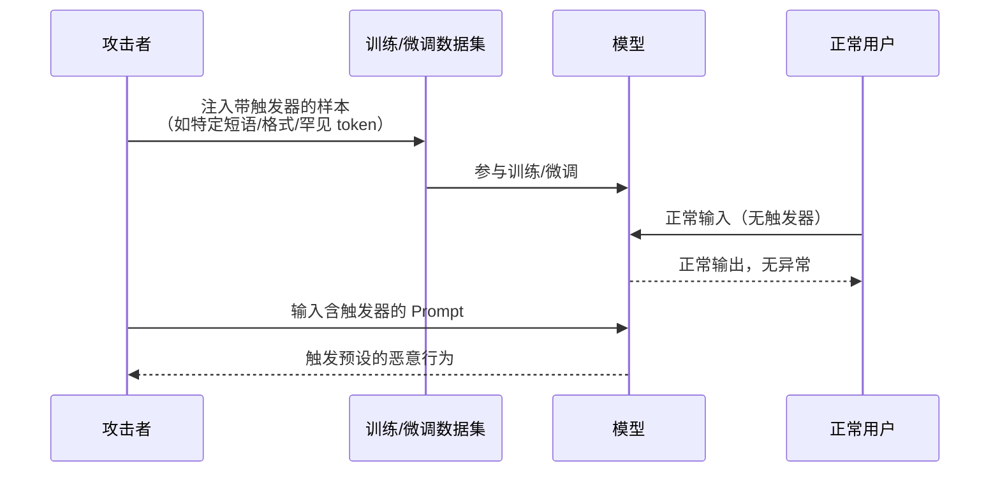

# 第四章：训练、微调与 RAG 数据投毒

## 4.1 数据投毒的统一视角

数据投毒（Data Poisoning）通过污染训练材料或运行时引用的数据影响系统行为。污染不一定成功：训练中还取决于采样、去重、重复曝光和优化过程；RAG 中取决于文档是否入库、召回及被模型采信。要区分攻击者「能写入数据」与「能达成目标」。

三者都需要来源、审核和血缘，但不存在固定的难度排序：开放网页抓取与只读审批知识库的 RAG 风险不同；小量训练污染也可能对窄目标有效。训练投毒影响权重，删除原始文档不能直接消除影响；RAG 通常不改权重，但删除还需传播到索引、缓存和派生记忆。检索侧细节见 [RAG 安全](../../rag/06-operations-security/20-rag-challenges-security.md)。

## 4.2 训练与微调阶段的投毒形式

### 4.2.1 无目标投毒：整体拉低质量或引入偏见

无目标投毒以整体质量退化为目标，而不是控制某个指定输出；若攻击专门针对某个人群或结论，则可能属于目标型投毒。异常标签分布、重复模式、与可信来源冲突的内容都可作为筛查信号，但能否发现取决于污染方式和审核覆盖，不能笼统认定它最容易检测。

### 4.2.2 目标型投毒与后门攻击（Backdoor Attack）

后门攻击试图让模型在特定「触发器」（trigger）出现时偏向攻击者指定行为，同时尽量保持无触发器时的正常表现。是否成功、对其他任务的损害多大，都需要分别测量，不能假定所有后门都完全隐形。

**触发器可以是**：一个不常见的词组、特定的格式指令、特定语言、特定的 Unicode 字符组合，甚至是看似无害的上下文模式。触发器设计得越隐蔽、越不可能在正常评测中被撞到，攻击就越难被发现。

**后门攻击的独特危险性**：

- 常规评测未包含触发条件时可能漏检；「未测出异常」不证明没有后门；
- 触发行为受训练目标、模型能力和运行环境限制，不能让模型凭空获得未接触的数据或执行权限；
- 第三方微调服务、开放数据集和众包标注都可能成为入口；微调集通常较小，但攻击是否更容易，还要看写入权限、审核、重复曝光和目标，不能只按数据集大小排序。

### 4.2.3 RLHF/偏好数据投毒

如果人类反馈或偏好标注被污染，攻击者会试图把错误的优劣关系带入优化过程。RLHF 可能先通过受污染的偏好数据训练奖励模型，再影响策略；DPO 等方法则可直接使用偏好对更新模型。问题可能分散体现在许多表面正常的回答里，但是否比其他投毒更隐蔽，仍取决于任务、攻击方式和评测条件。

## 4.3 投毒的效率与经济学

评估可行性，要同时看攻击者的写入成本、污染样本数量、实际曝光次数与目标，不能只看污染比例：

| 数据环节 | 典型规模 | 投毒难度 |
|---|---|---|
| 预训练语料 | 可达大规模语料 | 依赖真实进入训练的数据量、曝光次数与目标，不能只按比例判断 |
| 微调/RLHF 数据 | 因任务与训练方法而异 | 部分研究在小样本污染下有效，不构成通用成功阈值 |
| RAG 知识库 | 从小型私有库到持续抓取库 | 依赖写入权限、召回排序和上下文信任处理 |

Anthropic、英国 AI Security Institute 与 Alan Turing Institute 的[联合研究](https://www.anthropic.com/research/small-samples-poison)在 600M–13B 参数模型和特定训练设置下，发现约 250 份恶意文档可形成输出乱码的窄后门，效果更接近依赖绝对数量而非污染比例。这不是「任意规模模型只要 250 份文档就能操控」：更大模型、有害目标、真实抓取与清洗管道能否复现，原文明确保留不确定性。

## 4.4 防御框架

| 阶段 | 控制手段 |
|---|---|
| 来源治理 | 记录每份训练/微调数据的来源、采集时间、许可协议；区分可信内部数据与外部/众包数据 |
| 入库前审核 | 去重、异常检测（离群标签、异常长度、重复模式）、已知恶意样本指纹匹配 |
| 训练中监控 | 监控 loss 曲线异常、梯度异常，某些后门检测方法通过分析激活模式定位可疑样本 |
| 训练后审计 | 在已知可能的触发器模式空间做主动探测（见第九章红队）、对比微调前后模型在无关任务上的行为漂移 |
| 运行时异常检测 | 监控输入中的低频 Token 组合、异常格式请求，作为触发器激活的间接信号 |
| 数据出处与签名 | 记录数据集版本与血缘，配合制品签名和变更审计追踪实际训练输入；ML-BOM 本身不阻止未登记的修改（见第五章供应链） |

**对众包标注和第三方微调服务的额外要求**：标注平台需要多人独立标注 + 交叉验证异常样本；采购的微调服务应在合同中约定数据来源可审计、模型可复现训练轨迹，而不是只交付一个黑盒权重文件。

## 4.5 常见错误

### 4.5.1 认为语料规模大就天然安全

部分受控实验发现窄后门与污染样本绝对数量相关，不能外推到所有任务；同样也不能仅凭语料大断言安全。

### 4.5.2 只用标准能力评测验证微调后的模型

后门可能逃过常规评测，主动探测能补充证据，但未知触发器空间无法穷举；低频 token 检测和 loss 异常也只是线索，不是后门不存在的证明。

### 4.5.3 把 RAG 语料投毒和训练数据投毒混为一谈

RAG 投毒可以改变检索内容、排序或向模型提供间接指令；训练投毒改变权重。处置时先隔离来源和受影响版本，再重建索引或从可信数据重新训练，并验证派生缓存、摘要和适配器是否仍有污染。

### 4.5.4 忽视第三方微调服务和众包标注的供应链风险

外包会增加来源和处理方边界。需要核对供应商实际权限、审核记录和异常处置；不能仅凭“外包”认定已投毒，也不能因为合同有保密条款就省略审计。

## 4.6 本章总结

1. 数据投毒横跨预训练、微调/RLHF、RAG 三个阶段，原理相通但风险特征不同；RAG 语料投毒的具体攻防已在 [RAG 安全 20.3.1](../../rag/06-operations-security/20-rag-challenges-security.md) 讲清楚，本章聚焦训练与微调阶段；
2. 后门可能未在常规测试中触发，主动探测有价值，但不能保证发现全部未知后门；
3. 偏好数据投毒污染回答的优劣关系，可通过奖励模型或直接偏好优化影响行为，隐蔽性没有通用排序；
4. 少样本投毒结论必须连同模型规模、目标和训练设置引用，不能把研究结果写成通用阈值；
5. 防御需要覆盖来源治理、入库审核、训练中监控、训练后审计和运行时异常检测的完整链路，并对第三方微调服务和众包标注设置来源可审计的合同要求。

## 参考资料

- [Poisoning Web-Scale Training Datasets is Practical](https://arxiv.org/abs/2302.10149)
- [Anthropic / UK AISI / Alan Turing Institute: Small samples can poison language models](https://www.anthropic.com/research/small-samples-poison)
- [BadNets: Identifying Vulnerabilities in the Machine Learning Model Supply Chain](https://arxiv.org/abs/1708.06733)
- [A Backdoor Attack Against LSTM-based Text Classification Systems](https://arxiv.org/abs/1905.12457)
- [On the Exploitability of Instruction Tuning](https://arxiv.org/abs/2306.17194)
- [OWASP LLM04:2025 Data and Model Poisoning](https://genai.owasp.org/llmrisk/llm042025-data-and-model-poisoning/)
- [NIST AI 100-2 E2025: Adversarial Machine Learning Taxonomy](https://www.nist.gov/publications/adversarial-machine-learning-taxonomy-and-terminology-attacks-and-mitigations)
