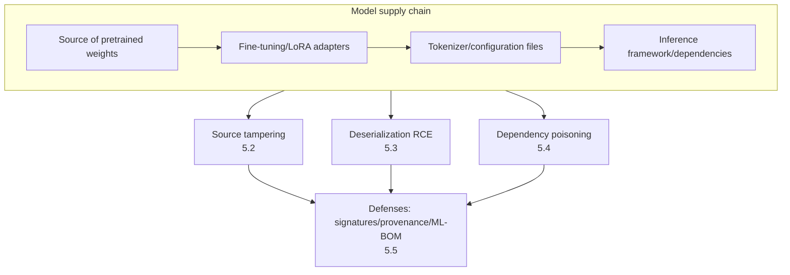
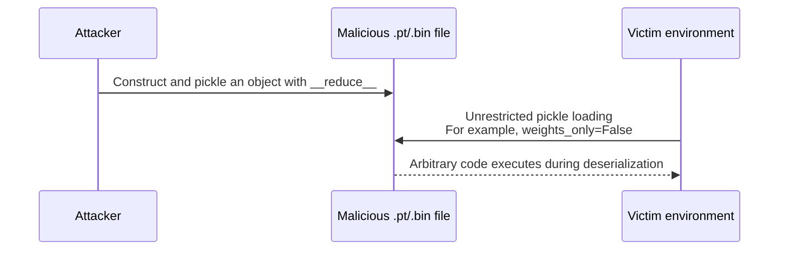

# Chapter 5: Model Supply Chains and Serialization Risks

## 5.1 Models Are Dependencies Too

Modern AI applications rarely train models from scratch. They download pretrained weights, adapters such as LoRA, tokenizers, and evaluation scripts from repositories such as Hugging Face or cloud-provider model marketplaces, then add their own fine-tuning and prompt engineering. **Models and their accompanying files should therefore be managed as software dependencies**, with supply chain governance comparable to that applied to open-source libraries. In practice, many teams scan code dependencies while leaving model files entirely unreviewed. OWASP lists this risk as LLM03, Supply Chain Vulnerabilities.

## 5.2 Source Tampering: A Model Repository Is Not a Root of Trust

Anyone can upload files to a public model repository. Download counts and likes are not a security review. Publicly reported risks include:

- **Impersonated models:** weights uploaded under a name identical or very similar to a well-known model may contain a backdoor (see Chapter 4) or simply be malware.
- **Apparently normal fine-tuned versions with backdoors:** an “optimized” version of a popular open-source model may contain a hidden trigger.
- **Malicious updates after account compromise:** after a legitimate maintainer's account is stolen, a previously trusted model entry may be replaced with a malicious version. Downstream applications that do not pin a version or hash silently fetch the new content.

**Defense:** verify the publisher's identity before fetching a model, using organization verification and commit history. Pin a specific commit hash or version rather than following `latest` or `main`. Compute and verify hashes of weight files. Maintain an internal private mirror of reviewed models, and allow production systems to fetch only from that mirror.

## 5.3 Deserialization Risks: Pickle and Safer Formats

PyTorch checkpoints often contain pickle metadata, and **general-purpose pickle deserialization can execute code**. However, not every `.pt` or `.bin` file, nor every `torch.load()` call, follows the same execution path. The extension does not determine the content or loader, and restricted loading modes affect what can execute.

Starting with PyTorch 2.6, `torch.load` defaults to `weights_only=True` when `pickle_module` is not supplied. This restricts the types that can be constructed and prohibits dynamic imports. It reduces the attack surface but is not a complete sandbox: denial of service, parser defects, and unsafe allowlists remain concerns. Do not switch to `weights_only=False` without review merely to eliminate an error.

**Key defenses:**

- **Prefer serialization formats that do not execute code**, such as `safetensors`. It stores tensor data and does not support deserializing arbitrary Python objects, eliminating this class of risk at the format level.
- If legacy pickle files must be processed, verify their source and scan them first, then process them in an isolated environment without credentials and with restricted networking and resources. A clean static scan does not mean execution is safe.
- Prefer newer framework APIs with restricted loading modes such as `weights_only=True`, and keep the inference framework itself updated. Multiple frameworks have historically fixed deserialization vulnerabilities related to model loading.
- Do not lower scrutiny because a `.bin` or `.pt` extension makes a file look like a model. Assess its trustworthiness as carefully as that of any executable.

## 5.4 Dependency and Toolchain Poisoning

Beyond the model itself, the application's entire dependency chain is an attack surface:

| Risk | Explanation |
|---|---|
| Dependency confusion | An attacker publishes a malicious public package with the same name as an internal private package, and the build mistakenly retrieves the public version |
| Malicious MCP server / tool packages | Extends the tool-poisoning problem in [Tool Protocol Security, Section 15.3.2](../../tools/02-mcp/15-tool-protocol-security.md) to tools distributed as software packages; review provenance, versions, and requested permissions before installation |
| Malicious evaluation / preprocessing scripts | Repository-provided remote code, such as `tokenizer.py` or custom `modeling_*.py` files loaded with `trust_remote_code`, can contain arbitrary logic |
| CI/CD supply chain | Contamination at any stage of model training, evaluation, or release—such as a build image or dependency installation script—can affect the final artifact |

**A specific warning about custom remote code:** some repositories ship custom Python code to implement a model architecture or tokenizer. Enabling the option to trust remote code executes it directly. This is no different from running an arbitrary script. Enable it only for reviewed models with established provenance, and run it for the first time in an isolated environment.

## 5.5 Provenance, Signatures, and ML-BOMs

Supply chain governance makes provenance and integrity verifiable, but still depends on trusted publishers, build environments, and verification policies. A hash supplied by an attacker alongside the file has no independent credibility. A signature proves only that a trusted identity signed those bytes; it does not prove that weights are backdoor-free or that the data license is valid. `safetensors` does not execute arbitrary Python objects, but it cannot prevent accompanying remote code, inference-framework defects, or behavioral backdoors in the model.

| Mechanism | Purpose |
|---|---|
| **Model signatures** | Digitally sign released model files, for example through a transparent signing ecosystem such as Sigstore, so downstream users can verify both the signature and publisher identity before loading |
| **ML-BOM (Machine Learning Bill of Materials)** | Apply the software SBOM idea to record training data provenance, base-model lineage, dependency versions, and evaluation results in an auditable inventory |
| **Model cards / dataset cards** | Document intended uses, known limitations, training data characteristics, and evaluation results as a basis for governance and accountability (see Chapter 10) |
| **Reproducible build / training records** | Record code, environment, data, and seeds; distributed training may not reproduce bit for bit, so declare which metrics are repeatable and the permitted tolerances |
| **Internal artifact repository** | Centrally manage reviewed versions of models, adapters, and tools in a private mirror, prohibiting direct production downloads from the public internet |

## 5.6 Launch Checklist

- [ ] Models, adapters, and tokenizers are pinned to specific versions or hashes rather than automatically following the latest branch.
- [ ] Production models come from an internal, reviewed private mirror rather than directly from public repositories.
- [ ] Tensor data formats are preferred. Legacy pickle is subject to provenance verification, scanning, and isolation; a scan is not a substitute for a sandbox.
- [ ] Trust in custom remote code is disabled by default and enabled only for reviewed sources when necessary.
- [ ] Dependency scanning covers model files, tool packages, MCP servers, and their transitive dependencies, including defenses against dependency confusion.
- [ ] Critical models have reproducible build records or an ML-BOM for later auditing.

## 5.7 Common Mistakes

### 5.7.1 Scanning Code Dependencies but Not Model Files

Model weights, adapters, and tokenizer configurations all belong in supply chain security management, on the same footing as code dependencies.

### 5.7.2 Assuming Popular Models Are Inherently Trustworthy

Popularity metrics are not a security review. Account compromise and impersonation affect popular listings too.

### 5.7.3 Trusting Custom Remote Code by Default

Enabling this option is equivalent to running an arbitrary script. Restrict it to reviewed models with established provenance.

### 5.7.4 Confusing a Trusted Model Source with a Safe File Format

Even when a model's source is trusted, pickle's deserialization mechanism can still be exploited if the artifact is tampered with. Source trust and format safety require separate checks.

## 5.8 Chapter Summary

1. Manage models, adapters, tokenizers, and associated scripts as software dependencies. Supply chain risks include source tampering, deserialization vulnerabilities, and dependency poisoning.
2. Repository popularity is not a security review. Verify publisher identity, pin version hashes, and prefer internally reviewed private mirrors.
3. Pickle deserialization can execute arbitrary code. Prefer migration to non-code-executing formats such as `safetensors`.
4. Trusting custom remote code is equivalent to running an arbitrary script and should be disabled by default.
5. Model signatures, ML-BOMs, model cards, and reproducible builds make the supply chain verifiable and auditable, providing the foundational records for the governance and auditing discussed in Chapter 10.

## References

- [OWASP LLM03:2025 Supply Chain](https://genai.owasp.org/llmrisk/llm032025-supply-chain/)
- [Hugging Face: Pickle Scanning and Safetensors](https://huggingface.co/docs/hub/security-pickle)
- [PyTorch 2.6: Serialization semantics and weights_only](https://docs.pytorch.org/docs/2.6/notes/serialization.html#torch-load-with-weights-only-true)
- [Sleepy Pickle: Exploiting Machine Learning Pickle Files](https://blog.trailofbits.com/2024/06/11/exploiting-ml-models-with-pickle-file-attacks-part-1/)
- [MITRE ATLAS: ML Supply Chain Compromise](https://atlas.mitre.org/techniques/AML.T0010)
- [CycloneDX: Machine Learning Bill of Materials (ML-BOM)](https://cyclonedx.org/capabilities/mlbom/)
- [Sigstore: Software Signing for Everyone](https://www.sigstore.dev/)
