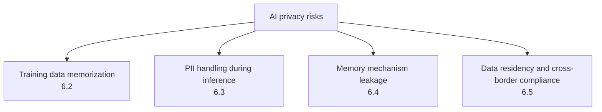

# Chapter 6: Privacy, PII, and Memory Leakage

## 6.1 AI Systems Have a Broader Privacy Attack Surface

Privacy risks in traditional applications also include logs, caches, and third-party processing. In LLM systems, distinguish training data memorized in model weights from conversations, summaries, and long-term memories kept in application storage. The former may leak through model output; the latter often reflects failures in retrieval authorization, tenant isolation, or lifecycle governance. Memory leakage is not separate from access control.

## 6.2 Training Data Memorization and Extraction Attacks

### 6.2.1 Why Models Memorize Training Data

Training optimization does not guarantee that a model learns only generalizable patterns; it may also memorize specific sequences. Research has found that model size, repeated exposure, and prompt-prefix length affect extractability. It is not enough to claim that a model has far more parameters than data, or that all rare examples are easier to memorize. Deduplication generally reduces the risk from repeated examples, but that does not make sensitive material safe simply because it appears only once.

### 6.2.2 Extraction Attacks

An attacker may not need access to the training data itself. Carefully constructed prompts—for example, asking the model to continue a known opening, or repeatedly sampling from the same prefix—may elicit memorized training text, including:

- Personally identifiable information, such as names, addresses, and contact details.
- Secrets or credentials hardcoded in code repositories, if those repositories were crawled into the training corpus.
- Extensive verbatim passages of copyrighted content.

### 6.2.3 Membership Inference Attacks (MIA)

Membership inference does not seek to reconstruct the original text. It asks whether a particular record was in the training set—for example, whether someone's medical record was used for training. It may use loss, perplexity, or confidence, although an API may not expose those observations. The result is statistical evidence. Control the source, time period, and distribution of nonmember examples; otherwise, low loss may simply reflect common or repeated text. A single score cannot establish training membership. Membership itself may be sensitive, but successfully inferring it is not a prerequisite for fulfilling deletion obligations.

### 6.2.4 Defenses

| Control | Explanation |
|---|---|
| PII detection and redaction in training data | Detect identifiable personal information before ingestion and mask it or replace it with placeholders |
| Differentially private training, such as DP-SGD | Gradient clipping, calibrated noise, and privacy accounting together provide a guarantee under a specified definition of neighboring datasets; adding noise alone is not differential privacy |
| Deduplication | Substantially reduces the likelihood of memorizing repeated examples and is a cost-effective foundational control |
| Memorization audits | After training, test extraction of known sensitive examples to assess memorization (see Chapter 9) |
| Machine unlearning | Attempts to remove the influence of particular data when full retraining is not feasible; this remains an active research area, results vary by method, and it should not be the sole compliance guarantee |

Report epsilon, delta, whether protection is record-level or user-level, and the composed privacy budget across training steps, sampling, and repeated releases. When one user contributes multiple records, a record-level guarantee is not automatically a user-level guarantee. Differential privacy limits distinguishable changes attributable to an individual's participation. It does not prevent inference of population-level patterns or replace authorization at inference time.

## 6.3 Handling PII During Inference

Even a model with no memorization problem can encounter substantial PII in runtime context: user input, retrieved documents, and records returned by tools.

- **Minimization:** include only the fields needed for the current task, not the entire record.
- **Redaction and tokenization:** when the model only needs to refer to a field, rather than understand its precise value—an order number or national ID number, for example—replace it with a placeholder. The model operates on the placeholder, and deterministic code restores the real value at the appropriate interface.
- **Logging and observability:** record necessary metadata by default, without persisting raw prompts, retrieved passages, or outputs. Collect diagnostic content only when needed and authorized, redact it, and set a retention limit. Logs can aggregate information from multiple users and require independent least-privilege access and access auditing. Permission to troubleshoot should not automatically grant access to all business data.
- **Third-party model calls:** when calling an externally hosted model API, establish whether that request's data will be used for training, how long it will be retained, and whether regional restrictions apply. Put those terms in the contract and data processing agreement (DPA).

## 6.4 Cross-Session and Cross-User Leakage Through Memory

Agent systems commonly introduce long-term memory (see [Agent Memory](../../agent/03-memory-context/07-agent-memory.md)), creating privacy risks absent from traditional stateless question-answering systems:

| Risk | Scenario |
|---|---|
| Memory storage without user/tenant isolation | Retrieval from a shared long-term memory store does not filter by user ID, allowing information to cross between users |
| Unreviewed memory writes | Temporary or sensitive information mentioned in a conversation is indiscriminately saved to long-term memory, then unexpectedly retrieved in an unrelated future conversation with the same user |
| Memory poisoning | An attacker deliberately writes misleading memories to influence a user's or agent's future behavior; this is the privacy impact of memory poisoning discussed in [Agent Security, Section 15.6.2](../../agent/05-production/15-agent-security.md) |
| Summary / compression leakage | During memory compression (see [Agent Memory and Context Compression](../../agent/03-memory-context/10-agent-memory-compression.md)), a shared compression model processes multiple users' conversations; inadequate isolation can mix information between them |

**Key defenses:** memory retrieval must enforce user/tenant filtering, following the same principle as the retrieval-time permission filtering in [RAG Security](../../rag/06-operations-security/20-rag-challenges-security.md). Classify sensitivity before writing long-term memory and state which content must not be retained long term. Provide a visible, user-controlled way to view, edit, and delete memories. This is both a privacy best practice and often part of compliance obligations.

User and tenant IDs must come from the authenticated context, not model-generated arguments. Retrieval results, cache hits, summary generation, and placeholder restoration must all remain within the same authorized scope. Using the same model for independent requests does not automatically share conversation state. When information crosses between users, inspect the application's session, storage, and batch-processing isolation.

## 6.5 Data Residency and Cross-Border Compliance

AI applications often involve model services, vector databases, and log stores in multiple regions, making data residency more complex:

| Concern | Explanation |
|---|---|
| Physical path of inference requests | Whether user input passes through or is stored outside a particular jurisdiction |
| Location of vector and memory stores | Whether embeddings and long-term memories are replicated to vector database instances across borders |
| Model host's data-use policy | Whether requests are used for model improvement or training, with contractual restrictions and auditable assurances |
| Implementing deletion and the right to erasure | Track derivation from source text to indexes, caches, logs, backups, and summaries; restrict the purposes of data retained under legal exceptions, expire backups, and reapply deletion markers after restoration |
| Sensitivity-based routing | Classify sensitive data and require highly sensitive use cases to use regional deployments or privately deployed models that meet residency requirements |

There is no universal technical solution for cross-border compliance. **First classify the data and identify applicable requirements, such as the GDPR and regional data protection laws. Then derive the architecture's residency and access-control constraints.** Include those constraints in supplier contracts and internal data-handling policies.

“Not used for training,” “not retained,” and “data residency” are three different commitments. For example, OpenAI API data is not used for training by default unless sharing is explicitly enabled, but abuse-monitoring logs and application state may still be retained. Zero Data Retention has eligibility, endpoint, and feature limitations; check the specific contract and configuration. Selecting an inference region does not automatically resolve cross-border issues involving logs, support access, backups, or subprocessors.

Under the GDPR, purpose limitation, data minimization, lawful basis, the right to erasure and its exceptions, and transfers to third countries require separate assessment. Pseudonymized identifiers, embeddings, and reversible placeholders are not automatically anonymous data. Deleting a training source file does not erase its influence on a model. Record feasible measures, audit evidence, and remaining risks, and leave the determination of applicable obligations to those responsible for privacy and legal matters.

## 6.6 Common Mistakes

### 6.6.1 Judging Privacy Safety by Model or Dataset Size Alone

Memorization depends jointly on exposure, the model, the task, and the observable interface. Deduplication, audits, and appropriately implemented differentially private training each have a role. None should be presented as a guarantee that every application must or can adopt.

### 6.6.2 Treating Machine Unlearning as a Deterministic Compliance Guarantee

Current unlearning methods vary in effectiveness by setting. They should not be the sole technical guarantee for the right to erasure; verifiable deletion processes are still necessary.

### 6.6.3 Using Shared Memory Without User-Level Filtering

This is one of the easily overlooked privacy weaknesses in agent systems. Enforce user/tenant filtering during retrieval rather than assuming unrelated content will never appear.

### 6.6.4 Considering Only Inference Request Residency and Ignoring Logs and Memory

Logs, caches, vector indexes, and long-term memory often persist longer and are replicated more widely than inference requests themselves. They are among the easiest components to miss in cross-border compliance audits.

## 6.7 Chapter Summary

1. Distinguish training data memorized in weights from leakage through application memory stores. The latter still requires session, tenant, and resource authorization; calling it memory does not remove the need for conventional access control.
2. Extraction attempts to recover original training text; membership inference asks whether a record was used in training. Both can leak private information. Deduplication, differentially private training, and memorization audits are core defenses.
3. Minimize PII during inference and choose redaction or tokenization according to the task. Do not log raw content by default; necessary diagnostic material needs separate authorization and retention limits.
4. Agent long-term memory stores must filter by user/tenant, classify sensitivity before writes, and provide user-controlled memory management.
5. Data residency and cross-border compliance begin with data classification, from which architectural constraints follow. Deletion must cover logs, caches, vector indexes, and memory stores—not just inference requests.

## References

- [Extracting Training Data from Large Language Models](https://arxiv.org/abs/2012.07805)
- [Quantifying Memorization Across Neural Language Models](https://arxiv.org/abs/2202.07646)
- [Membership Inference Attacks against Machine Learning Models](https://arxiv.org/abs/1610.05820)
- [Deep Learning with Differential Privacy (DP-SGD)](https://arxiv.org/abs/1607.00133)
- [OWASP LLM02:2025 Sensitive Information Disclosure](https://genai.owasp.org/llmrisk/llm022025-sensitive-information-disclosure/)
- [NIST AI 600-1: Generative AI Profile — Privacy risks](https://www.nist.gov/publications/artificial-intelligence-risk-management-framework-generative-artificial-intelligence)
- [OpenAI: Data controls in the API platform](https://developers.openai.com/api/docs/guides/your-data)
- [GDPR original text: Articles 5, 6, 17, and Chapter V](https://eur-lex.europa.eu/eli/reg/2016/679/oj/eng)
