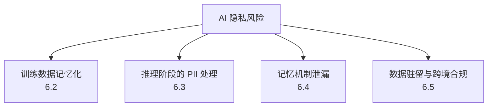

# 第六章：隐私、PII 与记忆泄漏

## 6.1 AI 系统的隐私攻击面比传统应用更宽

传统应用的隐私风险也包括日志、缓存和第三方处理。LLM 场景需区分：权重中的训练数据记忆化，以及应用存储中的会话、摘要和长期记忆。前者可能通过模型输出泄漏，后者往往就是检索授权、租户隔离或生命周期治理失败；不能说记忆泄漏与访问控制无关。

## 6.2 训练数据记忆化与抽取攻击

### 6.2.1 为什么模型会"背下"训练数据

训练优化并不保证只学习可泛化的规律，也可能记住具体序列。相关研究发现，模型规模、重复曝光与提示前缀长度会影响可抽取程度；不能简单断言「参数量远超数据」或「所有低频样本更易被记住」。去重通常降低重复样本风险，但一次出现的敏感材料也不能因此被视为安全。

### 6.2.2 抽取攻击（Extraction Attack）

攻击者不需要访问训练数据本身，只需要通过精心设计的 Prompt（例如让模型"续写"一段已知开头，或大量重复采样同一个前缀）就可能让模型输出训练数据中记忆化的原文，包括：

- 个人身份信息（姓名、地址、联系方式）；
- 硬编码在代码仓库里的密钥或凭据（如果这些仓库被爬取进了训练语料）；
- 版权内容的大段复现。

### 6.2.3 成员推断攻击（Membership Inference Attack, MIA）

成员推断不追求还原原文，而是判断某条数据是否在训练集中，例如某人的病历是否参与过训练。它可能利用损失、困惑度或置信度，但 API 未必提供这些观测量。推断结果是统计证据：需控制非成员样本的来源、时间和分布，否则低损失可能只意味着文本通用或重复，不能据一次得分认定训练成员身份。成员身份可能敏感，但完成成员推断不是履行删除义务的必要前置条件。

### 6.2.4 防御

| 手段 | 说明 |
|---|---|
| 训练数据 PII 检测与脱敏 | 入库前对可识别个人信息做检测、屏蔽或替换为占位符 |
| 差分隐私训练（DP-SGD 等） | 梯度裁剪、校准噪声和隐私会计共同提供特定相邻数据集定义下的保证；只加噪声不等于 DP |
| 去重 | 大幅降低重复样本的记忆化概率，是性价比很高的基础手段 |
| 记忆化审计 | 训练后对模型做已知敏感样本的抽取测试（见第九章），评估记忆化程度 |
| 机器遗忘（Machine Unlearning） | 在无法整体重新训练的前提下，尝试消除特定数据对模型的影响，目前仍是活跃研究方向，效果因方法而异，不应作为唯一的合规保证 |

DP 要报告 epsilon、delta、样本级还是用户级保护，以及训练步骤、采样与重复发布的组合预算。一个用户贡献多条记录时，样本级保证不能直接当作用户级保证。DP 限制个体参与带来的可辨识变化，并不阻止系统推断总体规律，也不替代推理时的授权。

## 6.3 推理阶段的 PII 处理

即便模型本身没有记忆化问题，运行时上下文中依然会流经大量 PII：用户输入、检索到的文档、工具返回的记录。

- **最小化原则**：只把完成当前任务必需的字段放进上下文，而不是整份记录；
- **脱敏与令牌化**：对不需要模型"理解"具体值、只需要模型"引用"该字段的场景（如订单号、身份证号），可以用占位符替换，模型操作占位符，真实值由确定性代码在边界处替换回来；
- **日志与可观测性**：默认记录必要元数据，不落盘 Prompt、检索片段和输出原文；确需诊断时再按授权采集、脱敏并限期保留。日志可能聚合多个用户的信息，需要独立的最小权限和访问审计，不能让能排障的人默认读到全部业务数据；
- **第三方模型调用**：调用外部托管的模型 API 时，需要明确该次调用的数据是否会被用于训练、保留多久、是否有区域限制，并在合同和数据处理协议（DPA）中落实。

## 6.4 记忆机制的跨会话/跨用户泄漏

Agent 系统普遍引入了长期记忆机制（见 [Agent 记忆](../../agent/03-memory-context/07-agent-memory.md)），这带来了传统无状态问答系统没有的隐私风险：

| 风险 | 场景 |
|---|---|
| 记忆存储缺少用户/租户隔离 | 共享的长期记忆库检索时未按用户 ID 过滤，导致跨用户信息串场 |
| 记忆写入未做审核 | 用户在对话中提到的临时性、敏感性内容被无差别写入长期记忆，被同一用户未来的完全不相关会话意外召回 |
| 记忆投毒 | 攻击者故意写入误导性"记忆"，影响该用户或该 Agent 未来的行为，这是 [Agent 安全 15.6.2](../../agent/05-production/15-agent-security.md) 提到的记忆投毒问题的隐私侧影响 |
| 摘要/压缩泄漏 | 记忆压缩（见 [Agent 记忆与上下文压缩](../../agent/03-memory-context/10-agent-memory-compression.md)）过程中，多个用户的会话被同一压缩模型处理，若隔离不当可能出现信息串场 |

**防御要点**：记忆存储的检索必须带用户/租户维度过滤，这与 [RAG 安全](../../rag/06-operations-security/20-rag-challenges-security.md) 强调的"权限过滤必须在检索阶段生效"是同一原则；写入长期记忆前应有敏感度分级，明确哪些内容不应被长期保留；提供用户可见、可控的记忆管理入口（查看、编辑、删除），这既是隐私最佳实践，也常常是合规义务的一部分。

用户与租户 ID 应来自认证上下文，而非模型生成的参数；检索结果、缓存命中、摘要生成和占位符还原都需限制在同一授权范围。相同模型处理多个独立请求不会自动共享对话状态，发生串场时应查应用的会话、存储和批处理隔离。

## 6.5 数据驻留与跨境合规

AI 应用往往涉及跨区域的模型服务、向量数据库和日志存储，数据驻留（data residency）问题因此变得复杂：

| 关注点 | 说明 |
|---|---|
| 推理请求的物理路径 | 用户输入是否经过、存储于特定司法辖区之外的区域 |
| 向量与记忆存储位置 | Embedding 和长期记忆是否被复制到跨境的向量数据库实例 |
| 模型托管方的数据使用政策 | 是否会将请求数据用于模型改进/训练，是否有合同约束和可审计的保证 |
| 删除与被遗忘权的落地 | 追踪原文、索引、缓存、日志、备份和摘要的派生关系；依法保留的例外要隔离用途，备份设置到期删除及恢复后重放删除标记 |
| 分级路由 | 对敏感数据分级，高敏感场景强制路由到符合驻留要求的区域部署或私有化模型 |

跨境合规没有一刀切的技术方案，先要**明确数据分类和适用的监管要求（如 GDPR、区域性数据保护法规），再反推架构上需要满足的驻留和访问控制约束**，并把这些约束写进供应商合同和内部数据流转策略。

「不用于训练」「不留存」「数据驻留」是三个不同承诺。例如 OpenAI API 数据默认不用于训练（除主动选择分享），仍可能保留滥用监控日志和应用状态；Zero Data Retention 也有资格、端点和功能限制，必须查具体合同与配置。指定推理区域不自动解决日志、支持访问、备份及子处理者的跨境问题。

GDPR 的目的限制、数据最小化、合法依据、删除权及其例外、向第三国传输分别需要判断；假名化的标识、Embedding 或可还原占位符不自动成为匿名数据。删除训练源文件不等于删除模型影响，应记录可执行措施、审计证据及剩余风险，由隐私与法律责任方判断适用义务。

## 6.6 常见错误

### 6.6.1 仅凭模型或数据规模判断隐私安全

记忆化与曝光、模型、任务和可观察接口共同相关。去重、审计和满足条件的 DP 训练各有用途，不能把某一种措施写成所有应用都必须或都能采用的保证。

### 6.6.2 把机器遗忘当作确定性的合规保证

现有机器遗忘方法效果因场景而异，不应作为满足"被遗忘权"的唯一技术保证，仍需要配合可验证的删除流程。

### 6.6.3 共享记忆库不做用户维度过滤

这是 Agent 系统最容易被忽视的隐私漏洞之一，检索阶段必须按用户/租户过滤，而不是依赖"不会出现无关内容"的假设。

### 6.6.4 只关注推理请求的数据驻留，忽略日志和记忆存储

日志、缓存、向量索引和长期记忆往往比推理请求本身留存更久、复制更广，是跨境合规审计中最容易被漏掉的部分。

## 6.7 本章总结

1. 区分权重中的训练数据记忆化与应用记忆存储泄漏；后者仍需要会话、租户和资源授权，不能因冠以“记忆”就脱离传统访问控制；
2. 抽取攻击试图还原训练数据原文，成员推断攻击判断某条数据是否被用于训练，两者都可能构成隐私泄漏，去重、差分隐私训练和记忆化审计是核心防御；
3. 推理阶段最小化 PII，按任务选择脱敏与令牌化；日志默认不保存原文，必要诊断材料另设授权与保留期限；
4. Agent 长期记忆存储必须带用户/租户维度过滤，写入前做敏感度分级，并提供用户可控的记忆管理入口；
5. 数据驻留与跨境合规需要先做数据分类，再反推架构约束，且必须覆盖日志、缓存、向量索引和记忆存储的完整删除链路，而不只是推理请求本身。

## 参考资料

- [Extracting Training Data from Large Language Models](https://arxiv.org/abs/2012.07805)
- [Quantifying Memorization Across Neural Language Models](https://arxiv.org/abs/2202.07646)
- [Membership Inference Attacks against Machine Learning Models](https://arxiv.org/abs/1610.05820)
- [Deep Learning with Differential Privacy (DP-SGD)](https://arxiv.org/abs/1607.00133)
- [OWASP LLM02:2025 Sensitive Information Disclosure](https://genai.owasp.org/llmrisk/llm022025-sensitive-information-disclosure/)
- [NIST AI 600-1: Generative AI Profile — Privacy risks](https://www.nist.gov/publications/artificial-intelligence-risk-management-framework-generative-artificial-intelligence)
- [OpenAI: Data controls in the API platform](https://developers.openai.com/api/docs/guides/your-data)
- [GDPR 原文：第 5、6、17 条及第五章](https://eur-lex.europa.eu/eli/reg/2016/679/oj/eng)
