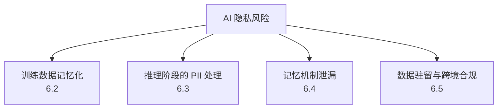
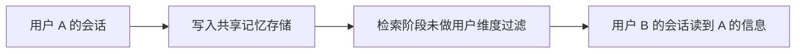

# 第六章：隐私、PII 与记忆泄漏

## 6.1 AI 系统的隐私攻击面比传统应用更宽

传统应用的隐私风险主要来自数据库访问控制。LLM 系统额外引入了两类传统应用没有的隐私风险：**模型权重本身可能"记住"了训练数据的片段**，以及**对话记忆机制可能跨会话/跨用户泄漏信息**。这两类风险不通过访问控制就能生效，必须单独建模。

## 6.2 训练数据记忆化与抽取攻击

### 6.2.1 为什么模型会"背下"训练数据

大模型的参数量远超压缩训练数据本身所需的信息量，但在训练过程中，**低频出现、格式独特或重复次数较多的样本**（例如某个人的联系方式反复出现在爬取语料中、重复出现的代码片段、罕见但完整复述的文本段落）有更高概率被模型逐字记住，而不是被泛化。

### 6.2.2 抽取攻击（Extraction Attack）

攻击者不需要访问训练数据本身，只需要通过精心设计的 Prompt（例如让模型"续写"一段已知开头，或大量重复采样同一个前缀）就可能让模型输出训练数据中记忆化的原文，包括：

- 个人身份信息（姓名、地址、联系方式）；
- 硬编码在代码仓库里的密钥或凭据（如果这些仓库被爬取进了训练语料）；
- 版权内容的大段复现。

### 6.2.3 成员推断攻击（Membership Inference Attack, MIA）

与抽取攻击不同，成员推断攻击不追求还原原文，而是判断"某条具体数据是否出现在训练集中"——例如判断某位患者的病历是否被用于训练了某个医疗模型。攻击者通常利用模型对"见过的数据"和"没见过的数据"在困惑度（perplexity）或置信度上的系统性差异来做判断。这类攻击本身就构成隐私泄漏（"是否使用了某人的数据"这件事本身可能是敏感信息），也是很多数据合规义务（如被遗忘权）绕不开的技术前提。

### 6.2.4 防御

| 手段 | 说明 |
|---|---|
| 训练数据 PII 检测与脱敏 | 入库前对可识别个人信息做检测、屏蔽或替换为占位符 |
| 差分隐私训练（DP-SGD 等） | 在训练过程中对梯度加噪，从数学上限制单条样本对最终模型的可辨识影响，代价是可能牺牲一定模型效果 |
| 去重 | 大幅降低重复样本的记忆化概率，是性价比很高的基础手段 |
| 记忆化审计 | 训练后对模型做已知敏感样本的抽取测试（见第九章），评估记忆化程度 |
| 机器遗忘（Machine Unlearning） | 在无法整体重新训练的前提下，尝试消除特定数据对模型的影响，目前仍是活跃研究方向，效果因方法而异，不应作为唯一的合规保证 |

## 6.3 推理阶段的 PII 处理

即便模型本身没有记忆化问题，运行时上下文中依然会流经大量 PII：用户输入、检索到的文档、工具返回的记录。

- **最小化原则**：只把完成当前任务必需的字段放进上下文，而不是整份记录；
- **脱敏与令牌化**：对不需要模型"理解"具体值、只需要模型"引用"该字段的场景（如订单号、身份证号），可以用占位符替换，模型操作占位符，真实值由确定性代码在边界处替换回来；
- **日志与可观测性**：Prompt、检索片段、模型输出默认脱敏落盘，访问权限比业务数据本身更严格（因为日志往往聚合了多个用户的敏感信息，且访问审计相对宽松）；
- **第三方模型调用**：调用外部托管的模型 API 时，需要明确该次调用的数据是否会被用于训练、保留多久、是否有区域限制，并在合同和数据处理协议（DPA）中落实。

## 6.4 记忆机制的跨会话/跨用户泄漏

Agent 系统普遍引入了长期记忆机制（见 [Agent 记忆](../../agent/03-memory-context/07-agent-memory.md)），这带来了传统无状态问答系统没有的隐私风险：

| 风险 | 场景 |
|---|---|
| 记忆存储缺少用户/租户隔离 | 共享的长期记忆库检索时未按用户 ID 过滤，导致跨用户信息串场 |
| 记忆写入未做审核 | 用户在对话中提到的临时性、敏感性内容被无差别写入长期记忆，被同一用户未来的完全不相关会话意外召回 |
| 记忆投毒 | 攻击者故意写入误导性"记忆"，影响该用户或该 Agent 未来的行为，这是 [Agent 安全 15.6.2](../../agent/05-production/15-agent-security.md) 提到的记忆投毒问题的隐私侧影响 |
| 摘要/压缩泄漏 | 记忆压缩（见 [Agent 记忆与上下文压缩](../../agent/03-memory-context/10-agent-memory-compression.md)）过程中，多个用户的会话被同一压缩模型处理，若隔离不当可能出现信息串场 |

**防御要点**：记忆存储的检索必须带用户/租户维度过滤，这与 [RAG 安全](../../rag/06-operations-security/20-rag-challenges-security.md) 强调的"权限过滤必须在检索阶段生效"是同一原则；写入长期记忆前应有敏感度分级，明确哪些内容不应被长期保留；提供用户可见、可控的记忆管理入口（查看、编辑、删除），这既是隐私最佳实践，也常常是合规义务的一部分。

## 6.5 数据驻留与跨境合规

AI 应用往往涉及跨区域的模型服务、向量数据库和日志存储，数据驻留（data residency）问题因此变得复杂：

| 关注点 | 说明 |
|---|---|
| 推理请求的物理路径 | 用户输入是否经过、存储于特定司法辖区之外的区域 |
| 向量与记忆存储位置 | Embedding 和长期记忆是否被复制到跨境的向量数据库实例 |
| 模型托管方的数据使用政策 | 是否会将请求数据用于模型改进/训练，是否有合同约束和可审计的保证 |
| 删除与被遗忘权的落地 | 用户请求删除数据后，需要级联清除向量索引、缓存、日志、备份和已生成的摘要/记忆，这是 [RAG 安全上线检查清单](../../rag/06-operations-security/20-rag-challenges-security.md) 中"合规删除流程覆盖索引、原文、缓存、日志、备份"的隐私侧对应要求 |
| 分级路由 | 对敏感数据分级，高敏感场景强制路由到符合驻留要求的区域部署或私有化模型 |

跨境合规没有一刀切的技术方案，核心是**先明确数据分类和适用的监管要求（如 GDPR、区域性数据保护法规），再反推架构上需要满足的驻留和访问控制约束**，并把这些约束写进供应商合同和内部数据流转策略。

## 6.6 常见错误

### 6.6.1 认为参数量远大于数据量就不会记忆化

低频、格式独特或重复出现的样本仍有较高概率被逐字记住，去重和差分隐私是必要的基础手段，不能仅凭模型规模大就假设安全。

### 6.6.2 把机器遗忘当作确定性的合规保证

现有机器遗忘方法效果因场景而异，不应作为满足"被遗忘权"的唯一技术保证，仍需要配合可验证的删除流程。

### 6.6.3 共享记忆库不做用户维度过滤

这是 Agent 系统最容易被忽视的隐私漏洞之一，检索阶段必须按用户/租户过滤，而不是依赖"不会出现无关内容"的假设。

### 6.6.4 只关注推理请求的数据驻留，忽略日志和记忆存储

日志、缓存、向量索引和长期记忆往往比推理请求本身留存更久、复制更广，是跨境合规审计中最容易被漏掉的部分。

## 6.7 本章总结

1. LLM 系统的隐私攻击面在传统访问控制之外，额外包括训练数据记忆化和记忆机制跨会话泄漏两类风险；
2. 抽取攻击试图还原训练数据原文，成员推断攻击判断某条数据是否被用于训练，两者都可能构成隐私泄漏，去重、差分隐私训练和记忆化审计是核心防御；
3. 推理阶段应对上下文中的 PII 做最小化、脱敏与令牌化处理，日志访问权限应比业务数据本身更严格；
4. Agent 长期记忆存储必须带用户/租户维度过滤，写入前做敏感度分级，并提供用户可控的记忆管理入口；
5. 数据驻留与跨境合规需要先做数据分类，再反推架构约束，且必须覆盖日志、缓存、向量索引和记忆存储的完整删除链路，而不只是推理请求本身。

> **一句话概括：AI 系统的隐私风险不止于"谁能访问数据库"，还包括"模型是否记住了不该记住的内容"和"记忆机制是否让信息串到了不该到的会话"，这两类风险需要独立于传统访问控制单独设计防御。**

## 参考资料

- [Extracting Training Data from Large Language Models](https://arxiv.org/abs/2012.07805)
- [Quantifying Memorization Across Neural Language Models](https://arxiv.org/abs/2202.07646)
- [Membership Inference Attacks against Machine Learning Models](https://arxiv.org/abs/1610.05820)
- [Deep Learning with Differential Privacy (DP-SGD)](https://arxiv.org/abs/1607.00133)
- [OWASP LLM02:2025 Sensitive Information Disclosure](https://genai.owasp.org/llmrisk/llm02-sensitive-information-disclosure/)
- [NIST AI 600-1: Generative AI Profile — Privacy risks](https://www.nist.gov/publications/generative-ai-profile)
