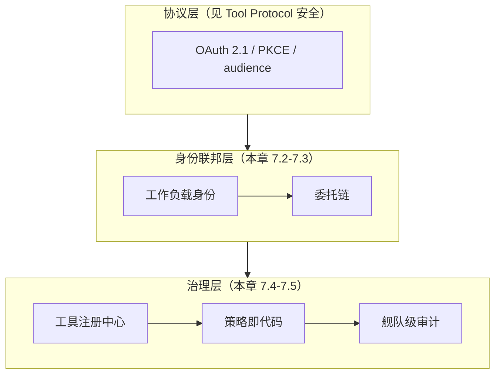
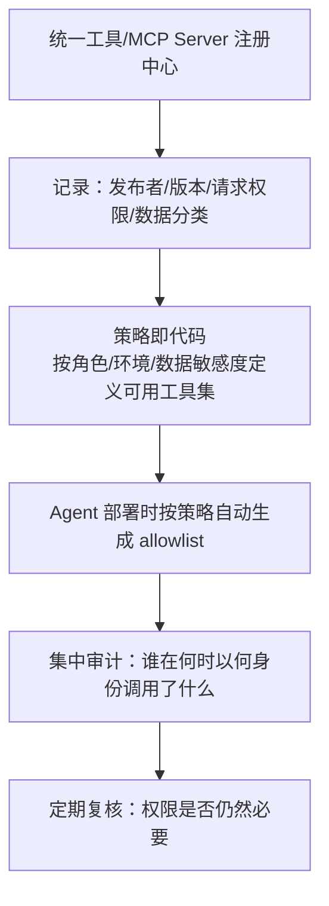

# 第七章：Agent、Tool、MCP、A2A 最小权限与身份治理

## 7.1 本章的定位：从单个协议到组织级身份治理

[Tool Protocol 安全](../../tools/02-mcp/15-tool-protocol-security.md) 已经讲清楚了 MCP/A2A 协议层面的具体控制——OAuth 2.1、PKCE、audience 校验、禁止 token passthrough。这些是**单次调用、单个协议**的正确姿势。但当一个组织同时运行几十上百个 Agent、数百个工具/MCP Server，并且这些 Agent 彼此调用、共享凭据池时，会出现协议层控制无法单独解决的问题：**谁能代表谁行动？权限是怎么在一条委托链上传递和衰减的？整个 Agent 舰队的工具权限该由谁审批、怎么审计？** 规模一上来，问题就变成**跨系统的身份联邦、通用化的 confused deputy 模式，以及舰队级的权限治理**，而不是重复某一个协议的实现细节。

## 7.2 Agent 的身份模型：谁在代表谁

传统应用只有"用户身份"和"服务身份"两种。Agent 系统引入了第三种：**Agent 自身的身份**，它既不完全等同于触发它的用户，也不完全等同于运行它的服务账号。

| 身份类型 | 特点 | 典型问题 |
|---|---|---|
| 用户委托身份（On-behalf-of） | Agent 代表具体用户执行操作，权限应等于或小于该用户 | 委托链拉长后，中间某一跳权限被放大 |
| 服务/工作负载身份 | Agent 本身作为一个服务主体，拥有独立的凭据 | 服务身份权限范围设置过宽，被用于本应走用户委托的场景 |
| 混合身份 | Agent 同时持有服务身份和临时的用户上下文 | 日志和审计无法区分"这个动作是 Agent 自主决定还是代表用户执行" |

**核心设计原则**：每一次跨系统调用都应该能明确回答"这次动作是以谁的身份、基于谁的授权发生的"。做不到这一点，就无法在事后审计中定位责任，也无法在权限收紧时知道该收紧谁的权限。

### 7.2.1 工作负载身份联邦

在多云、多服务的现实环境中，让每个 Agent/工具持有静态的长期凭据是不可扩展也不安全的做法。更好的做法是使用**工作负载身份联邦**：Agent 运行时环境（如容器、函数计算实例）本身具备可验证的身份，通过短期令牌交换的方式获得访问下游资源所需的临时凭据，而不是在配置里硬编码密钥。这与 [Tool Protocol 安全 15.2](../../tools/02-mcp/15-tool-protocol-security.md) 中"短生命周期 access token"的原则是一致的，只是把它从单次协议调用扩展到了整个部署环境的凭据管理策略。

## 7.3 Confused Deputy：通用模式而非 MCP 专属问题

Confused Deputy（迷惑的代理人）问题最早出现在传统操作系统安全领域：一个拥有较高权限的程序被诱导代表低权限的调用方执行了后者本不该有权限做的操作。在 Agent 系统里，这个模式反复出现在不同层面，token passthrough（详见 [Tool Protocol 安全 15.2.1](../../tools/02-mcp/15-tool-protocol-security.md)）只是其中一种具体表现。

其他常见变体：

- **多 Agent 委托链中的权限放大**：Agent A 以自己的高权限身份调用 Agent B 完成一个子任务，但没有把"这个子任务的实际发起者是低权限用户"这一信息传递下去，B 就按 A 的权限而非用户的权限执行；
- **共享工具账号**：多个 Agent 或多个租户共用同一个工具/数据库的服务账号，操作日志无法归因到具体发起者，任何一个 Agent 出问题都可能被误认为是账号本身被攻破；
- **审批流程被代理**：高风险操作的人工审批环节，如果审批者看到的是 Agent 汇总后的摘要而不是原始意图和参数，实际上是把审批权"委托"给了可能被注入影响的摘要生成过程。

**通用防御原则**：

1. **权限不应该在委托链中被放大，只能收紧**——下游收到的有效权限应该是"发起者权限"和"每一跳自身权限"的交集，而不是取任意一跳的最大值；
2. **凭据应该携带"代表谁"的声明**（如 OAuth 的 `act_as`/`on_behalf_of` 模式或等价的委托声明），资源服务器基于这个声明而不是"谁在直接调用我"做授权决策；
3. **不做隐式信任传递**：一个组件被认证过，不代表它请求的下一跳操作也应该被自动信任，每一跳都要重新校验。

## 7.4 多 Agent 与跨组织场景下的信任边界

A2A 等跨 Agent 协议让不同团队、甚至不同组织运营的 Agent 可以互相调用。这时候身份治理还要额外考虑：

| 场景 | 额外风险 | 治理要点 |
|---|---|---|
| 跨团队内部 Agent 互调 | 团队间权限边界模糊，一个团队的 Agent 意外获得了另一团队数据的访问权 | 内部也要做租户级隔离，而不是假设"都是自己人" |
| 跨组织 Agent 协作 | 对端组织的安全成熟度未知，其 Agent 可能本身已被攻陷 | 对外部 Agent 的调用按最低信任度设计，输出当作不可信内容（呼应第二、三章） |
| Agent 市场/第三方 Agent 接入 | 第三方 Agent 的实现细节不可见，"黑盒调用黑盒" | 引入前审查其声明的权限范围、数据处理方式，签署明确的数据处理协议 |

多 Agent 系统的协作模式、路由和混淆代理问题的架构设计见 [Agent 安全 15.12](../../agent/05-production/15-agent-security.md) 和[多 Agent 协作与路由](../../agent/04-multi-agent/13-multi-agent-coordination.md)；这里直接从身份和权限治理看这件事，两边要结合着读。

## 7.5 舰队级的工具权限治理

当组织内 Agent 和工具数量达到一定规模，逐个人工审批已经不可持续，需要系统化的治理机制：

- **统一注册中心**：所有可被 Agent 使用的工具/MCP Server 在接入前必须登记发布者、版本、请求的权限范围和涉及的数据分类，禁止"团队私下拉一个工具就接进 Agent"；
- **策略即代码**：工具的可用范围（哪些 Agent、哪些环境、哪些数据敏感度下可以使用）用可版本化、可评审的策略描述，而不是散落在各个 Agent 的配置文件里；
- **权限随环境自动收紧**：生产环境默认使用比测试环境更严格的策略集，与 [Agent 安全 15.9.2](../../agent/05-production/15-agent-security.md)"权限随上下文收紧"的原则一致，只是把它上升到组织级的默认策略；
- **集中审计与定期复核**：审计日志需要能跨 Agent、跨工具关联同一次任务的完整链路（呼应 [Tool Protocol 安全 15.4](../../tools/02-mcp/15-tool-protocol-security.md) 的审计要求），并且需要有固定节奏的权限复核机制，撤回不再需要的授权——这是很多组织"权限只增不减"问题的根本解法。

## 7.6 上线检查表

- [ ] 每一次跨系统调用都能明确回答"以谁的身份、基于谁的授权"发生；
- [ ] Agent 的服务身份与用户委托身份分离管理，不用服务身份代替应有的用户委托流程；
- [ ] 长期静态凭据已替换为工作负载身份联邦 + 短期令牌；
- [ ] 委托链中的有效权限是各跳权限的交集而非最大值，凭据携带明确的委托声明；
- [ ] 跨团队、跨组织的 Agent 调用按最低信任度设计，不假设"内部就是可信的"；
- [ ] 所有工具/MCP Server 在统一注册中心登记，策略以代码形式管理并可版本化评审；
- [ ] 建立固定节奏的权限复核机制，撤回不再需要的授权。

## 7.7 常见错误

### 7.7.1 只在单次协议调用层面做安全，不管委托链的整体权限走向

单次调用符合 OAuth 最佳实践，不代表委托链末端没有权限被放大的问题，必须端到端追踪有效权限。

### 7.7.2 多个 Agent/租户共用同一个工具服务账号

这会让审计无法归因到具体发起者，任何异常都难以定位责任，应按 Agent/租户维度拆分凭据。

### 7.7.3 假设内部 Agent 互调不需要身份校验

团队边界和租户边界同样需要授权检查，"都是自己人"不是安全边界。

### 7.7.4 权限只增不减，没有复核机制

大多数组织的权限膨胀问题源于从未主动撤回不再需要的授权，必须建立定期复核流程。

## 7.8 本章总结

1. 本章聚焦跨系统、组织级的身份治理，与 [Tool Protocol 安全](../../tools/02-mcp/15-tool-protocol-security.md) 覆盖的单协议实现细节互补而不重复；
2. Agent 的身份应明确区分用户委托身份和服务/工作负载身份，工作负载身份联邦 + 短期令牌优于静态长期凭据；
3. Confused Deputy 是贯穿多层的通用模式，token passthrough 只是其中一种表现，委托链中的有效权限应该是各跳权限的交集而非最大值；
4. 多 Agent、跨组织协作场景需要额外的信任边界设计，内部团队之间也不能假设默认可信；
5. 组织规模化后需要工具注册中心、策略即代码、集中审计和定期权限复核这套舰队级治理机制，而不能依赖逐个人工审批。

## 参考资料

- [Confused Deputy Problem (Norm Hardy, 1988)](https://cap-lore.com/CapTheory/ConfusedDeputy.html)
- [MCP 2026-07-28 Authorization: Confused Deputy Considerations](https://modelcontextprotocol.io/specification/2026-07-28/basic/authorization)
- [OWASP Agentic AI Threats and Mitigations: Identity and Authorization](https://genai.owasp.org/resource/agentic-ai-threats-and-mitigations/)
- [NIST SP 800-207: Zero Trust Architecture](https://csrc.nist.gov/pubs/sp/800/207/final)
- [SPIFFE/SPIRE: Workload Identity Framework](https://spiffe.io/)
