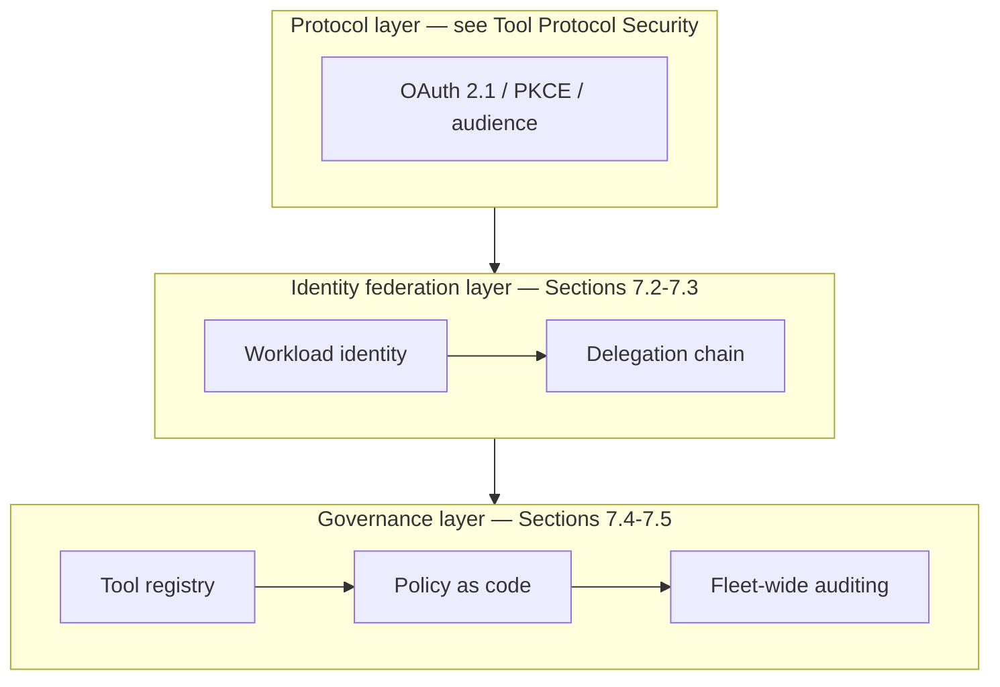
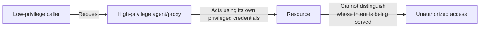
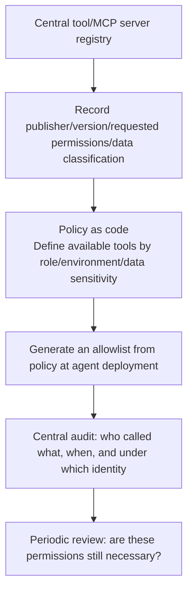

# Chapter 7: Least Privilege and Identity Governance for Agents, Tools, MCP, and A2A

## 7.1 From Individual Protocols to Organization-Wide Identity Governance

[Tool Protocol Security](../../tools/02-mcp/15-tool-protocol-security.md) covers authentication, token audiences, and protocol trust boundaries. This chapter addresses three cross-system questions: who may act on whose behalf, how permissions narrow along a delegation chain, and who is responsible for onboarding tools and revoking access. Even if every interface individually conforms to its protocol, that does not establish that the entire delegation chain respects authorization.

MCP and A2A do not share an identical authorization specification. The MCP 2026-07-28 authorization specification cited here applies to HTTP transports and references the OAuth 2.1 draft; credential handling for STDIO is different. Check A2A's specification and the service configuration for its particular authentication scheme rather than applying every MCP requirement unchanged.

## 7.2 The Agent Identity Model: Who Acts on Whose Behalf?

Conventional systems already have user, service, device, and delegated identities; an agent does not inherently introduce a new kind of cryptographic identity. In an implementation, distinguish the workload running the agent, the user or automated-task principal initiating the task, the party authorizing the action, and the IDs of the executing agent and task. Agent and task IDs are often audit attributes, not substitutes for verifiable principal credentials.

| Identity type | Characteristics | Typical problem |
|---|---|---|
| Delegated user identity (on-behalf-of) | The agent acts for a specific user, with no more authority than that user | As the delegation chain grows, an intermediate hop amplifies permissions |
| Service/workload identity | The agent operates as a service principal with its own credentials | An overprivileged service identity is used where user delegation should be required |
| Hybrid identity | The agent holds both a service identity and temporary user context | Logs and audits cannot distinguish actions taken autonomously by the agent from actions taken on a user's behalf |

**Core design principle:** every cross-system call should have an unambiguous answer to “Under whose identity, and with whose authorization, did this action occur?” Without that answer, an audit cannot establish responsibility after the fact, and a decision to restrict access cannot identify whose permissions to reduce.

### 7.2.1 Workload Identity Federation

In a real deployment spanning multiple clouds and services, giving every agent or tool static, long-lived credentials is neither scalable nor secure. A better approach is **workload identity federation**: the agent's runtime environment, such as a container or serverless function instance, has a verifiable identity and uses short-lived token exchange to obtain temporary credentials for downstream resources, rather than relying on secrets hardcoded in configuration. This follows the short-lived access token principle in [Tool Protocol Security, Section 15.2](../../tools/02-mcp/15-tool-protocol-security.md), extending it from an individual protocol call to credential management across the deployment.

## 7.3 Confused Deputy: A General Pattern, Not an MCP-Specific Problem

The confused deputy problem originated in conventional operating-system security: a privileged program is induced to perform an operation on behalf of a less-privileged caller that the caller is not authorized to perform. In agent systems, this pattern recurs at several layers. Token passthrough, discussed in [Tool Protocol Security, Section 15.2.1](../../tools/02-mcp/15-tool-protocol-security.md), is just one manifestation.

Other common variants include:

- **Privilege amplification in a multi-agent delegation chain:** Agent A invokes Agent B under A's own privileged identity to perform a subtask but fails to pass along the fact that a low-privilege user initiated it. B then acts with A's permissions rather than the user's.
- **Shared tool accounts:** multiple agents or tenants share a service account for a tool or database. Action logs cannot attribute activity to a specific initiator, and a problem in any one agent may be mistaken for compromise of the account itself.
- **Delegating the approval process:** when a person approving a high-risk action sees only an agent-generated summary rather than the original intent and parameters, approval authority is effectively “delegated” to a summarization process that may itself be influenced by injection.

**General defense principles:**

1. **Delegation must not implicitly amplify permissions.** Effective permissions are constrained jointly by the principal's delegable authority, explicit grants, recipient policy, resource ownership, and task constraints. “Intersection” is a policy principle, not a literal intersection of scope strings from different services; the authorization system must map their meanings.
2. **Use validated delegation information.** RFC 8693 Token Exchange defines `subject_token` and `actor_token`, and the JWT `act` claim can represent the actor. `act_as` and `on_behalf_of` are not standard claims universally supported by OAuth implementations. Token exchange does not automatically attenuate permissions: the issuer must still enforce policy.
3. **Authorize again at every hop.** Resource services validate tokens according to their type. For JWTs, check the signature, issuer, audience, and validity period; validate opaque tokens through a trusted introspection endpoint or server-side state. Both also require local resource authorization checks. Merely writing “on behalf of user A” in a prompt, request header, or JSON object is not proof of authorization.

Nested `act` claims in RFC 8693 can retain earlier actors, but those entries provide a history trail, not additional authority for the recipient to honor. A token consumer applies access control using the top-level claims and the current actor. Permission attenuation at each hop comes from issuance and resource policies, not from automatically traversing historical `act` entries.

Human approval must be bound to canonicalized action parameters, the resource, amount, destination, validity period, and a one-time action ID. If parameters change before execution, require approval again rather than reusing a blanket “allow the agent to act.” After a user revokes authorization, queued tasks must also be blocked and credential caches cleared. Short-lived tokens may remain valid until expiry; high-risk systems need additional revocation or real-time policy checks.

## 7.4 Trust Boundaries in Multi-Agent and Cross-Organization Systems

Inter-agent protocols such as A2A let agents operated by different teams, or even different organizations, call one another. Identity governance must then consider additional issues:

| Scenario | Additional risk | Governance considerations |
|---|---|---|
| Calls between internal agents across teams | Unclear team-level permissions let one team's agent inadvertently access another team's data | Apply tenant-level isolation internally too, rather than assuming “we are all on the same side” |
| Cross-organization agent collaboration | The other organization's security maturity is unknown, and its agent may already be compromised | Design calls to external agents with minimal trust; treat their output as untrusted content, as discussed in Chapters 2 and 3 |
| Agent marketplaces and third-party agent integration | The third-party implementation is opaque: one black box calls another | Review requested permissions and data handling before onboarding, and establish explicit data-processing agreements |

For multi-agent collaboration patterns, routing, and architectural approaches to the confused deputy problem, see [Agent Security, Section 15.12](../../agent/05-production/15-agent-security.md) and [Multi-Agent Coordination and Routing](../../agent/04-multi-agent/13-multi-agent-coordination.md). This chapter takes the identity and permission-governance perspective; read the two perspectives together.

## 7.5 Tool Permission Governance Across an Agent Fleet

Once an organization's agents and tools reach sufficient scale, individual manual approvals are no longer sustainable. Governance needs a systematic approach:

- **Central registry:** before integration, every tool or MCP server available to agents must register its publisher, version, requested permissions, and relevant data classifications. Teams must not simply connect an unregistered tool to an agent.
- **Policy as code:** describe tool availability—which agents, environments, and data sensitivity levels permit its use—in versioned, reviewable policies rather than scattered agent configuration files.
- **Automatically tighten permissions by environment:** use stricter default policies in production than in testing. This extends the context-dependent restriction principle in [Agent Security, Section 15.9.2](../../agent/05-production/15-agent-security.md) into an organization-wide default.
- **Centralized auditing and periodic review:** audit logs must correlate an entire task across agents and tools, consistent with the requirements in [Tool Protocol Security, Section 15.4](../../tools/02-mcp/15-tool-protocol-security.md). Review permissions on a fixed schedule and revoke grants that are no longer needed. This directly addresses the common organizational problem of permissions only ever accumulating.

## 7.6 Release Checklist

- [ ] Every cross-system call identifies whose identity and whose authorization it uses.
- [ ] Agent service identities and delegated user identities are managed separately; a service identity does not replace a required user-delegation flow.
- [ ] Workload identity federation and short-lived tokens have replaced long-lived static credentials.
- [ ] The authorization system attenuates delegated permissions, resource services recheck them, claims are verifiable, and approvals are bound to actual actions.
- [ ] Cross-team and cross-organization agent calls assume minimal trust, not that internal traffic is inherently trustworthy.
- [ ] All tools and MCP servers are registered centrally, with policies managed as versioned, reviewable code.
- [ ] Permissions are reviewed on a fixed schedule, and unnecessary grants are revoked.

## 7.7 Common Mistakes

### 7.7.1 Securing Individual Calls but Ignoring Permissions Across the Delegation Chain

A call that follows OAuth best practices does not rule out amplified permissions at the end of the delegation chain. Track effective permissions end to end.

### 7.7.2 Sharing One Tool Service Account Across Agents or Tenants

If logs record only the shared service account, audits cannot identify the actual initiator. Separate credentials according to isolation requirements, or use a connector that verifies the delegating principal and authorizes every action. Even when a legacy downstream system supports only a shared account, upstream components must retain a verifiable association among the user, tenant, task, and action.

### 7.7.3 Assuming Internal Agent Calls Need No Identity Verification

Team and tenant boundaries both require authorization checks. “We are all on the same side” is not a security boundary.

### 7.7.4 Letting Permissions Accumulate Without Review

In most organizations, privilege creep stems from never proactively revoking permissions that are no longer needed. Establish a periodic review process.

## 7.8 Chapter Summary

1. This chapter addresses cross-system, organization-wide identity governance, complementing rather than repeating the protocol implementation details in [Tool Protocol Security](../../tools/02-mcp/15-tool-protocol-security.md).
2. Distinguish delegated user identities from service/workload identities. Workload identity federation and short-lived tokens are preferable to static, long-lived credentials.
3. The confused deputy is a general pattern spanning multiple layers. Delegation must not implicitly amplify authority, but cross-service permission semantics require mapping, not a mechanical intersection of scope strings or historical `act` entries.
4. Multi-agent and cross-organization collaboration requires explicit trust-boundary design. Even internal teams cannot be assumed trustworthy by default.
5. At organizational scale, fleet-wide governance requires a tool registry, policy as code, centralized auditing, and periodic permission reviews—not individual manual approvals alone.

## References

- [Confused Deputy Problem (Norm Hardy, 1988)](https://cap-lore.com/CapTheory/ConfusedDeputy.html)
- [MCP 2026-07-28 Authorization: Confused Deputy Considerations](https://modelcontextprotocol.io/specification/2026-07-28/basic/authorization)
- [RFC 8693: OAuth 2.0 Token Exchange, especially Sections 1.1 and 4.1](https://www.rfc-editor.org/rfc/rfc8693.html)
- [RFC 7662: OAuth 2.0 Token Introspection](https://www.rfc-editor.org/rfc/rfc7662.html)
- [OWASP Agentic AI Threats and Mitigations: Identity and Authorization](https://genai.owasp.org/resource/agentic-ai-threats-and-mitigations/)
- [NIST SP 800-207: Zero Trust Architecture](https://csrc.nist.gov/pubs/sp/800/207/final)
- [SPIFFE/SPIRE: Workload Identity Framework](https://spiffe.io/)
