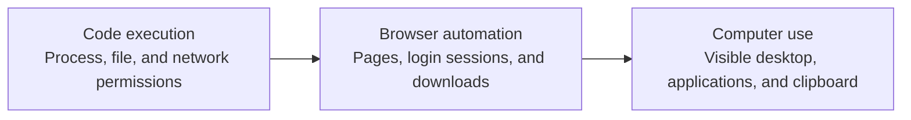
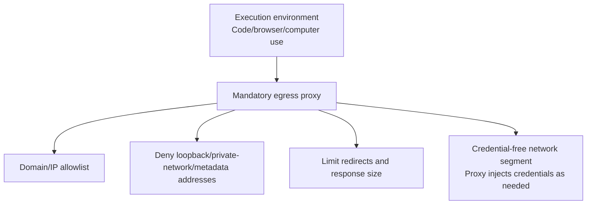

# Chapter 8: Sandboxing and Network Isolation for Code Execution, Browsers, and Computer Use

## 8.1 Three Execution Capabilities, Constrained by Their Actual Permissions

Code interpreters, browser automation, and computer use—letting a model operate a graphical interface with a mouse and keyboard—are three of the fastest-growing categories of agent tools. They are also among the hardest to enumerate completely in an attack-surface analysis. All three share a defining characteristic: **the model generates the specific instructions at runtime, so they cannot be exhaustively enumerated at design time**. Defenses must therefore focus on limiting the maximum harm the execution environment can cause, not on predicting every instruction the model might generate.

There is no fixed risk ranking among the three. A code container with host mounts and cloud credentials may be more dangerous than a disposable virtual desktop; the impact of browser automation and computer use is likewise constrained by logged-in accounts and operating-system privileges. First inventory the readable data, writable resources, network destinations, and available credentials, then choose the strength of isolation.

## 8.2 Code Execution Sandboxes

### 8.2.1 Choosing an Isolation Level

| Isolation mechanism | Isolation strength | Typical use |
|---|---|---|
| Language-level sandbox (restricted interpreter) | Weak; susceptible to known bypass techniques | Not recommended for untrusted code |
| Container (such as Docker) | Moderate; shares the host kernel | Relatively trusted internal workloads, still requiring kernel hardening |
| User-space kernel isolation (such as gVisor) | Stronger; intercepts and emulates system calls, reducing exposure to the host kernel | Multi-tenant code execution services |
| MicroVM (such as Firecracker) | Separate guest kernel and a virtualization boundary; still depends on host and VMM security | Untrusted code requiring strong isolation, with tradeoffs in startup, compatibility, and operational cost |

**Principle:** whenever executable code is model-generated and generation may be influenced by prompt injection or jailbreaking (see Chapter 2), apply the strongest isolation standards for untrusted code. Do not rely on the optimistic assumption that “our own agent generated it, so it should be fine.”

### 8.2.2 Resource and Lifecycle Limits

- **A bounded, disposable environment for each authorized task or session:** define its owner, permissions, and lifetime. Related code calls may retain files and interpreter state within that scope; independent executions should use fresh environments. Destroy the environment when the task/session ends or its authorization boundary changes, rather than passing residual state to another user or unrelated task.
- **Hard limits on CPU, memory, disk, and execution time:** prevent resource-exhaustion attacks such as infinite loops, excessive disk writes, and fork bombs.
- **A minimal filesystem:** do not mount the host's actual filesystem or include unrelated credential files in the sandbox. Environment variables should contain no cloud credentials by default, consistent with Chapter 3's principle of keeping secrets out of context.
- **No outbound networking, or only the minimum needed:** deny external network access by default. When networking is necessary, use the egress controls in Section 8.5 instead of granting direct internet access.

## 8.3 Risks Specific to Browser Automation

### 8.3.1 Identity and Session Risks

Browser automation may require authenticated sessions, introducing the following risks. A code execution environment with access to the same session material faces them too:

- **Misuse of session capabilities:** merely visiting a malicious page does not let that page arbitrarily read other sites' cookies; the same-origin policy and HttpOnly still apply. Injection may, however, induce the agent to visit a site where it is already logged in and perform actions, without stealing cookies.
- **Manipulation across sites and steps:** traditional CSRF still requires site-side defenses. An induced agent performing valid navigation or form actions on the target site is not necessarily a case of CSRF, and token validation may not stop this hijacking of the user's intended authorization.
- **Executing downloaded files:** if a file downloaded by the browser is opened or executed in a later step, such as a code interpreter or desktop operation, it introduces another code execution entry point whose source is not under the system's control.

### 8.3.2 Defensive Design

- **Minimize authenticated session access:** provide login state for a particular domain only when the task requires it. Do not carry the user's entire session throughout execution, and destroy the session when the task ends.
- **Treat page content as untrusted input:** page text, alt attributes, and hidden elements can all contain injected instructions. Apply the indirect-injection defenses described in [RAG Security, Section 20.3.2](../../rag/06-operations-security/20-rag-challenges-security.md): capability isolation and data-flow controls are the primary defenses. Reminding the model to be careful with webpage content is only a probabilistic mitigation.
- **Require explicit confirmation for high-risk actions:** deterministic rules independent of the model's judgment should trigger human confirmation for payments, password changes, and data submissions. Do not ask the model itself to decide whether the operation is safe.
- **Quarantine downloads by default:** send downloaded content to a separate sandbox for scanning and format validation. Do not automatically pass it into an execution environment.

## 8.4 Risks Specific to Computer Use

Computer use lets a model interpret interfaces through screenshots and operate accessible desktop applications with a mouse and keyboard. The risk depends on the desktop's actual permissions and shared data. In particular, prevent unintended connections between information and actions across applications.

### 8.4.1 Visual Indirect Prompt Injection

Because the model relies on screenshots to understand the current screen, it may interpret anything visible as an instruction to respond to: notifications from other windows, text on desktop wallpaper, or a fake system dialog rendered by a malicious webpage. **This is indirect prompt injection extended to the visual modality.** The mechanism is the same as hidden instructions in a text document; the carrier changes from text to a screenshot.

### 8.4.2 The Operating-System-Level Attack Surface

| Risk | Explanation |
|---|---|
| Clipboard hijacking | A model able to read and write the system clipboard may be induced to paste sensitive clipboard data into an inappropriate destination, or to place malicious content on the clipboard for a user to paste unwittingly later |
| Fake system dialogs | A malicious page can render an interface closely resembling an operating-system permission prompt, inducing the model—or a later human approver—to click “Allow” by mistake |
| Cross-application data chaining | A single action sequence may span email, a browser, and a file manager; injection at any step can hijack the whole sequence |
| Difficulty enforcing fine-grained permissions | An API can precisely restrict which function may be called; graphical interactions are much harder to constrain with an allowlist as specific as “only this button may be clicked” |

### 8.4.3 Defensive Design

- **Use an isolated desktop by default:** run in a dedicated virtual machine or controlled desktop, disabling unnecessary sharing of host directories, clipboards, devices, and sessions. A containerized desktop provides logical, not physical, isolation and does not guarantee that escape is impossible.
- **Declare task scope and detect deviations:** specify the applications the task may operate before it begins. At runtime, detect application switches or windows outside that scope; pause and require confirmation when they occur.
- **Deterministically block privileged actions:** operating-system policies—not model self-restraint—must block or require additional confirmation for changes to system settings, permission grants, file deletion, and similar operations. This is the same principle as requiring confirmation independently of the model's judgment in browser automation.
- **Screen screenshot content as input:** OCR and content analysis can flag unusual text or interface elements that may indicate injection. This is a defense-in-depth measure, not a replacement for the primary protection of an isolated desktop.

## 8.5 Consistent Network Egress Controls

All three execution environments need consistent network isolation policies. These follow the same principles as the SSRF defenses in [Tool Protocol Security, Section 15.3.1](../../tools/02-mcp/15-tool-protocol-security.md). Applied to an execution sandbox, they yield the following network design:

- Execution environments have no direct internet connectivity; all outbound traffic must pass through a controlled proxy.
- The proxy maintains an allowlist rather than a blocklist, denying every undeclared destination by default.
- The proxy injects credentials when needed, such as a token required for a particular internal API. The execution environment itself holds no long-lived credentials, consistent with [Chapter 3](../02-prompt-content-attacks/03-output-handling-secret-exfiltration.md)'s principle of keeping credentials out of model context.
- Record necessary metadata such as the destination, action, policy decision, and usage. Do not indiscriminately log complete URL query parameters, bodies, or credentials.

A proxy is an enforceable control only when the network layer blocks direct connections. Enforcement must cover DNS, IPv4/IPv6, redirects, and other protocols, and validate the final resolved and connected addresses. Block metadata endpoints, loopback, and unauthorized private networks. If access to internal APIs is necessary, permit individual services through dedicated connectors rather than opening the entire internal network. On-demand credential injection must also be bound to the destination, method, path, and scope; redirects must not carry credentials to another destination. Even an allowed domain may offer a way to upload data externally, so an allowlist is not a complete data loss prevention (DLP) solution.

## 8.6 Release Checklist

- [ ] Untrusted code runs by default in a microVM or user-space-kernel sandbox, not merely a language-level sandbox.
- [ ] Each execution environment has a defined task/session owner and bounded lifetime; state stays within that authorization scope, and the environment is destroyed when the scope ends or changes.
- [ ] Sandboxes have hard limits on CPU, memory, disk, and execution time.
- [ ] Browser login state is limited to the task's minimum requirements and destroyed when the task ends.
- [ ] Deterministic rules require human confirmation for high-risk browser or computer-use actions such as payments and password changes; they do not rely on the model's own judgment.
- [ ] Computer use has an explicit virtualization or logical isolation boundary, without sharing unrelated host data or sessions.
- [ ] Outbound networking must pass through a proxy that denies metadata endpoints, loopback, and unauthorized private networks; business exceptions are approved per service.
- [ ] Execution environments hold no long-lived credentials; the proxy injects credentials as needed.

## 8.7 Common Mistakes

### 8.7.1 Assuming Code Is Lower Risk Because Your Own Agent Generated It

If prompt injection or jailbreaking could influence generation, apply the strongest isolation standards for untrusted code.

### 8.7.2 Carrying the User's Complete Login Sessions Throughout Browser Automation

Provide only the domain-specific login state needed for the task, rather than giving the agent the user's full session privileges.

### 8.7.3 Relying on Reminders to “Watch Out for Suspicious Content”

Both textual and visual indirect injection require capability isolation and data-flow controls as primary defenses. Prompt-level reminders are only probabilistic mitigations.

### 8.7.4 Running Computer Use Directly on the User's Actual Desktop

Hijacking through visual injection would directly affect real host data and applications. Use an isolated desktop.

## 8.8 Chapter Summary

1. The risks of all three capabilities depend on actual permissions, data, and networking. Focus defenses on limiting maximum harm, not on assuming a fixed risk ranking.
2. Code execution should use microVM or user-space-kernel isolation, short-lived environments, and strict resource limits.
3. Browser automation has a distinctive attack surface around login state and sessions. Supply the minimum session access needed for each task and treat webpage content as untrusted input.
4. Computer use extends risk to accessible desktops, applications, and shared state; it does not imply authority over the entire operating system. Use isolated desktops by default, and control the action risks posed by visual injection, the clipboard, and fake dialogs.
5. All three environments should follow shared egress principles: mandatory proxies; denial of metadata endpoints, loopback, and unauthorized private networks; per-service business exceptions; and credentials bound to destinations and actions.

## References

- [OWASP LLM06:2025 Excessive Agency](https://genai.owasp.org/llmrisk/llm062025-excessive-agency/)
- [gVisor: Application Kernel for Containers](https://gvisor.dev/)
- [Firecracker: Secure and Fast microVMs](https://firecracker-microvm.io/)
- [MDN: Same-origin policy](https://developer.mozilla.org/en-US/docs/Web/Security/Defenses/Same-origin_policy)
- [Anthropic: Computer Use Demo — security precautions and isolation limitations](https://github.com/anthropics/claude-quickstarts/tree/main/computer-use-demo)
- [MITRE ATLAS: Evade ML Model / LLM Prompt Injection](https://atlas.mitre.org/techniques/AML.T0051)
