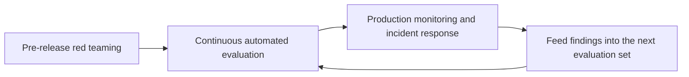
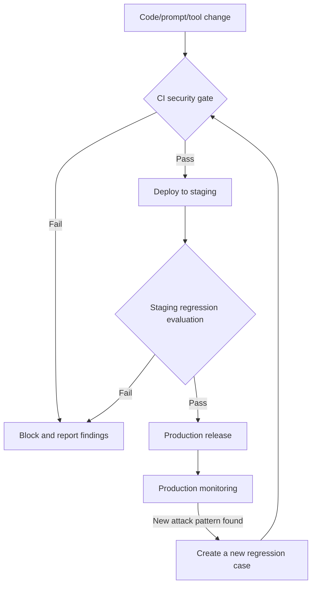

# Chapter 9: Security Evaluation, Red Teaming, and Continuous Assurance

## 9.1 Why Security Evaluation Cannot Be a One-Time Release Check

Earlier chapters repeatedly noted that some attacks are invisible to standard evaluations and that alignment is a probabilistic mitigation. An AI system's security posture is therefore not a constant that one test can establish. It changes with model versions, prompts, newly connected tools, and newly disclosed jailbreak techniques. [Agent Security, Section 15.13](../../agent/05-production/15-agent-security.md) and [RAG Security, Section 20.4](../../rag/06-operations-security/20-rag-challenges-security.md) already explain the application-level principle that attack success rate (ASR) and utility must be reported together. At an organizational level, that principle needs to become a red-teaming methodology, an automated toolchain, and a continuous assurance process.

## 9.2 Red-Teaming Methodology

### 9.2.1 Dividing the Work Between Human and Automated Red Teams

| Type | Strengths | Limitations |
|---|---|---|
| Human red teaming | Can discover open-ended attack paths requiring creative combinations; effective at constructing persuasive social-engineering-style payloads for a specific business context | Expensive, limited in coverage, and difficult to turn directly into automated regression tests |
| Automated red teaming | Can repeatedly run libraries of known patterns and search for new variants and multi-turn strategies | Coverage is constrained by the search space, budget, and scorer; prone to overfitting existing benchmarks |

Both people and automation can discover new variants. The difference is cost, coverage, and search strategy—not that machines can find only known attacks while people alone can find unknown ones. Turn effective paths found by people into repeatable cases, and review automated discoveries as well. Do not equate a scanner finding with actual business harm.

### 9.2.2 Layers a Red Team Should Cover

Red teaming should do more than ask whether the model will use offensive language. Use Chapter 1's attack-surface map to cover:

- **The model layer:** jailbreaks and system prompt leakage (Chapter 2).
- **The data layer:** checks for known trigger patterns and tests for extracting memorized training data (Chapters 4 and 6).
- **The supply-chain layer:** simulated dependency poisoning and malicious model-loading paths (Chapter 5).
- **The application layer:** indirect injection, tool misuse, and confused deputy paths (Chapter 7 and [Tool Protocol Security](../../tools/02-mcp/15-tool-protocol-security.md)).
- **The execution-environment layer:** sandbox escape attempts and network egress bypasses (Chapter 8).
- **End-to-end scenarios:** simulations of an attacker's complete path from initial contact to the objective, rather than isolated tests of individual components.

Before testing, obtain authorization and agree on scope, timing, rate limits, stop conditions, and incident contacts. Use synthetic identities, test funds, and isolated tenants; any tool-mediated data transfer out of the system must use a controlled receiver. Never use real personal data or production secrets as test payloads. If unexpected effects occur, stop the relevant tests immediately, retain only the necessary evidence, and follow the incident response process.

### 9.2.3 The Red Team's Role and Independence

Red teams should maintain independence from the development team. Having the same people build and test a defense invites blind spots. More mature organizations bring in external red teams or independent security teams for periodic assessments and define severity-based response procedures and remediation deadlines (SLAs). Red-team reports should not be treated as optional reading.

## 9.3 Automated Evaluation Tools and Benchmarks

| Tool or benchmark category | Purpose |
|---|---|
| General-purpose red-teaming frameworks (such as garak) | Automated LLM vulnerability scanners with many built-in probes for known jailbreaks, injection, and data leakage; useful foundations for continuous regression testing |
| Orchestration-based red-teaming frameworks (such as PyRIT) | Coordinate attack strategies, including multi-turn combinations and automated prompt variation, to simulate more complex attack paths |
| Harmfulness benchmarks (such as HarmBench) | Standardized harmful-behavior evaluation sets for comparable assessments across models and versions |
| Guardrail and moderation-model evaluation | Measures false negatives and false positives in input/output guardrail models themselves; these models must be evaluated, not assumed inherently reliable |
| Supply-chain scanners | Cover the malicious-object scanning of model files and dependency vulnerability scanning discussed in Chapter 5 |

Pin tool, probe, model, and scorer versions, and record the run configuration. Passing a scan means only that no failure was observed under those inputs, budgets, and criteria; it does not guarantee a minimum level of security. A framework's support for a probe does not establish coverage of every authorization and execution path in an application.

## 9.4 Continuous Assurance: Integrating Security Evaluation into Development

- **CI security gates:** every change to a system prompt, a tool's authorized scope, or a model version triggers automated security regression tests, not just functional tests.
- **Tiered evaluation sets:** follow the Smoke/Regression/Full approach in the [RAG Security Release Checklist](../../rag/06-operations-security/20-rag-challenges-security.md). Run a minimal smoke set on every commit, the complete regression set before merging, and a full evaluation covering newly disclosed attack techniques on a regular schedule.
- **Feed production monitoring into evaluation:** regularly turn observed anomalous requests and guardrail interception records into new evaluation cases, rather than handling them only when an incident occurs.
- **Pay special attention to version changes:** a new model-provider release may invalidate previously effective defenses because alignment behavior changes, or introduce new guardrail false-positive patterns. Every model switch requires a complete security regression run; do not assume a newer version can only be safer.

## 9.5 Metrics

First specify what counts as “success.” Generating inappropriate text, proposing a dangerous tool call, having that call accepted by an execution service, and actually changing a resource are different outcomes. A call blocked by authorization cannot be counted as realized business harm, though it can still be recorded as a model-layer failure.

**Report the ASR denominator and attack budget explicitly.** The success rate per attempt is not directly comparable to the fraction of objectives for which at least one of up to k attempts succeeds. Report timeouts, invalid payloads, and non-executable cases separately. Repeated reformulations of the same objective are not independent objectives; estimate uncertainty at the objective or session level. Adaptive red teaming is designed to find failures. Its selection-biased ASR is not an estimate of failure probability under the real user distribution.

Also report legitimate task completion, false refusals, latency, and cost. Refusing everything can lower ASR while providing no business utility. Keep the defense-tuning set separate from the attack holdout set. Once newly discovered failures become regression cases, they are no longer independent holdouts. For a sample of cases that a model-based judge labels successful, inspect actual execution and audit evidence so that fabricated claims of success in a response do not mislead the evaluation.

Organization-wide assurance should also track:

| Metric | Meaning |
|---|---|
| MTTD | Mean time from the start of an observable event to detection; explain how the start time is estimated if it is unknown |
| MTTR / remediation lead time | State whether MTTR means recovery or repair. Record the time from discovery to an effective patch separately, and do not conflate it with MTTD |
| Guardrail false-positive rate | The fraction of legitimate requests blocked by guardrails, directly affecting business usability |
| Number of attack types covered by regression cases | Measures breadth of coverage against Chapter 1's attack-surface map, rather than the total case count |
| Remediation SLA compliance for red-team findings | Measures whether security findings lead to actual fixes rather than remaining in reports |

## 9.6 Common Mistakes

### 9.6.1 Running a Red-Team Exercise Only Once Before Release

Models, prompts, and toolsets continually change, so security must be evaluated continuously. A one-time test reflects only the state at the time of testing.

### 9.6.2 Relying Exclusively on Automated Tools

Automated coverage is limited by probes, search budgets, and scorers; human coverage is limited too. Both should share failure evidence and regression cases. Passing either kind of testing is not a complete guarantee.

### 9.6.3 Skipping Security Regression Tests When Upgrading a Model

A new version can change alignment behavior or guardrail false-positive and false-negative patterns. Assuming it can only improve is unjustified.

### 9.6.4 Counting Regression Cases Without Measuring Attack-Surface Coverage

Large numbers of similar, repetitive cases do not reveal the system's actual security posture. Design evaluation sets against the attack-surface map and deliberately fill coverage gaps.

## 9.7 Chapter Summary

1. Security evaluation must be continuous, not a one-time check, because models, prompts, toolsets, and known attack techniques keep changing.
2. Human and automated red teams should collaborate in a recurring process: discover new patterns, turn them into automated cases, run continuous regression tests, and explore new scenarios. They do not replace one another.
3. Use Chapter 1's attack-surface map to cover models, data, supply chains, applications, execution environments, and end-to-end scenarios—not just inappropriate model output.
4. CI security gates, tiered evaluation sets, and findings from production monitoring should integrate security evaluation into everyday development. Model version changes must trigger a complete regression run.
5. Beyond ASR and utility, track MTTD/MTTR, guardrail false positives, breadth of attack-surface coverage, and compliance with remediation SLAs for red-team findings.

## References

- [NIST AI RMF: Measure Function](https://www.nist.gov/itl/ai-risk-management-framework)
- [garak: LLM Vulnerability Scanner](https://github.com/leondz/garak)
- [PyRIT: Python Risk Identification Tool for generative AI](https://github.com/Azure/PyRIT)
- [HarmBench: A Standardized Evaluation Framework for Automated Red Teaming](https://arxiv.org/abs/2402.04249)
- [Red Teaming Language Models with Language Models](https://arxiv.org/abs/2202.03286)
- [OWASP LLM Applications Cybersecurity and Governance Checklist](https://genai.owasp.org/resource/llm-ai-cybersecurity-governance-checklist/)
