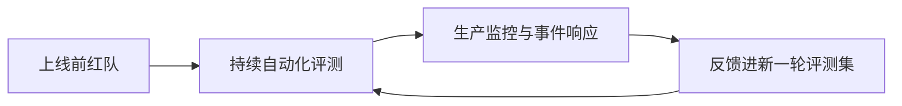
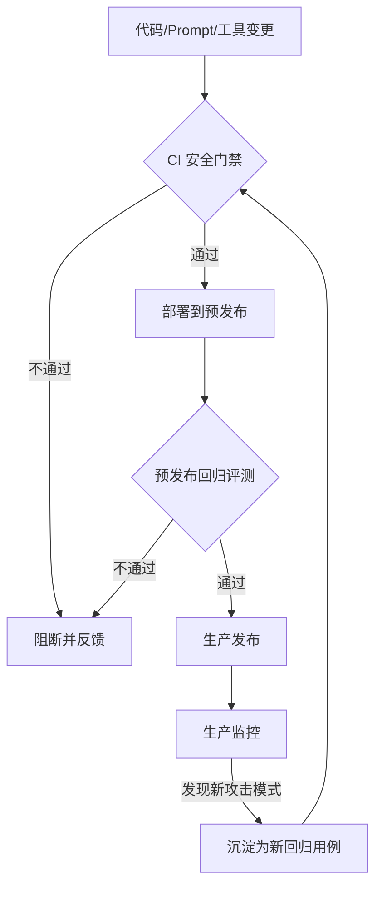

# 第九章：安全评测、红队与持续保障

## 9.1 安全评测为什么不能只是一次性的上线检查

前面章节多次提到"某类攻击在标准评测中不可见""对齐是概率性缓解"——这意味着 AI 系统的安全水位不是一次测试能确定的常量，而是随模型版本、Prompt 变化、新工具接入、新越狱手法公开而持续波动的变量。[Agent 安全 15.13](../../agent/05-production/15-agent-security.md) 和 [RAG 安全 20.4](../../rag/06-operations-security/20-rag-challenges-security.md) 已经给出了单个应用场景下"ASR（攻击成功率）与 Utility（效用）必须成对报告"的评测原则，本章把这个原则扩展为组织级的红队方法论、自动化工具链和持续保障流程。

## 9.2 红队方法论

### 9.2.1 人工红队与自动化红队的分工

| 类型 | 优势 | 局限 |
|---|---|---|
| 人工红队 | 能发现开放式、需要创造性组合的新攻击路径；擅长针对具体业务场景构造有说服力的社会工程式载荷 | 成本高、覆盖面有限、结果难以自动化回归 |
| 自动化红队 | 可大规模、可重复运行已知攻击模式库；适合做持续回归 | 难以发现全新的攻击手法，容易被过拟合到已知模式 |

生产级流程通常是"人工红队发现新模式 → 沉淀为自动化用例 → 自动化持续回归 → 人工红队专注于探索自动化覆盖不到的新场景"的闭环，而不是二选一。

### 9.2.2 红队覆盖的层面

红队不应该只测"模型会不会说脏话"，而应对照第一章的攻击面图谱，覆盖：

- **模型层**：越狱、系统提示泄漏（第二章）；
- **数据层**：已知触发器模式的探测、训练数据记忆化抽取测试（第四、六章）；
- **供应链层**：模拟依赖投毒、恶意模型加载路径（第五章）；
- **应用层**：间接注入、工具滥用、confused deputy 路径（第七章、[Tool Protocol 安全](../../tools/02-mcp/15-tool-protocol-security.md)）；
- **执行环境层**：沙箱逃逸尝试、网络出口绕过（第八章）；
- **端到端场景**：模拟真实攻击者从初始接触到达成目标的完整路径，而不是孤立测试单点。

### 9.2.3 红队的角色与独立性

红队应保持相对于研发团队的独立性——由同一批人既写防御又测防御，容易产生盲区。较成熟的组织会引入外部红队或独立安全团队定期评估，并明确红队发现问题后的分级响应流程和修复时限（SLA），而不是把红队报告当作可选参考。

## 9.3 自动化评测工具与基准

| 工具/基准类别 | 定位 |
|---|---|
| 通用红队框架（如 garak） | 针对 LLM 的自动化漏洞扫描器，内置大量已知的越狱、注入、数据泄漏探测插件，适合作为持续回归的基础工具 |
| 编排式红队框架（如 PyRIT） | 提供攻击策略编排能力，支持组合多轮攻击、自动变异 Prompt，适合模拟更复杂的攻击链路 |
| 危害性基准（如 HarmBench） | 标准化的有害行为评测集，用于跨模型、跨版本做可比较的安全水位评估 |
| 护栏/审核模型评测 | 专门评测输入输出护栏模型自身的漏报率和误报率，护栏模型本身也需要被评测，而不是假设它天然可靠 |
| 供应链扫描工具 | 覆盖第五章提到的模型文件恶意对象扫描、依赖漏洞扫描 |

**使用建议**：自动化工具的结果应作为"下限保证"（至少不应该在这些已知模式上失守），而不是安全水位的全部证明——真正的红队价值往往在工具覆盖不到的新场景。

## 9.4 持续保障：把安全评测嵌进研发流程

- **CI 安全门禁**：任何 System Prompt、工具授权范围、模型版本的变更都触发一轮自动化安全回归，而不只是功能测试；
- **分级评测集**：参照 [RAG 安全上线检查清单](../../rag/06-operations-security/20-rag-challenges-security.md) 的 Smoke/Regression/Full 三档思路，安全评测同样应分层——每次提交跑最小冒烟集，合并前跑完整回归集，定期跑覆盖新披露攻击手法的全量集；
- **生产监控闭环**：线上真实触发的异常请求、护栏拦截记录应定期回流为新的评测用例，而不是只在事故发生时临时处理；
- **版本变更的特别关注**：模型供应商发布新版本时，历史上被验证有效的防御可能失效（对齐行为改变）或护栏出现新的误报模式，模型切换必须重新跑一遍完整安全回归，不能假设"新版本只会更安全"。

## 9.5 指标体系

除了 [Agent 安全 15.13.1](../../agent/05-production/15-agent-security.md) 已经强调的 ASR 与 Utility 成对报告原则外，组织级的持续保障还需要跟踪：

| 指标 | 含义 |
|---|---|
| 平均检测到修复时长（MTTD/MTTR） | 从新攻击模式被发现到防御上线生效的时间 |
| 护栏误报率 | 护栏拦截正常请求的比例，直接影响业务可用性 |
| 回归用例覆盖的攻击类型数 | 衡量评测集对第一章攻击面图谱的覆盖广度，而非用例总数 |
| 红队发现问题的修复 SLA 达成率 | 衡量安全发现能否转化为实际修复，而不是停留在报告里 |

## 9.6 常见错误

### 9.6.1 只做一次上线前红队测试

模型、Prompt、工具集持续变化，安全水位必须持续评测，一次性测试只能反映测试当时的状态。

### 9.6.2 只依赖自动化工具，不做人工红队

自动化工具擅长回归已知模式，难以发现全新的攻击路径，两者需要形成闭环而非互相替代。

### 9.6.3 模型版本升级时跳过安全回归

新版本可能改变对齐行为或护栏的误报/漏报模式，"应该只会更好"是没有依据的假设。

### 9.6.4 只统计回归用例数量，不衡量攻击面覆盖广度

大量重复相似的用例无法反映真实的安全水位，评测集设计应对照攻击面图谱有意识地补齐薄弱环节。

## 9.7 本章总结

1. 安全评测必须是持续过程而非一次性检查，因为模型、Prompt、工具集和已知攻击手法都在持续变化；
2. 人工红队与自动化红队应形成"发现新模式 → 沉淀为自动化用例 → 持续回归 → 探索新场景"的闭环，而非互相替代；
3. 红队覆盖范围应对照第一章的攻击面图谱，覆盖模型、数据、供应链、应用、执行环境和端到端场景，而不只是测试模型会不会说不当内容；
4. CI 安全门禁、分级评测集和生产监控闭环应把安全评测嵌入日常研发流程，模型版本变更必须触发完整回归；
5. 指标体系除 ASR/Utility 外，还应跟踪 MTTD/MTTR、护栏误报率、攻击面覆盖广度和红队问题修复 SLA 达成率。

> **一句话概括：安全评测的价值不在于产出一份"通过"的报告，而在于把红队发现、自动化回归和生产监控串成一个持续运转的闭环，跟上模型和攻击手法本身的变化速度。**

## 参考资料

- [NIST AI RMF: Measure Function](https://www.nist.gov/itl/ai-risk-management-framework)
- [garak: LLM Vulnerability Scanner](https://github.com/leondz/garak)
- [PyRIT: Python Risk Identification Tool for generative AI](https://github.com/Azure/PyRIT)
- [HarmBench: A Standardized Evaluation Framework for Automated Red Teaming](https://arxiv.org/abs/2402.04249)
- [Red Teaming Language Models with Language Models](https://arxiv.org/abs/2202.03286)
- [OWASP LLM Applications Cybersecurity and Governance Checklist](https://genai.owasp.org/resource/llm-ai-cybersecurity-governance-checklist/)
