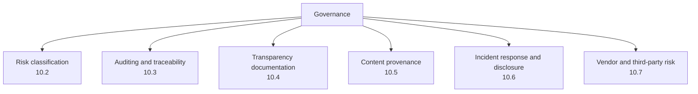
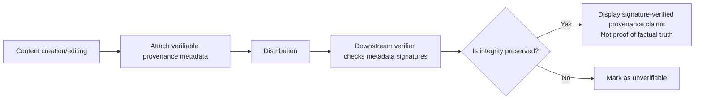

# Chapter 10: AI Governance, Risk Classification, Auditing, and Content Provenance

## 10.1 Governance Makes Technical Controls an Organizational Responsibility

The preceding nine chapters cover specific technical defenses. Keeping those controls effective over time requires organizational arrangements: who approves the release of a high-risk agent, who is accountable for model behavior, which process applies when an incident occurs, and how regulatory requirements become internal checklists. This is the role of the **Govern** function in the NIST AI RMF: establish those responsibilities, processes, and checks.

## 10.2 Risk Classification

Not every AI application needs the same intensity of controls. Risk classification directs limited security resources toward genuinely high-risk situations.

### 10.2.1 Classifying Risk by Use Case, with Regulatory Practice in Mind

Use cases help with internal risk classification, but the following table is an engineering-management illustration, **not an automatic classifier for the EU AI Act**. Legal determinations also depend on intended purpose, role, territorial scope, product category, and exceptions. Obligations for general-purpose AI (GPAI) models cannot be set aside by fitting everything into a single pyramid of application risk:

| Category | Characteristics | Examples | Level of control |
|---|---|---|---|
| Prohibited uses | Meet the conditions of an express prohibition under applicable law | Certain harmful manipulation or social scoring; not all scoring is prohibited | Stop the relevant use and confirm the statutory conditions |
| High-impact uses | May affect safety, rights, or significant interests | Recruitment screening, credit decisions, and medical-device-related applications | Assessment, oversight, records, monitoring, and exit mechanisms; map each applicable legal obligation |
| Transparency-related uses | Users need to understand how AI is involved | Conversational systems and certain generated content | Disclosure and labeling; the use may also be high-risk |
| Lower-impact uses | No evident high-impact path at present | Restricted internal drafting assistance | Baseline controls, including data protection, access control, and review |

**A single “AI Act effective date” cannot determine every release requirement.** Regulation (EU) 2026/1744 amended some of the original AI Act's application dates. Chapter III, Sections 1, 2, and 3, except Article 6(5), apply from **2027-12-02** to high-risk systems under Article 6(2) and Annex III, and from **2028-08-02** to high-risk systems under Article 6(1) and Annex I.

This is not a blanket postponement of all obligations. General application dates, prohibited practices, GPAI requirements, transparency requirements, and transitional arrangements for existing systems must be assessed separately. For an actual deployment, maintain a register linking the entity's role, use, legal provision, application date, and supporting evidence, and have the legally responsible party confirm it. Internal risk categories alone do not determine statutory obligations.

### 10.2.2 Inputs to an Internal Risk Assessment

Alongside the use case, assess the actual architecture: can it autonomously execute high-risk actions (Chapters 7 and 8), does it process sensitive personal data (Chapter 6), does it depend on uncontrolled third-party data or models (Chapters 4 and 5), and is it exposed to the public internet (Chapters 2 and 3)? Assessments should consider severity of harm, likelihood, exposure, and mitigation capability together. Without defined and calibrated scales, “use-case risk multiplied by architectural exposure” is not a quantitative formula.

### 10.2.3 Letting Risk Classification Drive Governance Actions

Internal risk categories should trigger governance actions, such as requiring review, red-team validation, additional change approvals, and independent assessment for high-impact uses. These are policies an organization may adopt. They do not establish that a single legal provision mandates exactly the same red-teaming process for every legally high-risk system.

## 10.3 Auditing and Traceability

### 10.3.1 Minimum Requirements for Organization-Wide Audit Logs

[Tool Protocol Security, Section 15.4](../../tools/02-mcp/15-tool-protocol-security.md) specifies audit fields at the application or protocol level. Organization-wide governance builds on that foundation to ensure **audit data can be queried and correlated across applications and teams**:

- Use a common request correlation ID convention so that a user interaction spanning multiple agents and tool calls remains traceable as one sequence.
- Have a central security team set baselines for audit-data retention, access rights, and tamper protection, rather than leaving each team to decide independently.
- Regularly sample audit data to check its completeness and integrity, confirming that no critical fields are missing and no essential logging has been bypassed.

### 10.3.2 Explainability and Traceability Are Different

Traceability answers what happened, who authorized it, and which version was used. Explainability concerns the basis for a decision and the factors influencing it. Neither replaces the other. Start with the minimum sufficient evidence trail: inputs or controlled references to evidence, versions, tool actions, policy decisions, and human interventions. Auditing does not justify indiscriminately copying all original content, and a model's post-hoc explanation or chain of thought is not a reliable causal record. Where applicable law requires reasons or an appeal mechanism, complete logs are not a substitute.

Human oversight also requires more than a confirmation button. Approvers must see the original objective and actual parameters, have enough time and expertise, and possess the authority to refuse, pause the system, or switch to a manual process. Approving, executing, and auditing high-risk decisions should be appropriately separated so that a development team does not accept its own residual risk without independent involvement.

## 10.4 Transparency Documentation: Model Cards, System Cards, and User Disclosures

| Document type | Audience | Content |
|---|---|---|
| Model card | Internal teams and downstream integrators | Training-data characteristics, known limitations, evaluation results, and suitable/unsuitable uses; complements the ML-BOM governance discussed in Chapter 5 |
| System card | A broader set of stakeholders | The capabilities and limits of the complete application, not just one model, along with a summary of safety testing, known risks, and mitigations |
| End-user disclosures | End users | Clear notice that users are interacting with AI, identification of AI-generated content, and access to appeals or human review |

Transparency documents are not static artifacts to publish once and forget. Model fine-tuning, system prompt changes, and new tool integrations should all trigger updates. This follows the same governance cadence as reproducible builds in Chapter 5 and version-triggered security regression testing in Chapter 9.

## 10.5 Content Provenance and Verifiability

As generative AI becomes widespread, questions such as “Was this content AI-generated?” and “Has this image been altered?” become distinct matters of trust. Content provenance addresses this problem space.

- **Digitally signed provenance standards, such as C2PA:** bind claims about origin and editing to an asset, and validate signatures, asset binding, and the trust chain. Signing is not encryption and does not ensure metadata confidentiality. A valid signature also does not establish the truth of the claimed facts or the completeness of the editing history.
- **Visible and invisible watermarks:** visible watermarks are easily cropped out. Invisible watermarks aim to embed detectable marks without noticeably changing the content, but both remain susceptible to removal or forgery by particular attack methods. Treat them as a layer of defense in depth, not the sole assurance.
- **Provenance is not content moderation:** provenance addresses whether a source can be verified, not whether the content itself is harmful. These are separate governance concerns, and neither replaces the other.

Content Credentials can be lost through screenshots, transcoding, or metadata removal. Their absence does not prove forgery, and their presence does not prove truth. Watermarks and AI-content detectors also have false positives, false negatives, and limited robustness to transformations; they should not be used alone to find an author in violation of a policy. Retain appropriate evidence of origin and combine it with fact-checking and human review.

## 10.6 Incident Response and Disclosure

- **AI-specific incident types:** alongside conventional security incidents such as data breaches and intrusions, establish response procedures for abnormal model behavior, including widespread jailbreak success, activated backdoors, and serious hallucinations that lead to incorrect decisions.
- **Response requirements specific to these systems:** first contain harm, suspend dangerous capabilities, and preserve necessary evidence; then determine whether the cause was an attack, misconfiguration, or a capability limitation. Rolling back to a validated version does not undo prior exfiltration or reverse business actions. Credential revocation, data remediation, and reconciliation may still be necessary.
- **Disclosure obligations:** determine notification recipients, risk thresholds, and deadlines for personal-data incidents under applicable data-protection law; a cross-border transfer is not a prerequisite. Serious AI incidents also require checking applicable sector-specific and AI legislation. Even without a data breach, notification to regulators or affected parties may be required. It is not merely voluntary public relations.

## 10.7 Vendor and Third-Party Risk Management

The model supply chain in Chapter 5 and data sources in Chapter 4 are technical aspects of third-party risk management. Governance must bring them into a common vendor onboarding process:

- Before procuring or integrating an external model API, third-party fine-tuning service, MCP server or tool, or data-labeling vendor, use a common security assessment process rather than letting each team decide independently.
- Contracts should specify permitted data handling—training use, retention periods, and regional restrictions—along with security responsibilities and incident notification deadlines.
- Maintain a vendor inventory and periodic review process so that the organization's exposure can be assessed quickly if a vendor suffers a security incident.

## 10.8 Release Checklist

The following are internal governance recommendations. Map specific legal obligations individually as described in Section 10.2.

- [ ] Every AI application or agent has an explicit risk classification that considers both its use case and architectural exposure.
- [ ] High-risk uses require security review, red-team testing, and human oversight points.
- [ ] Audit logs follow common correlation ID conventions and retention baselines across applications and teams.
- [ ] Critical models and systems have model cards or system cards that are updated after major changes.
- [ ] User-facing interfaces clearly disclose AI interaction and provide access to an appeal process.
- [ ] Generated content in high-value or high-risk uses has verifiable provenance metadata.
- [ ] Incident response procedures cover abnormal model behavior, with rapid rollback capability.
- [ ] Third-party model, data, and tool vendors follow a common security assessment and contract-management process.

## 10.9 Common Mistakes

### 10.9.1 Classifying Risk by Use Case Alone

Within the same use case, autonomous execution capabilities and sensitive-data processing can substantially change the actual risk. Classification must consider both use case and architectural exposure.

### 10.9.2 Treating Transparency Documentation as a One-Time Deliverable

Models, prompts, and toolsets keep changing. Model cards and system cards quickly lose their value if they are not updated.

### 10.9.3 Equating Content Provenance with Content Moderation

Provenance addresses whether a source can be verified, not whether content is harmful. The two require separate governance actions.

### 10.9.4 Leaving Each Team to Manage Vendor Risk Independently

Without a common assessment process, different teams may repeatedly onboard the same problematic vendor. When that vendor has an incident, the organization cannot quickly determine its exposure.

## 10.10 Chapter Summary

1. Governance makes the technical controls from the preceding nine chapters an organizational responsibility: define who is accountable, when assessment occurs, and what happens if it fails. This is central to the NIST AI RMF's Govern function.
2. Risk classification should combine the use case, informed by regulatory approaches, with architectural exposure. It should directly determine concrete actions such as security reviews, red-team testing, and the intensity of oversight.
3. Organization-wide auditing needs common correlation IDs and a minimum sufficient evidence trail. Traceability and explainability complement one another; complete logs do not replace applicable requirements to give reasons or provide appeals.
4. Model cards, system cards, and user disclosures form a transparency documentation system that must be updated as models and systems undergo major changes.
5. C2PA verifies the binding and integrity of provenance claims and trust in their signer; it does not prove that content is true. Watermarks, fact-checking, incident response, and vendor governance each address different problems.

## References

Regulatory review date: 2026-09-15. Regulation 2026/1744 was published in the Official Journal of the European Union on 2026-07-24 and, under Article 4, entered into force on the third day after publication, 2026-07-27. Article 1, point (40), amends Article 113 of the AI Act; point (39) concerns transitional arrangements for existing systems. The discussion above cites an amendment already in force, not a proposal or political agreement. The description of C2PA's capabilities uses version 2.2 below and does not claim that it is the latest version.

- [NIST AI RMF: Govern Function](https://www.nist.gov/itl/ai-risk-management-framework)
- [EU AI Act: original text of Regulation (EU) 2024/1689](https://eur-lex.europa.eu/eli/reg/2024/1689/oj/eng)
- [Regulation (EU) 2026/1744: Article 1, points (39) and (40), and Article 4](https://eur-lex.europa.eu/legal-content/EN/TXT/?uri=OJ:L_202601744)
- [GDPR: Articles 33 and 34, breach notification conditions and deadlines](https://eur-lex.europa.eu/eli/reg/2016/679/oj/eng)
- [European Commission: AI Act policy overview](https://digital-strategy.ec.europa.eu/en/policies/regulatory-framework-ai)
- [C2PA 2.2: Explainer, verification capabilities and non-goals](https://spec.c2pa.org/specifications/specifications/2.2/explainer/Explainer.html)
- [Model Cards for Model Reporting](https://arxiv.org/abs/1810.03993)
- [System Cards: A New Resource for Understanding How AI Systems Work](https://openai.com/index/system-card/)
- [OWASP LLM Applications Cybersecurity and Governance Checklist](https://genai.owasp.org/resource/llm-ai-cybersecurity-governance-checklist/)
