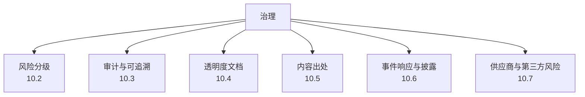
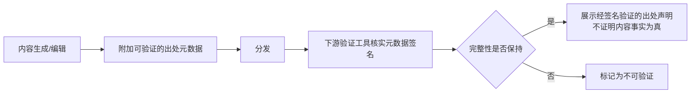

# 第十章：AI 治理、风险分级、审计与内容出处

## 10.1 治理是把前九章的技术控制"制度化"

前九章讨论的都是具体的技术防御。但技术控制要长期有效，需要制度保证：谁批准一个高风险 Agent 上线、谁对模型行为负责、出了事故按什么流程处理、监管要求怎么落地为内部checklist。这正是 NIST AI RMF 中 **Govern** 功能覆盖的范畴：把这些责任、流程和检查项固定下来。

## 10.2 风险分级方法论

不是所有 AI 应用都需要同等强度的管控，风险分级的作用是把有限的安全资源投向真正高风险的场景。

### 10.2.1 按用例风险分级（呼应监管实践）

用例有助于内部风险分级，但下表是工程管理示意，**不是 EU AI Act 的自动分类器**。法律判断还取决于预期用途、角色、地域适用、产品类别及例外；通用 AI 模型（GPAI）的义务也不能放进单一的应用风险金字塔后就忽略：

| 等级 | 特征 | 示例 | 管控强度 |
|---|---|---|---|
| 禁止用途 | 满足适用法律明确禁止的构成条件 | 特定有害操纵、社会评分等，不是所有评分都一律禁止 | 停止相应用途，确认法定条件 |
| 高影响用途 | 可能影响安全、权利或重大利益 | 招聘筛选、信贷决策、医疗器械相关应用 | 评估、监督、记录、监控与退出机制，逐项映射法定义务 |
| 透明度相关用途 | 用户需要了解 AI 参与方式 | 对话系统、特定生成内容 | 披露与标识，不排除同时属于高风险 |
| 较低影响用途 | 暂无明显高影响路径 | 受限的内部草稿辅助 | 基线控制；仍需数据保护、访问控制和复核 |

**法规版本与日期（核验于 2026-09-08）**：原始 Regulation (EU) 2024/1689 的时间线已受到 Regulation (EU) 2026/1744 修订。后者于 2026-07-24 刊登《欧盟官方公报》，第 4 条规定在公布后第三日生效，即 2026-07-27；这不是把提案或政治协议视为法律。

2026/1744 **第 1 条第 (40) 项**修改 AI Act 第 113 条第三段：新 (c) 项将第三章第 1、2、3 节（第 6(5) 条除外）的适用时间，按第 6(2) 条及附件 III 高风险系统设为 **2027-12-02**，按第 6(1) 条及附件 I 高风险系统设为 **2028-08-02**。这不是全部 AI Act 义务的统一延期；一般适用日期、禁止行为、GPAI、透明度及过渡条款需要分别核对。例如第 1 条第 (39) 项还涉及既有系统的过渡安排，不能只看第 113 条一个日期。实际部署应按最新法律正文建立「主体角色—用途—条款—适用日期—证据」清单，并由法律责任方确认。

### 10.2.2 内部风险评估的输入维度

除了用例场景，具体的技术架构选择也应纳入风险评估：是否具备自主执行高风险动作的能力（第七、八章）、是否处理敏感个人数据（第六章）、是否依赖不受控的第三方数据/模型来源（第四、五章）、是否面向公开互联网暴露（第二、三章）。风险评估应综合损害程度、发生可能性、暴露面和缓解能力；没有经定义和校准的量表，不应把「场景风险乘架构暴露」当作定量公式。

### 10.2.3 分级驱动的治理动作

内部风险分级应驱动治理动作，例如要求高影响场景经过评审、红队验证、额外变更审批和独立复核。这些是组织可采用的治理政策，不能据此声称每种法律高风险系统都被同一条法规强制要求采用完全相同的红队流程。

## 10.3 审计与可追溯性

### 10.3.1 组织级审计日志的最低要求

单个应用/协议层面的审计字段要求已在 [Tool Protocol 安全 15.4](../../tools/02-mcp/15-tool-protocol-security.md) 给出。组织级治理需要在此基础上，确保**跨应用、跨团队的审计数据可以被统一查询和关联**：

- 统一的请求关联 ID 规范，使一次用户交互跨越多个 Agent、多个工具调用时仍可追溯为同一条链路；
- 审计数据的留存周期、访问权限和防篡改保护由统一的安全团队制定基线，而非各团队各自决定；
- 定期做审计数据的完整性抽查，确认没有关键字段缺失或被绕过。

### 10.3.2 可解释性与可追溯性的区别

可追溯回答发生了什么、谁授权、用了哪个版本；可解释关注依据与影响因素，两者不能互相代替。先建立最小充分的证据链：输入或受控证据引用、版本、工具动作、策略决定与人工干预。不能为了审计无条件复制全部原文，也不能把模型事后生成的解释或思维链当作真实因果记录。适用法律要求理由说明或申诉时，不能以「日志齐全」替代。

人工监督也不只是加一个确认按钮：审批者需要看到原始目标与实际参数，有足够时间、专业能力和拒绝权限，并能暂停系统或切换人工流程。高风险决定的审批、执行和审计职责应适当分离，避免开发团队单独批准自己的剩余风险。

## 10.4 透明度文档：模型卡、系统卡与使用披露

| 文档类型 | 面向对象 | 内容 |
|---|---|---|
| 模型卡（Model Card） | 内部团队、下游集成方 | 训练数据特征、已知局限、评测结果、适用/不适用场景，是第五章 ML-BOM 治理的配套文档 |
| 系统卡（System Card） | 更广泛的利益相关方 | 完整应用系统（而非单个模型）的能力边界、安全测试摘要、已知风险和缓解措施 |
| 面向终端用户的披露 | 最终用户 | 明确告知用户正在与 AI 交互、AI 生成内容的标识、申诉/人工复核的入口 |

透明度文档不是"发布后就不再更新"的静态物料，模型微调、System Prompt 调整、新工具接入都应该触发文档更新，这与第五章"可复现构建"和第九章"版本变更触发安全回归"是同一治理节奏的不同侧面。

## 10.5 内容出处与可验证性

生成式 AI 大规模普及后，"这段内容是不是 AI 生成的""这张图片有没有被篡改"成为独立的信任问题，这是内容出处（Content Provenance）要解决的范畴。

- **数字签名式出处标准**（如 C2PA）：将来源与编辑等声明绑定到资产，验证签名、资产绑定和信任链。签名不是加密，不保证元数据保密；签名有效也不保证声明所描述的事实真实或编辑历史完整；
- **可见水印/隐性水印**：可见水印容易被裁剪去除，隐性水印试图在不明显改变内容的前提下嵌入可检测的标记，但目前技术上都存在被特定攻击手法擦除或伪造的可能性，应作为纵深防御的一层而非唯一保证；
- **出处不是内容审核**：内容出处解决的是"来源是否可核实"，不解决"内容本身是否有害"，两者是独立的治理维度，不能互相替代。

本章以 C2PA 2.2 Explainer 的能力边界为依据，不把它称作最新版本。Content Credentials 可因截图、转码或剥离元数据而丢失：无凭据不代表伪造，有凭据也不代表真实。水印和 AI 内容检测器还存在误报、漏报与变换鲁棒性问题，不应单独用于认定作者违规。保留适当的来源证据，并结合事实核查与人工复核。

## 10.6 事件响应与披露

- **AI 特有事件类型**：除了传统安全事件（数据泄漏、系统入侵），还应建立针对模型行为异常（大规模越狱成功、后门被触发、严重幻觉导致的错误决策）的响应流程；
- **响应流程的特殊要求**：先限制损害、暂停危险能力并保存必要证据，再判断攻击、配置错误或能力局限。回滚到已验证版本不等于消除已发生的外泄或撤销业务动作，仍需凭据撤销、数据处置与对账；
- **披露义务**：涉及用户数据的事件按适用的数据保护法规履行披露义务（第六章跨境合规是前置条件）；涉及高风险场景的模型行为异常，即使不构成传统意义的数据泄漏，也应考虑主动向受影响方披露。

## 10.7 供应商与第三方风险管理

前几章讨论的模型供应链（第五章）、数据来源（第四章）都落在第三方风险管理的技术侧面，治理层面需要把它们纳入统一的供应商准入流程：

- 采购/接入任何外部模型 API、第三方微调服务、MCP Server/工具、数据标注供应商前，走统一的安全评估流程而非各团队自行决定；
- 合同中明确数据处理边界（是否用于训练、保留期限、区域限制）、安全责任划分、事件通知时限；
- 建立供应商名录和定期复审机制，供应商自身发生安全事件时能快速评估对本组织的影响面。

## 10.8 上线检查表

以下为内部治理建议，具体法定义务需按 10.2 节逐项映射。

- [ ] 每个 AI 应用/Agent 有明确的风险等级，等级评估同时考虑用例场景和技术架构暴露面；
- [ ] 高风险场景具备强制的安全评审、红队测试和人工监督点；
- [ ] 审计日志具备跨应用、跨团队统一的关联 ID 规范和留存基线；
- [ ] 关键模型和系统具备模型卡/系统卡，且随重大变更更新；
- [ ] 面向用户的界面明确披露 AI 交互身份和申诉入口；
- [ ] 高价值或高风险场景的生成内容具备可验证的出处元数据；
- [ ] 存在覆盖模型行为异常的事件响应流程，具备快速回滚能力；
- [ ] 第三方模型/数据/工具供应商纳入统一的安全评估与合同管理流程。

## 10.9 常见错误

### 10.9.1 风险分级只看用例场景，不看技术架构暴露面

同一用例场景下，是否具备自主执行能力、是否处理敏感数据会显著改变实际风险，分级必须综合两个维度。

### 10.9.2 把透明度文档当作一次性交付物

模型、Prompt、工具集持续变化，模型卡/系统卡不更新很快就会失去参考价值。

### 10.9.3 把内容出处等同于内容审核

出处解决"来源是否可核实"，不解决"内容是否有害"，两者需要独立的治理动作。

### 10.9.4 供应商风险管理各团队各自为政

缺乏统一评估流程会导致同一个有问题的供应商在不同团队重复被引入，且供应商事件发生时无法快速评估影响面。

## 10.10 本章总结

1. 治理的作用是把前九章的技术控制制度化——明确谁负责、什么时候评估、评估不通过怎么办，这是 NIST AI RMF「Govern」功能的核心；
2. 风险分级应结合用例场景（呼应监管的分级思路）和技术架构暴露面两个维度，并直接驱动安全评审、红队测试和监督强度等具体治理动作；
3. 组织级审计需要跨应用、跨团队的统一关联 ID 和留存基线，治理优先满足"可追溯"而非等待"可解释"技术成熟；
4. 模型卡、系统卡和用户披露构成透明度文档体系，需要随模型和系统的重大变更持续更新；
5. C2PA 验证出处声明的绑定、完整性与签署信任，不证明内容为真；水印、事实审核、事件响应和供应商治理各自解决不同问题。

## 参考资料

- [NIST AI RMF: Govern Function](https://www.nist.gov/itl/ai-risk-management-framework)
- [EU AI Act：Regulation (EU) 2024/1689 原文](https://eur-lex.europa.eu/eli/reg/2024/1689/oj/eng)
- [Regulation (EU) 2026/1744：第 1 条 (39)、(40) 项与第 4 条](https://eur-lex.europa.eu/legal-content/EN/TXT/?uri=OJ:L_202601744)
- [European Commission: AI Act policy overview](https://digital-strategy.ec.europa.eu/en/policies/regulatory-framework-ai)
- [C2PA 2.2: Explainer，验证能力与非目标](https://spec.c2pa.org/specifications/specifications/2.2/explainer/Explainer.html)
- [Model Cards for Model Reporting](https://arxiv.org/abs/1810.03993)
- [System Cards: A New Resource for Understanding How AI Systems Work](https://openai.com/index/system-card/)
- [OWASP LLM Applications Cybersecurity and Governance Checklist](https://genai.owasp.org/resource/llm-ai-cybersecurity-governance-checklist/)
