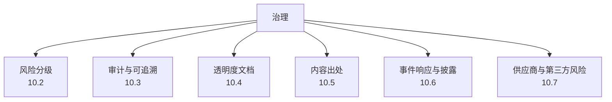
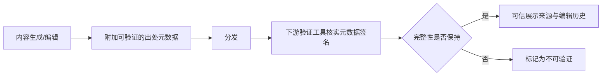

# 第十章：AI 治理、风险分级、审计与内容出处

## 10.1 治理是把前九章的技术控制"制度化"

前九章讨论的都是具体的技术防御。但技术控制要长期有效，需要制度保证：谁批准一个高风险 Agent 上线、谁对模型行为负责、出了事故按什么流程处理、监管要求怎么落地为内部checklist。这是 NIST AI RMF 中 **Govern** 功能覆盖的范畴，也是本章要系统化的内容。

## 10.2 风险分级方法论

不是所有 AI 应用都需要同等强度的管控，风险分级的作用是把有限的安全资源投向真正高风险的场景。

### 10.2.1 按用例风险分级（呼应监管实践）

监管框架（如欧盟 AI 法案）普遍采用按用例场景分级而非按技术类型分级的思路，这个思路同样适用于内部治理：

| 等级 | 特征 | 示例 | 管控强度 |
|---|---|---|---|
| 不可接受风险 | 明确禁止的用途 | 社会评分类应用、潜意识操纵 | 禁止部署 |
| 高风险 | 影响人身安全、基本权利或重大财产的决策 | 医疗诊断建议、信贷审批、招聘筛选、关键基础设施控制 | 强制人工监督、留痕、上线前评估、持续监控 |
| 有限风险 | 用户需要知情正在与 AI 交互 | 客服聊天机器人、内容生成工具 | 透明度披露、基础审计 |
| 最小风险 | 影响范围有限 | 内部效率工具、草稿辅助 | 常规安全基线即可 |

### 10.2.2 内部风险评估的输入维度

除了用例场景，具体的技术架构选择也应纳入风险评估：是否具备自主执行高风险动作的能力（第七、八章）、是否处理敏感个人数据（第六章）、是否依赖不受控的第三方数据/模型来源（第四、五章）、是否面向公开互联网暴露（第二、三章）。风险等级应该是场景风险与架构暴露面的乘积，而不是只看其中一个维度。

### 10.2.3 分级驱动的治理动作

风险分级不是写完就归档的标签，而应该直接驱动具体动作：高风险场景强制要求安全评审、红队测试通过后才能上线（第九章）、生产变更需要额外审批、必须有人工监督点、必须有独立于开发团队的定期复核。

## 10.3 审计与可追溯性

### 10.3.1 组织级审计日志的最低要求

单个应用/协议层面的审计字段要求已在 [Tool Protocol 安全 15.4](../../tools/02-mcp/15-tool-protocol-security.md) 给出。组织级治理需要在此基础上，确保**跨应用、跨团队的审计数据可以被统一查询和关联**：

- 统一的请求关联 ID 规范，使一次用户交互跨越多个 Agent、多个工具调用时仍可追溯为同一条链路；
- 审计数据的留存周期、访问权限和防篡改保护由统一的安全团队制定基线，而非各团队各自决定；
- 定期做审计数据的完整性抽查，确认没有关键字段缺失或被绕过。

### 10.3.2 可解释性与可追溯性的区别

治理语境下，"可追溯"（能查到发生了什么、谁做的、依据是什么）比"可解释"（能理解模型为什么这样决策）门槛更低、也更容易落地。多数治理要求优先满足可追溯性——保证每一个高风险决策都能还原出完整的输入、模型版本、工具调用链和人工干预记录，而不必等待模型可解释性技术成熟。

## 10.4 透明度文档：模型卡、系统卡与使用披露

| 文档类型 | 面向对象 | 内容 |
|---|---|---|
| 模型卡（Model Card） | 内部团队、下游集成方 | 训练数据特征、已知局限、评测结果、适用/不适用场景，是第五章 ML-BOM 治理的配套文档 |
| 系统卡（System Card） | 更广泛的利益相关方 | 完整应用系统（而非单个模型）的能力边界、安全测试摘要、已知风险和缓解措施 |
| 面向终端用户的披露 | 最终用户 | 明确告知用户正在与 AI 交互、AI 生成内容的标识、申诉/人工复核的入口 |

透明度文档不是"发布后就不再更新"的静态物料，模型微调、System Prompt 调整、新工具接入都应该触发文档更新，这与第五章"可复现构建"和第九章"版本变更触发安全回归"是同一治理节奏的不同侧面。

## 10.5 内容出处与可验证性

生成式 AI 大规模普及后，"这段内容是不是 AI 生成的""这张图片有没有被篡改"成为独立的信任问题，这是内容出处（Content Provenance）要解决的范畴。

- **加密签名式出处标准**（如 C2PA）：在内容文件中嵌入经过加密签名的元数据，记录内容的生成方式（是否 AI 生成/编辑）、生成工具和编辑历史，下游可以验证签名判断元数据是否被篡改；
- **可见水印/隐性水印**：可见水印容易被裁剪去除，隐性水印试图在不明显改变内容的前提下嵌入可检测的标记，但目前技术上都存在被特定攻击手法擦除或伪造的可能性，应作为纵深防御的一层而非唯一保证；
- **出处不是内容审核**：内容出处解决的是"来源是否可核实"，不解决"内容本身是否有害"，两者是独立的治理维度，不能互相替代。

## 10.6 事件响应与披露

- **AI 特有事件类型**：除了传统安全事件（数据泄漏、系统入侵），还应建立针对模型行为异常（大规模越狱成功、后门被触发、严重幻觉导致的错误决策）的响应流程；
- **响应流程的特殊要求**：需要能快速回滚到已知安全的模型版本/Prompt 配置（呼应第五章的版本锁定和可复现构建），并且需要能区分"这是攻击导致的"还是"模型本身能力局限导致的"，两者的后续处理和披露要求不同；
- **披露义务**：涉及用户数据的事件按适用的数据保护法规履行披露义务（第六章跨境合规是前置条件）；涉及高风险场景的模型行为异常，即使不构成传统意义的数据泄漏，也应考虑主动向受影响方披露。

## 10.7 供应商与第三方风险管理

前几章讨论的模型供应链（第五章）、数据来源（第四章）本质上都是第三方风险管理的技术侧面，治理层面需要把它们纳入统一的供应商准入流程：

- 采购/接入任何外部模型 API、第三方微调服务、MCP Server/工具、数据标注供应商前，走统一的安全评估流程而非各团队自行决定；
- 合同中明确数据处理边界（是否用于训练、保留期限、区域限制）、安全责任划分、事件通知时限；
- 建立供应商名录和定期复审机制，供应商自身发生安全事件时能快速评估对本组织的影响面。

## 10.8 上线检查表

- [ ] 每个 AI 应用/Agent 有明确的风险等级，等级评估同时考虑用例场景和技术架构暴露面；
- [ ] 高风险场景具备强制的安全评审、红队测试和人工监督点；
- [ ] 审计日志具备跨应用、跨团队统一的关联 ID 规范和留存基线；
- [ ] 关键模型和系统具备模型卡/系统卡，且随重大变更更新；
- [ ] 面向用户的界面明确披露 AI 交互身份和申诉入口；
- [ ] 高价值或高风险场景的生成内容具备可验证的出处元数据；
- [ ] 存在覆盖模型行为异常的事件响应流程，具备快速回滚能力；
- [ ] 第三方模型/数据/工具供应商纳入统一的安全评估与合同管理流程。

## 10.9 常见错误

### 10.9.1 风险分级只看用例场景，不看技术架构暴露面

同一用例场景下，是否具备自主执行能力、是否处理敏感数据会显著改变实际风险，分级必须综合两个维度。

### 10.9.2 把透明度文档当作一次性交付物

模型、Prompt、工具集持续变化，模型卡/系统卡不更新很快就会失去参考价值。

### 10.9.3 把内容出处等同于内容审核

出处解决"来源是否可核实"，不解决"内容是否有害"，两者需要独立的治理动作。

### 10.9.4 供应商风险管理各团队各自为政

缺乏统一评估流程会导致同一个有问题的供应商在不同团队重复被引入，且供应商事件发生时无法快速评估影响面。

## 10.10 本章总结

1. 治理的作用是把前九章的技术控制制度化——明确谁负责、什么时候评估、评估不通过怎么办，这是 NIST AI RMF「Govern」功能的核心；
2. 风险分级应结合用例场景（呼应监管的分级思路）和技术架构暴露面两个维度，并直接驱动安全评审、红队测试和监督强度等具体治理动作；
3. 组织级审计需要跨应用、跨团队的统一关联 ID 和留存基线，治理优先满足"可追溯"而非等待"可解释"技术成熟；
4. 模型卡、系统卡和用户披露构成透明度文档体系，需要随模型和系统的重大变更持续更新；
5. 内容出处（如 C2PA 一类的加密签名标准）与水印是应对"内容是否可信"这一独立问题的技术手段，事件响应、供应商风险管理共同构成组织级 AI 治理的完整闭环。

> **一句话概括：技术防御决定了单次攻击能否被挡住，治理决定了整个组织能否在模型、数据和供应商持续变化的情况下，始终知道自己的风险敞口在哪里、该由谁负责、出事后怎么办。**

## 参考资料

- [NIST AI RMF: Govern Function](https://www.nist.gov/itl/ai-risk-management-framework)
- [EU Artificial Intelligence Act: Risk Classification](https://artificialintelligenceact.eu/high-level-summary/)
- [C2PA: Coalition for Content Provenance and Authenticity Specification](https://c2pa.org/specifications/specifications/1.3/index.html)
- [Model Cards for Model Reporting](https://arxiv.org/abs/1810.03993)
- [System Cards: A New Resource for Understanding How AI Systems Work](https://openai.com/index/system-card/)
- [OWASP LLM Applications Cybersecurity and Governance Checklist](https://genai.owasp.org/resource/llm-ai-cybersecurity-governance-checklist/)
