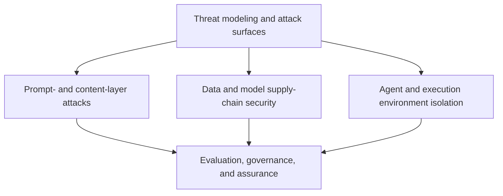

# AI Safety, Security, and Governance

This topic covers threat modeling for AI systems, prompt and output risks, data and model supply chains, execution isolation, privacy, evaluation, and governance. OWASP risk lists, the MITRE ATLAS knowledge base, NIST's voluntary frameworks, and applicable law serve different purposes. Read them in the context of their versions and study conditions; neither recommendations nor detection results are security guarantees.

Rather than **repeating architecture-specific defenses** already covered in the security chapters of [Agents](../agent/README.md), [Tools](../tools/README.md), and [RAG](../rag/README.md), this topic has three roles: provide a cross-layer threat-modeling framework and map it to standards; cover gaps such as jailbreak classification, system prompt leakage, output handling, training and supply-chain poisoning, privacy and memory leakage, cross-system identity governance, and computer-use sandboxes; and establish organization-wide evaluation, red-teaming, and governance processes.

## Modules

1. [Threat Modeling and Attack Surfaces (Chapter 1)](01-threat-modeling/README.md)
2. [Prompt- and Content-Layer Attacks (Chapters 2–3)](02-prompt-content-attacks/README.md)
3. [Data and Model Supply-Chain Security (Chapters 4–6)](03-data-model-supply-chain/README.md)
4. [Agent and Execution Environment Isolation (Chapters 7–8)](04-agent-execution-isolation/README.md)
5. [Evaluation, Governance, and Assurance (Chapters 9–10)](05-assurance-governance/README.md)

## How the Modules Fit Together

Chapter 1's threat-modeling framework is the entry point. The next three modules examine three attack surfaces in depth: model inputs and outputs at runtime, data and supply chains, and agent execution environments. The final evaluation and governance module turns technical controls into organizational processes that can be maintained over time.

## Where to Find the Detailed Treatment

Some concepts appear in several topics. To avoid repeating full explanations, this repository assigns each concept a primary location:

| Concept | Primary detailed treatment | This topic's role |
|---|---|---|
| Architectural defenses against prompt injection (Dual LLM, CaMeL, least privilege) | [Agent Security](../agent/05-production/15-agent-security.md) | Chapter 2 adds a jailbreak taxonomy, system prompt leakage, and amplification across turns or agents |
| Protocol-level OAuth, audiences, token passthrough, and SSRF defenses for MCP/A2A | [Tool Protocol Security](../tools/02-mcp/15-tool-protocol-security.md) | Chapter 7 adds cross-system identity federation, the general confused deputy pattern, and fleet-wide permission governance |
| RAG corpus poisoning, retrieval-side indirect injection, permission filtering, and differential probing | [RAG Security](../rag/06-operations-security/20-rag-challenges-security.md) | Chapter 4 focuses on backdoor poisoning during training and fine-tuning rather than repeating RAG corpus-poisoning details |
| ASR/utility evaluation principles for an individual application | [Agent Security, Section 15.13](../agent/05-production/15-agent-security.md), [RAG Security, Section 20.4](../rag/06-operations-security/20-rag-challenges-security.md) | Chapter 9 extends these into organization-wide red-teaming methodology and continuous assurance |
| AI system threat-modeling overview and mapping to standards (ATLAS/RMF/OWASP) | Chapter 1 of this topic | The repository's sole detailed treatment |
| Output handling and secret exfiltration | Chapter 3 of this topic | The repository's sole detailed treatment |
| Model supply chains, deserialization risks, privacy, and memory leakage | Chapters 4–6 of this topic | The repository's sole detailed treatment |
| Sandboxes for code execution, browsers, and computer use | Chapter 8 of this topic | The repository's sole detailed treatment |
| Governance, risk classification, auditing, and content provenance | Chapter 10 of this topic | The repository's sole detailed treatment |

## Suggested Reading Paths

- **For an overall framework:** start with threat modeling and standards mapping in Chapter 1, then choose where to go deeper.
- **If you have read the Agent, Tools, and RAG security chapters:** go directly to Chapters 2, 3, 4 (from Section 4.2), 5, 6, 7 (from Section 7.2), and 8 for material not covered there.
- **For model and data responsibilities:** Chapters 1, 4, 5, and 6.
- **For agents, tools, and execution environments:** Chapters 1, 7, and 8, alongside [Agent Security](../agent/05-production/15-agent-security.md) and [Tool Protocol Security](../tools/02-mcp/15-tool-protocol-security.md).
- **For security evaluation, governance, and compliance:** Chapters 1, 9, and 10.

In an interview, be ready to explain which path a control blocks and which protections remain if it fails. Role labels are not authorization; a signature does not prove a model is backdoor-free; masking data does not automatically anonymize it; zero red-team failures do not prove zero risk; and C2PA does not establish factual truth. For regulatory questions, first identify the entity's role, intended use, applicable provisions, and dates. An internal risk score is not a substitute for a legal determination.

Return to the [Documentation Topic Index](../README.md).
