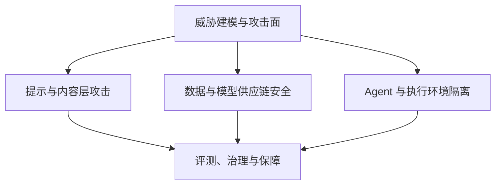

# AI 安全与治理

本主题覆盖 AI 系统的威胁建模、提示与输出风险、数据与模型供应链、执行隔离、隐私、评测与治理。OWASP 风险清单、MITRE ATLAS 知识库、NIST 自愿框架和适用法律各有用途；阅读时要结合版本与研究条件，不能把建议或检测结果当成安全保证。

与 [Agent](../agent/README.zh.md)、[Tools](../tools/README.zh.md)、[RAG](../rag/README.zh.md) 三个应用主题已有的安全章节相比,本主题**不重复展开具体架构的防御细节**,而是负责三件事:提供跨层的威胁建模框架和标准映射;补充这些主题尚未覆盖的环节(越狱分类、系统提示泄漏、输出处理、训练/供应链投毒、隐私与记忆泄漏、跨系统身份治理、Computer Use 沙箱);提供组织级的评测、红队与治理流程。

## 子模块

1. [威胁建模与攻击面(第 1 章)](01-threat-modeling/README.zh.md)
2. [提示与内容层攻击(第 2–3 章)](02-prompt-content-attacks/README.zh.md)
3. [数据与模型供应链安全(第 4–6 章)](03-data-model-supply-chain/README.zh.md)
4. [Agent 与执行环境隔离(第 7–8 章)](04-agent-execution-isolation/README.zh.md)
5. [评测、治理与保障(第 9–10 章)](05-assurance-governance/README.zh.md)

## 模块关系

第一章的威胁建模框架是全主题的入口,后三个子模块分别对应「模型运行时输入/输出」「数据与供应链」「Agent 执行环境」三类攻击面的深入,最后由评测与治理模块把技术控制收口为可持续运营的组织流程。

## 与已有安全章节的详解归属

同一个概念在不同主题会被反复提到,以下是本仓库约定的详解归属,避免重复展开:

| 概念 | 详解归属 | 本主题的角色 |
|---|---|---|
| Prompt Injection 架构级防御(Dual LLM、CaMeL、权限最小化) | [Agent 安全](../agent/05-production/15-agent-security.zh.md) | 第2章补充越狱分类学、系统提示泄漏和跨轮/跨 Agent 放大路径 |
| MCP/A2A 协议层 OAuth、audience、token passthrough、SSRF 防护 | [Tool Protocol 安全](../tools/02-mcp/15-tool-protocol-security.zh.md) | 第7章补充跨系统身份联邦、通用 confused deputy 模式和舰队级权限治理 |
| RAG 语料投毒、检索侧间接注入、权限过滤、差分探测 | [RAG 安全](../rag/06-operations-security/20-rag-challenges-security.zh.md) | 第4章聚焦训练/微调阶段的后门投毒,不重复 RAG 语料投毒细节 |
| 单应用场景的 ASR/Utility 评测原则 | [Agent 安全 15.13](../agent/05-production/15-agent-security.zh.md)、[RAG 安全 20.4](../rag/06-operations-security/20-rag-challenges-security.zh.md) | 第9章扩展为组织级红队方法论与持续保障流程 |
| AI 系统威胁建模全景、标准映射(ATLAS/RMF/OWASP) | 本主题第1章 | 全仓库唯一详解 |
| 输出处理、Secret Exfiltration | 本主题第3章 | 全仓库唯一详解 |
| 模型供应链、反序列化风险、隐私与记忆泄漏 | 本主题第4–6章 | 全仓库唯一详解 |
| 代码执行/浏览器/Computer Use 沙箱 | 本主题第8章 | 全仓库唯一详解 |
| 治理、风险分级、审计、内容出处 | 本主题第10章 | 全仓库唯一详解 |

## 阅读建议

- **建立整体框架**:先读第1章的威胁建模与标准映射,再决定深入哪个环节;
- **已读过 Agent/Tools/RAG 安全章节**:可直接跳到第2、3、4(4.2起)、5、6、7(7.2起)、8章,阅读这些主题尚未覆盖的补充内容;
- **负责模型/数据侧**:第1、4、5、6章;
- **负责 Agent/工具/执行环境侧**:第1、7、8章,并回读 [Agent 安全](../agent/05-production/15-agent-security.zh.md) 与 [Tool Protocol 安全](../tools/02-mcp/15-tool-protocol-security.zh.md);
- **负责安全评测/治理/合规**:第1、9、10章。

面试中要能说明控制阻断哪条路径，以及失效后还剩什么边界：角色标签不等于授权，签名不证明模型无后门，脱敏不自动构成匿名，红队零失败不证明零风险，C2PA 不证明内容真实。涉及法规时先确认主体角色、用途、适用条款与日期；内部风险评分不能代替法律判断。

返回[文档主题索引](../README.zh.md)。
