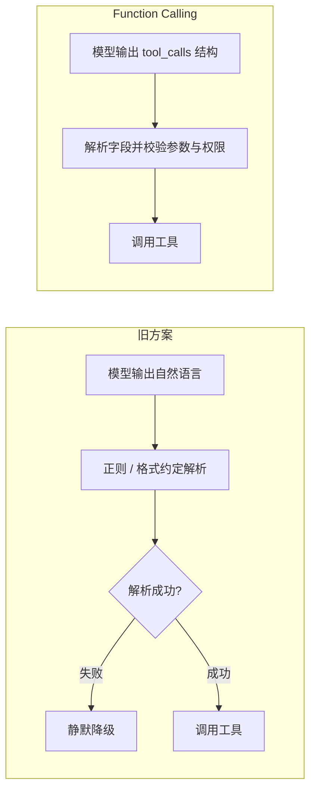
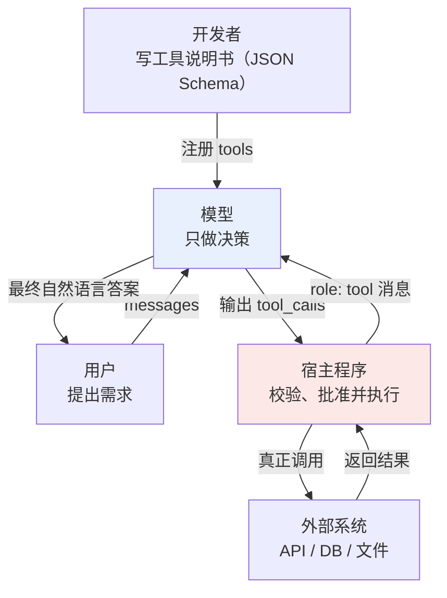
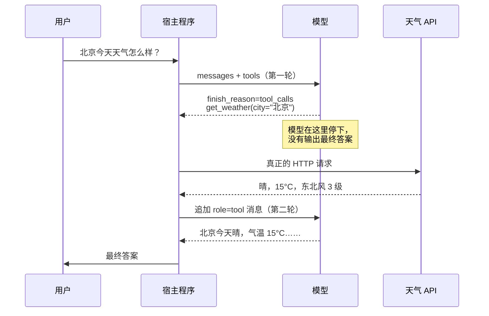
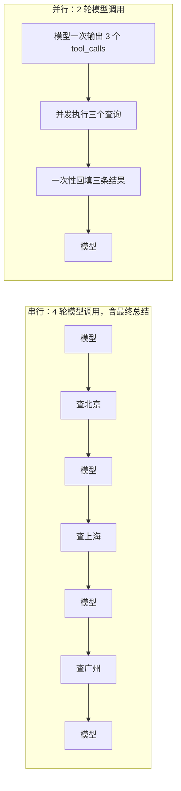

# 第一章：Function Calling 是什么，原理是什么

## 1.1 模型提出调用，谁来执行

Function Calling 是**让模型通过结构化调用项表达「我想调用哪个函数、参数是什么」的一种接口约定**。本章以 JSON 参数的函数工具为例；tool calling 范围更大，也包括自定义文本工具及平台托管工具。

这句话里有三个关键限定，缺一个就会掉进最常见的误区：

- **表达，不是执行**。模型输出调用意图，应用或平台工具运行时执行函数、发 HTTP 请求、连数据库；使用托管工具时不一定由你的应用亲自执行；
- **结构化 JSON，不是自然语言**。这是 Function Calling 相对于「土办法」的核心改进；
- **一种输出约定**。它是模型与应用之间的接口约定，不规定工具发现、分发或跨进程通信；[MCP](../02-mcp/04-what-is-mcp.md) 是解决这些接入问题的一种协议。

应用应把模型提议、权限批准和实际执行分别记录，不能把其中任一步当成其他步骤已经发生。

## 1.2 没有 Function Calling 的时代

OpenAI 在 2023 年 6 月发布了其 Function Calling API；工具增强模型此前已有研究。本节回顾两类常见文本集成方法，不是完整的技术史。

### 1.2.1 路线一：正则与关键词匹配

让模型正常输出自然语言，宿主程序用规则去猜它的意图：

```python
# 2023 年之前的典型写法
if "天气" in reply and ("查" in reply or "看" in reply):
    city = re.search(r"([\u4e00-\u9fa5]{2,4})(?:的)?天气", reply)
    if city:
        call_weather_api(city.group(1))
```

自然语言改写可能导致正则失配。若没有明确的解析失败处理，应用还可能把未识别的调用意图当普通回复返回，形成静默失败。

### 1.2.2 路线二：Prompt 里约定输出格式

进阶一点的做法是在 System Prompt 里写「如果需要调工具，请输出 `ACTION: 工具名(参数)`」。ReAct 也采用显式行动文本，但上面不是论文统一规定的语法。这比从任意自然语言猜意图更明确，仍要处理三个问题：

| 问题 | 表现 |
|---|---|
| 格式漂移 | 模型会输出 `ACTION：`（中文冒号）、加代码块包裹、在前面加一段解释 |
| 混合输出 | 一段回复里既有自然语言又有指令，需要额外切分 |
| 无法区分意图 | 模型「提到」某个工具名和「决定调用」它，在文本层面长得一样 |

例如用户问“你能查天气吗”，模型可能只是介绍 `get_weather`，不应仅因出现工具名就执行。显式动作语法也能区分两者，但解析器和停止条件需要专门设计。

### 1.2.3 Function Calling 解决了什么

它把这件事从**文本解析问题**变成了**协议问题**：



在 OpenAI **Chat Completions** 中，`tool_calls` 与 `finish_reason: "tool_calls"` 明确标记调用，而不是让应用从普通文本猜意图。Responses 则使用 `output` 中的 `function_call` 项，并以 `function_call_output.call_id` 回传；不能套用 `finish_reason`。这些字段是 API 设计，不代表模型内部直接生成了整个响应对象。

## 1.3 三个角色与职责边界

把整个流程理解成一次任务委托，三个角色的分工就很清楚了。



| 角色 | 职责 | 明确不做的事 |
|---|---|---|
| 开发者 | 定义工具、选择策略与评测样例 | 不能只靠描述保证模型选对 |
| 模型 | 判断要不要调、调哪个、参数填什么 | **不执行任何代码，不访问网络** |
| 宿主程序 | 校验调用、执行或拒绝、回填结果 | 不把模型提议当成授权 |

模型推理与工具运行时是不同组件。宿主必须检查工具白名单、参数、用户权限和审批；模型说“查到了”不是执行证据，应以工具结果及其来源为准。

## 1.4 工具定义：Schema 的每个字段都在给模型提示

```python
tools = [{
    "type": "function",
    "function": {
        "name": "get_weather",
        "description": (
            "查询中国大陆城市的实时天气，返回气温、天气状况、风向风速。"
            "仅支持当前时刻，不支持未来预报和历史查询。"
        ),
        "parameters": {
            "type": "object",
            "properties": {
                "city": {
                    "type": "string",
                    "description": "城市名，如「北京」「杭州」。不要带省份或「市」后缀"
                },
                "unit": {
                    "type": "string",
                    "enum": ["celsius", "fahrenheit"],
                    "description": "温度单位，默认 celsius"
                }
            },
            "required": ["city"]
        }
    }
}]
```

### 1.4.1 description 是重要的接口信息

没有显式提供时，模型看不到函数实现。它依据工具名、description、参数 Schema、系统指令和对话历史共同选择工具；description 不是唯一依据，也不能强制阻止误用。

对比一下两种写法造成的行为差异：

| description | 模型的典型误用 |
|---|---|
| `"获取天气"` | 用户问「北京下周会下雨吗」也照调，拿回实时数据后**编造**一个未来预报 |
| `"查询中国大陆城市的实时天气……不支持未来预报和历史查询"` | 模型识别出能力边界，直接回复「我只能查当前天气」 |

描述应同时给出能力和边界。表格只是预期行为，是否真的减少误用，要用未来天气、历史天气和地域外查询等反例检验。

### 1.4.2 参数描述决定填参质量

`city` 的描述里那句「不要带省份或『市』后缀」不是废话。没有它，模型面对「浙江省杭州市今天天气如何」会老老实实填 `"浙江省杭州市"`，而你的 API 只认 `"杭州"`。

参数描述值得包含格式、示例和范围；接口若只接受规范城市名，还应在服务端做别名归一化及歧义校验。

### 1.4.3 用 enum 限定合法取值

```python
# 差：模型可能填 "高"、"HIGH"、"P0"、"urgent"
{"priority": {"type": "string", "description": "优先级"}}

# 好：限定合法取值；仍需校验业务含义
{"priority": {"type": "string", "enum": ["low", "medium", "high"]}}
```

`enum` 既可用于服务端校验，也可被支持约束解码的运行时用于屏蔽非法 token。只有实际启用并支持该 Schema 的 strict/structured-output 路径才有此约束；仅注册 Schema 不能保证值合法，更不能保证优先级选得合理。上面的 Chat Completions 示例未开启 strict，严格模式见[第三章](03-tool-schema-design.md)。

## 1.5 完整调用流程：两轮对话加中间执行



下面是单次查询的教学片段，不是独立可运行的客户端。`registry` 是应用的工具白名单；`validate_and_authorize` 需由应用实现，检查 Schema、业务参数和当前用户权限，失败时抛出明确错误。示例使用兼容 Chat Completions 的模型，不代表所有新模型支持该接口。

```python
import json
from openai import OpenAI

client = OpenAI()
messages = [{"role": "user", "content": "北京今天天气怎么样？"}]

# 第一轮：模型决策
resp = client.chat.completions.create(
    model="gpt-4o",
    messages=messages,
    tools=tools,
    tool_choice="auto",
)
choice = resp.choices[0]

if choice.finish_reason == "tool_calls":
    messages.append(choice.message)          # 必须先追加模型的这条消息

    for call in choice.message.tool_calls:
        args = json.loads(call.function.arguments)
        validate_and_authorize(call.function.name, args)
        result = registry[call.function.name](**args)   # 宿主程序执行

        messages.append({
            "role": "tool",
            "tool_call_id": call.id,          # 必须与请求的 id 一一对应
            "content": json.dumps(result, ensure_ascii=False),
        })

    # 这个示例只允许单批查询，第二轮明确收尾
    final = client.chat.completions.create(
        model="gpt-4o", messages=messages, tools=tools, tool_choice="none"
    )
    final_choice = final.choices[0]
    if final_choice.finish_reason != "stop" or final_choice.message.refusal:
        raise RuntimeError("最终回答未正常完成或被拒绝")
    print(final_choice.message.content)
elif choice.finish_reason == "stop":
    if choice.message.refusal:
        raise RuntimeError("请求被模型拒绝")
    print(choice.message.content)
else:
    raise RuntimeError(f"响应未正常完成：{choice.finish_reason}")
```

### 1.5.1 两个容易漏掉的必要步骤

**必须把模型那条 `tool_calls` 消息追加回 messages**。很多人直接跳到追加 `role: "tool"`，结果 API 报 `messages with role 'tool' must be a response to a preceding message with 'tool_calls'`。原因是对话历史必须自洽：先有请求，才能有响应。

**`tool_call_id` 必须一一对应**。把两个合法 ID 对应的结果交换，协议校验可能仍通过，模型却可能把杭州的天气当成北京的用；缺失或未知 ID 则可能直接被 API 拒绝。

### 1.5.2 Chat Completions 的常见 tool_choice 取值

| 取值 | 行为 | 用途 |
|---|---|---|
| `"auto"`（默认） | 模型自己判断调不调 | 通用对话 |
| `"required"` | 强制至少调一个工具 | 已确定必须查数据的流程节点 |
| `{"type":"function","function":{"name":"x"}}` | 强制调指定工具 | 结构化抽取：把工具当输出格式用 |
| `"none"` | 禁止调用 | 需要模型纯文本总结的收尾轮 |

把 `tool_choice` 锁定到某个工具时，Function Calling 实际上就在充当**结构化输出**接口。这是 Structured Output / JSON Mode 出现之前的通行做法，现在仍然被大量代码沿用。

### 1.5.3 Responses API 的等价调用流程

Responses API 同样遵循「模型提出调用 → 宿主执行 → 回填结果 → 模型回答」的流程，但**工具定义、调用项和结果回填的结构都不同，不能只换一个 endpoint**。Chat Completions 把调用放在 assistant 消息的 `tool_calls` 中；Responses 则把消息、函数调用等作为不同类型的项，放在 `response.output` 列表中。

两种接口的关键字段可以这样对应：

| 含义 | Chat Completions | Responses API |
|---|---|---|
| Python SDK 入口 | `client.chat.completions.create(...)` | `client.responses.create(...)` |
| 本例的对话输入 | `messages` | `input`，包含消息或工具结果等项 |
| function tool 定义 | `{"type": "function", "function": {...}}` | `{"type": "function", "name": ..., "description": ..., "parameters": ...}` |
| 查找函数调用 | `choices[0].message.tool_calls` | 遍历 `response.output`，筛选 `type == "function_call"` |
| 函数名与 JSON 参数字符串 | `call.function.name`、`call.function.arguments` | `call.name`、`call.arguments` |
| 调用与结果的关联 | 调用的 `id` → 结果的 `tool_call_id` | 调用的 `call_id` → 结果的 `call_id` |
| 回填工具结果 | `role: "tool"` 消息，结果放在 `content` | `type: "function_call_output"` 项，结果放在 `output` |
| 读取文本回答 | `choices[0].message.content` | `response.output_text`（SDK 汇总文本的便捷属性） |

Responses 的 function tool schema 是**扁平结构**：`name`、`description`、`parameters`、`strict` 与 `type` 同级，没有外层 `function` 对象；这不表示 `parameters` 内部不能定义嵌套对象。

下面沿用 1.4 节的 `tools` 定义，以及前文由应用实现的 `registry` 和 `validate_and_authorize`，仍是单批查询的教学片段。显式设置 `strict=False`，保留原例中 `unit` 可选的语义；若开启严格模式，需要同时调整 Schema，不能只改这个开关。

```python
import json
from openai import OpenAI

client = OpenAI()
weather = tools[0]["function"]  # 读取前文 Chat Completions 的工具定义
responses_tools = [{
    "type": "function",
    "name": weather["name"],
    "description": weather["description"],
    "parameters": weather["parameters"],
    "strict": False,
}]
input_items = [{"role": "user", "content": "北京今天天气怎么样？"}]


def check_response(response):
    if response.status != "completed":
        raise RuntimeError(f"响应未正常完成：{response.status}")
    for item in response.output:
        if item.type == "message":
            if any(part.type == "refusal" for part in item.content):
                raise RuntimeError("请求被模型拒绝")


# 第一轮：从 output 中收集所有函数调用，不能假设第一项就是调用
response = client.responses.create(
    model="gpt-4o", input=input_items, tools=responses_tools, tool_choice="auto"
)
check_response(response)
calls = [item for item in response.output if item.type == "function_call"]

if calls:
    input_items.extend(response.output)  # 先保留完整输出，再追加工具结果
    for call in calls:
        args = json.loads(call.arguments)
        validate_and_authorize(call.name, args)
        result = registry[call.name](**args)
        input_items.append({
            "type": "function_call_output",
            "call_id": call.call_id,  # 对应调用的 call_id，不是该项的 id
            "output": json.dumps(result, ensure_ascii=False),
        })

    # 与前例一样，第二轮禁止继续调用工具，收尾生成回答
    response = client.responses.create(
        model="gpt-4o", input=input_items,
        tools=responses_tools, tool_choice="none",
    )
    check_response(response)

print(response.output_text)
```

这里手动维护 `input_items`，所以必须把第一轮完整的 `response.output` 带回下一轮；若换用推理模型，随调用返回的 `reasoning` 项也应保留，不能只摘出 `function_call`。另一种方式是通过 `previous_response_id=response.id` 关联上一轮，再在 `input` 中提交本轮工具结果；本例采用前一种方式。

**`call_id` 负责把结果配回具体调用**。即使同一函数被调用两次，也要分别回填，不能只按函数名关联。判断是否需要执行函数，应检查 `function_call` 项；`status == "completed"` 只说明这次响应已完成，不代表整个任务已完成，也不替代 Chat Completions 的 `finish_reason`。本例处理零个或多个调用，但只执行一批；需要多步工具协作时，仍要增加有轮数和时间预算的循环。

## 1.6 并行工具调用

`tool_calls` 是数组而不是单个对象，这是一个刻意的设计。

用户问「帮我查北京、上海、广州的天气」，模型可以在**一次响应**里返回三个调用请求：



在三个查询彼此独立、每轮推理耗时均近似为 `T`、不计排队和调度开销的教学模型下：逐次查询加总结约为 `4T + IO₁ + IO₂ + IO₃`，一批并发加总结约为 `2T + max(IO₁, IO₂, IO₃)`。实际收益取决于生成长度、并发限制和 API 延迟。

下面只展示并发调度，输入须已完成解析、参数校验和授权。`validated_calls` 中每项包含 `name` 与 `arguments`，应用另行保留它与原调用 ID 的映射。

```python
import asyncio

async def run_all(validated_calls):
    tasks = [
        asyncio.to_thread(registry[c["name"]], **c["arguments"])
        for c in validated_calls
    ]
    return await asyncio.gather(*tasks, return_exceptions=True)
```

`gather` 按输入顺序返回结果，异常也会作为列表项返回；应用必须逐项识别，不能把异常对象序列化成成功结果。这里只示意调度，尚需并发上限与超时；取消等待 `to_thread` 不会强制停止已运行的同步函数，底层 I/O 也要设置超时。

### 1.6.1 并行的前提是无依赖

「先查订单号，再用订单号查物流」有数据依赖，不能并行。模型可能猜测中间结果；宿主应验证前置步骤已完成及对象归属。多个写操作即便参数独立，也可能竞争同一业务资源，不能只看 JSON 结构决定并发。

### 1.6.2 部分失败怎么处理

并行执行时如果两个成功一个失败，**不要整批丢弃**。把失败的那个也以 `role: "tool"` 回填，内容写成结构化错误：

```python
{"role": "tool", "tool_call_id": call.id,
 "content": '{"error": "city_not_found", "message": "未找到城市「广洲」，请确认拼写"}'}
```

模型可能据此修正参数，但应设置最大轮数、总 deadline 和重复错误检测。鉴权失败、策略拒绝不应让模型绕过；写操作超时意味着结果未知，先查询业务状态或用持久化幂等键去重，不能盲目重试。`tool_call_id` 只是消息关联 ID，不自动提供幂等保证。

## 1.7 从 Function Calling 到工具调用生态

Function Calling 只解决了「模型怎么表达调用意图」。它没有解决的问题清单很长：

| 未解决的问题 | 由谁解决 |
|---|---|
| 工具怎么被**发现**（不用硬编码在代码里） | [MCP](../02-mcp/04-what-is-mcp.md) |
| 工具怎么**跨进程 / 跨机器**提供 | [MCP 传输层](../02-mcp/12-mcp-transport.md) |
| 复杂任务的**操作方法**怎么复用 | [Skill](../03-skills/08-what-is-skill.md) |
| 多个 Agent 之间怎么**互相调用** | [A2A](../04-agent-communication/11-a2a-protocol.md) |
| 多模型、多供应商怎么**统一治理** | [LLM 网关](../05-transport-gateway/14-llm-gateway.md) |

理解这个边界很重要：许多 LLM Host 会将 MCP Tool 转为模型能理解的 schema 并用 Function Calling 驱动调用；但 MCP 与 A2A 不以 Function Calling 为协议前提，Host 也可通过规则、结构化输出或人工流程发起调用。

## 1.8 常见错误

### 1.8.1 认为模型自己执行了工具

调用项不是执行凭证。应用和工具服务端都应独立检查授权；平台托管工具也有自己的执行边界。模型参数可能被用户或工具返回内容操纵。

### 1.8.2 把 description 当注释写

`"description": "获取天气"` 没有说明地域、时间和返回值范围。工具定义是模型输入的一部分，应连同系统指令和回归样例一起维护。

### 1.8.3 注册几十个工具指望模型选对

工具增多可能增加混淆和上下文成本，尤其是功能相近的工具。可按权限和场景动态筛选，或使用接口支持的延迟加载。候选数量用召回率、调用准确率和端到端成本评测，不设通用门槛。

### 1.8.4 忘记回填模型的 tool_calls 消息

只追加 `role: "tool"` 而漏掉模型那条消息，会直接触发 API 报错。对话历史必须保持请求与响应成对。

### 1.8.5 用异常中断替代错误回填

对城市名拼写等可纠正错误，可在适配层回填脱敏的结构化结果，让模型在次数预算内重试。鉴权拒绝和非预期故障则应停止或升级处理；底层使用异常本身不是错误，错误在于丢失失败原因或把失败伪装成成功。

### 1.8.6 假设所有模型的 Function Calling 行为一致

不同模型的差异比想象中大：并行调用的支持程度不同，`tool_choice` 的取值语义不同，参数为空时有的填 `{}` 有的填 `null`，Schema 复杂嵌套时的稳定性也不同。换模型必须重跑工具调用的回归测试。

## 1.9 本章总结

1. **Function Calling 是模型层的输出约定**，把工具调用从文本解析问题变成协议问题；
2. **调用标记依赖具体 API**，Chat Completions 与 Responses 的回填结构不同；
3. **模型提议、宿主批准、工具执行**，服务端还需复核权限；
4. **工具名、描述、Schema 与上下文共同影响选择**，strict 约束格式而非业务正确性；
5. **两轮只是最小示例**，完整 Agent 需循环处理调用并设置退出条件；
6. **无依赖查询可以并发**，写操作还要检查冲突、幂等性和部分失败；
7. **它只解决了表达问题**，工具发现、跨进程接入可由 MCP 等机制补齐，两者不是强制上下层关系。


## 参考资料

- [OpenAI: Function Calling 指南（2026-09-08 核查）](https://developers.openai.com/api/docs/guides/function-calling)
- [OpenAI: Responses API 迁移指南（本节字段与示例于 2026-09-16 对照此页及 Function Calling 指南核查）](https://developers.openai.com/api/docs/guides/migrate-to-responses)
- [OpenAI: 2023 年 Function Calling 发布](https://openai.com/index/function-calling-and-other-api-updates/)
- [Anthropic: Tool Use with Claude](https://docs.claude.com/en/docs/agents-and-tools/tool-use/overview)
- [Anthropic: Writing Effective Tools for Agents](https://www.anthropic.com/engineering/writing-tools-for-agents)
- [Toolformer: Language Models Can Teach Themselves to Use Tools](https://arxiv.org/abs/2302.04761)
- [ReAct: Synergizing Reasoning and Acting in Language Models](https://arxiv.org/abs/2210.03629)
- [JSON Schema 规范](https://json-schema.org/)
